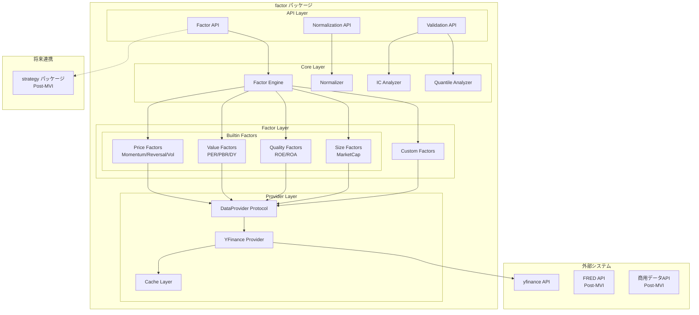
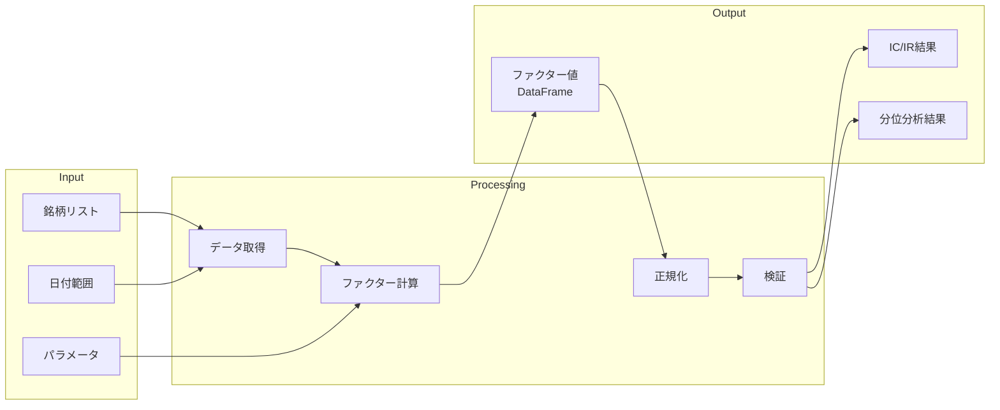
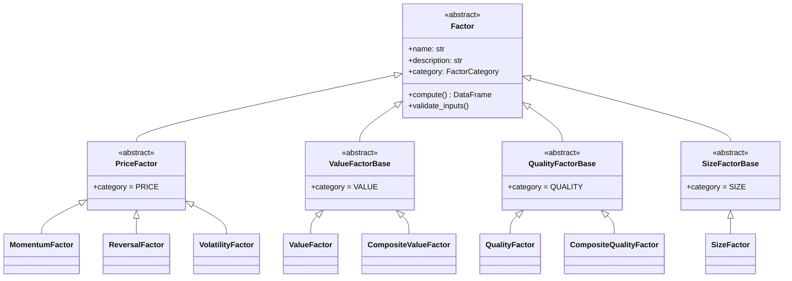
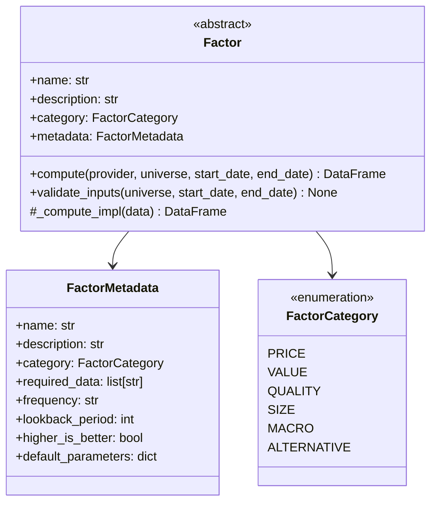
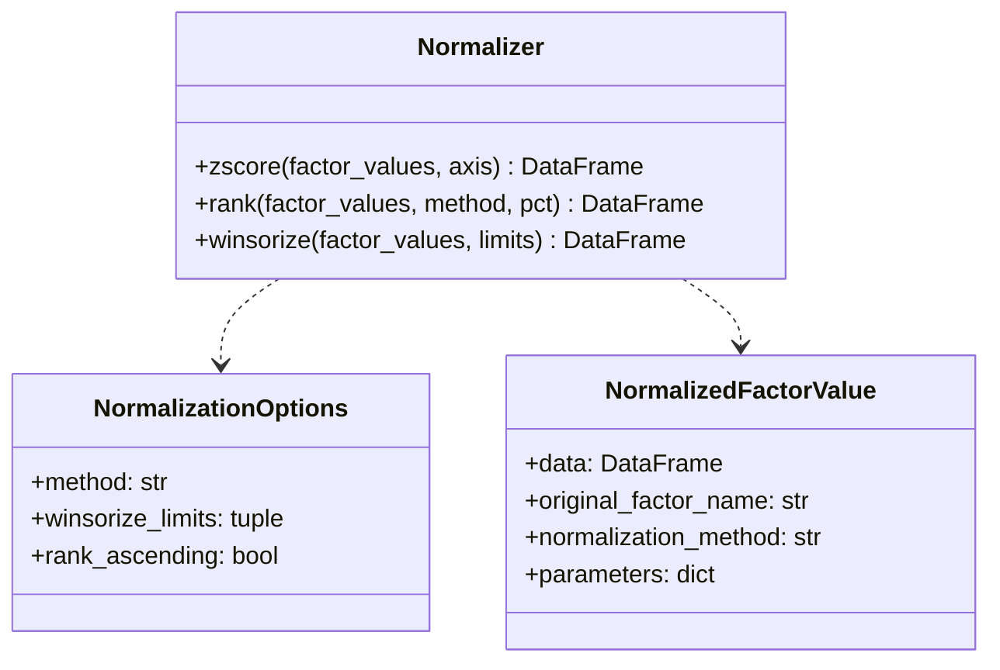
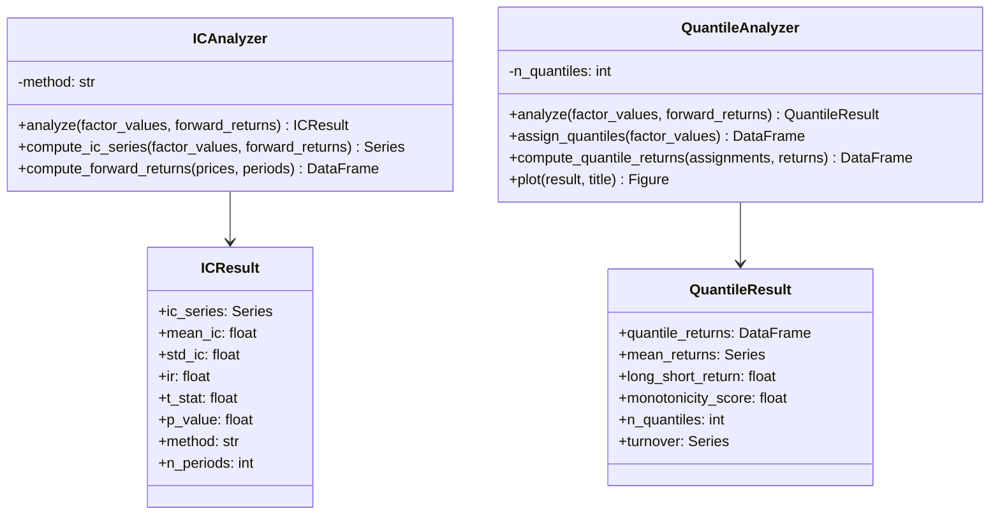
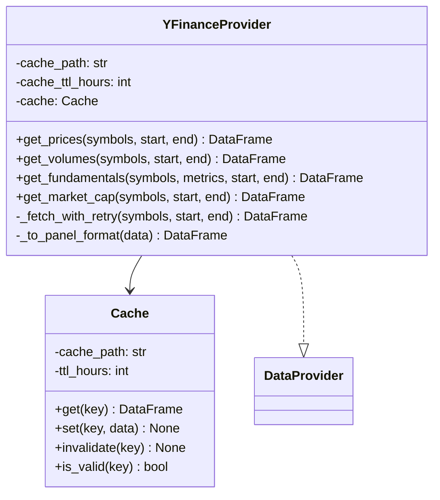
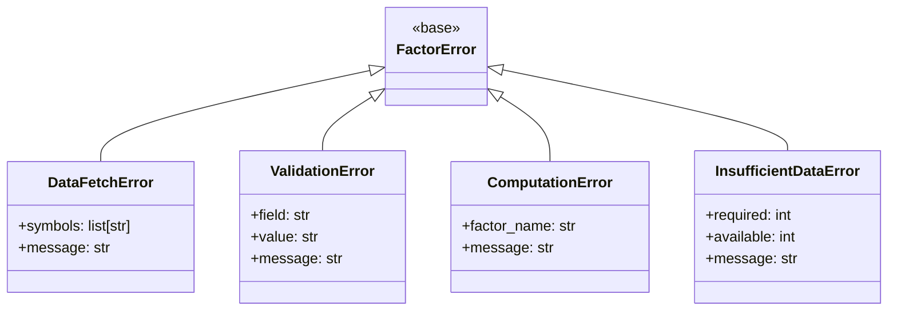

# アーキテクチャ設計書 (Architecture Design Document)

## 1. システムアーキテクチャ

### 1.1 全体構成図



### 1.2 レイヤー定義

| レイヤー | 責務 | 主要コンポーネント |
|----------|------|-------------------|
| API Layer | 公開インターフェース、入力バリデーション | Factor API, Validation API, Normalization API |
| Core Layer | ビジネスロジック、統計計算 | Factor Engine, Normalizer, Analyzers |
| Factor Layer | ファクター定義・計算ロジック | Builtin Factors, Custom Factors |
| Provider Layer | データ取得の抽象化、キャッシュ | DataProvider Protocol, Adapters |

### 1.3 データフロー



## 2. テクノロジースタック

### 2.1 言語・ランタイム

| 技術 | バージョン | 選定理由 |
|------|-----------|----------|
| Python | 3.12+ | 型ヒントの改善（PEP 695）、パターンマッチング、パフォーマンス向上 |
| uv | latest | Rustベース高速パッケージ管理、pyproject.toml統合 |

### 2.2 コア依存ライブラリ

| ライブラリ | バージョン | 用途 | 選定理由 |
|-----------|-----------|------|----------|
| pandas | >=2.0 | データ処理 | 金融データ分析の標準、DataFrame操作の効率性 |
| numpy | >=1.26 | 数値計算 | ベクトル化計算によるパフォーマンス |
| scipy | >=1.11 | 統計計算 | IC計算（相関）、統計検定 |
| yfinance | >=0.2.36 | 市場データ取得 | 無料、豊富な市場カバレッジ、pandas統合 |
| plotly | >=5.18 | インタラクティブ可視化 | 分位分析チャート、IC推移グラフ |
| matplotlib | >=3.8 | 静的可視化 | レポート用チャート、Jupyter統合 |

### 2.3 開発ツール

| ツール | バージョン | 用途 | 選定理由 |
|--------|-----------|------|----------|
| Ruff | latest | リント・フォーマット | 高速（Rust）、Black/isort/Flake8統合 |
| pyright | latest (strict) | 型チェック | 厳密な型検査、VS Code統合 |
| pytest | >=8.0 | テスト | Python標準、豊富なプラグイン |
| Hypothesis | >=6.100 | プロパティテスト | エッジケース自動検出、統計計算の検証 |
| pytest-cov | >=4.1 | カバレッジ | テストカバレッジ計測 |

## 3. レイヤードアーキテクチャ詳細

### 3.1 依存関係ルール

```
API Layer → Core Layer → Factor Layer → Provider Layer
    ↓            ↓            ↓
  types.py   types.py     types.py
```

**許可される依存**:
- 上位レイヤーから下位レイヤーへの依存
- 同一レイヤー内のユーティリティへの依存
- 全レイヤーから `types.py`, `errors.py` への依存

**禁止される依存**:
- 下位レイヤーから上位レイヤーへの依存
- Factor Layer から直接外部APIへのアクセス（Provider経由必須）

### 3.2 API Layer

**責務**:
- 公開インターフェースの提供
- 入力パラメータのバリデーション
- 結果の型変換とエラーラッピング

```python
# src/factor/__init__.py での公開API
from factor.core.base import Factor
from factor.core.normalizer import Normalizer
from factor.factors.price import MomentumFactor, ReversalFactor, VolatilityFactor
from factor.factors.value import ValueFactor, CompositeValueFactor
from factor.factors.quality import QualityFactor, CompositeQualityFactor
from factor.factors.size import SizeFactor
from factor.providers import YFinanceProvider
from factor.validation import ICAnalyzer, QuantileAnalyzer
```

### 3.3 Core Layer

**責務**:
- ファクター計算のオーケストレーション
- 正規化ロジック（z-score, rank, winsorize）
- 検証ロジック（IC/IR, 分位分析）

**主要コンポーネント**:

| コンポーネント | 責務 |
|---------------|------|
| Factor (ABC) | ファクター計算の共通インターフェース、メタデータ管理 |
| Normalizer | クロスセクショナル正規化、外れ値処理 |
| ICAnalyzer | IC/IR計算、統計的有意性検定 |
| QuantileAnalyzer | 分位ポートフォリオ構築、Long-Short分析 |

### 3.4 Factor Layer

**責務**:
- 個別ファクターの計算ロジック実装
- ファクターカテゴリの分類

**ファクターカテゴリ階層**:



### 3.5 Provider Layer

**責務**:
- データソースの抽象化
- DataProvider プロトコルの実装
- キャッシュ管理

**DataProvider プロトコル**:

```python
class DataProvider(Protocol):
    """データプロバイダーの抽象インターフェース"""

    def get_prices(
        self,
        symbols: list[str],
        start_date: datetime | str,
        end_date: datetime | str,
    ) -> pd.DataFrame: ...

    def get_volumes(
        self,
        symbols: list[str],
        start_date: datetime | str,
        end_date: datetime | str,
    ) -> pd.DataFrame: ...

    def get_fundamentals(
        self,
        symbols: list[str],
        metrics: list[str],
        start_date: datetime | str,
        end_date: datetime | str,
    ) -> pd.DataFrame: ...

    def get_market_cap(
        self,
        symbols: list[str],
        start_date: datetime | str,
        end_date: datetime | str,
    ) -> pd.DataFrame: ...
```

**拡張ポイント**:

| 将来対応 | 拡張方法 |
|---------|----------|
| FRED (マクロ) | `FREDProvider` 実装、`get_macro_indicators()` 追加 |
| 商用データ | `FactsetProvider`, `BloombergProvider` 実装 |
| オルタナティブ | `get_sentiment()`, `get_news()` メソッド追加 |

## 4. コンポーネント設計

### 4.1 Factor 基底クラス



### 4.2 Normalizer 設計



### 4.3 検証コンポーネント



### 4.4 YFinanceProvider 設計



## 5. データモデル

### 5.1 DataFrame スキーマ

| データ型 | Index | Columns | Values | 用途 |
|---------|-------|---------|--------|------|
| ファクター値 | DatetimeIndex (日付) | str (銘柄シンボル) | float64 | ファクター計算結果 |
| 価格データ | DatetimeIndex (日付) | str (銘柄シンボル) | float64 | 終値 |
| フォワードリターン | DatetimeIndex (日付) | str (銘柄シンボル) | float64 | 将来リターン |
| 分位割り当て | DatetimeIndex (日付) | str (銘柄シンボル) | int64 (1-N) | 分位番号 |

### 5.2 結果データクラス

```python
@dataclass
class FactorValue:
    """ファクター値の計算結果"""
    data: pd.DataFrame           # ファクター値
    factor_name: str             # ファクター名
    computed_at: datetime        # 計算日時
    universe: list[str]          # 対象銘柄
    start_date: datetime         # 開始日
    end_date: datetime           # 終了日
    parameters: dict             # パラメータ

@dataclass
class ICResult:
    """IC/IR分析結果"""
    ic_series: pd.Series         # 時系列IC
    mean_ic: float               # 平均IC
    std_ic: float                # IC標準偏差
    ir: float                    # 情報比率
    t_stat: float                # t値
    p_value: float               # p値
    method: str                  # 計算方法
    n_periods: int               # 分析期間数

@dataclass
class QuantileResult:
    """分位分析結果"""
    quantile_returns: pd.DataFrame  # 分位別リターン
    mean_returns: pd.Series         # 分位別平均リターン
    long_short_return: float        # Top - Bottom
    monotonicity_score: float       # 単調性スコア
    n_quantiles: int                # 分位数
    turnover: pd.Series | None      # 回転率
```

## 6. パフォーマンス設計

### 6.1 パフォーマンス目標

| 操作 | データ規模 | 目標時間 | 測定環境 |
|------|-----------|---------|---------|
| ファクター計算 | 100銘柄 x 5年日次 (125,000点) | 1秒以内 | CPU: 4コア、メモリ: 8GB |
| IC計算 | 100銘柄 x 1,000日 | 500ms以内 | 同上 |
| 分位分析 | 100銘柄 x 1,000日 x 5分位 | 500ms以内 | 同上 |
| データ取得（キャッシュヒット） | 100銘柄 x 5年 | 100ms以内 | 同上 |
| データ取得（キャッシュミス） | 100銘柄 x 5年 | 10秒以内 | ネットワーク依存 |

### 6.2 最適化戦略

| 領域 | 最適化手法 | 期待効果 |
|------|-----------|---------|
| データ取得 | バッチ取得、TTLキャッシュ | 2回目以降 90%高速化 |
| ファクター計算 | pandas ベクトル化操作 | ループ比 10-100x 高速 |
| IC計算 | scipy.stats 利用、ベクトル化 | 3-5x 高速化 |
| メモリ | float32 オプション、チャンク処理 | メモリ 50%削減 |

### 6.3 ベクトル化計算の原則

```python
# NG: ループ処理
def bad_momentum(prices: pd.DataFrame, lookback: int) -> pd.DataFrame:
    result = pd.DataFrame(index=prices.index, columns=prices.columns)
    for i in range(lookback, len(prices)):
        for col in prices.columns:
            result.iloc[i, prices.columns.get_loc(col)] = (
                prices.iloc[i, prices.columns.get_loc(col)]
                / prices.iloc[i - lookback, prices.columns.get_loc(col)]
                - 1
            )
    return result

# OK: ベクトル化
def good_momentum(prices: pd.DataFrame, lookback: int) -> pd.DataFrame:
    return prices / prices.shift(lookback) - 1
```

### 6.4 メモリ使用量

| データ規模 | 入力データ | 処理中最大 | 上限（入力の3倍） |
|-----------|-----------|-----------|------------------|
| 100銘柄 x 1,000日 | 0.8MB | 2.4MB | 2.4MB |
| 100銘柄 x 5,000日 | 4MB | 12MB | 12MB |
| 500銘柄 x 5,000日 | 20MB | 60MB | 60MB |

## 7. エラーハンドリング

### 7.1 エラー階層



### 7.2 エラー分類と対処

| エラー種別 | 原因 | 対処 | ユーザーメッセージ例 |
|-----------|------|------|-------------------|
| `ValidationError` | 不正な入力パラメータ | 処理中断 | `"Parameter 'lookback' must be positive, got -5"` |
| `DataFetchError` | API/ネットワーク障害 | 最大3回リトライ後中断 | `"Failed to fetch data for ['INVALID']: Symbol not found"` |
| `InsufficientDataError` | lookback期間より短いデータ | 警告表示、可能な範囲で計算 | `"Warning: Only 100 data points available, need 252"` |
| `ComputationError` | 数値計算の失敗 | 該当銘柄をスキップ | `"Computation failed for 'momentum': Division by zero"` |

### 7.3 リトライ戦略

```python
# データ取得のリトライ設定
RETRY_CONFIG = {
    "max_attempts": 3,
    "backoff_factor": 2.0,  # 指数バックオフ
    "initial_delay": 1.0,   # 初回待機: 1秒
    "max_delay": 10.0,      # 最大待機: 10秒
    "retryable_errors": [ConnectionError, TimeoutError],
}
```

## 8. キャッシュ設計

### 8.1 キャッシュ戦略

| データ種別 | キャッシュ方式 | TTL | 無効化条件 |
|-----------|--------------|-----|-----------|
| 価格データ | ファイルキャッシュ | 24時間 | 日付変更、手動クリア |
| 財務データ | ファイルキャッシュ | 7日 | 四半期決算後、手動クリア |
| 時価総額 | ファイルキャッシュ | 24時間 | 日付変更 |

### 8.2 キャッシュキー設計

```python
# キャッシュキーの構造
cache_key = f"{data_type}_{hash(sorted(symbols))}_{start_date}_{end_date}"

# 例
"prices_abc123def_2020-01-01_2024-01-01"
"fundamentals_xyz789_per_pbr_2020-01-01_2024-01-01"
```

### 8.3 キャッシュ保存先

```
~/.cache/factor/
├── prices/
│   ├── abc123def_2020-01-01_2024-01-01.parquet
│   └── ...
├── fundamentals/
│   └── ...
└── market_cap/
    └── ...
```

## 9. 拡張性設計

### 9.1 新規ファクター追加

```python
# 新しいファクターカテゴリの追加例（将来対応）
class MacroFactor(Factor):
    """マクロ経済ファクター基底クラス"""

    category = FactorCategory.MACRO

    def __init__(self, indicator: str) -> None:
        self.indicator = indicator

    def compute(
        self,
        provider: MacroDataProvider,  # 拡張されたプロバイダー
        universe: list[str],
        start_date: datetime | str,
        end_date: datetime | str,
    ) -> pd.DataFrame:
        macro_data = provider.get_macro_indicators([self.indicator], start_date, end_date)
        return self._compute_exposure(macro_data, universe)

    @abstractmethod
    def _compute_exposure(
        self,
        macro_data: pd.DataFrame,
        universe: list[str],
    ) -> pd.DataFrame:
        """銘柄のマクロファクターエクスポージャーを計算"""
        ...
```

### 9.2 新規データプロバイダー追加

```python
# FRED データプロバイダーの追加例（Post-MVI）
class FREDProvider:
    """FRED データプロバイダー"""

    def get_macro_indicators(
        self,
        indicators: list[str],
        start_date: datetime | str,
        end_date: datetime | str,
    ) -> pd.DataFrame:
        """マクロ経済指標を取得

        Parameters
        ----------
        indicators : list[str]
            指標コード (e.g., ["GDP", "UNRATE", "CPIAUCSL"])

        Returns
        -------
        pd.DataFrame
            index: Date, columns: indicators
        """
        ...
```

### 9.3 strategy パッケージ連携インターフェース

```python
# Post-MVI: strategy パッケージとの連携
class FactorSignal:
    """strategy パッケージへのシグナル出力"""

    factor_name: str
    signal_date: datetime
    signals: pd.Series  # index: symbols, values: normalized factor values
    confidence: float   # IC ベースの信頼度

    def to_strategy_format(self) -> dict:
        """strategy パッケージの入力形式に変換"""
        return {
            "factor": self.factor_name,
            "date": self.signal_date.isoformat(),
            "positions": self.signals.to_dict(),
            "confidence": self.confidence,
        }
```

## 10. テスト戦略

### 10.1 テスト分類

| テスト種別 | 対象 | ツール | カバレッジ目標 |
|-----------|------|--------|--------------|
| ユニットテスト | 個別関数・クラス | pytest | 80% |
| プロパティテスト | 不変条件・境界値 | Hypothesis | 主要関数 |
| 統合テスト | API全体フロー | pytest + モック | 主要シナリオ |
| 回帰テスト | 既知値との比較 | pytest | 全ビルトインファクター |

### 10.2 テストケース例

**ユニットテスト**:
```python
# tests/factor/unit/test_momentum.py
def test_momentum_factor_positive_lookback():
    """lookbackが正の値であることを検証"""

def test_momentum_factor_returns_correct_shape():
    """出力DataFrameの形状が正しいことを検証"""

def test_momentum_factor_handles_missing_data():
    """欠損値が適切に処理されることを検証"""
```

**プロパティテスト**:
```python
# tests/factor/property/test_normalizer.py
from hypothesis import given, strategies as st

@given(st.floats(min_value=-1e10, max_value=1e10))
def test_zscore_always_produces_mean_near_zero(values):
    """z-score正規化後の平均が0に近いことを検証"""

@given(st.integers(min_value=2, max_value=100))
def test_rank_values_between_zero_and_one(n_symbols):
    """ランク正規化後の値が0-1の範囲内であることを検証"""
```

**統合テスト**:
```python
# tests/factor/integration/test_end_to_end.py
def test_end_to_end_momentum_factor_analysis():
    """モメンタムファクターの計算から検証までの全フローをテスト"""

def test_custom_factor_with_validation():
    """カスタムファクターの定義から検証までをテスト"""
```

### 10.3 テストディレクトリ構成

```
tests/factor/
├── unit/
│   ├── test_momentum.py
│   ├── test_reversal.py
│   ├── test_volatility.py
│   ├── test_value.py
│   ├── test_quality.py
│   ├── test_size.py
│   ├── test_normalizer.py
│   ├── test_ic_analyzer.py
│   └── test_quantile_analyzer.py
├── property/
│   ├── test_normalizer.py
│   ├── test_ic.py
│   └── test_quantile.py
├── integration/
│   └── test_end_to_end.py
├── regression/
│   └── test_known_values.py
└── conftest.py
```

## 11. ファイル構造

### 11.1 パッケージ構成

```
src/factor/
├── __init__.py              # パッケージエクスポート
├── py.typed                 # PEP 561 マーカー
├── types.py                 # 共通型定義（FactorValue, ICResult等）
├── errors.py                # エラー型定義
├── core/
│   ├── __init__.py
│   ├── base.py              # Factor基底クラス
│   ├── normalizer.py        # Normalizer
│   └── registry.py          # ファクター登録（将来用）
├── factors/
│   ├── __init__.py
│   ├── price/
│   │   ├── __init__.py
│   │   ├── momentum.py      # MomentumFactor
│   │   ├── reversal.py      # ReversalFactor
│   │   └── volatility.py    # VolatilityFactor
│   ├── value/
│   │   ├── __init__.py
│   │   └── value.py         # ValueFactor, CompositeValueFactor
│   ├── quality/
│   │   ├── __init__.py
│   │   └── quality.py       # QualityFactor, CompositeQualityFactor
│   └── size/
│       ├── __init__.py
│       └── size.py          # SizeFactor
├── providers/
│   ├── __init__.py
│   ├── base.py              # DataProvider Protocol
│   ├── yfinance.py          # YFinanceProvider
│   └── cache.py             # Cache
├── validation/
│   ├── __init__.py
│   ├── ic_analyzer.py       # ICAnalyzer
│   └── quantile_analyzer.py # QuantileAnalyzer
├── utils/
│   ├── __init__.py
│   ├── logging_config.py    # ログ設定
│   └── cache.py             # キャッシュユーティリティ
└── docs/
    ├── project.md
    ├── library-requirements.md
    ├── functional-design.md
    └── architecture.md
```

### 11.2 公開API一覧

```python
# src/factor/__init__.py
__all__ = [
    # Core
    "Factor",
    "Normalizer",
    # Price Factors
    "MomentumFactor",
    "ReversalFactor",
    "VolatilityFactor",
    # Value Factors
    "ValueFactor",
    "CompositeValueFactor",
    # Quality Factors
    "QualityFactor",
    "CompositeQualityFactor",
    # Size Factors
    "SizeFactor",
    # Providers
    "YFinanceProvider",
    # Validation
    "ICAnalyzer",
    "QuantileAnalyzer",
    # Types
    "FactorValue",
    "ICResult",
    "QuantileResult",
    "FactorMetadata",
    "FactorCategory",
    # Errors
    "FactorError",
    "DataFetchError",
    "ValidationError",
    "ComputationError",
    "InsufficientDataError",
]
```

## 12. セキュリティ考慮事項

### 12.1 データ保護

| 対象 | 保護方法 |
|------|---------|
| キャッシュファイル | ファイルパーミッション 600 (所有者のみ読み書き) |
| API認証情報 | 環境変数管理（将来の商用API対応時） |
| 一時ファイル | 処理完了後自動削除 |

### 12.2 入力検証

```python
# 全ての公開APIで入力検証を実施
def validate_inputs(
    universe: list[str],
    start_date: datetime | str,
    end_date: datetime | str,
) -> None:
    if not universe:
        raise ValidationError(field="universe", value="[]", message="Universe cannot be empty")

    if len(universe) > 1000:
        raise ValidationError(
            field="universe",
            value=f"len={len(universe)}",
            message="Universe size exceeds limit of 1000",
        )

    start = pd.to_datetime(start_date)
    end = pd.to_datetime(end_date)
    if start >= end:
        raise ValidationError(
            field="date_range",
            value=f"{start} to {end}",
            message="Start date must be before end date",
        )
```

## 13. 非機能要件との対応

| LRD要件 | アーキテクチャ対応 |
|---------|-----------------|
| パフォーマンス: 100銘柄x5年で1秒以内 | ベクトル化計算、pandas最適化 |
| メモリ: 入力の3倍以内 | チャンク処理、float32オプション |
| Python 3.12+ | PEP 695型ヒント、最新機能活用 |
| テストカバレッジ 80% | pytest + Hypothesis、CI統合 |
| 型カバレッジ 100% | pyright strict、py.typed |

## 14. 将来の拡張ロードマップ

### Phase 1: MVI (現在)
- 価格ベース、バリュー、クオリティ、サイズファクター
- IC/IR、分位分析
- YFinanceProvider

### Phase 2: Post-MVI (P1)
- 回帰分析（Fama-MacBeth）
- バックテストエンジン
- レポート生成
- strategy パッケージ連携

### Phase 3: 拡張データ対応 (P2)
- FREDProvider（マクロ経済）
- 商用データプロバイダー（Factset, Bloomberg）
- オルタナティブデータファクター
- 並列処理対応

## 15. 品質チェックリスト

- [x] すべての技術選定に理由が記載されている
- [x] レイヤードアーキテクチャが明確に定義されている
- [x] パフォーマンス要件が測定可能である
- [x] セキュリティ考慮事項が記載されている
- [x] 拡張性が考慮されている
- [x] キャッシュ戦略が定義されている
- [x] 依存関係管理のポリシーが明確である
- [x] テスト戦略が定義されている
- [x] strategy パッケージとの連携インターフェースが定義されている
