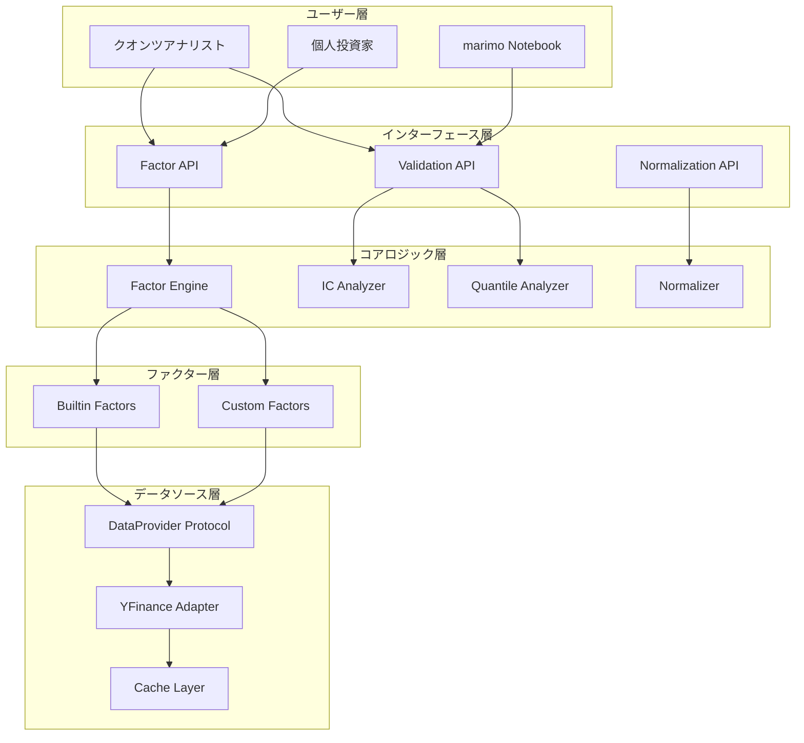
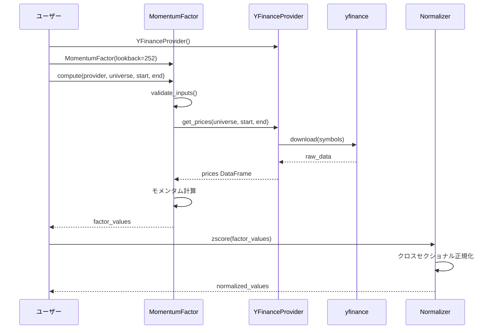
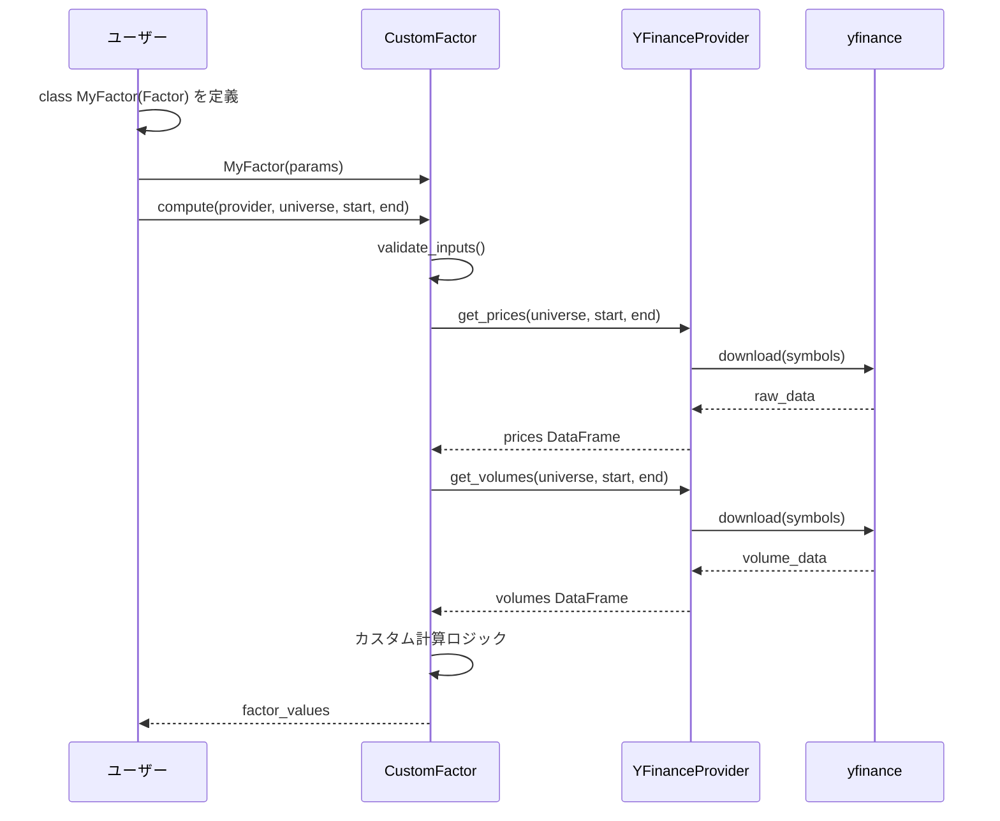
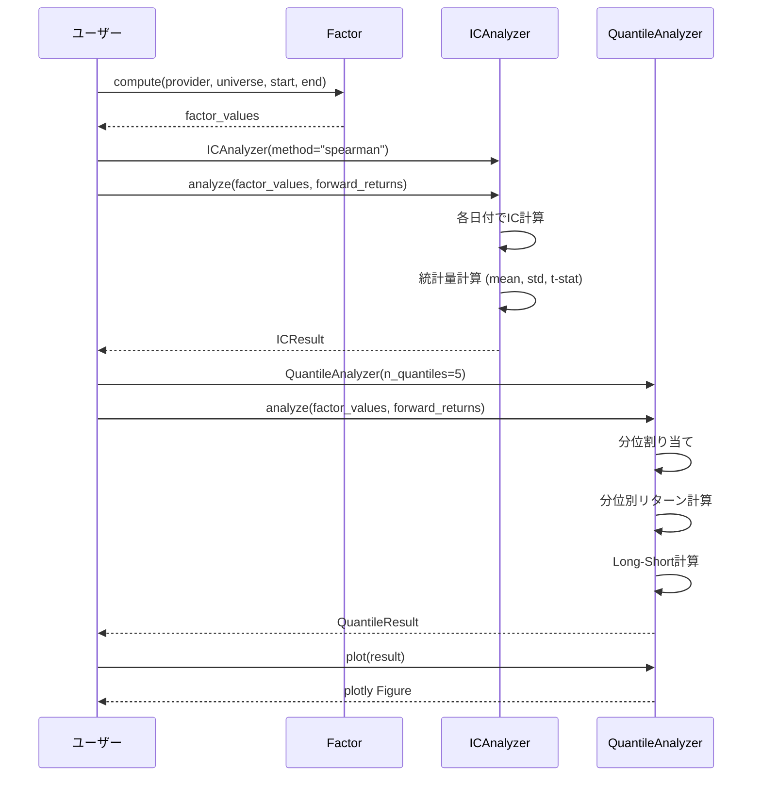

# 機能設計書 (Functional Design Document)

## 1. システム概要

### 1.1 システム構成図



### 1.2 レイヤー構造

| レイヤー | 責務 | 主要コンポーネント |
|----------|------|-------------------|
| インターフェース層 | 公開API、入力バリデーション | Factor API, Validation API |
| コアロジック層 | ビジネスロジック実装 | Factor Engine, Analyzers |
| ファクター層 | ファクター定義・計算 | Builtin Factors, Custom Factors |
| データソース層 | データ取得の抽象化 | DataProvider, Adapters |

### 1.3 技術スタック

| 分類 | 技術 | 選定理由 |
|------|------|----------|
| 言語 | Python 3.12+ | 型ヒント改善、パターンマッチング |
| パッケージ管理 | uv | 高速、統合されたツール |
| データ処理 | pandas 2.0+ | データ分析の標準ライブラリ |
| 数値計算 | numpy 1.26+, scipy | 統計計算、相関分析 |
| 市場データ | yfinance | 無料、豊富な市場カバレッジ |
| 可視化 | plotly, matplotlib | インタラクティブ/静的チャート |
| 型チェック | pyright (strict) | 厳密な型チェック |
| テスト | pytest + Hypothesis | 標準的、プロパティベーステスト |

## 2. 機能一覧

### 2.1 機能マトリクス

| 機能ID | 機能名 | 対応要件 | 優先度 |
|--------|--------|----------|--------|
| FD-001 | DataProvider インターフェース | LRD-1 | P0 |
| FD-002 | Factor 基底クラス | LRD-2 | P0 |
| FD-003 | ファクター正規化 | LRD-3 | P0 |
| FD-004 | IC/IR 計算 | LRD-4 | P0 |
| FD-005 | 分位分析 | LRD-5 | P0 |
| FD-006 | 価格ベースファクター | LRD-6 | P0 |
| FD-007 | バリューファクター | LRD-7 | P0 |
| FD-008 | クオリティファクター | LRD-8 | P0 |
| FD-009 | サイズファクター | LRD-9 | P0 |
| FD-010 | ファクターカテゴリ拡張 | LRD-10 | P0 |

## 3. データモデル定義

### 3.1 コアエンティティ

#### FactorValue

```python
from dataclasses import dataclass
from datetime import datetime

import pandas as pd


@dataclass
class FactorValue:
    """ファクター値の計算結果"""

    data: pd.DataFrame                   # ファクター値 (index: 日付, columns: 銘柄)
    factor_name: str                     # ファクター名
    computed_at: datetime                # 計算日時
    universe: list[str]                  # 対象銘柄リスト
    start_date: datetime                 # 開始日
    end_date: datetime                   # 終了日
    parameters: dict[str, int | float | str]  # ファクターパラメータ
```

**DataFrame スキーマ (ファクター値)**:

| 軸 | 型 | 説明 |
|----|-----|------|
| index (Date) | datetime64[ns] | 日付 |
| columns | str | 銘柄シンボル |
| values | float64 | ファクター値 |

#### ICResult

```python
from dataclasses import dataclass

import pandas as pd


@dataclass
class ICResult:
    """IC/IR分析結果"""

    ic_series: pd.Series                 # 時系列IC (index: 日付)
    mean_ic: float                       # 平均IC
    std_ic: float                        # IC標準偏差
    ir: float                            # 情報比率 (mean_ic / std_ic)
    t_stat: float                        # t値
    p_value: float                       # p値
    method: str                          # 計算方法 ("spearman" or "pearson")
    n_periods: int                       # 分析期間数
```

#### QuantileResult

```python
from dataclasses import dataclass

import pandas as pd


@dataclass
class QuantileResult:
    """分位分析結果"""

    quantile_returns: pd.DataFrame       # 分位別リターン (index: 日付, columns: 分位)
    mean_returns: pd.Series              # 分位別平均リターン
    long_short_return: float             # Top - Bottom リターン
    monotonicity_score: float            # 単調性スコア (0-1)
    n_quantiles: int                     # 分位数
    turnover: pd.Series | None           # 各分位の回転率 (オプション)
```

#### NormalizedFactorValue

```python
from dataclasses import dataclass
from typing import Literal

import pandas as pd


@dataclass
class NormalizedFactorValue:
    """正規化されたファクター値"""

    data: pd.DataFrame                   # 正規化後のファクター値
    original_factor_name: str            # 元のファクター名
    normalization_method: Literal["zscore", "rank", "winsorize"]
    parameters: dict[str, float]         # 正規化パラメータ
```

### 3.2 ファクター定義型

#### FactorMetadata

```python
from dataclasses import dataclass, field
from typing import Literal


@dataclass(frozen=True)
class FactorMetadata:
    """ファクターのメタデータ"""

    name: str                            # ファクター名
    description: str                     # 説明
    category: Literal["price", "value", "quality", "size", "macro", "alternative"]
    required_data: list[str]             # 必要なデータ種別 (e.g., ["price", "volume"])
    frequency: Literal["daily", "weekly", "monthly", "quarterly"]
    lookback_period: int | None = None   # ルックバック期間 (日数)
    higher_is_better: bool = True        # 高い値が良いか
    default_parameters: dict[str, int | float] = field(default_factory=dict)
```

#### FactorCategory

```python
from enum import Enum


class FactorCategory(str, Enum):
    """ファクターカテゴリ"""

    PRICE = "price"          # 価格ベース (モメンタム、ボラティリティ等)
    VALUE = "value"          # バリュー (PER, PBR等)
    QUALITY = "quality"      # クオリティ (ROE, ROA等)
    SIZE = "size"            # サイズ (時価総額等)
    MACRO = "macro"          # マクロ経済 (金利感応度等)
    ALTERNATIVE = "alternative"  # オルタナティブ (センチメント等)
```

### 3.3 DataProvider型

#### DataProvider Protocol

```python
from datetime import datetime
from typing import Protocol

import pandas as pd


class DataProvider(Protocol):
    """データプロバイダーのプロトコル"""

    def get_prices(
        self,
        symbols: list[str],
        start_date: datetime | str,
        end_date: datetime | str,
    ) -> pd.DataFrame:
        """価格データ (OHLCV) を取得

        Returns
        -------
        pd.DataFrame
            MultiIndex DataFrame (index: Date, columns: (symbol, OHLCV))
        """
        ...

    def get_volumes(
        self,
        symbols: list[str],
        start_date: datetime | str,
        end_date: datetime | str,
    ) -> pd.DataFrame:
        """出来高データを取得

        Returns
        -------
        pd.DataFrame
            index: Date, columns: symbols
        """
        ...

    def get_fundamentals(
        self,
        symbols: list[str],
        metrics: list[str],
        start_date: datetime | str,
        end_date: datetime | str,
    ) -> pd.DataFrame:
        """財務データを取得

        Parameters
        ----------
        metrics : list[str]
            取得する指標 (e.g., ["per", "pbr", "roe", "roa"])

        Returns
        -------
        pd.DataFrame
            MultiIndex DataFrame (index: Date, columns: (symbol, metric))
        """
        ...

    def get_market_cap(
        self,
        symbols: list[str],
        start_date: datetime | str,
        end_date: datetime | str,
    ) -> pd.DataFrame:
        """時価総額データを取得

        Returns
        -------
        pd.DataFrame
            index: Date, columns: symbols
        """
        ...
```

### 3.4 設定・オプション型

```python
from dataclasses import dataclass
from typing import Literal


@dataclass(frozen=True)
class FactorComputeOptions:
    """ファクター計算オプション"""

    handle_missing: Literal["drop", "fill_zero", "fill_mean"] = "drop"
    min_periods: int = 20                # 最小必要期間
    universe_filter: str | None = None   # ユニバースフィルター条件


@dataclass(frozen=True)
class NormalizationOptions:
    """正規化オプション"""

    method: Literal["zscore", "rank", "winsorize"] = "zscore"
    winsorize_limits: tuple[float, float] = (0.01, 0.99)  # Winsorization の閾値
    rank_ascending: bool = True          # ランクの昇順/降順


@dataclass(frozen=True)
class ICAnalysisOptions:
    """IC分析オプション"""

    method: Literal["spearman", "pearson"] = "spearman"
    forward_periods: int = 1             # フォワードリターンの期間
    lag: int = 0                         # ファクター値のラグ


@dataclass(frozen=True)
class QuantileAnalysisOptions:
    """分位分析オプション"""

    n_quantiles: int = 5                 # 分位数
    equal_weight: bool = True            # 等金額ウェイト
    rebalance_frequency: Literal["daily", "weekly", "monthly"] = "monthly"
```

### 3.5 エラー型

```python
from dataclasses import dataclass


class FactorError(Exception):
    """ファクターライブラリ基底エラー"""

    pass


@dataclass
class DataFetchError(FactorError):
    """データ取得エラー"""

    symbols: list[str]
    message: str


@dataclass
class ValidationError(FactorError):
    """入力バリデーションエラー"""

    field: str
    value: str
    message: str


@dataclass
class ComputationError(FactorError):
    """ファクター計算エラー"""

    factor_name: str
    message: str


@dataclass
class InsufficientDataError(FactorError):
    """データ不足エラー"""

    required: int
    available: int
    message: str
```

## 4. コンポーネント設計

### 4.1 Factor 基底クラス (コア)

**責務**:
- ファクター計算の共通インターフェース定義
- メタデータ管理
- バリデーション

```python
from abc import ABC, abstractmethod
from datetime import datetime

import pandas as pd


class Factor(ABC):
    """ファクター基底クラス

    カスタムファクターを作成する場合、このクラスを継承して
    compute() メソッドを実装してください。

    Examples
    --------
    >>> class MyFactor(Factor):
    ...     name = "my_factor"
    ...     description = "カスタムファクター"
    ...     category = FactorCategory.PRICE
    ...
    ...     def compute(self, provider, universe, start_date, end_date):
    ...         prices = provider.get_prices(universe, start_date, end_date)
    ...         return prices.pct_change(20)
    """

    # クラス属性 (サブクラスでオーバーライド)
    name: str = ""
    description: str = ""
    category: FactorCategory = FactorCategory.PRICE

    @property
    def metadata(self) -> FactorMetadata:
        """ファクターのメタデータを取得"""
        ...

    @abstractmethod
    def compute(
        self,
        provider: DataProvider,
        universe: list[str],
        start_date: datetime | str,
        end_date: datetime | str,
    ) -> pd.DataFrame:
        """ファクター値を計算

        Parameters
        ----------
        provider : DataProvider
            データプロバイダー
        universe : list[str]
            対象銘柄リスト
        start_date : datetime | str
            開始日
        end_date : datetime | str
            終了日

        Returns
        -------
        pd.DataFrame
            ファクター値 (index: Date, columns: symbols)

        Raises
        ------
        ComputationError
            計算失敗時
        InsufficientDataError
            データ不足時
        """
        ...

    def validate_inputs(
        self,
        universe: list[str],
        start_date: datetime,
        end_date: datetime,
    ) -> None:
        """入力値のバリデーション

        Raises
        ------
        ValidationError
            バリデーション失敗時
        """
        ...
```

### 4.2 ビルトインファクター

#### 価格ベースファクター

```python
from datetime import datetime

import pandas as pd


class MomentumFactor(Factor):
    """モメンタムファクター

    指定期間のリターンを計算します。

    Parameters
    ----------
    lookback : int, default=252
        ルックバック期間 (営業日)
    skip_recent : int, default=21
        直近除外期間 (リバーサル効果を除去)
    """

    name = "momentum"
    description = "価格モメンタム (過去リターン)"
    category = FactorCategory.PRICE

    def __init__(
        self,
        lookback: int = 252,
        skip_recent: int = 21,
    ) -> None:
        self.lookback = lookback
        self.skip_recent = skip_recent

    def compute(
        self,
        provider: DataProvider,
        universe: list[str],
        start_date: datetime | str,
        end_date: datetime | str,
    ) -> pd.DataFrame:
        """モメンタムファクター値を計算

        計算式: (P_{t-skip} / P_{t-lookback}) - 1

        Returns
        -------
        pd.DataFrame
            モメンタム値 (index: Date, columns: symbols)
        """
        ...


class ReversalFactor(Factor):
    """リバーサルファクター

    短期リターンの反転を計算します。

    Parameters
    ----------
    lookback : int, default=5
        ルックバック期間 (営業日)
    """

    name = "reversal"
    description = "短期リバーサル"
    category = FactorCategory.PRICE

    def __init__(self, lookback: int = 5) -> None:
        self.lookback = lookback

    def compute(
        self,
        provider: DataProvider,
        universe: list[str],
        start_date: datetime | str,
        end_date: datetime | str,
    ) -> pd.DataFrame:
        """リバーサルファクター値を計算

        計算式: -(P_t / P_{t-lookback} - 1)
        符号を反転して、下落した銘柄が高スコアになる

        Returns
        -------
        pd.DataFrame
            リバーサル値 (index: Date, columns: symbols)
        """
        ...


class VolatilityFactor(Factor):
    """ボラティリティファクター

    リターンの標準偏差を計算します。

    Parameters
    ----------
    lookback : int, default=20
        ルックバック期間 (営業日)
    annualize : bool, default=True
        年率換算するか
    """

    name = "volatility"
    description = "価格ボラティリティ"
    category = FactorCategory.PRICE

    def __init__(
        self,
        lookback: int = 20,
        annualize: bool = True,
    ) -> None:
        self.lookback = lookback
        self.annualize = annualize

    def compute(
        self,
        provider: DataProvider,
        universe: list[str],
        start_date: datetime | str,
        end_date: datetime | str,
    ) -> pd.DataFrame:
        """ボラティリティファクター値を計算

        計算式: std(returns) * sqrt(252) (年率換算時)

        Returns
        -------
        pd.DataFrame
            ボラティリティ値 (index: Date, columns: symbols)
        """
        ...
```

#### バリューファクター

```python
class ValueFactor(Factor):
    """バリューファクター

    PER, PBR, 配当利回り等のバリュー指標を計算します。

    Parameters
    ----------
    metric : str, default="per"
        指標種類 ("per", "pbr", "dividend_yield", "ev_ebitda")
    invert : bool, default=True
        符号反転 (低PER = 高スコアにする場合True)
    """

    name = "value"
    description = "バリューファクター"
    category = FactorCategory.VALUE

    VALID_METRICS = ("per", "pbr", "dividend_yield", "ev_ebitda")

    def __init__(
        self,
        metric: str = "per",
        invert: bool = True,
    ) -> None:
        if metric not in self.VALID_METRICS:
            raise ValidationError(
                field="metric",
                value=metric,
                message=f"metric must be one of {self.VALID_METRICS}",
            )
        self.metric = metric
        self.invert = invert

    def compute(
        self,
        provider: DataProvider,
        universe: list[str],
        start_date: datetime | str,
        end_date: datetime | str,
    ) -> pd.DataFrame:
        """バリューファクター値を計算

        Returns
        -------
        pd.DataFrame
            バリュー指標値 (index: Date, columns: symbols)
        """
        ...


class CompositeValueFactor(Factor):
    """複合バリューファクター

    複数のバリュー指標を組み合わせたファクター。

    Parameters
    ----------
    weights : dict[str, float] | None
        各指標のウェイト (デフォルト: 等ウェイト)
    """

    name = "composite_value"
    description = "複合バリューファクター"
    category = FactorCategory.VALUE

    def __init__(
        self,
        weights: dict[str, float] | None = None,
    ) -> None:
        self.weights = weights or {
            "per": 0.25,
            "pbr": 0.25,
            "dividend_yield": 0.25,
            "ev_ebitda": 0.25,
        }

    def compute(
        self,
        provider: DataProvider,
        universe: list[str],
        start_date: datetime | str,
        end_date: datetime | str,
    ) -> pd.DataFrame:
        """複合バリューファクター値を計算

        各指標を正規化後、ウェイト付き平均を計算

        Returns
        -------
        pd.DataFrame
            複合バリュー値 (index: Date, columns: symbols)
        """
        ...
```

#### クオリティファクター

```python
class QualityFactor(Factor):
    """クオリティファクター

    ROE, ROA, 利益安定性等のクオリティ指標を計算します。

    Parameters
    ----------
    metric : str, default="roe"
        指標種類 ("roe", "roa", "earnings_stability", "debt_ratio")
    """

    name = "quality"
    description = "クオリティファクター"
    category = FactorCategory.QUALITY

    VALID_METRICS = ("roe", "roa", "earnings_stability", "debt_ratio")

    def __init__(self, metric: str = "roe") -> None:
        if metric not in self.VALID_METRICS:
            raise ValidationError(
                field="metric",
                value=metric,
                message=f"metric must be one of {self.VALID_METRICS}",
            )
        self.metric = metric

    def compute(
        self,
        provider: DataProvider,
        universe: list[str],
        start_date: datetime | str,
        end_date: datetime | str,
    ) -> pd.DataFrame:
        """クオリティファクター値を計算

        Returns
        -------
        pd.DataFrame
            クオリティ指標値 (index: Date, columns: symbols)
        """
        ...


class CompositeQualityFactor(Factor):
    """複合クオリティファクター

    複数のクオリティ指標を組み合わせたファクター。

    Parameters
    ----------
    weights : dict[str, float] | None
        各指標のウェイト (デフォルト: 等ウェイト)
    """

    name = "composite_quality"
    description = "複合クオリティファクター"
    category = FactorCategory.QUALITY

    def __init__(
        self,
        weights: dict[str, float] | None = None,
    ) -> None:
        self.weights = weights or {
            "roe": 0.3,
            "roa": 0.3,
            "earnings_stability": 0.2,
            "debt_ratio": 0.2,
        }

    def compute(
        self,
        provider: DataProvider,
        universe: list[str],
        start_date: datetime | str,
        end_date: datetime | str,
    ) -> pd.DataFrame:
        """複合クオリティファクター値を計算

        Returns
        -------
        pd.DataFrame
            複合クオリティ値 (index: Date, columns: symbols)
        """
        ...
```

#### サイズファクター

```python
class SizeFactor(Factor):
    """サイズファクター

    時価総額、売上高、総資産等のサイズ指標を計算します。

    Parameters
    ----------
    metric : str, default="market_cap"
        指標種類 ("market_cap", "revenue", "total_assets")
    invert : bool, default=False
        符号反転 (小型株プレミアムを狙う場合True)
    log_transform : bool, default=True
        対数変換を適用するか
    """

    name = "size"
    description = "サイズファクター"
    category = FactorCategory.SIZE

    VALID_METRICS = ("market_cap", "revenue", "total_assets")

    def __init__(
        self,
        metric: str = "market_cap",
        invert: bool = False,
        log_transform: bool = True,
    ) -> None:
        if metric not in self.VALID_METRICS:
            raise ValidationError(
                field="metric",
                value=metric,
                message=f"metric must be one of {self.VALID_METRICS}",
            )
        self.metric = metric
        self.invert = invert
        self.log_transform = log_transform

    def compute(
        self,
        provider: DataProvider,
        universe: list[str],
        start_date: datetime | str,
        end_date: datetime | str,
    ) -> pd.DataFrame:
        """サイズファクター値を計算

        Returns
        -------
        pd.DataFrame
            サイズ指標値 (index: Date, columns: symbols)
        """
        ...
```

### 4.3 Normalizer (正規化)

**責務**:
- クロスセクショナル正規化
- 外れ値処理
- ランク変換

```python
from typing import Literal

import pandas as pd


class Normalizer:
    """ファクター正規化クラス"""

    @staticmethod
    def zscore(
        factor_values: pd.DataFrame,
        axis: Literal["cross_sectional", "time_series"] = "cross_sectional",
    ) -> pd.DataFrame:
        """Z-score 正規化

        Parameters
        ----------
        factor_values : pd.DataFrame
            ファクター値 (index: Date, columns: symbols)
        axis : str
            正規化の軸 ("cross_sectional": 銘柄間, "time_series": 時系列)

        Returns
        -------
        pd.DataFrame
            正規化後のファクター値

        Examples
        --------
        >>> normalized = Normalizer.zscore(factor_values)
        >>> # 各日付で銘柄間の平均0、標準偏差1に正規化
        """
        ...

    @staticmethod
    def rank(
        factor_values: pd.DataFrame,
        method: Literal["average", "min", "max", "first", "dense"] = "average",
        pct: bool = True,
    ) -> pd.DataFrame:
        """ランク正規化

        Parameters
        ----------
        factor_values : pd.DataFrame
            ファクター値
        method : str
            ランク計算方法
        pct : bool
            パーセンタイルに変換するか

        Returns
        -------
        pd.DataFrame
            ランク正規化後のファクター値 (0-1 の範囲)

        Examples
        --------
        >>> ranked = Normalizer.rank(factor_values, pct=True)
        >>> # 各日付で銘柄を0-1のパーセンタイルに変換
        """
        ...

    @staticmethod
    def winsorize(
        factor_values: pd.DataFrame,
        limits: tuple[float, float] = (0.01, 0.99),
    ) -> pd.DataFrame:
        """Winsorization (外れ値処理)

        Parameters
        ----------
        factor_values : pd.DataFrame
            ファクター値
        limits : tuple[float, float]
            クリップする下限/上限パーセンタイル

        Returns
        -------
        pd.DataFrame
            外れ値処理後のファクター値

        Examples
        --------
        >>> clipped = Normalizer.winsorize(factor_values, limits=(0.01, 0.99))
        >>> # 1%ile以下と99%ile以上の値をクリップ
        """
        ...
```

### 4.4 ICAnalyzer (IC/IR 分析)

**責務**:
- IC (情報係数) の計算
- IR (情報比率) の計算
- 統計的有意性の検定

```python
from typing import Literal

import pandas as pd


class ICAnalyzer:
    """IC/IR 分析クラス"""

    def __init__(
        self,
        method: Literal["spearman", "pearson"] = "spearman",
    ) -> None:
        """初期化

        Parameters
        ----------
        method : str
            相関計算方法 ("spearman": ランク相関, "pearson": 線形相関)
        """
        self.method = method

    def analyze(
        self,
        factor_values: pd.DataFrame,
        forward_returns: pd.DataFrame,
    ) -> ICResult:
        """IC/IR を分析

        Parameters
        ----------
        factor_values : pd.DataFrame
            ファクター値 (index: Date, columns: symbols)
        forward_returns : pd.DataFrame
            フォワードリターン (index: Date, columns: symbols)

        Returns
        -------
        ICResult
            分析結果

        Raises
        ------
        InsufficientDataError
            データ点数が不足している場合

        Examples
        --------
        >>> analyzer = ICAnalyzer(method="spearman")
        >>> result = analyzer.analyze(momentum_values, forward_returns)
        >>> print(f"Mean IC: {result.mean_ic:.4f}, IR: {result.ir:.4f}")
        """
        ...

    def compute_ic_series(
        self,
        factor_values: pd.DataFrame,
        forward_returns: pd.DataFrame,
    ) -> pd.Series:
        """時系列IC を計算

        Parameters
        ----------
        factor_values : pd.DataFrame
            ファクター値
        forward_returns : pd.DataFrame
            フォワードリターン

        Returns
        -------
        pd.Series
            各日付のIC値 (index: Date)
        """
        ...

    @staticmethod
    def compute_forward_returns(
        prices: pd.DataFrame,
        periods: int = 1,
    ) -> pd.DataFrame:
        """フォワードリターンを計算

        Parameters
        ----------
        prices : pd.DataFrame
            価格データ (index: Date, columns: symbols)
        periods : int
            リターン期間

        Returns
        -------
        pd.DataFrame
            フォワードリターン (index: Date, columns: symbols)
        """
        ...
```

### 4.5 QuantileAnalyzer (分位分析)

**責務**:
- 分位ポートフォリオの構築
- 分位別リターンの計算
- 単調性の評価

```python
from typing import Literal

import pandas as pd
import plotly.graph_objects as go


class QuantileAnalyzer:
    """分位分析クラス"""

    def __init__(
        self,
        n_quantiles: int = 5,
    ) -> None:
        """初期化

        Parameters
        ----------
        n_quantiles : int
            分位数 (デフォルト: 5分位)
        """
        self.n_quantiles = n_quantiles

    def analyze(
        self,
        factor_values: pd.DataFrame,
        forward_returns: pd.DataFrame,
    ) -> QuantileResult:
        """分位分析を実行

        Parameters
        ----------
        factor_values : pd.DataFrame
            ファクター値 (index: Date, columns: symbols)
        forward_returns : pd.DataFrame
            フォワードリターン (index: Date, columns: symbols)

        Returns
        -------
        QuantileResult
            分析結果

        Examples
        --------
        >>> analyzer = QuantileAnalyzer(n_quantiles=5)
        >>> result = analyzer.analyze(momentum_values, forward_returns)
        >>> print(f"Long-Short Return: {result.long_short_return:.4f}")
        """
        ...

    def assign_quantiles(
        self,
        factor_values: pd.DataFrame,
    ) -> pd.DataFrame:
        """ファクター値を分位に割り当て

        Parameters
        ----------
        factor_values : pd.DataFrame
            ファクター値

        Returns
        -------
        pd.DataFrame
            分位番号 (1: 最低, n_quantiles: 最高)
        """
        ...

    def compute_quantile_returns(
        self,
        quantile_assignments: pd.DataFrame,
        forward_returns: pd.DataFrame,
    ) -> pd.DataFrame:
        """分位別リターンを計算

        Parameters
        ----------
        quantile_assignments : pd.DataFrame
            分位割り当て
        forward_returns : pd.DataFrame
            フォワードリターン

        Returns
        -------
        pd.DataFrame
            分位別リターン (index: Date, columns: 分位番号)
        """
        ...

    def plot(
        self,
        result: QuantileResult,
        title: str | None = None,
    ) -> go.Figure:
        """分位別リターンをプロット

        Parameters
        ----------
        result : QuantileResult
            分析結果
        title : str | None
            チャートタイトル

        Returns
        -------
        go.Figure
            plotly Figure オブジェクト
        """
        ...
```

### 4.6 YFinanceProvider (データアダプター)

**責務**:
- yfinance からのデータ取得
- DataProvider プロトコルの実装
- キャッシュ管理

```python
from datetime import datetime

import pandas as pd


class YFinanceProvider:
    """yfinance データプロバイダー

    DataProvider プロトコルを実装し、yfinance からデータを取得します。

    Parameters
    ----------
    cache_path : str | None
        キャッシュファイルパス
    cache_ttl_hours : int
        キャッシュの有効期間

    Examples
    --------
    >>> provider = YFinanceProvider()
    >>> prices = provider.get_prices(
    ...     symbols=["AAPL", "GOOGL"],
    ...     start_date="2020-01-01",
    ...     end_date="2024-01-01",
    ... )
    """

    def __init__(
        self,
        cache_path: str | None = None,
        cache_ttl_hours: int = 24,
    ) -> None:
        ...

    def get_prices(
        self,
        symbols: list[str],
        start_date: datetime | str,
        end_date: datetime | str,
    ) -> pd.DataFrame:
        """価格データを取得

        Returns
        -------
        pd.DataFrame
            価格データ (index: Date, columns: symbols, Close値)
        """
        ...

    def get_volumes(
        self,
        symbols: list[str],
        start_date: datetime | str,
        end_date: datetime | str,
    ) -> pd.DataFrame:
        """出来高データを取得"""
        ...

    def get_fundamentals(
        self,
        symbols: list[str],
        metrics: list[str],
        start_date: datetime | str,
        end_date: datetime | str,
    ) -> pd.DataFrame:
        """財務データを取得

        Note
        ----
        yfinance の財務データは四半期ベースのため、
        日次データに展開して返します。
        """
        ...

    def get_market_cap(
        self,
        symbols: list[str],
        start_date: datetime | str,
        end_date: datetime | str,
    ) -> pd.DataFrame:
        """時価総額データを取得"""
        ...
```

## 5. ユースケース

### 5.1 ビルトインファクターの使用



**フロー説明**:
1. ユーザーが `YFinanceProvider` と `MomentumFactor` を初期化
2. `compute()` メソッドでファクター値を計算
3. 内部で yfinance からデータを取得
4. モメンタム値を計算して返却
5. 必要に応じて `Normalizer` で正規化

### 5.2 カスタムファクターの作成



### 5.3 ファクター検証フロー



**フロー説明**:
1. ファクター値を計算
2. `ICAnalyzer` で IC/IR を計算
3. 統計的有意性を検定
4. `QuantileAnalyzer` で分位分析
5. Long-Short リターンと単調性を評価
6. 結果を可視化

## 6. アルゴリズム設計

### 6.1 モメンタム計算

**目的**: 指定期間の価格リターンを計算し、トレンドフォロー戦略の基礎とする

**計算式**:
```
Momentum = (P_{t-skip} / P_{t-lookback}) - 1
```

**実装**:
```python
import pandas as pd


def calculate_momentum(
    prices: pd.DataFrame,
    lookback: int = 252,
    skip_recent: int = 21,
) -> pd.DataFrame:
    """モメンタムファクターを計算

    Parameters
    ----------
    prices : pd.DataFrame
        価格データ (index: Date, columns: symbols)
    lookback : int
        ルックバック期間
    skip_recent : int
        直近除外期間 (リバーサル効果を除去)

    Returns
    -------
    pd.DataFrame
        モメンタム値
    """
    # 直近を除外したリターンを計算
    lagged_prices = prices.shift(skip_recent)
    lookback_prices = prices.shift(lookback)

    momentum = (lagged_prices / lookback_prices) - 1
    return momentum
```

### 6.2 ボラティリティ計算

**目的**: 価格変動の大きさを標準偏差で計算

**計算式**:
```
Volatility = std(Returns) * sqrt(252)  # 年率換算
```

**実装**:
```python
import numpy as np
import pandas as pd


def calculate_volatility(
    prices: pd.DataFrame,
    lookback: int = 20,
    annualize: bool = True,
) -> pd.DataFrame:
    """ボラティリティファクターを計算

    Parameters
    ----------
    prices : pd.DataFrame
        価格データ
    lookback : int
        計算期間
    annualize : bool
        年率換算するか

    Returns
    -------
    pd.DataFrame
        ボラティリティ値
    """
    returns = prices.pct_change()
    volatility = returns.rolling(window=lookback).std()

    if annualize:
        volatility = volatility * np.sqrt(252)

    return volatility
```

### 6.3 Z-score 正規化

**目的**: ファクター値をクロスセクショナルに標準化

**計算式**:
```
Z = (X - mean(X)) / std(X)
```

**実装**:
```python
import pandas as pd


def zscore_normalize(
    factor_values: pd.DataFrame,
) -> pd.DataFrame:
    """クロスセクショナル Z-score 正規化

    Parameters
    ----------
    factor_values : pd.DataFrame
        ファクター値 (index: Date, columns: symbols)

    Returns
    -------
    pd.DataFrame
        正規化後の値 (各行で平均0、標準偏差1)
    """
    # 各行 (日付) で正規化
    mean = factor_values.mean(axis=1)
    std = factor_values.std(axis=1)

    normalized = factor_values.sub(mean, axis=0).div(std, axis=0)
    return normalized
```

### 6.4 Winsorization

**目的**: 外れ値の影響を軽減

**計算式**:
```
X_winsorized = clip(X, percentile_low, percentile_high)
```

**実装**:
```python
import pandas as pd


def winsorize(
    factor_values: pd.DataFrame,
    limits: tuple[float, float] = (0.01, 0.99),
) -> pd.DataFrame:
    """外れ値をWinsorize

    Parameters
    ----------
    factor_values : pd.DataFrame
        ファクター値
    limits : tuple[float, float]
        下限/上限パーセンタイル

    Returns
    -------
    pd.DataFrame
        Winsorize後の値
    """
    def winsorize_row(row: pd.Series) -> pd.Series:
        lower = row.quantile(limits[0])
        upper = row.quantile(limits[1])
        return row.clip(lower=lower, upper=upper)

    return factor_values.apply(winsorize_row, axis=1)
```

### 6.5 IC (情報係数) 計算

**目的**: ファクター値とフォワードリターンの相関を計算し、予測力を評価

**計算式**:
```
IC_t = corr(Factor_t, Return_{t+1})
Mean IC = mean(IC_t)
IR = Mean IC / std(IC_t)
```

**実装**:
```python
import pandas as pd
from scipy import stats


def calculate_ic(
    factor_values: pd.DataFrame,
    forward_returns: pd.DataFrame,
    method: str = "spearman",
) -> pd.Series:
    """時系列ICを計算

    Parameters
    ----------
    factor_values : pd.DataFrame
        ファクター値 (index: Date, columns: symbols)
    forward_returns : pd.DataFrame
        フォワードリターン (index: Date, columns: symbols)
    method : str
        相関計算方法 ("spearman" or "pearson")

    Returns
    -------
    pd.Series
        各日付のIC値
    """
    common_dates = factor_values.index.intersection(forward_returns.index)
    ic_series = pd.Series(index=common_dates, dtype=float)

    for date in common_dates:
        factors = factor_values.loc[date].dropna()
        returns = forward_returns.loc[date].dropna()

        common_symbols = factors.index.intersection(returns.index)
        if len(common_symbols) < 5:  # 最小銘柄数
            ic_series.loc[date] = float("nan")
            continue

        f = factors.loc[common_symbols]
        r = returns.loc[common_symbols]

        if method == "spearman":
            ic, _ = stats.spearmanr(f, r)
        else:
            ic, _ = stats.pearsonr(f, r)

        ic_series.loc[date] = ic

    return ic_series


def calculate_ir(ic_series: pd.Series) -> float:
    """情報比率を計算

    Parameters
    ----------
    ic_series : pd.Series
        時系列IC

    Returns
    -------
    float
        IR (IC平均 / IC標準偏差)
    """
    ic_clean = ic_series.dropna()
    if len(ic_clean) == 0:
        return float("nan")

    return ic_clean.mean() / ic_clean.std()
```

### 6.6 分位分析

**目的**: ファクター値で銘柄を分位に分け、各分位のリターンを比較

**計算式**:
```
Quantile_i = assign_quantile(Factor_t, n_quantiles)
Return_quantile_i = mean(Return_{t+1} for stocks in Quantile_i)
Long_Short = Return_quantile_n - Return_quantile_1
```

**実装**:
```python
import pandas as pd


def assign_quantiles(
    factor_values: pd.DataFrame,
    n_quantiles: int = 5,
) -> pd.DataFrame:
    """ファクター値を分位に割り当て

    Parameters
    ----------
    factor_values : pd.DataFrame
        ファクター値 (index: Date, columns: symbols)
    n_quantiles : int
        分位数

    Returns
    -------
    pd.DataFrame
        分位番号 (1: 最低, n_quantiles: 最高)
    """
    def quantile_row(row: pd.Series) -> pd.Series:
        valid = row.dropna()
        if len(valid) < n_quantiles:
            return pd.Series(float("nan"), index=row.index)

        quantiles = pd.qcut(
            valid,
            q=n_quantiles,
            labels=range(1, n_quantiles + 1),
            duplicates="drop",
        )
        result = pd.Series(float("nan"), index=row.index)
        result.loc[valid.index] = quantiles.astype(float)
        return result

    return factor_values.apply(quantile_row, axis=1)


def calculate_quantile_returns(
    quantile_assignments: pd.DataFrame,
    forward_returns: pd.DataFrame,
    n_quantiles: int = 5,
) -> pd.DataFrame:
    """分位別リターンを計算

    Parameters
    ----------
    quantile_assignments : pd.DataFrame
        分位割り当て
    forward_returns : pd.DataFrame
        フォワードリターン
    n_quantiles : int
        分位数

    Returns
    -------
    pd.DataFrame
        分位別リターン (index: Date, columns: 分位番号)
    """
    common_dates = quantile_assignments.index.intersection(forward_returns.index)
    result = pd.DataFrame(index=common_dates, columns=range(1, n_quantiles + 1))

    for date in common_dates:
        assignments = quantile_assignments.loc[date]
        returns = forward_returns.loc[date]

        for q in range(1, n_quantiles + 1):
            stocks_in_quantile = assignments[assignments == q].index
            common = stocks_in_quantile.intersection(returns.dropna().index)

            if len(common) > 0:
                result.loc[date, q] = returns.loc[common].mean()

    return result.astype(float)
```

## 7. エラーハンドリング

### 7.1 エラー分類と対処

| エラー種別 | エラーコード | 原因 | 対処 | ユーザーへの表示 |
|-----------|-------------|------|------|-----------------|
| シンボル不正 | `INVALID_SYMBOL` | 存在しないティッカー | 処理中断 | "Symbol 'XXX' not found" |
| データ不足 | `INSUFFICIENT_DATA` | lookback期間より短いデータ | 警告表示、可能な範囲で計算 | "Warning: Only X data points, need Y" |
| 日付範囲エラー | `INVALID_DATE_RANGE` | start > end | 処理中断 | "Start date must be before end date" |
| ユニバース空 | `EMPTY_UNIVERSE` | 銘柄リストが空 | 処理中断 | "Universe cannot be empty" |
| データ取得失敗 | `DATA_FETCH_ERROR` | API/ネットワーク障害 | 最大3回リトライ | "Failed to fetch data: {detail}" |
| 計算エラー | `COMPUTATION_ERROR` | 数値計算の失敗 | 該当銘柄をスキップ | "Computation failed for {symbol}" |
| パラメータ不正 | `INVALID_PARAMETER` | lookback < 1 等 | 処理中断 | "Parameter 'lookback' must be positive" |

### 7.2 データ品質チェック

```python
from dataclasses import dataclass


@dataclass
class DataQualityReport:
    """データ品質レポート"""

    total_symbols: int                   # 総銘柄数
    valid_symbols: int                   # 有効な銘柄数
    missing_ratio: float                 # 欠損率
    warnings: list[str]                  # 警告メッセージ


def check_data_quality(
    factor_values: pd.DataFrame,
    min_valid_ratio: float = 0.5,
) -> DataQualityReport:
    """データ品質をチェック

    Parameters
    ----------
    factor_values : pd.DataFrame
        ファクター値
    min_valid_ratio : float
        最小有効データ比率

    Returns
    -------
    DataQualityReport
        品質レポート
    """
    ...
```

## 8. パフォーマンス最適化

### 8.1 最適化方針

| 領域 | 最適化 | 期待効果 |
|------|--------|----------|
| データ取得 | バッチ取得、キャッシュ | 2回目以降 90%高速化 |
| ファクター計算 | pandas vectorized操作 | ループ比 10-100x 高速 |
| IC計算 | 並列化 (multiprocessing) | 4コアで 3x 高速化 |
| メモリ | DataFrame型最適化 | メモリ 50%削減 |

### 8.2 ベクトル化計算の原則

```python
# 悪い例: ループ処理
def bad_momentum(prices: pd.DataFrame, lookback: int) -> pd.DataFrame:
    result = pd.DataFrame(index=prices.index, columns=prices.columns)
    for i in range(lookback, len(prices)):
        for col in prices.columns:
            result.iloc[i, prices.columns.get_loc(col)] = (
                prices.iloc[i, prices.columns.get_loc(col)]
                / prices.iloc[i - lookback, prices.columns.get_loc(col)]
                - 1
            )
    return result


# 良い例: ベクトル化
def good_momentum(prices: pd.DataFrame, lookback: int) -> pd.DataFrame:
    return prices / prices.shift(lookback) - 1
```

### 8.3 パフォーマンス目標

- **ファクター計算**: 100銘柄 x 5年日次 (約125,000点) で 1秒以内
- **IC計算**: 100銘柄 x 1000日で 500ms以内
- **メモリ使用量**: 入力データの 3倍以内

## 9. ファイル構造

### 9.1 パッケージ構成

```
src/factor/
├── __init__.py              # パッケージエクスポート
├── py.typed                 # PEP 561 マーカー
├── types.py                 # 共通型定義
├── errors.py                # エラー型定義
├── core/
│   ├── __init__.py
│   ├── base.py              # Factor基底クラス
│   ├── normalizer.py        # 正規化処理
│   └── registry.py          # ファクター登録
├── factors/
│   ├── __init__.py
│   ├── price/
│   │   ├── __init__.py
│   │   ├── momentum.py      # モメンタム
│   │   ├── reversal.py      # リバーサル
│   │   └── volatility.py    # ボラティリティ
│   ├── value/
│   │   ├── __init__.py
│   │   └── value.py         # バリューファクター
│   ├── quality/
│   │   ├── __init__.py
│   │   └── quality.py       # クオリティファクター
│   └── size/
│       ├── __init__.py
│       └── size.py          # サイズファクター
├── providers/
│   ├── __init__.py
│   ├── base.py              # DataProviderプロトコル
│   └── yfinance.py          # YFinanceProvider
├── validation/
│   ├── __init__.py
│   ├── ic_analyzer.py       # IC/IR分析
│   └── quantile_analyzer.py # 分位分析
├── utils/
│   ├── __init__.py
│   ├── logging_config.py    # ログ設定
│   └── cache.py             # キャッシュ管理
└── docs/
    ├── project.md
    ├── library-requirements.md
    └── functional-design.md
```

### 9.2 公開API

`src/factor/__init__.py`:
```python
"""factor - カスタムファクター開発フレームワーク"""

# 基底クラス
from factor.core.base import Factor
from factor.core.normalizer import Normalizer

# ビルトインファクター
from factor.factors.price import MomentumFactor, ReversalFactor, VolatilityFactor
from factor.factors.value import ValueFactor, CompositeValueFactor
from factor.factors.quality import QualityFactor, CompositeQualityFactor
from factor.factors.size import SizeFactor

# データプロバイダー
from factor.providers import YFinanceProvider

# 検証ツール
from factor.validation import ICAnalyzer, QuantileAnalyzer

# 型・エラー
from factor.types import (
    FactorValue,
    ICResult,
    QuantileResult,
    FactorMetadata,
    FactorCategory,
)
from factor.errors import (
    FactorError,
    DataFetchError,
    ValidationError,
    ComputationError,
    InsufficientDataError,
)

__all__ = [
    # Core
    "Factor",
    "Normalizer",
    # Price Factors
    "MomentumFactor",
    "ReversalFactor",
    "VolatilityFactor",
    # Value Factors
    "ValueFactor",
    "CompositeValueFactor",
    # Quality Factors
    "QualityFactor",
    "CompositeQualityFactor",
    # Size Factors
    "SizeFactor",
    # Providers
    "YFinanceProvider",
    # Validation
    "ICAnalyzer",
    "QuantileAnalyzer",
    # Types
    "FactorValue",
    "ICResult",
    "QuantileResult",
    "FactorMetadata",
    "FactorCategory",
    # Errors
    "FactorError",
    "DataFetchError",
    "ValidationError",
    "ComputationError",
    "InsufficientDataError",
]
```

## 10. テスト戦略

### 10.1 テスト分類

| テスト種別 | 対象 | ツール |
|-----------|------|--------|
| ユニットテスト | 個別関数・クラス | pytest |
| プロパティテスト | 境界値・不変条件 | Hypothesis |
| 統合テスト | API全体のフロー | pytest + モック |
| 回帰テスト | 既知のファクター値との比較 | pytest |

### 10.2 テストケース例

**ユニットテスト**:
- `test_momentum_factor_positive_lookback`
- `test_momentum_factor_returns_correct_shape`
- `test_normalizer_zscore_mean_zero`
- `test_normalizer_zscore_std_one`
- `test_ic_analyzer_spearman_correlation`
- `test_quantile_analyzer_correct_assignments`

**プロパティテスト**:
- `test_zscore_always_produces_mean_zero`
- `test_rank_values_between_zero_and_one`
- `test_ic_values_between_minus_one_and_one`
- `test_quantile_assignments_cover_all_symbols`

**統合テスト**:
- `test_end_to_end_momentum_factor_analysis`
- `test_custom_factor_with_validation`
- `test_multiple_factors_combination`

**回帰テスト**:
- `test_momentum_matches_expected_values`
- `test_value_factor_matches_bloomberg_calculation`

## 11. LRD要件との対応表

| LRD要件 | 機能設計 | 対応状況 |
|---------|----------|----------|
| LRD-1: DataProvider インターフェース | DataProvider Protocol, YFinanceProvider | 対応済 |
| LRD-2: Factor 基底クラス | Factor ABC, compute(), metadata | 対応済 |
| LRD-3: ファクター正規化 | Normalizer.zscore/rank/winsorize() | 対応済 |
| LRD-4: IC/IR 計算 | ICAnalyzer.analyze() | 対応済 |
| LRD-5: 分位分析 | QuantileAnalyzer.analyze(), plot() | 対応済 |
| LRD-6: 価格ベースファクター | MomentumFactor, ReversalFactor, VolatilityFactor | 対応済 |
| LRD-7: バリューファクター | ValueFactor, CompositeValueFactor | 対応済 |
| LRD-8: クオリティファクター | QualityFactor, CompositeQualityFactor | 対応済 |
| LRD-9: サイズファクター | SizeFactor | 対応済 |
| LRD-10: ファクターカテゴリ拡張 | FactorCategory Enum, FactorMetadata | 対応済 |

## 12. 使用例

### 12.1 基本的な使用例

```python
from factor import MomentumFactor, ValueFactor
from factor.providers import YFinanceProvider
from factor.validation import ICAnalyzer, QuantileAnalyzer
from factor import Normalizer

# データプロバイダーの設定
provider = YFinanceProvider()

# ユニバースの定義
universe = ["AAPL", "GOOGL", "MSFT", "AMZN", "META", "NVDA"]

# モメンタムファクターの計算
momentum = MomentumFactor(lookback=252, skip_recent=21)
momentum_values = momentum.compute(
    provider=provider,
    universe=universe,
    start_date="2020-01-01",
    end_date="2024-01-01",
)

# 正規化
normalized = Normalizer.zscore(momentum_values)

# フォワードリターンの計算
prices = provider.get_prices(universe, "2020-01-01", "2024-01-01")
forward_returns = ICAnalyzer.compute_forward_returns(prices, periods=21)

# IC/IR 分析
ic_analyzer = ICAnalyzer(method="spearman")
ic_result = ic_analyzer.analyze(normalized, forward_returns)
print(f"Mean IC: {ic_result.mean_ic:.4f}")
print(f"IR: {ic_result.ir:.4f}")
print(f"t-stat: {ic_result.t_stat:.2f} (p={ic_result.p_value:.4f})")

# 分位分析
quantile_analyzer = QuantileAnalyzer(n_quantiles=5)
quantile_result = quantile_analyzer.analyze(normalized, forward_returns)
print(f"Long-Short Return: {quantile_result.long_short_return:.4f}")

# 可視化
fig = quantile_analyzer.plot(quantile_result, title="Momentum Factor Quantile Analysis")
fig.show()
```

### 12.2 カスタムファクターの作成

```python
from factor import Factor
from factor.types import FactorCategory
import pandas as pd


class PriceVolumeMomentum(Factor):
    """価格とボリュームを組み合わせたカスタムファクター"""

    name = "price_volume_momentum"
    description = "価格変化率とボリューム変化率の積"
    category = FactorCategory.PRICE

    def __init__(
        self,
        price_lookback: int = 20,
        volume_lookback: int = 20,
    ) -> None:
        self.price_lookback = price_lookback
        self.volume_lookback = volume_lookback

    def compute(
        self,
        provider,
        universe,
        start_date,
        end_date,
    ) -> pd.DataFrame:
        prices = provider.get_prices(universe, start_date, end_date)
        volumes = provider.get_volumes(universe, start_date, end_date)

        price_mom = prices.pct_change(self.price_lookback)
        volume_mom = volumes.pct_change(self.volume_lookback)

        return price_mom * volume_mom


# カスタムファクターの使用
pv_momentum = PriceVolumeMomentum(price_lookback=20, volume_lookback=20)
pv_values = pv_momentum.compute(provider, universe, "2020-01-01", "2024-01-01")
```

### 12.3 設定ファイルベースのファクター定義

```yaml
# factor_config.yaml
factors:
  - name: momentum_12m
    type: builtin.momentum
    params:
      lookback: 252
      skip_recent: 21

  - name: volatility_20d
    type: builtin.volatility
    params:
      lookback: 20
      annualize: true

  - name: value_composite
    type: builtin.composite_value
    params:
      weights:
        per: 0.3
        pbr: 0.3
        dividend_yield: 0.4
```

```python
from factor.config import load_factors_from_config

# 設定ファイルからファクターをロード
factors = load_factors_from_config("factor_config.yaml")

# 各ファクターを計算
for factor in factors:
    values = factor.compute(provider, universe, start_date, end_date)
    print(f"{factor.name}: computed")
```
