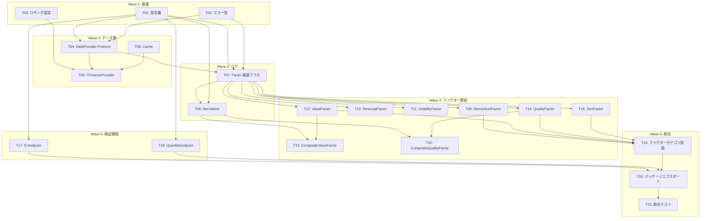

# 実装タスク一覧 (Implementation Tasks)

## 概要

本ドキュメントは、factor パッケージの MVI (Minimum Viable Implementation) を実装するためのタスク一覧です。
各タスクは依存関係に基づいて実装順序が定義されており、一意に再現可能な粒度で記載されています。

## タスク依存関係図

## Wave 1: 基盤 (Foundation)

### T01: 型定義 (types.py)

**対応要件**: LRD-1, LRD-2, LRD-4, LRD-5, LRD-10
**見積もり**: 1-2時間
**依存関係**: なし

**実装内容**:
1. `src/factor/types.py` を作成
2. 以下のデータクラス/型を定義:
   - `FactorValue`: ファクター値の計算結果
   - `ICResult`: IC/IR 分析結果
   - `QuantileResult`: 分位分析結果
   - `NormalizedFactorValue`: 正規化後のファクター値
   - `FactorMetadata`: ファクターのメタデータ
   - `FactorCategory` (Enum): PRICE, VALUE, QUALITY, SIZE, MACRO, ALTERNATIVE
   - `FactorComputeOptions`: ファクター計算オプション
   - `NormalizationOptions`: 正規化オプション
   - `ICAnalysisOptions`: IC 分析オプション
   - `QuantileAnalysisOptions`: 分位分析オプション

**受け入れ条件**:
- [ ] 全データクラスが `@dataclass` または `@dataclass(frozen=True)` で定義されている
- [ ] 全フィールドに型ヒントが付与されている
- [ ] `FactorCategory` が str を継承した Enum で定義されている
- [ ] NumPy 形式の docstring が全クラスに記載されている
- [ ] pyright strict でエラーがない
- [ ] ユニットテスト `tests/factor/unit/test_types.py` が作成されている

---

### T02: エラー型定義 (errors.py)

**対応要件**: LRD-1, LRD-2
**見積もり**: 30分-1時間
**依存関係**: なし

**実装内容**:
1. `src/factor/errors.py` を作成
2. 以下のエラークラスを定義:
   - `FactorError`: 基底エラークラス
   - `DataFetchError`: データ取得エラー (symbols, message)
   - `ValidationError`: 入力バリデーションエラー (field, value, message)
   - `ComputationError`: 計算エラー (factor_name, message)
   - `InsufficientDataError`: データ不足エラー (required, available, message)

**受け入れ条件**:
- [ ] 全エラーが `FactorError` を継承している
- [ ] `DataFetchError`, `ValidationError`, `ComputationError`, `InsufficientDataError` が `@dataclass` で定義されている
- [ ] エラーメッセージが具体的な値を含む形式である
- [ ] pyright strict でエラーがない
- [ ] ユニットテスト `tests/factor/unit/test_errors.py` が作成されている

---

### T03: ロギング設定 (logging_config.py)

**対応要件**: 横断的要件
**見積もり**: 30分
**依存関係**: なし

**実装内容**:
1. `src/factor/utils/__init__.py` を作成
2. `src/factor/utils/logging_config.py` を作成
3. `get_logger(__name__)` 関数を実装
4. 環境変数 `LOG_LEVEL`, `LOG_FORMAT` に対応

**受け入れ条件**:
- [ ] `get_logger` 関数が `__name__` を受け取りロガーを返す
- [ ] `LOG_LEVEL` 環境変数でログレベルを設定可能
- [ ] `LOG_FORMAT` 環境変数で json/text フォーマットを切り替え可能
- [ ] `finance.utils.logging_config` との整合性がある（または再利用）
- [ ] pyright strict でエラーがない

---

## Wave 2: データ層 (Provider Layer)

### T04: DataProvider Protocol (providers/base.py)

**対応要件**: LRD-1
**見積もり**: 1時間
**依存関係**: T01, T02

**実装内容**:
1. `src/factor/providers/__init__.py` を作成
2. `src/factor/providers/base.py` を作成
3. `DataProvider` Protocol を定義:
   - `get_prices(symbols, start_date, end_date) -> pd.DataFrame`
   - `get_volumes(symbols, start_date, end_date) -> pd.DataFrame`
   - `get_fundamentals(symbols, metrics, start_date, end_date) -> pd.DataFrame`
   - `get_market_cap(symbols, start_date, end_date) -> pd.DataFrame`

**受け入れ条件**:
- [ ] `DataProvider` が `typing.Protocol` で定義されている
- [ ] 全メソッドが `datetime | str` の日付型をサポート
- [ ] 戻り値の DataFrame スキーマがドキュメント化されている
- [ ] NumPy 形式の docstring が全メソッドに記載されている
- [ ] pyright strict でエラーがない
- [ ] ユニットテスト `tests/factor/unit/providers/test_base.py` が作成されている

---

### T05: Cache クラス (providers/cache.py)

**対応要件**: アーキテクチャ要件（キャッシュ設計）
**見積もり**: 1-2時間
**依存関係**: なし

**実装内容**:
1. `src/factor/providers/cache.py` を作成
2. `Cache` クラスを実装:
   - `__init__(cache_path, ttl_hours)`
   - `get(key) -> pd.DataFrame | None`
   - `set(key, data) -> None`
   - `invalidate(key) -> None`
   - `is_valid(key) -> bool`
3. Parquet 形式でのファイルキャッシュ

**受け入れ条件**:
- [ ] キャッシュキーからファイルパスを生成できる
- [ ] TTL (Time To Live) によるキャッシュ無効化が動作する
- [ ] Parquet 形式でデータを保存・読み込みできる
- [ ] キャッシュディレクトリが存在しない場合は自動作成される
- [ ] pyright strict でエラーがない
- [ ] ユニットテスト `tests/factor/unit/providers/test_cache.py` が作成されている

---

### T06: YFinanceProvider 実装 (providers/yfinance.py)

**対応要件**: LRD-1
**見積もり**: 2-3時間
**依存関係**: T03, T04, T05

**実装内容**:
1. `src/factor/providers/yfinance.py` を作成
2. `YFinanceProvider` クラスを実装:
   - `__init__(cache_path, cache_ttl_hours)`
   - `get_prices(symbols, start_date, end_date) -> pd.DataFrame`
   - `get_volumes(symbols, start_date, end_date) -> pd.DataFrame`
   - `get_fundamentals(symbols, metrics, start_date, end_date) -> pd.DataFrame`
   - `get_market_cap(symbols, start_date, end_date) -> pd.DataFrame`
3. リトライロジック（最大3回、指数バックオフ）
4. キャッシュ統合

**受け入れ条件**:
- [ ] `DataProvider` Protocol を満たしている
- [ ] yfinance から価格データ (OHLCV) を取得できる
- [ ] yfinance から出来高データを取得できる
- [ ] yfinance から財務データ (PER, PBR, ROE, ROA 等) を取得できる
- [ ] yfinance から時価総額データを取得できる
- [ ] 複数銘柄の一括取得が可能
- [ ] キャッシュが機能している（2回目以降が高速）
- [ ] リトライロジックが動作する
- [ ] `DataFetchError` が適切にスローされる
- [ ] ロギングが適切に行われている
- [ ] pyright strict でエラーがない
- [ ] ユニットテスト `tests/factor/unit/providers/test_yfinance.py` が作成されている（モック使用）

---

## Wave 3: コア (Core Layer)

### T07: Factor 基底クラス (core/base.py)

**対応要件**: LRD-2
**見積もり**: 1-2時間
**依存関係**: T01, T02, T04

**実装内容**:
1. `src/factor/core/__init__.py` を作成
2. `src/factor/core/base.py` を作成
3. `Factor` 抽象基底クラスを実装:
   - クラス属性: `name`, `description`, `category`
   - `metadata` プロパティ: `FactorMetadata` を返す
   - `compute(provider, universe, start_date, end_date) -> pd.DataFrame` (抽象メソッド)
   - `validate_inputs(universe, start_date, end_date) -> None`
4. 入力バリデーション:
   - ユニバースが空でないこと
   - 日付範囲が有効であること (start < end)

**受け入れ条件**:
- [ ] `Factor` が `ABC` を継承している
- [ ] `compute()` が抽象メソッドとして定義されている
- [ ] `name`, `description`, `category` がクラス属性として定義されている
- [ ] `metadata` プロパティが `FactorMetadata` を返す
- [ ] `validate_inputs()` が `ValidationError` をスローする
- [ ] 欠損値処理のオプションが利用可能（`FactorComputeOptions`）
- [ ] 戻り値が `pd.DataFrame` (index: Date, columns: symbols)
- [ ] NumPy 形式の docstring が記載されている
- [ ] pyright strict でエラーがない
- [ ] ユニットテスト `tests/factor/unit/core/test_base.py` が作成されている

---

### T08: Normalizer クラス (core/normalizer.py)

**対応要件**: LRD-3
**見積もり**: 1-2時間
**依存関係**: T01, T07

**実装内容**:
1. `src/factor/core/normalizer.py` を作成
2. `Normalizer` クラスを実装（静的メソッド中心）:
   - `zscore(factor_values, axis) -> pd.DataFrame`
   - `rank(factor_values, method, pct) -> pd.DataFrame`
   - `winsorize(factor_values, limits) -> pd.DataFrame`

**受け入れ条件**:
- [ ] クロスセクショナル z-score 正規化が実装されている
- [ ] 時系列 z-score 正規化が実装されている
- [ ] ランク正規化（パーセンタイル）が実装されている
- [ ] Winsorization（外れ値処理）が実装されている
- [ ] 正規化後の平均が 0（z-score の場合）
- [ ] 正規化後の標準偏差が 1（z-score の場合）
- [ ] ランク正規化後の値が 0-1 の範囲内
- [ ] NumPy 形式の docstring が記載されている
- [ ] pyright strict でエラーがない
- [ ] ユニットテスト `tests/factor/unit/core/test_normalizer.py` が作成されている
- [ ] プロパティテスト `tests/factor/property/test_normalizer.py` が作成されている

---

## Wave 4: ファクター実装 (Factor Layer)

### T09: MomentumFactor (factors/price/momentum.py)

**対応要件**: LRD-6
**見積もり**: 1-2時間
**依存関係**: T07

**実装内容**:
1. `src/factor/factors/__init__.py` を作成
2. `src/factor/factors/price/__init__.py` を作成
3. `src/factor/factors/price/momentum.py` を作成
4. `MomentumFactor` クラスを実装:
   - `__init__(lookback, skip_recent)`
   - `compute(provider, universe, start_date, end_date) -> pd.DataFrame`
5. 計算式: `(P_{t-skip} / P_{t-lookback}) - 1`

**受け入れ条件**:
- [ ] `Factor` を継承している
- [ ] `lookback` パラメータでルックバック期間を設定可能（デフォルト: 252）
- [ ] `skip_recent` パラメータで直近除外期間を設定可能（デフォルト: 21）
- [ ] 1ヶ月、3ヶ月、12ヶ月モメンタムが計算可能
- [ ] 戻り値が正しいスキーマ (index: Date, columns: symbols)
- [ ] パフォーマンス: 100銘柄 x 5年で1秒以内
- [ ] NumPy 形式の docstring が記載されている
- [ ] サンプルコードがドキュメントに含まれている
- [ ] pyright strict でエラーがない
- [ ] ユニットテスト `tests/factor/unit/factors/price/test_momentum.py` が作成されている

---

### T10: ReversalFactor (factors/price/reversal.py)

**対応要件**: LRD-6
**見積もり**: 1時間
**依存関係**: T07

**実装内容**:
1. `src/factor/factors/price/reversal.py` を作成
2. `ReversalFactor` クラスを実装:
   - `__init__(lookback)`
   - `compute(provider, universe, start_date, end_date) -> pd.DataFrame`
3. 計算式: `-(P_t / P_{t-lookback} - 1)` （符号反転）

**受け入れ条件**:
- [ ] `Factor` を継承している
- [ ] `lookback` パラメータでルックバック期間を設定可能（デフォルト: 5）
- [ ] 短期リターンの反転が計算される（符号反転）
- [ ] 戻り値が正しいスキーマ
- [ ] NumPy 形式の docstring が記載されている
- [ ] pyright strict でエラーがない
- [ ] ユニットテスト `tests/factor/unit/factors/price/test_reversal.py` が作成されている

---

### T11: VolatilityFactor (factors/price/volatility.py)

**対応要件**: LRD-6
**見積もり**: 1時間
**依存関係**: T07

**実装内容**:
1. `src/factor/factors/price/volatility.py` を作成
2. `VolatilityFactor` クラスを実装:
   - `__init__(lookback, annualize)`
   - `compute(provider, universe, start_date, end_date) -> pd.DataFrame`
3. 計算式: `std(returns) * sqrt(252)` (年率換算時)

**受け入れ条件**:
- [ ] `Factor` を継承している
- [ ] `lookback` パラメータでルックバック期間を設定可能（デフォルト: 20）
- [ ] `annualize` パラメータで年率換算を切り替え可能（デフォルト: True）
- [ ] リターンの標準偏差が計算される
- [ ] 戻り値が正しいスキーマ
- [ ] NumPy 形式の docstring が記載されている
- [ ] pyright strict でエラーがない
- [ ] ユニットテスト `tests/factor/unit/factors/price/test_volatility.py` が作成されている

---

### T12: ValueFactor (factors/value/value.py)

**対応要件**: LRD-7
**見積もり**: 1-2時間
**依存関係**: T07

**実装内容**:
1. `src/factor/factors/value/__init__.py` を作成
2. `src/factor/factors/value/value.py` を作成
3. `ValueFactor` クラスを実装:
   - `__init__(metric, invert)`
   - `compute(provider, universe, start_date, end_date) -> pd.DataFrame`
   - `VALID_METRICS = ("per", "pbr", "dividend_yield", "ev_ebitda")`

**受け入れ条件**:
- [ ] `Factor` を継承している
- [ ] `metric` パラメータで指標を選択可能（per, pbr, dividend_yield, ev_ebitda）
- [ ] `invert` パラメータで符号反転可能（デフォルト: True、低 PER = 高スコア）
- [ ] PER ファクターが実装されている
- [ ] PBR ファクターが実装されている
- [ ] 配当利回りファクターが実装されている
- [ ] EV/EBITDA ファクターが実装されている（データ利用可能時）
- [ ] 不正な metric 指定時に `ValidationError` がスローされる
- [ ] 戻り値が正しいスキーマ
- [ ] NumPy 形式の docstring が記載されている
- [ ] pyright strict でエラーがない
- [ ] ユニットテスト `tests/factor/unit/factors/value/test_value.py` が作成されている

---

### T13: CompositeValueFactor (factors/value/value.py)

**対応要件**: LRD-7
**見積もり**: 1時間
**依存関係**: T08, T12

**実装内容**:
1. `CompositeValueFactor` クラスを `src/factor/factors/value/value.py` に追加
2. 実装内容:
   - `__init__(weights)`
   - `compute(provider, universe, start_date, end_date) -> pd.DataFrame`
3. 各指標を正規化後、ウェイト付き平均を計算

**受け入れ条件**:
- [ ] `Factor` を継承している
- [ ] `weights` パラメータで各指標のウェイトを設定可能
- [ ] デフォルトウェイトは等ウェイト（per: 0.25, pbr: 0.25, dividend_yield: 0.25, ev_ebitda: 0.25）
- [ ] 各指標が z-score 正規化されてから結合される
- [ ] 戻り値が正しいスキーマ
- [ ] NumPy 形式の docstring が記載されている
- [ ] pyright strict でエラーがない
- [ ] ユニットテスト（T12 のテストファイルに追加）

---

### T14: QualityFactor (factors/quality/quality.py)

**対応要件**: LRD-8
**見積もり**: 1-2時間
**依存関係**: T07

**実装内容**:
1. `src/factor/factors/quality/__init__.py` を作成
2. `src/factor/factors/quality/quality.py` を作成
3. `QualityFactor` クラスを実装:
   - `__init__(metric)`
   - `compute(provider, universe, start_date, end_date) -> pd.DataFrame`
   - `VALID_METRICS = ("roe", "roa", "earnings_stability", "debt_ratio")`

**受け入れ条件**:
- [ ] `Factor` を継承している
- [ ] `metric` パラメータで指標を選択可能（roe, roa, earnings_stability, debt_ratio）
- [ ] ROE ファクターが実装されている
- [ ] ROA ファクターが実装されている
- [ ] 利益の安定性ファクターが実装されている（収益のボラティリティの逆数）
- [ ] 負債比率ファクターが実装されている（低い方が高スコア）
- [ ] 不正な metric 指定時に `ValidationError` がスローされる
- [ ] 戻り値が正しいスキーマ
- [ ] NumPy 形式の docstring が記載されている
- [ ] pyright strict でエラーがない
- [ ] ユニットテスト `tests/factor/unit/factors/quality/test_quality.py` が作成されている

---

### T15: CompositeQualityFactor (factors/quality/quality.py)

**対応要件**: LRD-8
**見積もり**: 1時間
**依存関係**: T08, T14

**実装内容**:
1. `CompositeQualityFactor` クラスを `src/factor/factors/quality/quality.py` に追加
2. 実装内容:
   - `__init__(weights)`
   - `compute(provider, universe, start_date, end_date) -> pd.DataFrame`
3. 各指標を正規化後、ウェイト付き平均を計算

**受け入れ条件**:
- [ ] `Factor` を継承している
- [ ] `weights` パラメータで各指標のウェイトを設定可能
- [ ] デフォルトウェイト（roe: 0.3, roa: 0.3, earnings_stability: 0.2, debt_ratio: 0.2）
- [ ] 各指標が z-score 正規化されてから結合される
- [ ] 戻り値が正しいスキーマ
- [ ] NumPy 形式の docstring が記載されている
- [ ] pyright strict でエラーがない
- [ ] ユニットテスト（T14 のテストファイルに追加）

---

### T16: SizeFactor (factors/size/size.py)

**対応要件**: LRD-9
**見積もり**: 1時間
**依存関係**: T07

**実装内容**:
1. `src/factor/factors/size/__init__.py` を作成
2. `src/factor/factors/size/size.py` を作成
3. `SizeFactor` クラスを実装:
   - `__init__(metric, invert, log_transform)`
   - `compute(provider, universe, start_date, end_date) -> pd.DataFrame`
   - `VALID_METRICS = ("market_cap", "revenue", "total_assets")`

**受け入れ条件**:
- [ ] `Factor` を継承している
- [ ] `metric` パラメータで指標を選択可能（market_cap, revenue, total_assets）
- [ ] `invert` パラメータで符号反転可能（小型株プレミアム）
- [ ] `log_transform` パラメータで対数変換可能（デフォルト: True）
- [ ] 時価総額ファクターが実装されている
- [ ] 売上高ファクターが実装されている（データ利用可能時）
- [ ] 総資産ファクターが実装されている（データ利用可能時）
- [ ] 戻り値が正しいスキーマ
- [ ] NumPy 形式の docstring が記載されている
- [ ] pyright strict でエラーがない
- [ ] ユニットテスト `tests/factor/unit/factors/size/test_size.py` が作成されている

---

## Wave 5: 検証機能 (Validation)

### T17: ICAnalyzer (validation/ic_analyzer.py)

**対応要件**: LRD-4
**見積もり**: 2-3時間
**依存関係**: T01

**実装内容**:
1. `src/factor/validation/__init__.py` を作成
2. `src/factor/validation/ic_analyzer.py` を作成
3. `ICAnalyzer` クラスを実装:
   - `__init__(method)`
   - `analyze(factor_values, forward_returns) -> ICResult`
   - `compute_ic_series(factor_values, forward_returns) -> pd.Series`
   - `compute_forward_returns(prices, periods) -> pd.DataFrame` (静的メソッド)

**受け入れ条件**:
- [ ] Spearman IC（ランク相関）が計算できる
- [ ] Pearson IC（線形相関）が計算できる
- [ ] IR（IC の平均 / 標準偏差）が計算できる
- [ ] 時系列での IC 推移を取得できる
- [ ] 統計的有意性（t 値、p 値）が出力される
- [ ] `ICResult` データクラスが返される
- [ ] データ不足時に `InsufficientDataError` がスローされる
- [ ] パフォーマンス: 100銘柄 x 1000日で 500ms 以内
- [ ] NumPy 形式の docstring が記載されている
- [ ] pyright strict でエラーがない
- [ ] ユニットテスト `tests/factor/unit/validation/test_ic_analyzer.py` が作成されている
- [ ] プロパティテスト `tests/factor/property/test_ic.py` が作成されている

---

### T18: QuantileAnalyzer (validation/quantile_analyzer.py)

**対応要件**: LRD-5
**見積もり**: 2-3時間
**依存関係**: T01

**実装内容**:
1. `src/factor/validation/quantile_analyzer.py` を作成
2. `QuantileAnalyzer` クラスを実装:
   - `__init__(n_quantiles)`
   - `analyze(factor_values, forward_returns) -> QuantileResult`
   - `assign_quantiles(factor_values) -> pd.DataFrame`
   - `compute_quantile_returns(quantile_assignments, forward_returns) -> pd.DataFrame`
   - `plot(result, title) -> go.Figure`

**受け入れ条件**:
- [ ] 任意の分位数（デフォルト 5 分位）でポートフォリオを構築できる
- [ ] 各分位の平均リターンを計算できる
- [ ] Long-Short リターン（Top - Bottom）を計算できる
- [ ] 単調性スコア（0-1）が計算される
- [ ] 分位別リターンの可視化が可能（plotly）
- [ ] `QuantileResult` データクラスが返される
- [ ] NumPy 形式の docstring が記載されている
- [ ] pyright strict でエラーがない
- [ ] ユニットテスト `tests/factor/unit/validation/test_quantile_analyzer.py` が作成されている
- [ ] プロパティテスト `tests/factor/property/test_quantile.py` が作成されている

---

## Wave 6: 統合 (Integration)

### T19: ファクターカテゴリ拡張フレームワーク

**対応要件**: LRD-10
**見積もり**: 1時間
**依存関係**: T09, T12, T14, T16

**実装内容**:
1. `src/factor/core/registry.py` を作成（将来用のスタブ）
2. ファクターメタデータの拡張:
   - `required_data`: 必要なデータ種別のリスト
   - `frequency`: 計算頻度（daily, weekly, monthly, quarterly）
3. 各ファクターの `metadata` プロパティを確認・更新
4. 新しいファクターカテゴリを追加するためのドキュメントを作成

**受け入れ条件**:
- [ ] `FactorCategory` に MACRO, ALTERNATIVE が定義されている
- [ ] 全ビルトインファクターの `metadata` が正しく設定されている
- [ ] `FactorMetadata.required_data` が各ファクターで定義されている
- [ ] `FactorMetadata.frequency` が各ファクターで定義されている
- [ ] 新しいファクターカテゴリを追加するためのドキュメントがある
- [ ] DataProvider インターフェースの拡張ポイントがドキュメント化されている
- [ ] pyright strict でエラーがない

---

### T20: パッケージエクスポート (__init__.py)

**対応要件**: 全要件
**見積もり**: 30分-1時間
**依存関係**: T17, T18, T19

**実装内容**:
1. `src/factor/__init__.py` を作成
2. `src/factor/py.typed` を作成（PEP 561 マーカー）
3. 全公開 API をエクスポート
4. `__all__` リストを定義

**受け入れ条件**:
- [ ] 以下がトップレベルからインポート可能:
  - Core: `Factor`, `Normalizer`
  - Price Factors: `MomentumFactor`, `ReversalFactor`, `VolatilityFactor`
  - Value Factors: `ValueFactor`, `CompositeValueFactor`
  - Quality Factors: `QualityFactor`, `CompositeQualityFactor`
  - Size Factors: `SizeFactor`
  - Providers: `YFinanceProvider`
  - Validation: `ICAnalyzer`, `QuantileAnalyzer`
  - Types: `FactorValue`, `ICResult`, `QuantileResult`, `FactorMetadata`, `FactorCategory`
  - Errors: `FactorError`, `DataFetchError`, `ValidationError`, `ComputationError`, `InsufficientDataError`
- [ ] `py.typed` ファイルが存在する
- [ ] `__all__` が定義されている
- [ ] pyright strict でエラーがない

---

### T21: 統合テスト

**対応要件**: 全要件
**見積もり**: 2-3時間
**依存関係**: T20

**実装内容**:
1. `tests/factor/integration/test_end_to_end.py` を作成
2. `tests/factor/regression/test_known_values.py` を作成
3. `tests/factor/conftest.py` を作成（共通フィクスチャ）
4. エンドツーエンドテストシナリオ:
   - モメンタムファクターの計算から検証まで
   - カスタムファクターの定義と検証
   - 複数ファクターの組み合わせ

**受け入れ条件**:
- [ ] エンドツーエンドテストが実装されている
- [ ] `test_end_to_end_momentum_factor_analysis`: モメンタムファクターの全フロー
- [ ] `test_custom_factor_with_validation`: カスタムファクターの定義から検証
- [ ] `test_multiple_factors_combination`: 複数ファクターの組み合わせ
- [ ] 回帰テストが実装されている
- [ ] `test_momentum_matches_expected_values`: 既知のモメンタム値との比較
- [ ] 共通フィクスチャ（モックプロバイダー、サンプルデータ）が定義されている
- [ ] 全テストがパスする
- [ ] テストカバレッジが 80% 以上

---

## 実装順序サマリー

| Wave | タスク | 見積もり合計 | 累積時間 |
|------|--------|-------------|---------|
| 1 | T01, T02, T03 | 2-3.5時間 | 2-3.5時間 |
| 2 | T04, T05, T06 | 4-6時間 | 6-9.5時間 |
| 3 | T07, T08 | 2-4時間 | 8-13.5時間 |
| 4 | T09-T16 | 8-12時間 | 16-25.5時間 |
| 5 | T17, T18 | 4-6時間 | 20-31.5時間 |
| 6 | T19, T20, T21 | 3.5-5時間 | 23.5-36.5時間 |

**総見積もり**: 23.5-36.5時間（約3-5日）

---

## 品質チェックリスト（全タスク共通）

- [ ] pyright strict でエラーがない
- [ ] Ruff でリント・フォーマットエラーがない
- [ ] NumPy 形式の docstring が全公開 API に記載されている
- [ ] ユニットテストが作成されている
- [ ] テストがパスする
- [ ] ログ出力が適切に行われている
