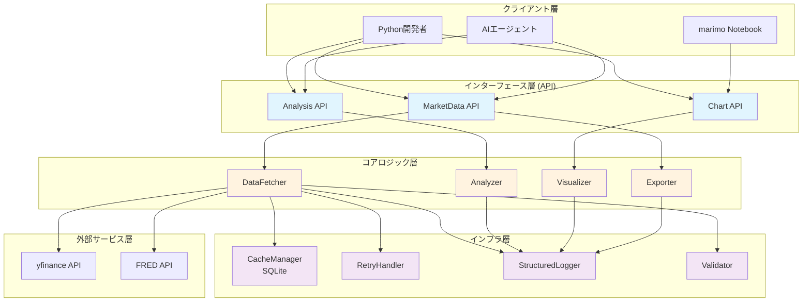
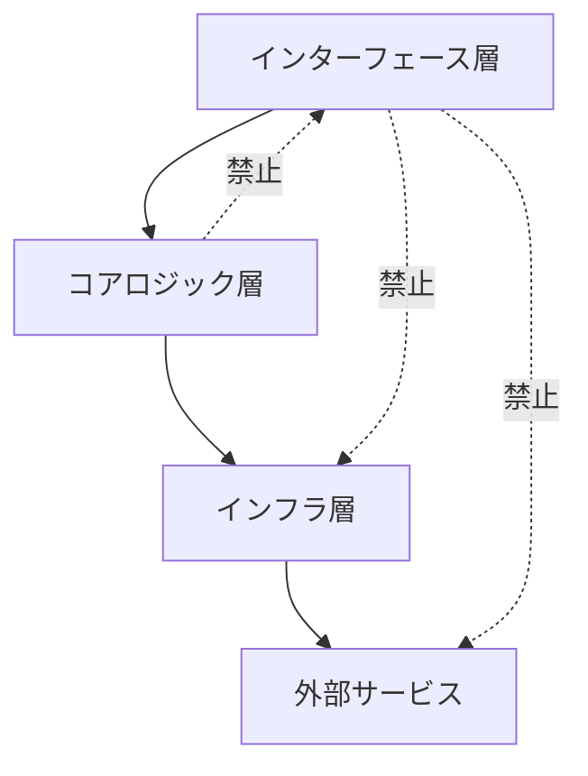
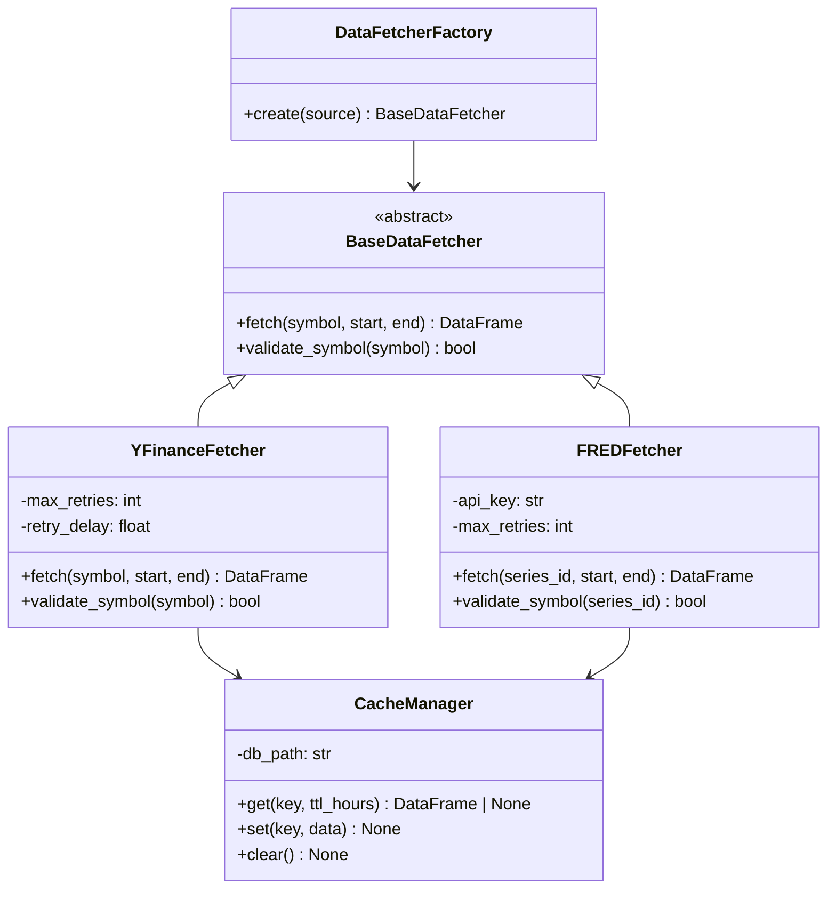
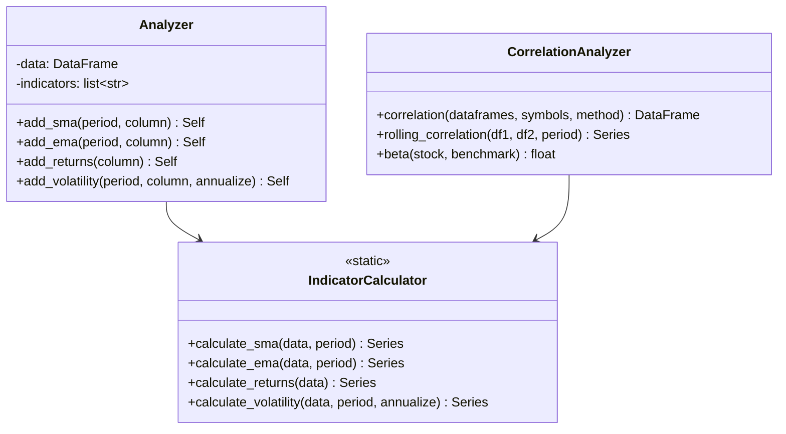
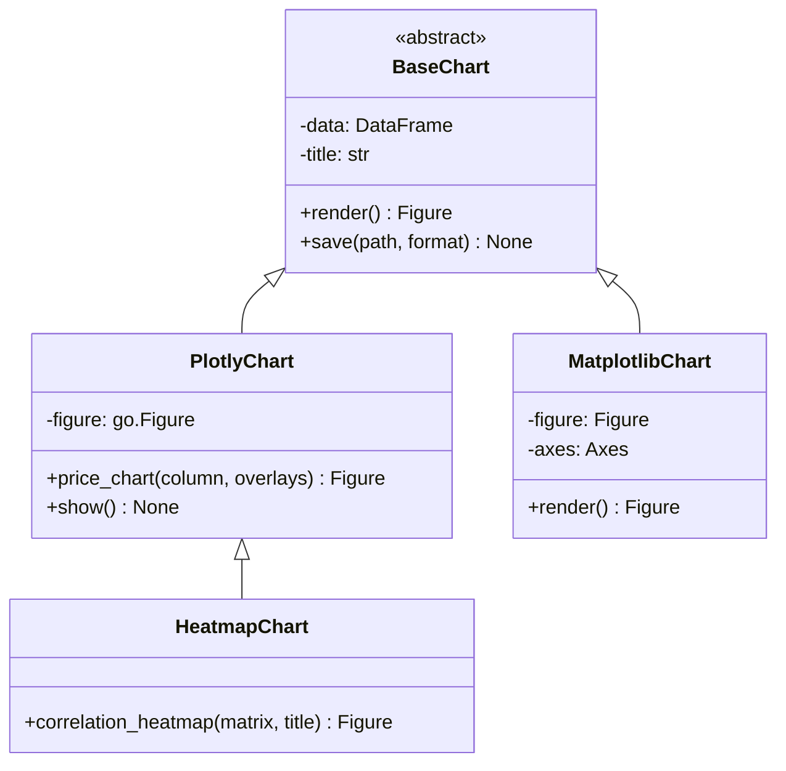
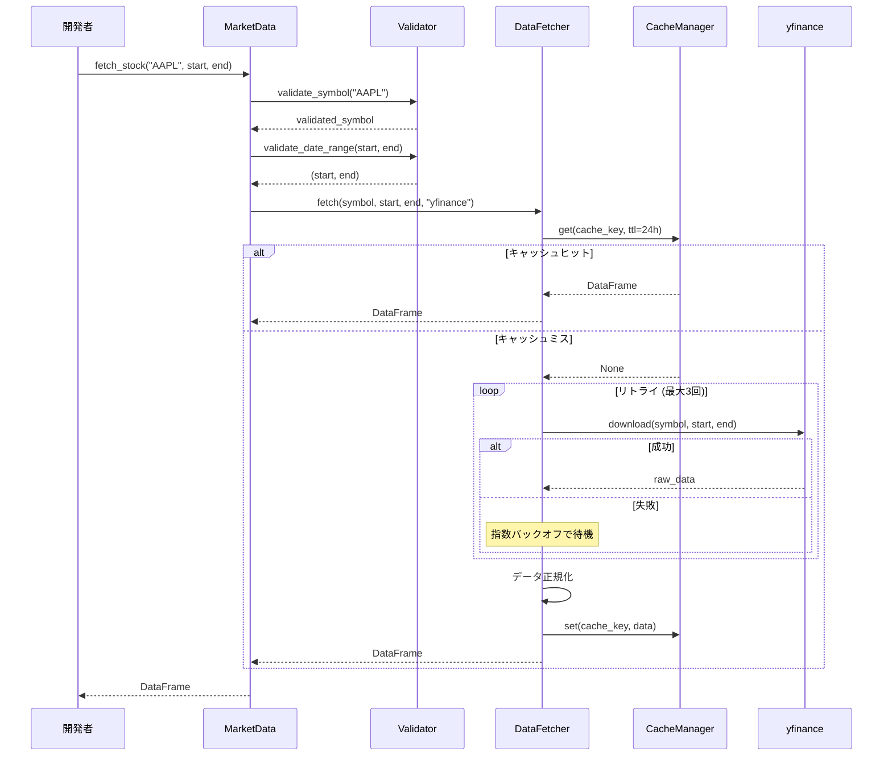
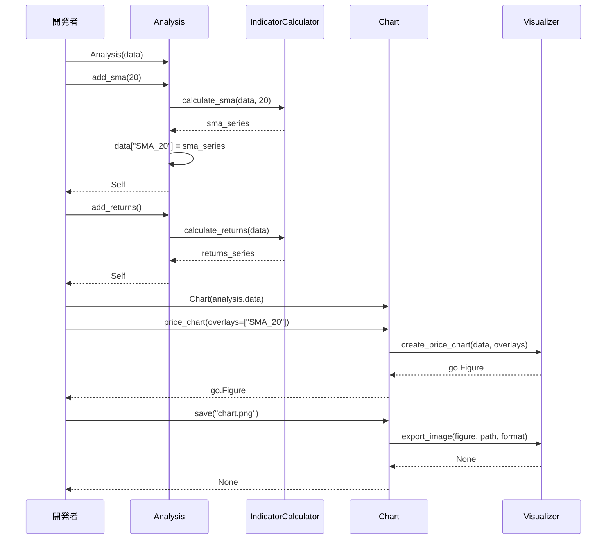
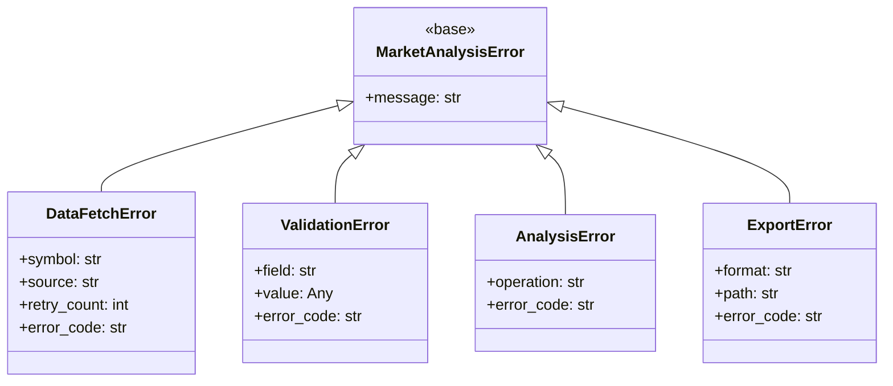

# アーキテクチャ設計書 (Architecture Design Document)

## 1. システム概要

### 1.1 アーキテクチャ全体図



### 1.2 設計方針

本ライブラリは以下の設計方針に基づいて構築します:

1. **レイヤードアーキテクチャ**: 関心の分離と依存関係の一方向化
2. **統一インターフェース**: 複数データソースを単一APIで抽象化
3. **キャッシュファースト**: ネットワーク障害への耐性とパフォーマンス向上
4. **構造化ログ**: 運用時のトレーサビリティ確保
5. **型安全性**: pyright strict モードによる堅牢性確保

## 2. テクノロジースタック

### 2.1 言語・ランタイム

| 技術 | バージョン | 選定理由 |
|------|-----------|----------|
| Python | 3.12+ | 型ヒントの改善（PEP 695）、パターンマッチング、改善されたエラーメッセージ |
| uv | latest | Rustベースで高速、pip/pipx/virtualenv/pyenvの機能を統合 |

### 2.2 コアライブラリ

| 技術 | バージョン | 用途 | 選定理由 |
|------|-----------|------|----------|
| pandas | >=2.0.0 | データ処理 | 金融データ分析のデファクトスタンダード、Apache Arrow対応で高速化 |
| numpy | >=1.26.0 | 数値計算 | pandasの基盤、高速な配列演算 |
| yfinance | >=0.2.0 | 市場データ取得 | Yahoo Finance API の無料アクセス、豊富な市場カバレッジ |
| fredapi | >=0.5.0 | 経済指標取得 | FRED APIの公式Pythonクライアント |

### 2.3 可視化ライブラリ

| 技術 | バージョン | 用途 | 選定理由 |
|------|-----------|------|----------|
| plotly | >=5.18.0 | インタラクティブチャート (メイン) | marimo対応、インタラクティブ操作、HTML/PNG/SVG出力 |
| matplotlib | >=3.8.0 | 静的チャート (補助) | plotlyで対応できない特殊チャート用 |
| seaborn | >=0.13.0 | 統計可視化 (補助) | 相関ヒートマップ等の統計グラフ |
| kaleido | >=0.2.0 | plotly画像出力 | plotlyのPNG/SVG出力に必要 |

### 2.4 ユーティリティライブラリ

| 技術 | バージョン | 用途 | 選定理由 |
|------|-----------|------|----------|
| structlog | >=24.0.0 | 構造化ログ | JSON形式出力、コンテキスト情報の付与が容易 |
| tenacity | >=8.2.0 | リトライ処理 | デコレータベースで宣言的、指数バックオフ対応 |
| pydantic | >=2.5.0 | バリデーション・設定管理 | 型安全な設定管理、入力検証 |

### 2.5 開発ツール

| 技術 | バージョン | 用途 | 選定理由 |
|------|-----------|------|----------|
| ruff | latest | リント・フォーマット | Rustベースで高速、Flake8/isort/Black統合 |
| pyright | latest | 型チェック | strictモードで厳密な型チェック |
| pytest | >=8.0.0 | テスト | Pythonの標準的なテストフレームワーク |
| hypothesis | >=6.0.0 | プロパティベーステスト | 自動テストケース生成、境界値テスト |
| pytest-cov | >=4.0.0 | カバレッジ計測 | pytest統合、レポート生成 |
| respx | >=0.20.0 | HTTPモック | 非同期対応、宣言的なモック定義 |

## 3. アーキテクチャパターン

### 3.1 レイヤードアーキテクチャ

```
┌─────────────────────────────────────────────────────────────┐
│                    インターフェース層                         │
│  MarketData  │  Analysis  │  Chart                          │
│  - 入力バリデーション                                        │
│  - 戻り値の型保証                                            │
│  - ドキュメント (NumPy形式docstring)                        │
├─────────────────────────────────────────────────────────────┤
│                    コアロジック層                             │
│  DataFetcher  │  Analyzer  │  Visualizer  │  Exporter       │
│  - ビジネスロジック                                          │
│  - データ変換                                                │
│  - エラーハンドリング                                        │
├─────────────────────────────────────────────────────────────┤
│                    インフラ層                                 │
│  CacheManager  │  RetryHandler  │  Logger  │  Validator     │
│  - 技術的関心事                                              │
│  - 外部サービス接続                                          │
│  - 横断的関心事                                              │
└─────────────────────────────────────────────────────────────┘
```

### 3.2 各レイヤーの責務

#### インターフェース層 (API)

| コンポーネント | 責務 | 許可される操作 | 禁止される操作 |
|---------------|------|--------------|--------------|
| MarketData | ユーザー向けデータ取得API | コアロジック層の呼び出し | 外部APIへの直接アクセス |
| Analysis | テクニカル分析API | コアロジック層の呼び出し | データ永続化 |
| Chart | チャート生成API | コアロジック層の呼び出し | ビジネスロジックの実装 |

```python
# インターフェース層の例: 入力バリデーションとコアロジック呼び出し
class MarketData:
    def fetch_stock(
        self,
        symbol: str,
        start: datetime | str | None = None,
        end: datetime | str | None = None,
    ) -> pd.DataFrame:
        # バリデーション (インターフェース層の責務)
        validated_symbol = self._validator.validate_symbol(symbol)
        validated_start, validated_end = self._validator.validate_date_range(start, end)

        # コアロジック層への委譲
        return self._fetcher.fetch(
            symbol=validated_symbol,
            start=validated_start,
            end=validated_end,
            source="yfinance",
        )
```

#### コアロジック層

| コンポーネント | 責務 | 許可される操作 | 禁止される操作 |
|---------------|------|--------------|--------------|
| DataFetcher | データ取得・キャッシュ管理 | インフラ層の呼び出し | UIロジック |
| Analyzer | 指標計算・統計分析 | インフラ層の呼び出し | データソースへの直接アクセス |
| Visualizer | チャート生成 | インフラ層の呼び出し | データ取得 |
| Exporter | データ出力・フォーマット変換 | インフラ層の呼び出し | ビジネスロジック |

```python
# コアロジック層の例: ビジネスロジックの実装
class DataFetcher:
    def fetch(
        self,
        symbol: str,
        start: datetime,
        end: datetime,
        source: Literal["yfinance", "fred"],
    ) -> pd.DataFrame:
        cache_key = self._build_cache_key(symbol, start, end, source)

        # キャッシュ確認 (インフラ層への委譲)
        cached_data = self._cache.get(cache_key)
        if cached_data is not None:
            self._logger.info("cache_hit", symbol=symbol)
            return cached_data

        # データ取得 (リトライ付き)
        data = self._retry_handler.execute(
            lambda: self._fetch_from_source(symbol, start, end, source)
        )

        # キャッシュ保存
        self._cache.set(cache_key, data)
        return data
```

#### インフラ層

| コンポーネント | 責務 | 依存関係 |
|---------------|------|---------|
| CacheManager | SQLiteキャッシュの読み書き | なし (最下層) |
| RetryHandler | リトライ処理・指数バックオフ | なし |
| Logger | 構造化ログ出力 | なし |
| Validator | 入力値の検証 | なし |

### 3.3 依存関係の方向



**原則**: 依存関係は常に上位レイヤーから下位レイヤーへの一方向のみ

## 4. コンポーネント設計

### 4.1 データ取得コンポーネント



### 4.2 分析コンポーネント



### 4.3 可視化コンポーネント



## 5. データフロー

### 5.1 株価データ取得フロー



### 5.2 分析・可視化フロー



## 6. データ永続化戦略

### 6.1 キャッシュ設計

#### SQLiteスキーマ

```sql
-- キャッシュテーブル
CREATE TABLE IF NOT EXISTS cache (
    cache_key TEXT PRIMARY KEY,     -- source:symbol:start:end
    data BLOB NOT NULL,             -- pickle化されたDataFrame
    created_at TEXT NOT NULL,       -- ISO 8601形式
    expires_at TEXT NOT NULL,       -- ISO 8601形式
    data_hash TEXT NOT NULL         -- データ整合性検証用
);

-- 有効期限インデックス (クリーンアップ高速化)
CREATE INDEX IF NOT EXISTS idx_cache_expires_at ON cache(expires_at);

-- メタデータテーブル (統計情報)
CREATE TABLE IF NOT EXISTS cache_stats (
    id INTEGER PRIMARY KEY AUTOINCREMENT,
    operation TEXT NOT NULL,        -- hit/miss/set/clear
    cache_key TEXT,
    timestamp TEXT NOT NULL
);
```

#### キャッシュポリシー

| 項目 | 設定値 | 理由 |
|------|--------|------|
| デフォルトTTL | 24時間 | 日次データの鮮度を保ちつつ、API負荷を軽減 |
| 最大キャッシュサイズ | 1GB | 一般的なローカル環境での許容範囲 |
| クリーンアップ頻度 | 起動時 | 期限切れエントリを自動削除 |
| シリアライズ形式 | pickle | pandas DataFrameの高速な保存・復元 |

#### キャッシュキー形式

```
{source}:{symbol}:{start_date}:{end_date}
```

例:
- `yfinance:AAPL:2024-01-01:2024-12-31`
- `fred:DGS10:2024-01-01:2024-12-31`
- `yfinance:USDJPY=X:2024-01-01:2024-12-31`

### 6.2 データエクスポート

| フォーマット | ユースケース | 実装方法 |
|-------------|-------------|---------|
| DataFrame | Python内での分析 | デフォルト戻り値 |
| JSON | AIエージェント連携 | `to_agent_json()` |
| CSV | 外部ツール連携 | `DataFrame.to_csv()` |
| SQLite | 長期保存・クエリ | `save_to_sqlite()` |

### 6.3 バックアップ戦略

- **対象**: キャッシュデータベース (`~/.market_analysis/cache.db`)
- **頻度**: ユーザー任意（キャッシュは再構築可能なため自動バックアップは不要）
- **復元方法**: キャッシュファイルを削除すると、次回アクセス時に再取得

## 7. エラーハンドリング

### 7.1 エラー分類



### 7.2 エラーコードと対処

| エラーコード | 原因 | 対処 | ユーザーへの表示 |
|-------------|------|------|-----------------|
| `INVALID_SYMBOL` | 存在しないティッカー | 処理中断 | `Symbol 'XXX' not found in {source}` |
| `API_CONNECTION_ERROR` | ネットワーク障害 | 3回リトライ後キャッシュフォールバック | `Failed to connect. Using cached data.` |
| `RATE_LIMIT_ERROR` | API制限超過 | 指数バックオフリトライ | `Rate limited. Retrying in {n} seconds...` |
| `INVALID_DATE_RANGE` | 日付範囲エラー | 処理中断 | `Start date must be before end date` |
| `INSUFFICIENT_DATA` | データ不足 | 警告出力して継続 | `Warning: Only {n} data points available` |
| `FRED_API_KEY_MISSING` | APIキー未設定 | 処理中断 | `FRED API key not set. Set FRED_API_KEY environment variable.` |
| `CACHE_ERROR` | キャッシュ障害 | キャッシュなしで継続 | `Cache unavailable. Fetching from source.` |
| `EXPORT_ERROR` | 出力失敗 | 処理中断 | `Failed to save file: {path}` |

### 7.3 リトライ戦略

```python
from dataclasses import dataclass

@dataclass(frozen=True)
class RetryConfig:
    """リトライ設定"""
    max_retries: int = 3           # 最大リトライ回数
    initial_delay: float = 1.0     # 初回待機時間 (秒)
    exponential_base: float = 2.0  # 指数バックオフ倍率
    max_delay: float = 30.0        # 最大待機時間 (秒)
    retryable_exceptions: tuple = (
        ConnectionError,
        TimeoutError,
    )
```

**リトライフロー**:
1. 初回失敗: 1秒待機後リトライ
2. 2回目失敗: 2秒待機後リトライ
3. 3回目失敗: 4秒待機後リトライ
4. 4回目失敗: キャッシュフォールバックまたはエラー送出

## 8. パフォーマンス要件

### 8.1 レスポンスタイム

| 操作 | 目標時間 | 測定条件 | 測定方法 |
|------|---------|---------|---------|
| 単一銘柄1年分データ取得 | 5秒以内 | 初回取得、ネットワーク正常 | `time.perf_counter()` |
| キャッシュからのデータ取得 | 100ms以内 | キャッシュヒット | `time.perf_counter()` |
| 1000点の移動平均計算 | 100ms以内 | SMA/EMA各1回 | `time.perf_counter()` |
| 単一チャート生成 | 2秒以内 | PNG出力含む | `time.perf_counter()` |
| 相関行列計算 (10銘柄) | 500ms以内 | 1年分データ | `time.perf_counter()` |

### 8.2 リソース使用量

| リソース | 上限 | 測定条件 | 理由 |
|---------|------|---------|------|
| メモリ | 100MB | 10,000データポイント処理 | 一般的なローカル環境での許容範囲 |
| ディスク (キャッシュ) | 1GB | 最大キャッシュサイズ | 長期運用を想定 |
| CPU | 1コア100% | 分析計算中 | シングルスレッド処理 |

### 8.3 最適化戦略

| 領域 | 最適化手法 | 期待効果 |
|------|----------|---------|
| データ取得 | SQLiteキャッシュ | 2回目以降90%高速化 |
| 分析計算 | pandas vectorized操作 | ループ比10-100倍高速 |
| メモリ | DataFrame型最適化 (float64→float32) | メモリ使用量50%削減 |
| チャート | 遅延レンダリング | 初期表示の高速化 |

## 9. セキュリティアーキテクチャ

### 9.1 データ保護

| 項目 | 対策 | 実装方法 |
|------|------|---------|
| APIキー管理 | 環境変数で管理 | `os.environ.get("FRED_API_KEY")` |
| ファイルパーミッション | 所有者のみ読み書き | `chmod 600 ~/.market_analysis/` |
| キャッシュ暗号化 | 将来対応 | 現時点では対象外 |

### 9.2 入力検証

```python
class Validator:
    """入力検証クラス"""

    # シンボル: 英数字とドット、ハイフン、イコールのみ
    SYMBOL_PATTERN = re.compile(r"^[A-Za-z0-9.\-=]+$")

    # 最大シンボル長
    MAX_SYMBOL_LENGTH = 20

    def validate_symbol(self, symbol: str) -> str:
        """シンボルの検証

        Raises
        ------
        ValidationError
            シンボルが不正な場合
        """
        if not symbol:
            raise ValidationError(
                field="symbol",
                value=symbol,
                message="Symbol is required",
            )
        if len(symbol) > self.MAX_SYMBOL_LENGTH:
            raise ValidationError(
                field="symbol",
                value=symbol,
                message=f"Symbol must be {self.MAX_SYMBOL_LENGTH} characters or less",
            )
        if not self.SYMBOL_PATTERN.match(symbol):
            raise ValidationError(
                field="symbol",
                value=symbol,
                message="Symbol contains invalid characters",
            )
        return symbol.upper()
```

### 9.3 SQLインジェクション対策

```python
# 悪い例
cursor.execute(f"SELECT * FROM cache WHERE key = '{user_input}'")

# 良い例
cursor.execute("SELECT * FROM cache WHERE key = ?", (user_input,))
```

## 10. テスト戦略

### 10.1 テスト分類

| テスト種別 | 対象 | ツール | カバレッジ目標 |
|-----------|------|--------|--------------|
| ユニットテスト | 個別関数・クラス | pytest | 80%以上 |
| プロパティテスト | 境界値・不変条件 | Hypothesis | 主要関数 |
| 統合テスト | API全体のフロー | pytest + モック | 主要ユースケース |
| E2Eテスト | 実際のAPI呼び出し | pytest | CI外で実行 |

### 10.2 テストピラミッド

```
        /\
       /E2E\          ← 少数 (実際のAPI呼び出し、CI外)
      /------\
     /統合テスト\      ← 中程度 (モック使用)
    /------------\
   /ユニットテスト\    ← 多数 (全公開API)
  /----------------\
```

### 10.3 テストケース例

**ユニットテスト**:
```python
def test_calculate_sma_with_valid_period():
    """SMA計算の基本動作を確認"""
    data = pd.Series([1.0, 2.0, 3.0, 4.0, 5.0])
    result = calculate_sma(data, period=3)
    assert result.iloc[2] == 2.0  # (1+2+3)/3
    assert result.iloc[4] == 4.0  # (3+4+5)/3

def test_calculate_sma_with_insufficient_data():
    """データ不足時のNaN処理を確認"""
    data = pd.Series([1.0, 2.0])
    result = calculate_sma(data, period=3)
    assert pd.isna(result.iloc[0])
    assert pd.isna(result.iloc[1])
```

**プロパティテスト**:
```python
from hypothesis import given, strategies as st

@given(st.lists(st.floats(allow_nan=False, allow_infinity=False), min_size=20))
def test_correlation_between_minus_one_and_one(data):
    """相関係数が-1から1の範囲内であることを確認"""
    series1 = pd.Series(data)
    series2 = pd.Series(data[::-1])  # 逆順
    corr = series1.corr(series2)
    assert -1.0 <= corr <= 1.0
```

**統合テスト**:
```python
def test_fetch_stock_returns_valid_dataframe(mock_yfinance):
    """株価データ取得が有効なDataFrameを返すことを確認"""
    mock_yfinance.return_value = sample_ohlcv_data()

    market_data = MarketData()
    result = market_data.fetch_stock("AAPL", start="2024-01-01", end="2024-12-31")

    assert isinstance(result, pd.DataFrame)
    assert "Close" in result.columns
    assert len(result) > 0
```

### 10.4 モック戦略

| 対象 | モック方法 | 理由 |
|------|----------|------|
| yfinance | `pytest-mock` | API呼び出しを避け、テストを高速化 |
| FRED API | `respx` | HTTP層でモック |
| ファイルシステム | `tmp_path` fixture | テスト間の独立性確保 |
| 時刻 | `freezegun` | 時刻依存テストの再現性確保 |

## 11. ディレクトリ構造

### 11.1 パッケージ構成

```
src/market_analysis/
├── __init__.py              # 公開APIエクスポート
├── py.typed                 # PEP 561マーカー
├── types.py                 # 共通型定義 (dataclass)
├── errors.py                # エラー型定義
├── core/                    # コアロジック層
│   ├── __init__.py
│   ├── fetcher.py           # DataFetcher実装
│   ├── analyzer.py          # Analyzer実装
│   ├── visualizer.py        # Visualizer実装
│   └── exporter.py          # Exporter実装
├── api/                     # インターフェース層
│   ├── __init__.py
│   ├── market_data.py       # MarketData API
│   ├── analysis.py          # Analysis API
│   └── chart.py             # Chart API
├── utils/                   # インフラ層ユーティリティ
│   ├── __init__.py
│   ├── logging_config.py    # 構造化ログ設定
│   ├── cache.py             # キャッシュ管理
│   ├── validators.py        # バリデーション
│   ├── retry.py             # リトライ処理
│   └── profiling.py         # プロファイリング
└── docs/                    # ドキュメント
    ├── project.md
    ├── library-requirements.md
    ├── functional-design.md
    └── architecture.md
```

### 11.2 テスト構成

```
tests/
├── unit/                    # ユニットテスト
│   ├── core/
│   │   ├── test_fetcher.py
│   │   ├── test_analyzer.py
│   │   ├── test_visualizer.py
│   │   └── test_exporter.py
│   ├── api/
│   │   ├── test_market_data.py
│   │   ├── test_analysis.py
│   │   └── test_chart.py
│   └── utils/
│       ├── test_cache.py
│       ├── test_validators.py
│       └── test_retry.py
├── property/                # プロパティベーステスト
│   ├── test_indicators.py
│   └── test_correlation.py
├── integration/             # 統合テスト
│   ├── test_fetch_flow.py
│   ├── test_analysis_flow.py
│   └── test_chart_flow.py
├── e2e/                     # E2Eテスト (CI外)
│   └── test_real_api.py
├── fixtures/                # テストデータ
│   ├── sample_ohlcv.csv
│   └── sample_fred.csv
└── conftest.py              # 共通フィクスチャ
```

## 12. 設計上の決定事項

### 12.1 技術選定のトレードオフ

| 決定事項 | 選択肢 | 選択 | 理由 |
|---------|--------|------|------|
| 可視化ライブラリ | plotly vs matplotlib | plotly (メイン) | marimo対応、インタラクティブ性 |
| キャッシュ方式 | ファイル vs SQLite | SQLite | クエリ可能、トランザクション対応 |
| 設定管理 | 環境変数 vs 設定ファイル | 環境変数 | シンプル、12-factor app準拠 |
| シリアライズ | pickle vs JSON | pickle | pandas DataFrameの高速処理 |

### 12.2 将来の拡張ポイント

| 拡張ポイント | 現在の設計 | 拡張方法 |
|-------------|----------|---------|
| 新データソース | BaseDataFetcher抽象クラス | 新クラスを継承・実装 |
| 新指標 | IndicatorCalculatorにstaticメソッド追加 | 新メソッドを追加 |
| 新チャート種類 | BaseChart抽象クラス | 新クラスを継承・実装 |
| 非同期対応 | 現在は同期のみ | asyncio版APIを追加 |

### 12.3 スコープ外 (明示的な除外)

以下の機能は本バージョンのスコープ外とします:

- リアルタイムデータ取得 (WebSocket)
- 有料API対応 (Bloomberg, Reuters)
- バックテスト・シミュレーション
- 機械学習モデル組み込み
- Web UI / ダッシュボード
- 取引執行機能

## 13. LRD要件との対応表

| LRD要件 | アーキテクチャ対応 | 実現方法 |
|---------|------------------|---------|
| FR-001: 株価・指数データ取得 | DataFetcher + YFinanceFetcher | yfinance.download() |
| FR-002: 為替データ取得 | DataFetcher + YFinanceFetcher | シンボル変換 (USDJPY→USDJPY=X) |
| FR-003: 経済指標データ取得 | DataFetcher + FREDFetcher | fredapi.Fred.get_series() |
| FR-004: コモディティデータ取得 | DataFetcher + YFinanceFetcher | 先物シンボル対応 (GC=F等) |
| FR-005: 基本テクニカル指標 | Analyzer + IndicatorCalculator | pandas vectorized操作 |
| FR-006: 相関分析 | CorrelationAnalyzer | pandas.DataFrame.corr() |
| FR-007: チャート生成 | Visualizer + PlotlyChart | plotly.graph_objects |
| FR-008: データエクスポート | Exporter | pandas.to_csv/to_json, sqlite3 |
| FR-009: AIエージェント向けJSON出力 | Exporter.to_agent_json() | 構造化dict変換 |

## 14. チェックリスト

- [x] すべての技術選定に理由が記載されている
- [x] レイヤードアーキテクチャが明確に定義されている
- [x] 各コンポーネントの責務と依存関係が明確である
- [x] パフォーマンス要件が測定可能な形で定義されている
- [x] セキュリティ考慮事項が記載されている
- [x] エラーハンドリング戦略が定義されている
- [x] キャッシュ設計が定義されている
- [x] テスト戦略が定義されている
- [x] LRD要件との対応が確認されている
- [x] 将来の拡張ポイントが識別されている
