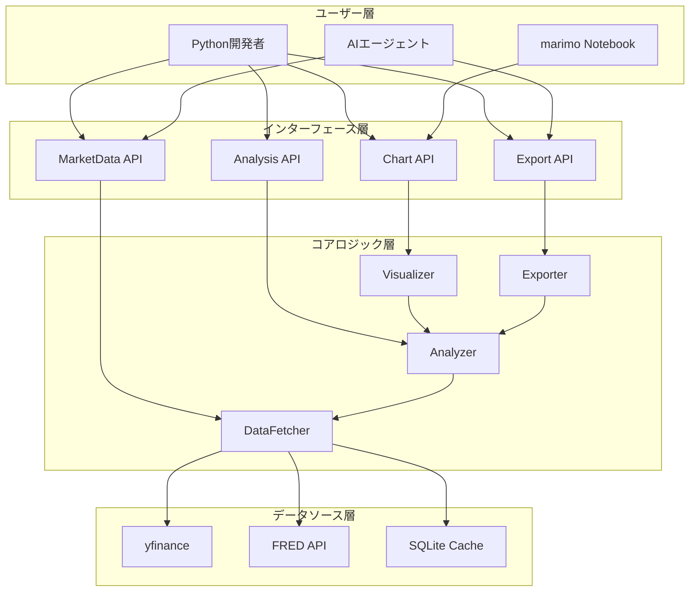
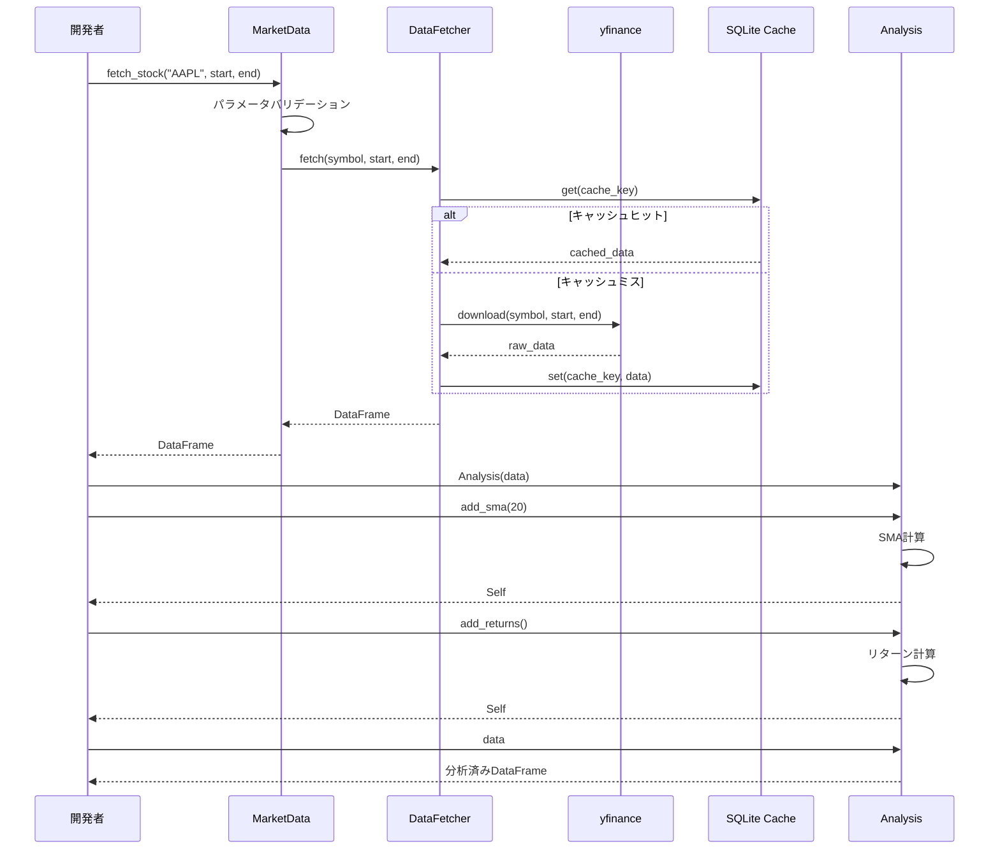
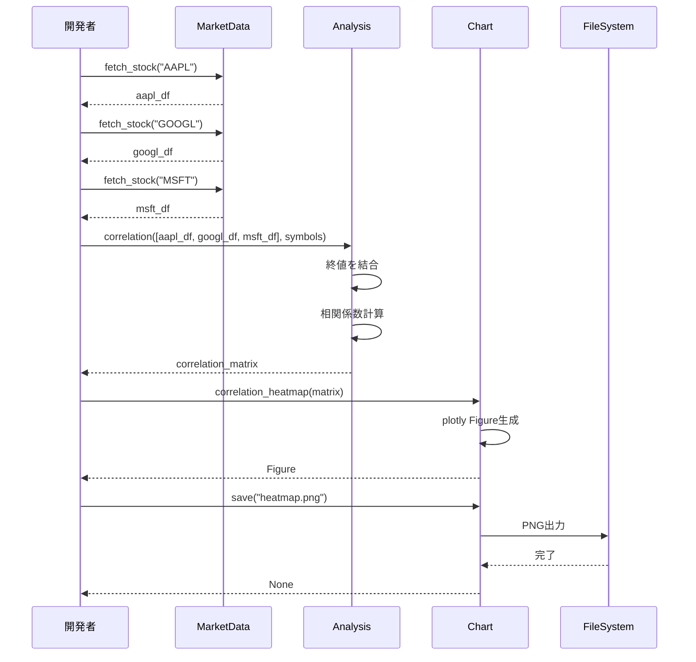
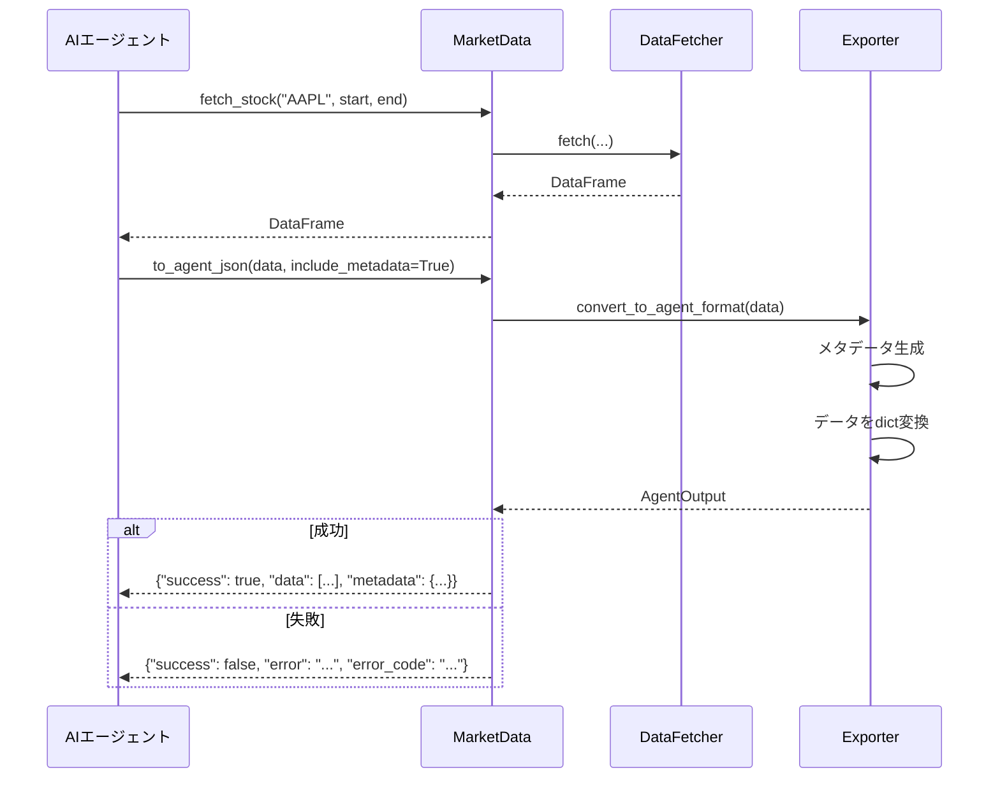

# 機能設計書 (Functional Design Document)

## 1. システム概要

### 1.1 システム構成図



### 1.2 レイヤー構造

| レイヤー | 責務 | 主要コンポーネント |
|----------|------|-------------------|
| インターフェース層 | 公開API、入力バリデーション | MarketData, Analysis, Chart |
| コアロジック層 | ビジネスロジック実装 | DataFetcher, Analyzer, Visualizer |
| データソース層 | 外部API・キャッシュアクセス | yfinance, FRED, SQLite |

### 1.3 技術スタック

| 分類 | 技術 | 選定理由 |
|------|------|----------|
| 言語 | Python 3.12+ | 型ヒント改善、パターンマッチング |
| パッケージ管理 | uv | 高速、統合されたツール |
| データ処理 | pandas 2.0+ | データ分析の標準ライブラリ |
| 市場データ | yfinance | 無料、豊富な市場カバレッジ |
| 経済指標 | fredapi | FRED APIの公式クライアント |
| 可視化 (メイン) | plotly | インタラクティブ、marimo対応 |
| 可視化 (補助) | matplotlib/seaborn | 静的チャート、特殊グラフ |
| キャッシュ | SQLite | 軽量、ファイルベース |
| ログ | structlog | 構造化ログ出力 |
| 型チェック | pyright (strict) | 厳密な型チェック |
| テスト | pytest + Hypothesis | 標準的、プロパティベーステスト |

## 2. 機能一覧

### 2.1 機能マトリクス

| 機能ID | 機能名 | 対応要件 | 優先度 |
|--------|--------|----------|--------|
| FD-001 | 株価・指数データ取得 | FR-001 | P0 |
| FD-002 | 為替データ取得 | FR-002 | P0 |
| FD-003 | 経済指標データ取得 | FR-003 | P0 |
| FD-004 | コモディティデータ取得 | FR-004 | P0 |
| FD-005 | 移動平均計算 (SMA/EMA) | FR-005 | P0 |
| FD-006 | リターン・ボラティリティ計算 | FR-005 | P0 |
| FD-007 | 相関分析 | FR-006 | P0 |
| FD-008 | 価格チャート生成 | FR-007 | P0 |
| FD-009 | 相関ヒートマップ生成 | FR-007 | P0 |
| FD-010 | マルチフォーマットエクスポート | FR-008 | P0 |
| FD-011 | AIエージェント向けJSON出力 | FR-009 | P0 |

## 3. データモデル定義

### 3.1 コアエンティティ

#### MarketDataResult

```python
from dataclasses import dataclass
from datetime import datetime
from typing import Literal

import pandas as pd


@dataclass(frozen=True)
class DataSource:
    """データソース情報"""

    name: Literal["yfinance", "fred"]  # データソース名
    symbol: str                         # 元のシンボル
    fetched_at: datetime                # 取得日時


@dataclass
class MarketDataResult:
    """市場データ取得結果"""

    data: pd.DataFrame                  # OHLCV データ
    source: DataSource                  # データソース情報
    start_date: datetime                # データ開始日
    end_date: datetime                  # データ終了日
    symbol: str                         # ティッカーシンボル
    data_type: Literal["stock", "forex", "commodity", "index", "economic"]
```

**DataFrame スキーマ (OHLCV)**:

| カラム名 | 型 | 説明 |
|----------|-----|------|
| Date | datetime64[ns] | 日付 (index) |
| Open | float64 | 始値 |
| High | float64 | 高値 |
| Low | float64 | 安値 |
| Close | float64 | 終値 |
| Volume | float64 | 出来高 |
| Adj Close | float64 | 調整後終値 |

#### AnalysisResult

```python
from dataclasses import dataclass, field

import pandas as pd


@dataclass
class AnalysisResult:
    """分析結果"""

    data: pd.DataFrame                           # 分析済みデータ
    indicators: list[str] = field(default_factory=list)  # 追加された指標名
    metadata: dict[str, str | int | float] = field(default_factory=dict)
```

**追加される指標カラム例**:

| カラム名 | 型 | 説明 |
|----------|-----|------|
| SMA_{period} | float64 | 単純移動平均 |
| EMA_{period} | float64 | 指数移動平均 |
| Returns | float64 | 日次リターン |
| Volatility_{period} | float64 | ボラティリティ |

#### CorrelationResult

```python
from dataclasses import dataclass

import pandas as pd


@dataclass
class CorrelationResult:
    """相関分析結果"""

    matrix: pd.DataFrame                 # 相関係数行列
    symbols: list[str]                   # 対象シンボル
    period: tuple[datetime, datetime]    # 分析期間
    method: Literal["pearson", "spearman", "kendall"] = "pearson"
```

#### AgentOutput

```python
from dataclasses import dataclass
from datetime import datetime
from typing import Any


@dataclass
class AgentOutputMetadata:
    """AIエージェント向け出力メタデータ"""

    source: str                          # データソース
    symbol: str                          # シンボル
    period_start: datetime               # 期間開始
    period_end: datetime                 # 期間終了
    fetched_at: datetime                 # 取得日時
    record_count: int                    # レコード数
    columns: list[str]                   # カラム名


@dataclass
class AgentOutput:
    """AIエージェント向け構造化出力"""

    success: bool                        # 成功フラグ
    data: list[dict[str, Any]] | None    # データ (JSONシリアライズ可能)
    metadata: AgentOutputMetadata | None # メタデータ
    error: str | None = None             # エラーメッセージ (失敗時)
    error_code: str | None = None        # エラーコード (失敗時)
```

### 3.2 設定・オプション型

```python
from dataclasses import dataclass
from datetime import datetime
from typing import Literal


@dataclass(frozen=True)
class FetchOptions:
    """データ取得オプション"""

    start: datetime | str | None = None  # 開始日 (デフォルト: 1年前)
    end: datetime | str | None = None    # 終了日 (デフォルト: 今日)
    use_cache: bool = True               # キャッシュ使用
    cache_ttl_hours: int = 24            # キャッシュ有効期間 (時間)


@dataclass(frozen=True)
class AnalysisOptions:
    """分析オプション"""

    sma_periods: list[int] | None = None      # SMA期間リスト
    ema_periods: list[int] | None = None      # EMA期間リスト
    calculate_returns: bool = False            # リターン計算
    volatility_period: int | None = None       # ボラティリティ期間


@dataclass(frozen=True)
class ChartOptions:
    """チャートオプション"""

    title: str | None = None                           # チャートタイトル
    overlays: list[str] | None = None                  # オーバーレイ指標
    width: int = 1200                                  # 幅 (px)
    height: int = 600                                  # 高さ (px)
    theme: Literal["light", "dark"] = "light"          # テーマ
    interactive: bool = True                           # インタラクティブ表示


@dataclass(frozen=True)
class ExportOptions:
    """エクスポートオプション"""

    format: Literal["json", "csv", "sqlite"] = "json"  # 出力形式
    include_metadata: bool = True                       # メタデータ含める
    table_name: str | None = None                       # SQLiteテーブル名
```

### 3.3 エラー型

```python
from dataclasses import dataclass


class MarketAnalysisError(Exception):
    """市場分析ライブラリ基底エラー"""

    pass


@dataclass
class DataFetchError(MarketAnalysisError):
    """データ取得エラー"""

    symbol: str
    source: str
    message: str
    retry_count: int = 0


@dataclass
class ValidationError(MarketAnalysisError):
    """入力バリデーションエラー"""

    field: str
    value: str
    message: str


@dataclass
class AnalysisError(MarketAnalysisError):
    """分析エラー"""

    operation: str
    message: str


@dataclass
class ExportError(MarketAnalysisError):
    """エクスポートエラー"""

    format: str
    message: str
```

## 4. コンポーネント設計

### 4.1 MarketData (インターフェース層)

**責務**:
- ユーザー向け統一データ取得API
- 入力パラメータのバリデーション
- データソースの抽象化

```python
from datetime import datetime
from typing import overload

import pandas as pd


class MarketData:
    """市場データ取得の統一インターフェース"""

    def __init__(
        self,
        cache_path: str | None = None,
        fred_api_key: str | None = None,
    ) -> None:
        """初期化

        Parameters
        ----------
        cache_path : str | None
            SQLiteキャッシュファイルパス (デフォルト: ~/.market_analysis/cache.db)
        fred_api_key : str | None
            FRED APIキー (デフォルト: 環境変数 FRED_API_KEY)
        """
        ...

    def fetch_stock(
        self,
        symbol: str,
        start: datetime | str | None = None,
        end: datetime | str | None = None,
    ) -> pd.DataFrame:
        """株価データを取得

        Parameters
        ----------
        symbol : str
            ティッカーシンボル (例: "AAPL", "7203.T")
        start : datetime | str | None
            開始日 (デフォルト: 1年前)
        end : datetime | str | None
            終了日 (デフォルト: 今日)

        Returns
        -------
        pd.DataFrame
            OHLCVデータ

        Raises
        ------
        DataFetchError
            データ取得失敗時
        ValidationError
            パラメータ不正時
        """
        ...

    def fetch_forex(
        self,
        pair: str,
        start: datetime | str | None = None,
        end: datetime | str | None = None,
    ) -> pd.DataFrame:
        """為替データを取得

        Parameters
        ----------
        pair : str
            通貨ペア (例: "USDJPY", "EURUSD")
        start : datetime | str | None
            開始日
        end : datetime | str | None
            終了日

        Returns
        -------
        pd.DataFrame
            為替レートデータ
        """
        ...

    def fetch_fred(
        self,
        series_id: str,
        start: datetime | str | None = None,
        end: datetime | str | None = None,
    ) -> pd.DataFrame:
        """FRED経済指標データを取得

        Parameters
        ----------
        series_id : str
            FREDシリーズID (例: "DGS10", "GDP", "CPIAUCSL")
        start : datetime | str | None
            開始日
        end : datetime | str | None
            終了日

        Returns
        -------
        pd.DataFrame
            経済指標データ
        """
        ...

    def fetch_commodity(
        self,
        symbol: str,
        start: datetime | str | None = None,
        end: datetime | str | None = None,
    ) -> pd.DataFrame:
        """コモディティデータを取得

        Parameters
        ----------
        symbol : str
            コモディティシンボル (例: "GC=F" 金, "CL=F" 原油)
        start : datetime | str | None
            開始日
        end : datetime | str | None
            終了日

        Returns
        -------
        pd.DataFrame
            コモディティ価格データ
        """
        ...

    def save_to_sqlite(
        self,
        db_path: str,
        data: pd.DataFrame,
        table_name: str,
    ) -> None:
        """DataFrameをSQLiteに保存

        Parameters
        ----------
        db_path : str
            SQLiteデータベースパス
        data : pd.DataFrame
            保存するデータ
        table_name : str
            テーブル名
        """
        ...

    def to_agent_json(
        self,
        data: pd.DataFrame,
        include_metadata: bool = True,
    ) -> dict:
        """AIエージェント向けJSON形式に変換

        Parameters
        ----------
        data : pd.DataFrame
            変換するデータ
        include_metadata : bool
            メタデータを含めるか

        Returns
        -------
        dict
            構造化されたJSONオブジェクト
        """
        ...
```

### 4.2 Analysis (インターフェース層)

**責務**:
- テクニカル分析の実行
- 相関分析の実行
- 分析結果の管理

```python
from typing import Self

import pandas as pd


class Analysis:
    """テクニカル分析クラス"""

    def __init__(self, data: pd.DataFrame) -> None:
        """初期化

        Parameters
        ----------
        data : pd.DataFrame
            分析対象のOHLCVデータ
        """
        ...

    @property
    def data(self) -> pd.DataFrame:
        """分析済みデータを取得"""
        ...

    @property
    def indicators(self) -> list[str]:
        """追加された指標一覧"""
        ...

    def add_sma(self, period: int = 20, column: str = "Close") -> Self:
        """単純移動平均を追加

        Parameters
        ----------
        period : int
            移動平均期間
        column : str
            計算対象カラム

        Returns
        -------
        Self
            メソッドチェーン用
        """
        ...

    def add_ema(self, period: int = 20, column: str = "Close") -> Self:
        """指数移動平均を追加

        Parameters
        ----------
        period : int
            移動平均期間
        column : str
            計算対象カラム

        Returns
        -------
        Self
            メソッドチェーン用
        """
        ...

    def add_returns(self, column: str = "Close") -> Self:
        """日次リターンを追加

        Parameters
        ----------
        column : str
            計算対象カラム

        Returns
        -------
        Self
            メソッドチェーン用
        """
        ...

    def add_volatility(
        self,
        period: int = 20,
        column: str = "Close",
        annualize: bool = True,
    ) -> Self:
        """ボラティリティを追加

        Parameters
        ----------
        period : int
            計算期間
        column : str
            計算対象カラム
        annualize : bool
            年率換算するか (x sqrt(252))

        Returns
        -------
        Self
            メソッドチェーン用
        """
        ...

    @staticmethod
    def correlation(
        dataframes: list[pd.DataFrame],
        symbols: list[str] | None = None,
        column: str = "Close",
        method: str = "pearson",
    ) -> pd.DataFrame:
        """複数銘柄間の相関係数行列を計算

        Parameters
        ----------
        dataframes : list[pd.DataFrame]
            分析対象のDataFrameリスト
        symbols : list[str] | None
            シンボル名リスト (カラム名に使用)
        column : str
            計算対象カラム
        method : str
            相関計算方法 ("pearson", "spearman", "kendall")

        Returns
        -------
        pd.DataFrame
            相関係数行列
        """
        ...

    @staticmethod
    def rolling_correlation(
        df1: pd.DataFrame,
        df2: pd.DataFrame,
        period: int = 20,
        column: str = "Close",
    ) -> pd.Series:
        """ローリング相関を計算

        Parameters
        ----------
        df1 : pd.DataFrame
            1つ目のDataFrame
        df2 : pd.DataFrame
            2つ目のDataFrame
        period : int
            ローリング期間
        column : str
            計算対象カラム

        Returns
        -------
        pd.Series
            ローリング相関係数
        """
        ...

    @staticmethod
    def beta(
        stock: pd.DataFrame,
        benchmark: pd.DataFrame,
        column: str = "Close",
    ) -> float:
        """ベータ値を計算

        Parameters
        ----------
        stock : pd.DataFrame
            銘柄データ
        benchmark : pd.DataFrame
            ベンチマークデータ
        column : str
            計算対象カラム

        Returns
        -------
        float
            ベータ値
        """
        ...
```

### 4.3 Chart (インターフェース層)

**責務**:
- チャート生成
- インタラクティブ表示 (plotly/marimo)
- ファイル出力

```python
from pathlib import Path

import pandas as pd
import plotly.graph_objects as go


class Chart:
    """チャート生成クラス"""

    def __init__(
        self,
        data: pd.DataFrame,
        title: str | None = None,
    ) -> None:
        """初期化

        Parameters
        ----------
        data : pd.DataFrame
            描画対象データ
        title : str | None
            チャートタイトル
        """
        ...

    def price_chart(
        self,
        column: str = "Close",
        overlays: list[str] | None = None,
        width: int = 1200,
        height: int = 600,
    ) -> go.Figure:
        """価格チャートを生成

        Parameters
        ----------
        column : str
            描画対象カラム
        overlays : list[str] | None
            オーバーレイする指標 (例: ["SMA_20", "EMA_50"])
        width : int
            チャート幅
        height : int
            チャート高さ

        Returns
        -------
        go.Figure
            plotly Figureオブジェクト
        """
        ...

    @staticmethod
    def correlation_heatmap(
        correlation_matrix: pd.DataFrame,
        title: str = "Correlation Matrix",
        width: int = 800,
        height: int = 800,
    ) -> go.Figure:
        """相関ヒートマップを生成

        Parameters
        ----------
        correlation_matrix : pd.DataFrame
            相関係数行列
        title : str
            チャートタイトル
        width : int
            チャート幅
        height : int
            チャート高さ

        Returns
        -------
        go.Figure
            plotly Figureオブジェクト
        """
        ...

    def save(
        self,
        path: str | Path,
        format: str = "png",
        scale: int = 2,
    ) -> None:
        """チャートをファイルに保存

        Parameters
        ----------
        path : str | Path
            保存先パス
        format : str
            フォーマット ("png", "svg", "html")
        scale : int
            解像度スケール (PNG用)
        """
        ...

    def show(self) -> None:
        """チャートを表示 (Jupyter/marimo用)"""
        ...
```

### 4.4 DataFetcher (コアロジック層)

**責務**:
- yfinance/FRED からのデータ取得
- リトライ処理
- キャッシュ管理

```python
from abc import ABC, abstractmethod
from datetime import datetime

import pandas as pd


class BaseDataFetcher(ABC):
    """データ取得基底クラス"""

    @abstractmethod
    def fetch(
        self,
        symbol: str,
        start: datetime,
        end: datetime,
    ) -> pd.DataFrame:
        """データを取得"""
        ...

    @abstractmethod
    def validate_symbol(self, symbol: str) -> bool:
        """シンボルの妥当性を検証"""
        ...


class YFinanceFetcher(BaseDataFetcher):
    """yfinanceデータ取得"""

    def __init__(
        self,
        max_retries: int = 3,
        retry_delay: float = 1.0,
    ) -> None:
        ...


class FREDFetcher(BaseDataFetcher):
    """FREDデータ取得"""

    def __init__(
        self,
        api_key: str,
        max_retries: int = 3,
        retry_delay: float = 1.0,
    ) -> None:
        ...


class CacheManager:
    """SQLiteキャッシュ管理"""

    def __init__(self, db_path: str) -> None:
        ...

    def get(
        self,
        key: str,
        ttl_hours: int = 24,
    ) -> pd.DataFrame | None:
        """キャッシュからデータを取得"""
        ...

    def set(
        self,
        key: str,
        data: pd.DataFrame,
    ) -> None:
        """キャッシュにデータを保存"""
        ...

    def clear(self) -> None:
        """キャッシュをクリア"""
        ...
```

## 5. ユースケース

### 5.1 株価データ取得と分析



**フロー説明**:
1. ユーザーが `fetch_stock()` を呼び出す
2. MarketData がパラメータをバリデーション
3. DataFetcher がキャッシュを確認
4. キャッシュがなければ yfinance からデータ取得
5. 取得データをキャッシュに保存
6. DataFrame をユーザーに返却
7. ユーザーが Analysis で指標を追加
8. メソッドチェーンで複数指標を追加可能

### 5.2 相関分析とヒートマップ生成



### 5.3 AIエージェント向けJSON出力



**JSON出力例 (成功時)**:
```json
{
  "success": true,
  "data": [
    {
      "date": "2024-01-02",
      "open": 187.15,
      "high": 188.44,
      "low": 183.89,
      "close": 185.64,
      "volume": 82488700,
      "adj_close": 185.64
    }
  ],
  "metadata": {
    "source": "yfinance",
    "symbol": "AAPL",
    "period_start": "2024-01-01T00:00:00",
    "period_end": "2024-12-31T00:00:00",
    "fetched_at": "2025-01-10T12:00:00",
    "record_count": 252,
    "columns": ["date", "open", "high", "low", "close", "volume", "adj_close"]
  }
}
```

**JSON出力例 (失敗時)**:
```json
{
  "success": false,
  "data": null,
  "metadata": null,
  "error": "Symbol 'INVALID' not found in yfinance",
  "error_code": "DATA_FETCH_ERROR"
}
```

## 6. アルゴリズム設計

### 6.1 単純移動平均 (SMA)

**目的**: 指定期間の終値の単純平均を計算し、トレンドを可視化

**計算式**:
```
SMA_n = (P_1 + P_2 + ... + P_n) / n
```

**実装**:
```python
def calculate_sma(data: pd.Series, period: int) -> pd.Series:
    """単純移動平均を計算

    Parameters
    ----------
    data : pd.Series
        価格データ
    period : int
        移動平均期間

    Returns
    -------
    pd.Series
        SMA値 (最初の period-1 個は NaN)
    """
    return data.rolling(window=period).mean()
```

### 6.2 指数移動平均 (EMA)

**目的**: 直近のデータに重みを置いた移動平均を計算

**計算式**:
```
EMA_t = Price_t * k + EMA_{t-1} * (1 - k)
k = 2 / (period + 1)
```

**実装**:
```python
def calculate_ema(data: pd.Series, period: int) -> pd.Series:
    """指数移動平均を計算

    Parameters
    ----------
    data : pd.Series
        価格データ
    period : int
        移動平均期間

    Returns
    -------
    pd.Series
        EMA値
    """
    return data.ewm(span=period, adjust=False).mean()
```

### 6.3 日次リターン

**目的**: 日々の価格変化率を計算

**計算式**:
```
Return_t = (Price_t - Price_{t-1}) / Price_{t-1}
         = Price_t / Price_{t-1} - 1
```

**実装**:
```python
def calculate_returns(data: pd.Series) -> pd.Series:
    """日次リターンを計算

    Parameters
    ----------
    data : pd.Series
        価格データ

    Returns
    -------
    pd.Series
        日次リターン (最初の1個は NaN)
    """
    return data.pct_change()
```

### 6.4 ボラティリティ

**目的**: 価格変動の大きさを標準偏差で計算

**計算式**:
```
Volatility_n = std(Returns) * sqrt(252)  # 年率換算
```

**実装**:
```python
import numpy as np


def calculate_volatility(
    data: pd.Series,
    period: int,
    annualize: bool = True,
) -> pd.Series:
    """ボラティリティを計算

    Parameters
    ----------
    data : pd.Series
        価格データ
    period : int
        計算期間
    annualize : bool
        年率換算するか

    Returns
    -------
    pd.Series
        ボラティリティ
    """
    returns = data.pct_change()
    volatility = returns.rolling(window=period).std()

    if annualize:
        volatility = volatility * np.sqrt(252)

    return volatility
```

### 6.5 ベータ値

**目的**: ベンチマークに対する銘柄の感応度を計算

**計算式**:
```
Beta = Cov(Stock, Benchmark) / Var(Benchmark)
```

**実装**:
```python
import numpy as np


def calculate_beta(
    stock_returns: pd.Series,
    benchmark_returns: pd.Series,
) -> float:
    """ベータ値を計算

    Parameters
    ----------
    stock_returns : pd.Series
        銘柄リターン
    benchmark_returns : pd.Series
        ベンチマークリターン

    Returns
    -------
    float
        ベータ値
    """
    # 共通インデックスでアライン
    aligned = pd.concat([stock_returns, benchmark_returns], axis=1).dropna()

    covariance = np.cov(aligned.iloc[:, 0], aligned.iloc[:, 1])[0, 1]
    variance = np.var(aligned.iloc[:, 1])

    return covariance / variance
```

## 7. エラーハンドリング

### 7.1 エラー分類と対処

| エラー種別 | エラーコード | 原因 | 対処 | ユーザーへの表示 |
|-----------|-------------|------|------|-----------------|
| シンボル不正 | `INVALID_SYMBOL` | 存在しないティッカー | 処理中断 | "Symbol 'XXX' not found" |
| API接続エラー | `API_CONNECTION_ERROR` | ネットワーク障害 | 最大3回リトライ → キャッシュフォールバック | "Failed to connect to yfinance. Using cached data." |
| APIレート制限 | `RATE_LIMIT_ERROR` | リクエスト過多 | 指数バックオフでリトライ | "Rate limited. Retrying in X seconds..." |
| 日付範囲エラー | `INVALID_DATE_RANGE` | 開始日>終了日 | 処理中断 | "Start date must be before end date" |
| データ不足 | `INSUFFICIENT_DATA` | 期間が短い | 警告を出力して継続 | "Warning: Only X data points available" |
| FRED APIキー未設定 | `FRED_API_KEY_MISSING` | 環境変数未設定 | 処理中断 | "FRED API key not set. Set FRED_API_KEY environment variable." |
| キャッシュエラー | `CACHE_ERROR` | SQLite障害 | キャッシュなしで継続 | "Cache unavailable. Fetching from source." |
| エクスポートエラー | `EXPORT_ERROR` | ファイル書き込み失敗 | 処理中断 | "Failed to save file: {path}" |

### 7.2 リトライ戦略

```python
from dataclasses import dataclass
from typing import Callable, TypeVar
import time

T = TypeVar("T")


@dataclass
class RetryConfig:
    """リトライ設定"""

    max_retries: int = 3
    initial_delay: float = 1.0
    exponential_base: float = 2.0
    max_delay: float = 30.0


def with_retry(
    func: Callable[[], T],
    config: RetryConfig = RetryConfig(),
) -> T:
    """リトライ付きで関数を実行

    Parameters
    ----------
    func : Callable[[], T]
        実行する関数
    config : RetryConfig
        リトライ設定

    Returns
    -------
    T
        関数の戻り値

    Raises
    ------
    Exception
        最大リトライ回数を超えた場合
    """
    last_exception: Exception | None = None
    delay = config.initial_delay

    for attempt in range(config.max_retries + 1):
        try:
            return func()
        except Exception as e:
            last_exception = e
            if attempt < config.max_retries:
                time.sleep(min(delay, config.max_delay))
                delay *= config.exponential_base

    raise last_exception  # type: ignore
```

## 8. キャッシュ設計

### 8.1 キャッシュスキーマ

```sql
-- キャッシュテーブル
CREATE TABLE IF NOT EXISTS cache (
    cache_key TEXT PRIMARY KEY,     -- 一意キー (source:symbol:start:end)
    data BLOB NOT NULL,             -- pickle化されたDataFrame
    created_at TEXT NOT NULL,       -- 作成日時 (ISO 8601)
    expires_at TEXT NOT NULL        -- 有効期限 (ISO 8601)
);

-- インデックス
CREATE INDEX IF NOT EXISTS idx_expires_at ON cache(expires_at);
```

### 8.2 キャッシュキー形式

```
{source}:{symbol}:{start_date}:{end_date}
```

例: `yfinance:AAPL:2024-01-01:2024-12-31`

### 8.3 キャッシュポリシー

- **デフォルトTTL**: 24時間
- **クリーンアップ**: 起動時に期限切れエントリを削除
- **無効化**: 手動クリア可能 (`cache.clear()`)

## 9. ログ設計

### 9.1 ログレベルと用途

| レベル | 用途 | 例 |
|--------|------|-----|
| DEBUG | 詳細なデバッグ情報 | "Fetching data for AAPL from 2024-01-01 to 2024-12-31" |
| INFO | 正常な処理の記録 | "Successfully fetched 252 records for AAPL" |
| WARNING | 非致命的な問題 | "Cache miss for AAPL, fetching from source" |
| ERROR | エラー発生 | "Failed to fetch data for INVALID: Symbol not found" |

### 9.2 構造化ログ形式

```python
# structlog を使用した構造化ログ
logger.info(
    "data_fetched",
    symbol="AAPL",
    source="yfinance",
    record_count=252,
    duration_ms=1234,
)
```

**出力例 (JSON形式)**:
```json
{
  "event": "data_fetched",
  "symbol": "AAPL",
  "source": "yfinance",
  "record_count": 252,
  "duration_ms": 1234,
  "timestamp": "2025-01-10T12:00:00.000Z",
  "level": "info"
}
```

## 10. ファイル構造

### 10.1 パッケージ構成

```
src/market_analysis/
├── __init__.py              # パッケージエクスポート
├── py.typed                 # PEP 561 マーカー
├── types.py                 # 共通型定義
├── errors.py                # エラー型定義
├── core/
│   ├── __init__.py
│   ├── fetcher.py           # DataFetcher実装
│   ├── analyzer.py          # Analyzer実装
│   ├── visualizer.py        # Visualizer実装
│   └── exporter.py          # Exporter実装
├── api/
│   ├── __init__.py
│   ├── market_data.py       # MarketData API
│   ├── analysis.py          # Analysis API
│   └── chart.py             # Chart API
├── utils/
│   ├── __init__.py
│   ├── logging_config.py    # ログ設定
│   ├── cache.py             # キャッシュ管理
│   └── validators.py        # バリデーション
└── docs/
    ├── project.md
    ├── library-requirements.md
    └── functional-design.md
```

### 10.2 公開API

`src/market_analysis/__init__.py`:
```python
"""market_analysis - 金融市場データ取得・分析・可視化ライブラリ"""

from market_analysis.api.market_data import MarketData
from market_analysis.api.analysis import Analysis
from market_analysis.api.chart import Chart
from market_analysis.errors import (
    MarketAnalysisError,
    DataFetchError,
    ValidationError,
    AnalysisError,
    ExportError,
)

__all__ = [
    "MarketData",
    "Analysis",
    "Chart",
    "MarketAnalysisError",
    "DataFetchError",
    "ValidationError",
    "AnalysisError",
    "ExportError",
]
```

## 11. パフォーマンス最適化

### 11.1 最適化方針

| 領域 | 最適化 | 期待効果 |
|------|--------|----------|
| データ取得 | SQLiteキャッシュ | 2回目以降のアクセス 90%高速化 |
| 分析計算 | pandas vectorized操作 | ループ比 10-100x 高速 |
| メモリ | DataFrameの型最適化 | メモリ使用量 50%削減 |
| チャート | 遅延レンダリング | 初期表示の高速化 |

### 11.2 メモリ最適化

```python
def optimize_dataframe(df: pd.DataFrame) -> pd.DataFrame:
    """DataFrameのメモリ使用量を最適化

    Parameters
    ----------
    df : pd.DataFrame
        最適化対象

    Returns
    -------
    pd.DataFrame
        最適化済みDataFrame
    """
    for col in df.select_dtypes(include=["float64"]).columns:
        df[col] = df[col].astype("float32")

    for col in df.select_dtypes(include=["int64"]).columns:
        df[col] = df[col].astype("int32")

    return df
```

## 12. セキュリティ考慮事項

### 12.1 セキュリティ対策

| 項目 | 対策 |
|------|------|
| APIキー管理 | 環境変数 (`FRED_API_KEY`) で管理、ハードコード禁止 |
| SQLインジェクション | パラメータ化クエリの使用 |
| パストラバーサル | 入力パスの正規化と検証 |
| 依存関係 | 定期的な脆弱性スキャン (dependabot) |

### 12.2 APIキー検証

```python
import os


def get_fred_api_key() -> str:
    """FRED APIキーを取得

    Returns
    -------
    str
        APIキー

    Raises
    ------
    ValueError
        環境変数未設定時
    """
    api_key = os.environ.get("FRED_API_KEY")
    if not api_key:
        raise ValueError(
            "FRED API key not set. Set FRED_API_KEY environment variable. "
            "Get your key at: https://fred.stlouisfed.org/docs/api/api_key.html"
        )
    return api_key
```

## 13. テスト戦略

### 13.1 テスト分類

| テスト種別 | 対象 | ツール |
|-----------|------|--------|
| ユニットテスト | 個別関数・クラス | pytest |
| プロパティテスト | 境界値・不変条件 | Hypothesis |
| 統合テスト | API全体のフロー | pytest + モック |
| E2Eテスト | 実際のAPI呼び出し | pytest (CI ではスキップ) |

### 13.2 テストケース例

**ユニットテスト**:
- `test_calculate_sma_with_valid_period`
- `test_calculate_sma_with_insufficient_data`
- `test_calculate_ema_matches_expected_values`
- `test_correlation_matrix_is_symmetric`

**プロパティテスト**:
- `test_sma_period_always_positive`
- `test_returns_sum_to_total_return`
- `test_correlation_between_minus_one_and_one`

**統合テスト**:
- `test_fetch_stock_returns_valid_dataframe`
- `test_analysis_chain_adds_all_indicators`
- `test_chart_saves_to_file`

## 14. LRD要件との対応表

| LRD要件 | 機能設計 | 対応状況 |
|---------|----------|----------|
| FR-001: 株価・指数データ取得 | MarketData.fetch_stock() | 対応済 |
| FR-002: 為替データ取得 | MarketData.fetch_forex() | 対応済 |
| FR-003: 経済指標データ取得 | MarketData.fetch_fred() | 対応済 |
| FR-004: コモディティデータ取得 | MarketData.fetch_commodity() | 対応済 |
| FR-005: 基本テクニカル指標 | Analysis.add_sma/ema/returns/volatility() | 対応済 |
| FR-006: 相関分析 | Analysis.correlation/rolling_correlation/beta() | 対応済 |
| FR-007: チャート生成 | Chart.price_chart/correlation_heatmap() | 対応済 |
| FR-008: データエクスポート | DataFrame.to_json/csv(), MarketData.save_to_sqlite() | 対応済 |
| FR-009: AI向けJSON出力 | MarketData.to_agent_json() | 対応済 |
