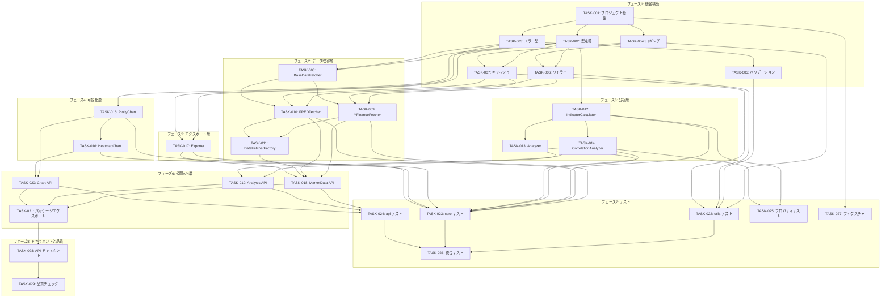

# 実装タスク一覧 (Implementation Tasks)

## 概要

本ドキュメントは market_analysis ライブラリの実装タスクを定義します。
各タスクは一意に実装が再現可能な粒度で分解されており、依存関係と実装順序が明確化されています。

## タスク一覧

### フェーズ 1: 基盤構築

#### TASK-001: プロジェクト基盤の初期化

- **優先度**: P0 (必須)
- **見積もり**: 1時間
- **依存関係**: なし
- **対応要件**: 全要件の前提

**説明**:
パッケージの基本構造を作成し、開発に必要な依存関係を設定する。

**実装内容**:
1. `src/market_analysis/__init__.py` を作成し、パッケージとして認識させる
2. `src/market_analysis/py.typed` を作成し、PEP 561 準拠を宣言
3. `pyproject.toml` に market_analysis パッケージの依存関係を追加:
   - pandas>=2.0.0
   - numpy>=1.26.0
   - yfinance>=0.2.0
   - fredapi>=0.5.0
   - plotly>=5.18.0
   - kaleido>=0.2.0
   - structlog>=24.0.0
   - tenacity>=8.2.0
   - pydantic>=2.5.0

**受け入れ条件**:
- [ ] `uv sync` が正常に完了する
- [ ] `from market_analysis import *` がエラーなく実行できる
- [ ] pyright で型チェックが通る

---

#### TASK-002: 型定義の作成

- **優先度**: P0 (必須)
- **見積もり**: 2時間
- **依存関係**: TASK-001
- **対応要件**: 全要件の基盤

**説明**:
全コンポーネントで使用する共通型定義を作成する。

**実装内容**:
`src/market_analysis/types.py` に以下を実装:

```python
from dataclasses import dataclass, field
from datetime import datetime
from typing import Literal, Any

import pandas as pd

@dataclass(frozen=True)
class DataSource:
    """データソース情報"""
    name: Literal["yfinance", "fred"]
    symbol: str
    fetched_at: datetime

@dataclass
class MarketDataResult:
    """市場データ取得結果"""
    data: pd.DataFrame
    source: DataSource
    start_date: datetime
    end_date: datetime
    symbol: str
    data_type: Literal["stock", "forex", "commodity", "index", "economic"]

@dataclass
class AnalysisResult:
    """分析結果"""
    data: pd.DataFrame
    indicators: list[str] = field(default_factory=list)
    metadata: dict[str, str | int | float] = field(default_factory=dict)

@dataclass
class CorrelationResult:
    """相関分析結果"""
    matrix: pd.DataFrame
    symbols: list[str]
    period: tuple[datetime, datetime]
    method: Literal["pearson", "spearman", "kendall"] = "pearson"

@dataclass
class AgentOutputMetadata:
    """AIエージェント向け出力メタデータ"""
    source: str
    symbol: str
    period_start: datetime
    period_end: datetime
    fetched_at: datetime
    record_count: int
    columns: list[str]

@dataclass
class AgentOutput:
    """AIエージェント向け構造化出力"""
    success: bool
    data: list[dict[str, Any]] | None
    metadata: AgentOutputMetadata | None
    error: str | None = None
    error_code: str | None = None

@dataclass(frozen=True)
class FetchOptions:
    """データ取得オプション"""
    start: datetime | str | None = None
    end: datetime | str | None = None
    use_cache: bool = True
    cache_ttl_hours: int = 24

@dataclass(frozen=True)
class AnalysisOptions:
    """分析オプション"""
    sma_periods: list[int] | None = None
    ema_periods: list[int] | None = None
    calculate_returns: bool = False
    volatility_period: int | None = None

@dataclass(frozen=True)
class ChartOptions:
    """チャートオプション"""
    title: str | None = None
    overlays: list[str] | None = None
    width: int = 1200
    height: int = 600
    theme: Literal["light", "dark"] = "light"
    interactive: bool = True

@dataclass(frozen=True)
class ExportOptions:
    """エクスポートオプション"""
    format: Literal["json", "csv", "sqlite"] = "json"
    include_metadata: bool = True
    table_name: str | None = None

@dataclass(frozen=True)
class RetryConfig:
    """リトライ設定"""
    max_retries: int = 3
    initial_delay: float = 1.0
    exponential_base: float = 2.0
    max_delay: float = 30.0
```

**受け入れ条件**:
- [ ] 全 dataclass が pyright strict モードで型エラーなし
- [ ] NumPy 形式の docstring が全クラスに記載
- [ ] `from market_analysis.types import *` で全型がインポート可能

---

#### TASK-003: エラー型の定義

- **優先度**: P0 (必須)
- **見積もり**: 1時間
- **依存関係**: TASK-001
- **対応要件**: 全要件のエラーハンドリング

**説明**:
カスタム例外クラスを定義し、エラーコードを含む詳細なエラー情報を提供する。

**実装内容**:
`src/market_analysis/errors.py` に以下を実装:

```python
from dataclasses import dataclass
from typing import Any

class MarketAnalysisError(Exception):
    """市場分析ライブラリ基底エラー"""
    pass

@dataclass
class DataFetchError(MarketAnalysisError):
    """データ取得エラー"""
    symbol: str
    source: str
    message: str
    retry_count: int = 0
    error_code: str = "DATA_FETCH_ERROR"

    def __str__(self) -> str:
        return f"[{self.error_code}] Failed to fetch {self.symbol} from {self.source}: {self.message}"

@dataclass
class ValidationError(MarketAnalysisError):
    """入力バリデーションエラー"""
    field: str
    value: Any
    message: str
    error_code: str = "VALIDATION_ERROR"

    def __str__(self) -> str:
        return f"[{self.error_code}] Invalid {self.field}='{self.value}': {self.message}"

@dataclass
class AnalysisError(MarketAnalysisError):
    """分析エラー"""
    operation: str
    message: str
    error_code: str = "ANALYSIS_ERROR"

    def __str__(self) -> str:
        return f"[{self.error_code}] Analysis failed in {self.operation}: {self.message}"

@dataclass
class ExportError(MarketAnalysisError):
    """エクスポートエラー"""
    format: str
    message: str
    path: str | None = None
    error_code: str = "EXPORT_ERROR"

    def __str__(self) -> str:
        location = f" to {self.path}" if self.path else ""
        return f"[{self.error_code}] Export to {self.format}{location} failed: {self.message}"
```

**受け入れ条件**:
- [ ] 全エラー型が MarketAnalysisError を継承
- [ ] 全エラー型に `__str__` メソッドが実装され、読みやすいエラーメッセージを出力
- [ ] エラーコードが定義され、プログラムで判別可能
- [ ] ユニットテストでエラー出力が期待通りであることを確認

---

#### TASK-004: ロギング設定の実装

- **優先度**: P0 (必須)
- **見積もり**: 1.5時間
- **依存関係**: TASK-001
- **対応要件**: NFR（非機能要件）- ログ出力

**説明**:
structlog を使用した構造化ログ設定を実装する。

**実装内容**:
`src/market_analysis/utils/logging_config.py` に以下を実装:

1. `get_logger(name: str)` 関数を実装
2. 環境変数 `LOG_LEVEL` (デフォルト: INFO) を読み取る
3. 環境変数 `LOG_FORMAT` (json/text, デフォルト: text) を読み取る
4. コンテキスト情報（timestamp, level, logger名）を自動付与

```python
import os
import structlog

def get_logger(name: str) -> structlog.BoundLogger:
    """構造化ロガーを取得"""
    ...
```

**受け入れ条件**:
- [ ] `LOG_LEVEL=DEBUG` で DEBUG ログが出力される
- [ ] `LOG_FORMAT=json` で JSON 形式のログが出力される
- [ ] タイムスタンプ、ログレベル、ロガー名がログに含まれる
- [ ] `get_logger(__name__)` でモジュール名がロガー名として使用される

---

#### TASK-005: バリデーション機能の実装

- **優先度**: P0 (必須)
- **見積もり**: 2時間
- **依存関係**: TASK-003
- **対応要件**: 全データ取得機能の入力検証

**説明**:
入力パラメータのバリデーション機能を実装する。

**実装内容**:
`src/market_analysis/utils/validators.py` に以下を実装:

```python
import re
from datetime import datetime
from market_analysis.errors import ValidationError

class Validator:
    """入力バリデーションクラス"""

    SYMBOL_PATTERN = re.compile(r"^[A-Za-z0-9.\-=^]+$")
    MAX_SYMBOL_LENGTH = 20

    def validate_symbol(self, symbol: str) -> str:
        """シンボルの検証"""
        ...

    def validate_date_range(
        self,
        start: datetime | str | None,
        end: datetime | str | None,
    ) -> tuple[datetime, datetime]:
        """日付範囲の検証"""
        ...

    def validate_period(self, period: int, min_val: int = 1, max_val: int = 500) -> int:
        """期間パラメータの検証"""
        ...
```

**受け入れ条件**:
- [ ] 空のシンボルで ValidationError が発生
- [ ] 不正な文字を含むシンボルで ValidationError が発生
- [ ] 開始日 > 終了日 で ValidationError が発生
- [ ] 文字列日付（"2024-01-01"）が datetime に正しく変換される
- [ ] 期間が min/max 範囲外の場合 ValidationError が発生

---

#### TASK-006: リトライ機能の実装

- **優先度**: P0 (必須)
- **見積もり**: 1.5時間
- **依存関係**: TASK-002, TASK-004
- **対応要件**: NFR - リトライ処理

**説明**:
tenacity を使用した指数バックオフリトライ機能を実装する。

**実装内容**:
`src/market_analysis/utils/retry.py` に以下を実装:

```python
from typing import Callable, TypeVar
from tenacity import retry, stop_after_attempt, wait_exponential
from market_analysis.types import RetryConfig
from market_analysis.utils.logging_config import get_logger

T = TypeVar("T")

class RetryHandler:
    """リトライ処理ハンドラ"""

    def __init__(self, config: RetryConfig | None = None) -> None:
        ...

    def execute(self, func: Callable[[], T]) -> T:
        """リトライ付きで関数を実行"""
        ...

def with_retry(
    func: Callable[[], T],
    config: RetryConfig | None = None,
) -> T:
    """リトライ付きで関数を実行するヘルパー"""
    ...
```

**受け入れ条件**:
- [ ] 一時的なエラーで指定回数リトライが実行される
- [ ] リトライ間隔が指数バックオフで増加する
- [ ] 最大リトライ回数を超えると例外が送出される
- [ ] リトライ時にログが出力される

---

#### TASK-007: キャッシュ機能の実装

- **優先度**: P0 (必須)
- **見積もり**: 2.5時間
- **依存関係**: TASK-002, TASK-004
- **対応要件**: NFR - キャッシュ

**説明**:
SQLite を使用したキャッシュ機能を実装する。

**実装内容**:
`src/market_analysis/utils/cache.py` に以下を実装:

```python
import sqlite3
import pickle
from pathlib import Path
from datetime import datetime, timedelta
import pandas as pd
from market_analysis.utils.logging_config import get_logger

class CacheManager:
    """SQLiteキャッシュマネージャ"""

    DEFAULT_CACHE_PATH = "~/.market_analysis/cache.db"

    def __init__(self, db_path: str | None = None) -> None:
        ...

    def _init_db(self) -> None:
        """データベースを初期化"""
        ...

    def get(self, key: str, ttl_hours: int = 24) -> pd.DataFrame | None:
        """キャッシュからデータを取得"""
        ...

    def set(self, key: str, data: pd.DataFrame) -> None:
        """キャッシュにデータを保存"""
        ...

    def clear(self) -> None:
        """キャッシュをクリア"""
        ...

    def cleanup_expired(self) -> int:
        """期限切れエントリを削除"""
        ...

    @staticmethod
    def build_cache_key(source: str, symbol: str, start: datetime, end: datetime) -> str:
        """キャッシュキーを生成"""
        ...
```

**受け入れ条件**:
- [ ] キャッシュがない場合 `get()` が None を返す
- [ ] `set()` で保存したデータを `get()` で取得できる
- [ ] TTL 超過後は `get()` が None を返す
- [ ] `clear()` でキャッシュが全削除される
- [ ] `cleanup_expired()` で期限切れエントリのみ削除される
- [ ] pickle でシリアライズされた DataFrame が正しく復元される

---

### フェーズ 2: データ取得層

#### TASK-008: BaseDataFetcher 抽象クラスの実装

- **優先度**: P0 (必須)
- **見積もり**: 1時間
- **依存関係**: TASK-002, TASK-003
- **対応要件**: FR-001〜FR-004 の基盤

**説明**:
データ取得の抽象基底クラスを定義する。

**実装内容**:
`src/market_analysis/core/fetcher.py` に以下を実装:

```python
from abc import ABC, abstractmethod
from datetime import datetime
import pandas as pd

class BaseDataFetcher(ABC):
    """データ取得基底クラス"""

    @abstractmethod
    def fetch(
        self,
        symbol: str,
        start: datetime,
        end: datetime,
    ) -> pd.DataFrame:
        """データを取得"""
        ...

    @abstractmethod
    def validate_symbol(self, symbol: str) -> bool:
        """シンボルの妥当性を検証"""
        ...

    def normalize_dataframe(self, df: pd.DataFrame) -> pd.DataFrame:
        """DataFrameを正規化（共通カラム名、インデックス設定）"""
        ...
```

**受け入れ条件**:
- [ ] ABC を継承した抽象クラスとして定義
- [ ] `fetch()` と `validate_symbol()` が abstractmethod として定義
- [ ] `normalize_dataframe()` が共通実装として提供
- [ ] pyright で型チェックが通る

---

#### TASK-009: YFinanceFetcher の実装

- **優先度**: P0 (必須)
- **見積もり**: 2.5時間
- **依存関係**: TASK-006, TASK-007, TASK-008
- **対応要件**: FR-001, FR-002, FR-004

**説明**:
yfinance を使用したデータ取得クラスを実装する。

**実装内容**:
`src/market_analysis/core/fetcher.py` に以下を追加:

```python
import yfinance as yf
from market_analysis.errors import DataFetchError

class YFinanceFetcher(BaseDataFetcher):
    """yfinanceデータ取得"""

    def __init__(
        self,
        cache_manager: CacheManager | None = None,
        retry_handler: RetryHandler | None = None,
    ) -> None:
        ...

    def fetch(
        self,
        symbol: str,
        start: datetime,
        end: datetime,
    ) -> pd.DataFrame:
        """yfinanceからデータを取得"""
        ...

    def validate_symbol(self, symbol: str) -> bool:
        """yfinanceシンボルの妥当性を検証"""
        ...

    def _fetch_from_api(
        self,
        symbol: str,
        start: datetime,
        end: datetime,
    ) -> pd.DataFrame:
        """APIからデータを取得（リトライ対象）"""
        ...
```

**受け入れ条件**:
- [ ] 有効なシンボルでデータが取得できる
- [ ] キャッシュがある場合はキャッシュから返す
- [ ] キャッシュがない場合は API から取得してキャッシュに保存
- [ ] API エラー時にリトライが実行される
- [ ] 存在しないシンボルで DataFetchError が発生
- [ ] 返却される DataFrame に OHLCV カラムが含まれる

---

#### TASK-010: FREDFetcher の実装

- **優先度**: P0 (必須)
- **見積もり**: 2時間
- **依存関係**: TASK-006, TASK-007, TASK-008
- **対応要件**: FR-003

**説明**:
FRED API を使用した経済指標データ取得クラスを実装する。

**実装内容**:
`src/market_analysis/core/fetcher.py` に以下を追加:

```python
from fredapi import Fred
import os

class FREDFetcher(BaseDataFetcher):
    """FREDデータ取得"""

    def __init__(
        self,
        api_key: str | None = None,
        cache_manager: CacheManager | None = None,
        retry_handler: RetryHandler | None = None,
    ) -> None:
        """初期化（api_keyがNoneの場合は環境変数FRED_API_KEYを使用）"""
        ...

    def fetch(
        self,
        series_id: str,
        start: datetime,
        end: datetime,
    ) -> pd.DataFrame:
        """FREDから経済指標データを取得"""
        ...

    def validate_symbol(self, series_id: str) -> bool:
        """FREDシリーズIDの妥当性を検証"""
        ...
```

**受け入れ条件**:
- [ ] 環境変数 `FRED_API_KEY` から API キーを読み取れる
- [ ] API キー未設定時に明確なエラーメッセージを出力
- [ ] 有効なシリーズ ID でデータが取得できる
- [ ] キャッシュ機能が正常に動作
- [ ] 存在しないシリーズ ID で DataFetchError が発生

---

#### TASK-011: DataFetcherFactory の実装

- **優先度**: P1 (重要)
- **見積もり**: 0.5時間
- **依存関係**: TASK-009, TASK-010
- **対応要件**: FR-001〜FR-004

**説明**:
データソースに応じた Fetcher インスタンスを生成するファクトリクラスを実装する。

**実装内容**:
`src/market_analysis/core/fetcher.py` に以下を追加:

```python
from typing import Literal

class DataFetcherFactory:
    """データ取得インスタンスファクトリ"""

    @staticmethod
    def create(
        source: Literal["yfinance", "fred"],
        cache_manager: CacheManager | None = None,
        retry_handler: RetryHandler | None = None,
        **kwargs,
    ) -> BaseDataFetcher:
        """データソースに応じたFetcherを生成"""
        ...
```

**受け入れ条件**:
- [ ] `source="yfinance"` で YFinanceFetcher が返される
- [ ] `source="fred"` で FREDFetcher が返される
- [ ] 不正なソース指定で ValueError が発生

---

### フェーズ 3: 分析層

#### TASK-012: IndicatorCalculator の実装

- **優先度**: P0 (必須)
- **見積もり**: 2時間
- **依存関係**: TASK-002
- **対応要件**: FR-005

**説明**:
テクニカル指標計算のスタティックメソッドを実装する。

**実装内容**:
`src/market_analysis/core/analyzer.py` に以下を実装:

```python
import numpy as np
import pandas as pd

class IndicatorCalculator:
    """テクニカル指標計算クラス"""

    @staticmethod
    def calculate_sma(data: pd.Series, period: int) -> pd.Series:
        """単純移動平均を計算"""
        return data.rolling(window=period).mean()

    @staticmethod
    def calculate_ema(data: pd.Series, period: int) -> pd.Series:
        """指数移動平均を計算"""
        return data.ewm(span=period, adjust=False).mean()

    @staticmethod
    def calculate_returns(data: pd.Series) -> pd.Series:
        """日次リターンを計算"""
        return data.pct_change()

    @staticmethod
    def calculate_volatility(
        data: pd.Series,
        period: int,
        annualize: bool = True,
    ) -> pd.Series:
        """ボラティリティを計算"""
        returns = data.pct_change()
        volatility = returns.rolling(window=period).std()
        if annualize:
            volatility = volatility * np.sqrt(252)
        return volatility
```

**受け入れ条件**:
- [ ] SMA が正しく計算される（期待値との比較テスト）
- [ ] EMA が正しく計算される（pandas ewm との一致を確認）
- [ ] リターンが正しく計算される
- [ ] ボラティリティが正しく計算される（年率換算オプション含む）
- [ ] 不十分なデータポイントで NaN が返される

---

#### TASK-013: Analyzer クラスの実装

- **優先度**: P0 (必須)
- **見積もり**: 2時間
- **依存関係**: TASK-012
- **対応要件**: FR-005

**説明**:
メソッドチェーンで指標を追加できる Analysis クラスを実装する。

**実装内容**:
`src/market_analysis/core/analyzer.py` に以下を追加:

```python
from typing import Self

class Analyzer:
    """テクニカル分析クラス"""

    def __init__(self, data: pd.DataFrame) -> None:
        self._data = data.copy()
        self._indicators: list[str] = []

    @property
    def data(self) -> pd.DataFrame:
        return self._data

    @property
    def indicators(self) -> list[str]:
        return self._indicators.copy()

    def add_sma(self, period: int = 20, column: str = "Close") -> Self:
        """単純移動平均を追加"""
        ...

    def add_ema(self, period: int = 20, column: str = "Close") -> Self:
        """指数移動平均を追加"""
        ...

    def add_returns(self, column: str = "Close") -> Self:
        """日次リターンを追加"""
        ...

    def add_volatility(
        self,
        period: int = 20,
        column: str = "Close",
        annualize: bool = True,
    ) -> Self:
        """ボラティリティを追加"""
        ...
```

**受け入れ条件**:
- [ ] メソッドチェーンが正常に動作（`analysis.add_sma(20).add_ema(50).add_returns()`）
- [ ] 追加された指標が `indicators` プロパティで確認できる
- [ ] 追加された指標が `data` プロパティの DataFrame に含まれる
- [ ] 元のデータが変更されない（コピーで操作）

---

#### TASK-014: CorrelationAnalyzer の実装

- **優先度**: P0 (必須)
- **見積もり**: 2時間
- **依存関係**: TASK-012
- **対応要件**: FR-006

**説明**:
相関分析機能を実装する。

**実装内容**:
`src/market_analysis/core/analyzer.py` に以下を追加:

```python
class CorrelationAnalyzer:
    """相関分析クラス"""

    @staticmethod
    def correlation(
        dataframes: list[pd.DataFrame],
        symbols: list[str] | None = None,
        column: str = "Close",
        method: str = "pearson",
    ) -> pd.DataFrame:
        """複数銘柄間の相関係数行列を計算"""
        ...

    @staticmethod
    def rolling_correlation(
        df1: pd.DataFrame,
        df2: pd.DataFrame,
        period: int = 20,
        column: str = "Close",
    ) -> pd.Series:
        """ローリング相関を計算"""
        ...

    @staticmethod
    def beta(
        stock: pd.DataFrame,
        benchmark: pd.DataFrame,
        column: str = "Close",
    ) -> float:
        """ベータ値を計算"""
        ...
```

**受け入れ条件**:
- [ ] 相関係数行列が対称行列として計算される
- [ ] 対角成分が 1.0 である
- [ ] 相関係数が -1 から 1 の範囲内
- [ ] ローリング相関が正しく計算される
- [ ] ベータ値が正しく計算される（既知のデータでの検証）

---

### フェーズ 4: 可視化層

#### TASK-015: PlotlyChart クラスの実装

- **優先度**: P0 (必須)
- **見積もり**: 2.5時間
- **依存関係**: TASK-002
- **対応要件**: FR-007

**説明**:
plotly を使用した価格チャート生成機能を実装する。

**実装内容**:
`src/market_analysis/core/visualizer.py` に以下を実装:

```python
from pathlib import Path
import pandas as pd
import plotly.graph_objects as go
from market_analysis.utils.logging_config import get_logger

class PlotlyChart:
    """Plotlyチャートクラス"""

    def __init__(
        self,
        data: pd.DataFrame,
        title: str | None = None,
    ) -> None:
        ...

    def price_chart(
        self,
        column: str = "Close",
        overlays: list[str] | None = None,
        width: int = 1200,
        height: int = 600,
    ) -> go.Figure:
        """価格チャートを生成"""
        ...

    def save(
        self,
        path: str | Path,
        format: str = "png",
        scale: int = 2,
    ) -> None:
        """チャートをファイルに保存"""
        ...

    def show(self) -> None:
        """チャートを表示（Jupyter/marimo用）"""
        ...
```

**受け入れ条件**:
- [ ] 価格チャートが正しく生成される
- [ ] オーバーレイ指標が正しく表示される
- [ ] PNG 形式でファイル出力できる
- [ ] SVG 形式でファイル出力できる
- [ ] HTML 形式でファイル出力できる
- [ ] `show()` で表示されるか、エラーなく終了する

---

#### TASK-016: HeatmapChart クラスの実装

- **優先度**: P0 (必須)
- **見積もり**: 1.5時間
- **依存関係**: TASK-015
- **対応要件**: FR-007

**説明**:
相関ヒートマップ生成機能を実装する。

**実装内容**:
`src/market_analysis/core/visualizer.py` に以下を追加:

```python
class HeatmapChart(PlotlyChart):
    """ヒートマップチャートクラス"""

    @staticmethod
    def correlation_heatmap(
        correlation_matrix: pd.DataFrame,
        title: str = "Correlation Matrix",
        width: int = 800,
        height: int = 800,
    ) -> go.Figure:
        """相関ヒートマップを生成"""
        ...
```

**受け入れ条件**:
- [ ] 相関行列からヒートマップが生成される
- [ ] カラースケールが -1 から 1 の範囲で設定される
- [ ] 各セルに相関係数値が表示される
- [ ] PNG/SVG 形式でファイル出力できる

---

### フェーズ 5: エクスポート層

#### TASK-017: Exporter クラスの実装

- **優先度**: P0 (必須)
- **見積もり**: 2時間
- **依存関係**: TASK-002, TASK-003
- **対応要件**: FR-008, FR-009

**説明**:
データエクスポート機能を実装する。

**実装内容**:
`src/market_analysis/core/exporter.py` に以下を実装:

```python
import sqlite3
from pathlib import Path
from datetime import datetime
from typing import Any
import pandas as pd
from market_analysis.types import AgentOutput, AgentOutputMetadata
from market_analysis.errors import ExportError

class Exporter:
    """データエクスポートクラス"""

    @staticmethod
    def to_json(
        data: pd.DataFrame,
        path: str | Path | None = None,
    ) -> str | None:
        """JSON形式でエクスポート"""
        ...

    @staticmethod
    def to_csv(
        data: pd.DataFrame,
        path: str | Path,
    ) -> None:
        """CSV形式でエクスポート"""
        ...

    @staticmethod
    def to_sqlite(
        data: pd.DataFrame,
        db_path: str | Path,
        table_name: str,
    ) -> None:
        """SQLiteにエクスポート"""
        ...

    @staticmethod
    def to_agent_json(
        data: pd.DataFrame,
        symbol: str,
        source: str,
        include_metadata: bool = True,
    ) -> dict[str, Any]:
        """AIエージェント向けJSON形式に変換"""
        ...
```

**受け入れ条件**:
- [ ] JSON 形式で正しくエクスポートされる
- [ ] CSV 形式で正しくエクスポートされる
- [ ] SQLite にデータが正しく保存される
- [ ] AIエージェント向け JSON に必要なメタデータが含まれる
- [ ] エクスポート失敗時に ExportError が発生

---

### フェーズ 6: 公開 API 層

#### TASK-018: MarketData API の実装

- **優先度**: P0 (必須)
- **見積もり**: 3時間
- **依存関係**: TASK-009, TASK-010, TASK-011, TASK-017
- **対応要件**: FR-001〜FR-004, FR-008, FR-009

**説明**:
ユーザー向けのデータ取得統一 API を実装する。

**実装内容**:
`src/market_analysis/api/market_data.py` に以下を実装:

```python
from datetime import datetime
import pandas as pd
from market_analysis.core.fetcher import DataFetcherFactory, YFinanceFetcher, FREDFetcher
from market_analysis.core.exporter import Exporter
from market_analysis.utils.cache import CacheManager
from market_analysis.utils.validators import Validator
from market_analysis.utils.logging_config import get_logger

class MarketData:
    """市場データ取得の統一インターフェース"""

    def __init__(
        self,
        cache_path: str | None = None,
        fred_api_key: str | None = None,
    ) -> None:
        ...

    def fetch_stock(
        self,
        symbol: str,
        start: datetime | str | None = None,
        end: datetime | str | None = None,
    ) -> pd.DataFrame:
        """株価データを取得"""
        ...

    def fetch_forex(
        self,
        pair: str,
        start: datetime | str | None = None,
        end: datetime | str | None = None,
    ) -> pd.DataFrame:
        """為替データを取得"""
        ...

    def fetch_fred(
        self,
        series_id: str,
        start: datetime | str | None = None,
        end: datetime | str | None = None,
    ) -> pd.DataFrame:
        """FRED経済指標データを取得"""
        ...

    def fetch_commodity(
        self,
        symbol: str,
        start: datetime | str | None = None,
        end: datetime | str | None = None,
    ) -> pd.DataFrame:
        """コモディティデータを取得"""
        ...

    def save_to_sqlite(
        self,
        db_path: str,
        data: pd.DataFrame,
        table_name: str,
    ) -> None:
        """DataFrameをSQLiteに保存"""
        ...

    def to_agent_json(
        self,
        data: pd.DataFrame,
        include_metadata: bool = True,
    ) -> dict:
        """AIエージェント向けJSON形式に変換"""
        ...
```

**受け入れ条件**:
- [ ] `fetch_stock()` で株価データが取得できる
- [ ] `fetch_forex()` で為替データが取得できる（USDJPY → USDJPY=X への変換含む）
- [ ] `fetch_fred()` で経済指標データが取得できる
- [ ] `fetch_commodity()` でコモディティデータが取得できる
- [ ] 入力パラメータが適切にバリデーションされる
- [ ] 全操作がログ出力される

---

#### TASK-019: Analysis API の実装

- **優先度**: P0 (必須)
- **見積もり**: 2時間
- **依存関係**: TASK-013, TASK-014
- **対応要件**: FR-005, FR-006

**説明**:
ユーザー向けの分析 API を実装する。

**実装内容**:
`src/market_analysis/api/analysis.py` に以下を実装:

```python
from typing import Self
import pandas as pd
from market_analysis.core.analyzer import Analyzer as CoreAnalyzer, CorrelationAnalyzer

class Analysis:
    """テクニカル分析クラス（公開API）"""

    def __init__(self, data: pd.DataFrame) -> None:
        ...

    @property
    def data(self) -> pd.DataFrame:
        ...

    @property
    def indicators(self) -> list[str]:
        ...

    def add_sma(self, period: int = 20, column: str = "Close") -> Self:
        ...

    def add_ema(self, period: int = 20, column: str = "Close") -> Self:
        ...

    def add_returns(self, column: str = "Close") -> Self:
        ...

    def add_volatility(
        self,
        period: int = 20,
        column: str = "Close",
        annualize: bool = True,
    ) -> Self:
        ...

    @staticmethod
    def correlation(
        dataframes: list[pd.DataFrame],
        symbols: list[str] | None = None,
        column: str = "Close",
        method: str = "pearson",
    ) -> pd.DataFrame:
        ...

    @staticmethod
    def rolling_correlation(
        df1: pd.DataFrame,
        df2: pd.DataFrame,
        period: int = 20,
        column: str = "Close",
    ) -> pd.Series:
        ...

    @staticmethod
    def beta(
        stock: pd.DataFrame,
        benchmark: pd.DataFrame,
        column: str = "Close",
    ) -> float:
        ...
```

**受け入れ条件**:
- [ ] LRD で定義された API インターフェースと一致
- [ ] メソッドチェーンが正常に動作
- [ ] 全メソッドに NumPy 形式の docstring が記載
- [ ] 入力パラメータのバリデーションが実装

---

#### TASK-020: Chart API の実装

- **優先度**: P0 (必須)
- **見積もり**: 1.5時間
- **依存関係**: TASK-015, TASK-016
- **対応要件**: FR-007

**説明**:
ユーザー向けのチャート API を実装する。

**実装内容**:
`src/market_analysis/api/chart.py` に以下を実装:

```python
from pathlib import Path
import pandas as pd
import plotly.graph_objects as go
from market_analysis.core.visualizer import PlotlyChart, HeatmapChart

class Chart:
    """チャート生成クラス（公開API）"""

    def __init__(
        self,
        data: pd.DataFrame,
        title: str | None = None,
    ) -> None:
        ...

    def price_chart(
        self,
        column: str = "Close",
        overlays: list[str] | None = None,
        width: int = 1200,
        height: int = 600,
    ) -> go.Figure:
        ...

    @staticmethod
    def correlation_heatmap(
        correlation_matrix: pd.DataFrame,
        title: str = "Correlation Matrix",
        width: int = 800,
        height: int = 800,
    ) -> go.Figure:
        ...

    def save(
        self,
        path: str | Path,
        format: str = "png",
        scale: int = 2,
    ) -> None:
        ...

    def show(self) -> None:
        ...
```

**受け入れ条件**:
- [ ] LRD で定義された API インターフェースと一致
- [ ] 全メソッドに NumPy 形式の docstring が記載
- [ ] marimo ノートブックでインタラクティブ表示が動作

---

#### TASK-021: パッケージエクスポートの設定

- **優先度**: P0 (必須)
- **見積もり**: 0.5時間
- **依存関係**: TASK-018, TASK-019, TASK-020
- **対応要件**: 全要件

**説明**:
`__init__.py` でパッケージの公開 API をエクスポートする。

**実装内容**:
`src/market_analysis/__init__.py` を更新:

```python
"""market_analysis - 金融市場データ取得・分析・可視化ライブラリ"""

from market_analysis.api.market_data import MarketData
from market_analysis.api.analysis import Analysis
from market_analysis.api.chart import Chart
from market_analysis.errors import (
    MarketAnalysisError,
    DataFetchError,
    ValidationError,
    AnalysisError,
    ExportError,
)

__all__ = [
    "MarketData",
    "Analysis",
    "Chart",
    "MarketAnalysisError",
    "DataFetchError",
    "ValidationError",
    "AnalysisError",
    "ExportError",
]

__version__ = "0.1.0"
```

**受け入れ条件**:
- [ ] `from market_analysis import MarketData, Analysis, Chart` が動作
- [ ] `from market_analysis import *` で公開 API がインポートされる
- [ ] `__version__` が定義されている

---

### フェーズ 7: テスト

#### TASK-022: ユニットテスト: utils 層

- **優先度**: P0 (必須)
- **見積もり**: 3時間
- **依存関係**: TASK-004, TASK-005, TASK-006, TASK-007
- **対応要件**: テスト要件

**説明**:
utils 層のユニットテストを作成する。

**実装内容**:
以下のテストファイルを作成:
- `tests/market_analysis/unit/utils/test_logging_config.py`
- `tests/market_analysis/unit/utils/test_validators.py`
- `tests/market_analysis/unit/utils/test_retry.py`
- `tests/market_analysis/unit/utils/test_cache.py`

**受け入れ条件**:
- [ ] 全テストが pass
- [ ] カバレッジ 80% 以上
- [ ] エッジケースが網羅されている

---

#### TASK-023: ユニットテスト: core 層

- **優先度**: P0 (必須)
- **見積もり**: 4時間
- **依存関係**: TASK-009, TASK-010, TASK-012, TASK-013, TASK-014, TASK-015, TASK-016, TASK-017
- **対応要件**: テスト要件

**説明**:
core 層のユニットテストを作成する。

**実装内容**:
以下のテストファイルを作成:
- `tests/market_analysis/unit/core/test_fetcher.py`
- `tests/market_analysis/unit/core/test_analyzer.py`
- `tests/market_analysis/unit/core/test_visualizer.py`
- `tests/market_analysis/unit/core/test_exporter.py`

**受け入れ条件**:
- [ ] 全テストが pass
- [ ] カバレッジ 80% 以上
- [ ] yfinance/FRED API はモック化
- [ ] エッジケースが網羅されている

---

#### TASK-024: ユニットテスト: api 層

- **優先度**: P0 (必須)
- **見積もり**: 3時間
- **依存関係**: TASK-018, TASK-019, TASK-020
- **対応要件**: テスト要件

**説明**:
api 層のユニットテストを作成する。

**実装内容**:
以下のテストファイルを作成:
- `tests/market_analysis/unit/api/test_market_data.py`
- `tests/market_analysis/unit/api/test_analysis.py`
- `tests/market_analysis/unit/api/test_chart.py`

**受け入れ条件**:
- [ ] 全テストが pass
- [ ] カバレッジ 80% 以上
- [ ] 入力バリデーションのテストが含まれる

---

#### TASK-025: プロパティベーステスト

- **優先度**: P1 (重要)
- **見積もり**: 2時間
- **依存関係**: TASK-012, TASK-014
- **対応要件**: テスト要件

**説明**:
Hypothesis を使用したプロパティベーステストを作成する。

**実装内容**:
以下のテストファイルを作成:
- `tests/market_analysis/property/test_indicators.py`
- `tests/market_analysis/property/test_correlation.py`

**受け入れ条件**:
- [ ] SMA/EMA の期間が正の整数であることを検証
- [ ] 相関係数が -1 から 1 の範囲内であることを検証
- [ ] リターンの合計が総リターンと一致することを検証

---

#### TASK-026: 統合テスト

- **優先度**: P1 (重要)
- **見積もり**: 3時間
- **依存関係**: TASK-022, TASK-023, TASK-024
- **対応要件**: テスト要件

**説明**:
API フロー全体の統合テストを作成する。

**実装内容**:
以下のテストファイルを作成:
- `tests/market_analysis/integration/test_fetch_flow.py`
- `tests/market_analysis/integration/test_analysis_flow.py`
- `tests/market_analysis/integration/test_chart_flow.py`

**受け入れ条件**:
- [ ] データ取得 → 分析 → 可視化のフローが正常動作
- [ ] キャッシュ機能が統合テストで検証される
- [ ] エラーハンドリングが適切に機能する

---

#### TASK-027: テストフィクスチャの作成

- **優先度**: P0 (必須)
- **見積もり**: 1.5時間
- **依存関係**: TASK-001
- **対応要件**: テスト要件

**説明**:
共通テストフィクスチャを作成する。

**実装内容**:
以下のファイルを作成:
- `tests/market_analysis/conftest.py`
- `tests/market_analysis/fixtures/sample_ohlcv.csv`
- `tests/market_analysis/fixtures/sample_fred.csv`

**受け入れ条件**:
- [ ] `sample_ohlcv_data` フィクスチャが利用可能
- [ ] `sample_fred_data` フィクスチャが利用可能
- [ ] `mock_yfinance` フィクスチャが利用可能
- [ ] `mock_fred` フィクスチャが利用可能
- [ ] `temp_cache_db` フィクスチャが利用可能

---

### フェーズ 8: ドキュメントと品質

#### TASK-028: API ドキュメントの整備

- **優先度**: P1 (重要)
- **見積もり**: 2時間
- **依存関係**: TASK-021
- **対応要件**: ドキュメント要件

**説明**:
全公開 API に NumPy 形式の docstring を記載する。

**実装内容**:
以下のファイルの docstring を確認・整備:
- `src/market_analysis/api/market_data.py`
- `src/market_analysis/api/analysis.py`
- `src/market_analysis/api/chart.py`
- `src/market_analysis/types.py`
- `src/market_analysis/errors.py`

**受け入れ条件**:
- [ ] 全公開クラス・メソッドに docstring が記載
- [ ] Parameters, Returns, Raises, Examples セクションが含まれる
- [ ] `pydoc-markdown` で API ドキュメントが生成できる

---

#### TASK-029: 品質チェックの実施

- **優先度**: P0 (必須)
- **見積もり**: 1時間
- **依存関係**: TASK-028
- **対応要件**: 品質指標

**説明**:
ruff, pyright, テストカバレッジを確認し、品質基準を満たすことを確認する。

**実装内容**:
以下のコマンドを実行し、問題を修正:
1. `make format` - コードフォーマット
2. `make lint` - リント
3. `make typecheck` - 型チェック
4. `make test-cov` - カバレッジ付きテスト

**受け入れ条件**:
- [ ] ruff チェックが pass
- [ ] pyright strict モードで型エラーなし
- [ ] テストカバレッジ 80% 以上
- [ ] 全テストが pass

---

## 依存関係グラフ



## 実装順序サマリ

| 順序 | タスクID | タスク名 | 見積もり |
|------|----------|----------|----------|
| 1 | TASK-001 | プロジェクト基盤の初期化 | 1h |
| 2 | TASK-002 | 型定義の作成 | 2h |
| 3 | TASK-003 | エラー型の定義 | 1h |
| 4 | TASK-004 | ロギング設定の実装 | 1.5h |
| 5 | TASK-027 | テストフィクスチャの作成 | 1.5h |
| 6 | TASK-005 | バリデーション機能の実装 | 2h |
| 7 | TASK-006 | リトライ機能の実装 | 1.5h |
| 8 | TASK-007 | キャッシュ機能の実装 | 2.5h |
| 9 | TASK-008 | BaseDataFetcher 抽象クラス | 1h |
| 10 | TASK-009 | YFinanceFetcher の実装 | 2.5h |
| 11 | TASK-010 | FREDFetcher の実装 | 2h |
| 12 | TASK-011 | DataFetcherFactory の実装 | 0.5h |
| 13 | TASK-012 | IndicatorCalculator の実装 | 2h |
| 14 | TASK-013 | Analyzer クラスの実装 | 2h |
| 15 | TASK-014 | CorrelationAnalyzer の実装 | 2h |
| 16 | TASK-015 | PlotlyChart クラスの実装 | 2.5h |
| 17 | TASK-016 | HeatmapChart クラスの実装 | 1.5h |
| 18 | TASK-017 | Exporter クラスの実装 | 2h |
| 19 | TASK-018 | MarketData API の実装 | 3h |
| 20 | TASK-019 | Analysis API の実装 | 2h |
| 21 | TASK-020 | Chart API の実装 | 1.5h |
| 22 | TASK-021 | パッケージエクスポートの設定 | 0.5h |
| 23 | TASK-022 | ユニットテスト: utils 層 | 3h |
| 24 | TASK-023 | ユニットテスト: core 層 | 4h |
| 25 | TASK-024 | ユニットテスト: api 層 | 3h |
| 26 | TASK-025 | プロパティベーステスト | 2h |
| 27 | TASK-026 | 統合テスト | 3h |
| 28 | TASK-028 | API ドキュメントの整備 | 2h |
| 29 | TASK-029 | 品質チェックの実施 | 1h |

**合計見積もり時間**: 約 54.5 時間

## LRD 要件との対応表

| LRD要件 | 対応タスク |
|---------|-----------|
| FR-001: 株価・指数データ取得 | TASK-009, TASK-018 |
| FR-002: 為替データ取得 | TASK-009, TASK-018 |
| FR-003: 経済指標データ取得 | TASK-010, TASK-018 |
| FR-004: コモディティデータ取得 | TASK-009, TASK-018 |
| FR-005: 基本テクニカル指標 | TASK-012, TASK-013, TASK-019 |
| FR-006: 相関分析 | TASK-014, TASK-019 |
| FR-007: チャート生成 | TASK-015, TASK-016, TASK-020 |
| FR-008: データエクスポート | TASK-017, TASK-018 |
| FR-009: AIエージェント向けJSON出力 | TASK-017, TASK-018 |

## 更新履歴

| 日付 | 更新内容 | 担当 |
|------|----------|------|
| 2025-01-11 | 初版作成 | Claude |
