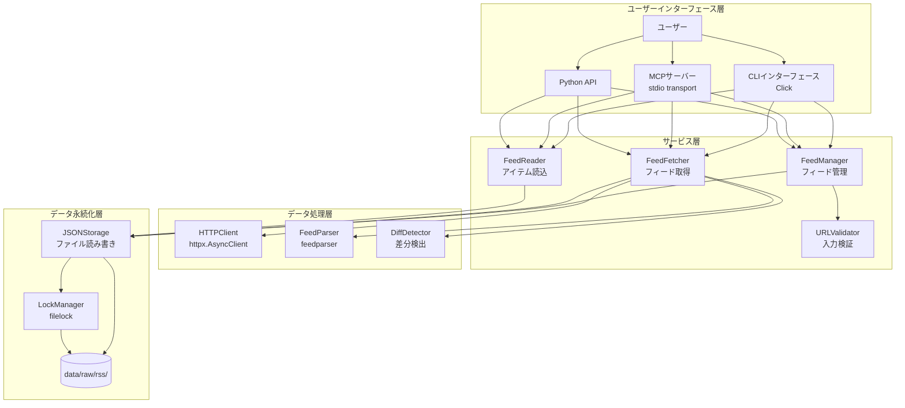
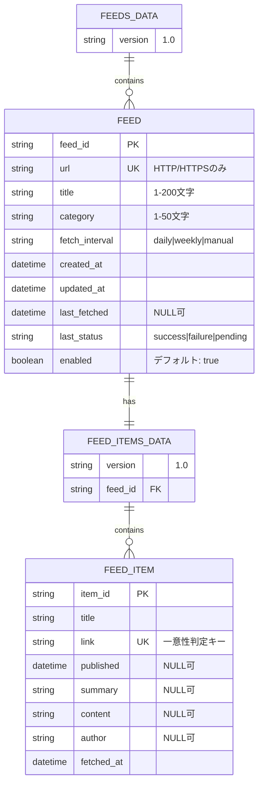

# アーキテクチャ設計書 (Architecture Design Document)

## システム概要

rssライブラリは、RSS/Atomフィードの収集・パース・構造化保存を提供するPythonライブラリです。
JSON形式でのデータ管理により検索・分析が容易で、MCPサーバーとしてClaude Codeなどのエージェントからも利用可能です。

## システム構成図



## テクノロジースタック

### 言語・ランタイム

| 技術 | バージョン | 選定理由 |
|------|-----------|----------|
| Python | 3.12+ | 型ヒントの改善（PEP 695）、パターンマッチング、改善されたエラーメッセージなど最新機能を活用 |
| uv | latest | Rustベースで高速なパッケージ管理、pip/pipx/virtualenv/pyenvの機能を統合 |

### コアライブラリ

| 技術 | バージョン | 用途 | 選定理由 |
|------|-----------|------|----------|
| httpx | 0.27.0+ | HTTP/HTTPSクライアント | 非同期対応、HTTP/2サポート、タイムアウト・リトライ制御が容易 |
| feedparser | 6.0.0+ | RSS/Atomパーサー | RSS 2.0/Atom両対応、実績豊富で信頼性が高い |
| filelock | 3.20.0+ | ファイルロック | クロスプラットフォーム対応、並行書き込み制御に必須 |
| structlog | 25.4.0+ | 構造化ロギング | financeパッケージから継承、JSON/テキスト形式の柔軟な出力 |

### オプショナル依存

| 技術 | バージョン | 用途 | 選定理由 |
|------|-----------|------|----------|
| mcp | 0.9.0+ | MCPプロトコル実装 | Claude Code連携に必須、stdio transportに対応 |
| APScheduler | 3.10.0+ | スケジューラー | 日次バッチ実行、cron形式のスケジュール設定が可能 |
| click | 8.1.0+ | CLIフレームワーク | サブコマンド対応、型ヒントサポート、Pythonで標準的 |

### 開発ツール

| 技術 | バージョン | 用途 | 選定理由 |
|------|-----------|------|----------|
| Ruff | latest | リント・フォーマット | Rustベースで高速、Flake8/isort/Blackを統合 |
| pyright | latest | 型チェック | 厳密な型チェック、Python 3.12+の型機能に完全対応 |
| pytest | latest | テストフレームワーク | Pythonの標準的なテスト環境 |
| Hypothesis | latest | プロパティベーステスト | 自動テストケース生成、不正入力への対処を検証 |
| pytest-cov | latest | カバレッジ測定 | pytestと統合、80%カバレッジ目標の測定 |
| pytest-benchmark | latest | ベンチマーク | パフォーマンス要件の検証 |
| memory_profiler | latest | メモリプロファイリング | メモリ使用量100MB以内の検証 |

## アーキテクチャパターン

### レイヤードアーキテクチャ

```
┌──────────────────────────────────────┐
│   ユーザーインターフェース層          │ ← CLI/MCP/Python API
├──────────────────────────────────────┤
│   サービス層                          │ ← ビジネスロジック
├──────────────────────────────────────┤
│   データ処理層                        │ ← HTTP取得・パース・差分検出
├──────────────────────────────────────┤
│   データ永続化層                      │ ← JSON保存・ファイルロック
└──────────────────────────────────────┘
```

#### ユーザーインターフェース層

- **責務**: ユーザー入力の受付、バリデーション、結果の表示
- **コンポーネント**: CLI、MCPサーバー、Python API
- **許可される操作**: サービス層の呼び出し
- **禁止される操作**: データ層への直接アクセス、ビジネスロジックの実装

**実装例**:
```python
# OK: サービス層を呼び出す
class CLI:
    def add_feed(self, url: str, title: str, category: str):
        feed_id = self.feed_manager.add_feed(url, title, category)
        click.echo(f"フィードを登録しました (ID: {feed_id})")

# NG: データ層を直接呼び出す
class CLI:
    def add_feed(self, url: str, title: str, category: str):
        feed_id = self.storage.save_feed(url, title, category)  # ❌
```

#### サービス層

- **責務**: ビジネスロジックの実装、データ変換、トランザクション制御
- **コンポーネント**: FeedManager、FeedFetcher、FeedReader、URLValidator
- **許可される操作**: データ処理層・永続化層の呼び出し
- **禁止される操作**: UI層への依存

**実装例**:
```python
class FeedManager:
    def add_feed(self, url: str, title: str, category: str) -> str:
        # バリデーション
        self.validator.validate_url(url)
        self.validator.validate_title(title)

        # 重複チェック（ビジネスロジック）
        feeds = self.storage.load_feeds()
        if any(f.url == url for f in feeds.feeds):
            raise FeedAlreadyExistsError(f"このURLは既に登録されています: {url}")

        # UUID生成・Feedオブジェクト作成
        feed = Feed(
            feed_id=str(uuid.uuid4()),
            url=url,
            title=title,
            category=category,
            fetch_interval=FetchInterval.DAILY,
            created_at=datetime.now(timezone.utc),
            updated_at=datetime.now(timezone.utc),
            last_fetched=None,
            last_status=FetchStatus.PENDING,
            enabled=True,
        )

        # 保存
        feeds.feeds.append(feed)
        self.storage.save_feeds(feeds)

        return feed.feed_id
```

#### データ処理層

- **責務**: HTTP通信、RSS/Atomパース、差分検出
- **コンポーネント**: HTTPClient、FeedParser、DiffDetector
- **許可される操作**: 外部API呼び出し、パースライブラリの使用
- **禁止される操作**: データ永続化、ビジネスロジックの実装

**実装例**:
```python
class HTTPClient:
    async def fetch(self, url: str, timeout: int = 10, max_retries: int = 3) -> HTTPResponse:
        async with httpx.AsyncClient(verify=True) as client:
            for attempt in range(max_retries):
                try:
                    response = await client.get(
                        url,
                        timeout=timeout,
                        headers={"User-Agent": "rss-feed-collector/0.1.0"},
                    )
                    response.raise_for_status()
                    return HTTPResponse(
                        status_code=response.status_code,
                        content=response.content,
                        headers=dict(response.headers),
                    )
                except (httpx.TimeoutException, httpx.ConnectError) as e:
                    if attempt < max_retries - 1:
                        wait_time = 2 ** attempt
                        logger.warning("Retrying fetch", url=url, attempt=attempt+1, wait=wait_time)
                        await asyncio.sleep(wait_time)
                    else:
                        raise FeedFetchError(f"Failed to fetch {url} after {max_retries} retries: {e}")
```

#### データ永続化層

- **責務**: データの永続化、取得、ファイルロック制御
- **コンポーネント**: JSONStorage、LockManager
- **許可される操作**: ファイルシステムへのアクセス、ロック制御
- **禁止される操作**: ビジネスロジックの実装、データ処理

**実装例**:
```python
class JSONStorage:
    def save_feeds(self, data: FeedsData) -> None:
        with self.lock_manager.lock_feeds():
            self.feeds_file.parent.mkdir(parents=True, exist_ok=True)
            with open(self.feeds_file, "w", encoding="utf-8") as f:
                json.dump(
                    asdict(data),
                    f,
                    ensure_ascii=False,
                    indent=2,
                    default=str,  # datetime等のシリアライズ
                )
```

## データモデル設計

### エンティティ定義

#### Feed（フィード情報）

```python
from dataclasses import dataclass
from datetime import datetime
from enum import Enum


class FetchInterval(str, Enum):
    """フィード取得間隔"""
    DAILY = "daily"
    WEEKLY = "weekly"
    MANUAL = "manual"


class FetchStatus(str, Enum):
    """フィード取得ステータス"""
    SUCCESS = "success"
    FAILURE = "failure"
    PENDING = "pending"


@dataclass
class Feed:
    """フィード情報モデル"""
    feed_id: str                    # UUID v4形式
    url: str                        # HTTP/HTTPSスキーマのみ許可
    title: str                      # 1-200文字
    category: str                   # カテゴリ名（例: finance, economics）
    fetch_interval: FetchInterval   # 取得間隔
    created_at: datetime            # 作成日時（ISO 8601形式）
    updated_at: datetime            # 更新日時（ISO 8601形式）
    last_fetched: datetime | None   # 最終取得日時（初期はNone）
    last_status: FetchStatus        # 最終取得ステータス（初期はpending）
    enabled: bool                   # 有効/無効フラグ（デフォルト: True）
```

**制約**:
- `feed_id`: UUID v4形式、自動生成
- `url`: HTTP/HTTPSスキーマのみ許可、同一URL重複不可
- `title`: 1-200文字
- `category`: 1-50文字
- `enabled`: デフォルト `True`
- `last_status`: 初期値 `pending`

#### FeedItem（フィードアイテム）

```python
@dataclass
class FeedItem:
    """フィードアイテムモデル"""
    item_id: str                    # UUID v4形式
    title: str                      # 記事タイトル
    link: str                       # 記事URL（一意性の判定に使用）
    published: datetime | None      # 公開日時（フィードに存在しない場合はNone）
    summary: str | None             # 記事の要約（オプション）
    content: str | None             # 本文（オプション）
    author: str | None              # 著者名（オプション）
    fetched_at: datetime            # 取得日時
```

**制約**:
- `item_id`: UUID v4形式、自動生成
- `link`: 一意性の判定キー（同一フィード内で重複不可）
- `published`: フィードに含まれない場合は `None`
- `summary`, `content`, `author`: オプション項目

### ER図



## データ永続化戦略

### ストレージ方式

| データ種別 | ストレージ | フォーマット | 理由 |
|-----------|----------|-------------|------|
| フィード管理マスター | ファイルシステム | JSON（UTF-8、インデント付き） | 手動編集可能、AIエージェントとの共同管理に適する |
| フィードアイテム | ファイルシステム | JSON（UTF-8、インデント付き） | 検索・分析が容易、外部システムとの連携に適する |
| ロックファイル | ファイルシステム | バイナリ | 並行書き込み制御に必須 |

**ディレクトリ構造**:
```
data/raw/rss/
├── feeds.json                          # フィード管理マスター
├── .feeds.lock                         # feeds.json用ファイルロック
├── 550e8400-e29b-41d4-a716-446655440000/
│   ├── items.json                      # フィードアイテム
│   └── .items.lock                     # items.json用ファイルロック
└── 660e8400-e29b-41d4-a716-446655440001/
    ├── items.json
    └── .items.lock
```

**ファイルロック方式**:
- `filelock`ライブラリを使用
- タイムアウト: 10秒（設定可能）
- ロック粒度:
  - feeds.json: 全体ロック（頻度低、影響範囲大）
  - items.json: フィードIDごとに個別ロック（頻度高、影響範囲小）

**同時書き込み制御**:
```python
from filelock import FileLock, Timeout

lock_file = data_dir / ".feeds.lock"
lock = FileLock(lock_file, timeout=10)

try:
    with lock:
        # feeds.json の読み書き
        pass
except Timeout:
    raise FileLockError(f"Failed to acquire lock: {lock_file}")
```

### バックアップ戦略

**スコープ外**:
- バックアップはユーザー責任（データはdata/raw/rss/に保存されるため、ユーザーがバックアップ可能）
- Gitでの管理を推奨（feeds.jsonは手動編集可能な形式）

## パフォーマンス要件

### レスポンスタイム

| 操作 | 目標時間 | 測定環境 | 測定方法 |
|------|---------|---------|---------|
| フィード取得（単一） | 5秒以内 | ネットワーク遅延除く | 実フィードでのベンチマーク |
| JSON保存・読込（100アイテム） | 100ms以内 | 標準的なPC環境 | pytest-benchmark |
| キーワード検索（1000アイテム） | 1秒以内 | 標準的なPC環境 | pytest-benchmark |
| 並列フィード取得（5フィード） | 10秒以内 | ネットワーク遅延除く | 実フィードでのベンチマーク |

**測定環境**:
- CPU: Core i5相当
- メモリ: 8GB
- ストレージ: SSD
- Python: 3.12+

### リソース使用量

| リソース | 上限 | 理由 |
|---------|------|------|
| メモリ | 100MB | 1000アイテム処理時、memory_profilerで測定 |
| CPU | 制限なし | 並列取得時は複数コアを活用 |
| ディスク | 制限なし | ユーザーがフィード数・アイテム数を制御 |

### 並列処理最適化

**並列フィード取得**:
- `httpx.AsyncClient`を使用した非同期HTTP取得
- `asyncio.gather()`で並列実行
- セマフォで同時実行数を制御（デフォルト5、最大10）

**実装例**:
```python
import asyncio
from httpx import AsyncClient


class FeedFetcher:
    async def fetch_all_async(
        self,
        category: str | None = None,
        max_concurrent: int = 5,
    ) -> list[FetchResult]:
        feeds = self.manager.list_feeds(category=category, enabled_only=True)
        semaphore = asyncio.Semaphore(max_concurrent)

        async def fetch_with_semaphore(feed_id: str) -> FetchResult:
            async with semaphore:
                return await self._fetch_feed_async(feed_id)

        tasks = [fetch_with_semaphore(feed.feed_id) for feed in feeds]
        return await asyncio.gather(*tasks, return_exceptions=False)
```

## セキュリティアーキテクチャ

### データ保護

**ファイルパーミッション**:
- デフォルト: OS標準（ユーザー権限で読み書き可能）
- 推奨: `chmod 600 data/raw/rss/*.json`（所有者のみ読み書き）

**暗号化**:
- スコープ外（プレーンテキストJSON保存）
- 必要に応じてユーザーがファイルシステムレベルで暗号化可能

**機密情報管理**:
- RSSフィードURLは公開情報のため、機密情報としては扱わない
- 環境変数: `RSS_DATA_DIR`（データディレクトリのカスタマイズ）

### 入力検証

**URLバリデーション**:
```python
class URLValidator:
    def validate_url(self, url: str) -> bool:
        if not url.startswith(("http://", "https://")):
            raise InvalidURLError(f"HTTP/HTTPSスキーマのみ許可されます: {url}")
        return True
```

**文字列長検証**:
```python
def validate_title(self, title: str) -> bool:
    if not title or len(title) == 0:
        raise ValueError("タイトルは必須です")
    if len(title) > 200:
        raise ValueError("タイトルは200文字以内です")
    return True

def validate_category(self, category: str) -> bool:
    if not category or len(category) == 0:
        raise ValueError("カテゴリは必須です")
    if len(category) > 50:
        raise ValueError("カテゴリは50文字以内です")
    return True
```

**エラーハンドリング**:
- セキュアなエラーメッセージ（スタックトレースは開発環境のみ）
- 構造化ロギングでエラー情報を記録

### HTTPS通信のセキュリティ

**証明書検証**:
```python
async with httpx.AsyncClient(verify=True) as client:
    # verify=True で証明書検証を有効化
    response = await client.get(url)
```

**User-Agent設定**:
```python
headers = {"User-Agent": "rss-feed-collector/0.1.0"}
```

**タイムアウト設定**:
- デフォルト: 10秒
- DoS攻撃対策（長時間待機を防止）

## スケーラビリティ設計

### データ増加への対応

**想定データ量**:
- フィード数: 100フィード
- アイテム数: 10,000アイテム/フィード（合計100万アイテム）

**パフォーマンス劣化対策**:
1. **ページネーション**: `FeedReader.get_items(limit, offset)`
2. **遅延読み込み**: キーワード検索時は該当カテゴリのitems.jsonのみ読み込み
3. **キャッシュ戦略**:
   - feeds.jsonは初回読み込み時にメモリキャッシュ（変更時は無効化）
   - items.jsonはファイルサイズが大きいため都度読み込み（メモリ効率優先）

**アーカイブ戦略**:
- スコープ外（ユーザーが古いitems.jsonを手動削除可能）
- 将来的な拡張: アーカイブ機能の追加（P2機能）

### 機能拡張性

**プラグインシステム**:
- スコープ外（MVI段階では不要）

**設定のカスタマイズ**:
- 環境変数: `RSS_DATA_DIR`（データディレクトリ）
- 環境変数: `LOG_LEVEL`（ログレベル）
- 環境変数: `LOG_FORMAT`（ログフォーマット: json/text）

**API拡張性**:
- インターフェース定義（`IFeedManager`等）により、実装を差し替え可能
- 将来的な拡張: データベース対応（SQLite/DuckDB）、リアルタイム監視

## テスト戦略

### ユニットテスト

**フレームワーク**: pytest

**対象**:
- URLValidator: URL形式検証、文字列長検証
- DiffDetector: 差分検出ロジック
- FeedParser: RSS 2.0/Atomパース処理
- LockManager: ファイルロック取得・解放
- JSONStorage: JSON読み書き

**カバレッジ目標**: 80%以上（pytest-covで測定）

**テストケース例**:
```python
def test_validate_url_with_valid_https():
    """HTTPS URLは検証を通過する"""
    validator = URLValidator()
    assert validator.validate_url("https://example.com/feed.xml") is True


def test_validate_url_with_invalid_schema():
    """HTTP/HTTPS以外は InvalidURLError を発生させる"""
    validator = URLValidator()
    with pytest.raises(InvalidURLError):
        validator.validate_url("ftp://example.com/feed.xml")
```

### 統合テスト

**対象**:
- フィード登録 → 取得 → アイテム保存 → 検索のフルフロー
- 並列フィード取得
- ファイルロック競合のシミュレーション

**テストケース例**:
```python
def test_full_flow_add_fetch_search(tmp_path):
    """フィード登録 → 取得 → 検索のフルフローが動作する"""
    # モックHTTPサーバーでRSSフィードを提供
    with mock_rss_server() as server_url:
        manager = FeedManager(data_dir=tmp_path)
        fetcher = FeedFetcher(manager)
        reader = FeedReader(data_dir=tmp_path)

        # フィード登録
        feed_id = manager.add_feed(
            url=f"{server_url}/feed.xml",
            title="Test Feed",
            category="finance",
            validate_url=False,
        )

        # フィード取得
        result = fetcher.fetch_feed(feed_id)
        assert result.success is True
        assert result.new_items == 10

        # アイテム検索
        items = reader.search_items(query="金利", category="finance")
        assert len(items) > 0
```

### プロパティベーステスト（Hypothesis）

**対象**:
- FeedParser: 不正なXML/HTMLへの対処
- DiffDetector: 任意のアイテムリストで差分検出が正常動作

**テストケース例**:
```python
from hypothesis import given, strategies as st


@given(st.text(min_size=1, max_size=200))
def test_validate_title_with_random_string(title: str):
    """任意の1-200文字文字列は検証を通過する"""
    validator = URLValidator()
    assert validator.validate_title(title) is True


@given(st.lists(st.text()))
def test_diff_detector_with_random_items(links: list[str]):
    """任意のリンクリストで差分検出が正常動作する"""
    existing = [FeedItem(item_id=str(i), link=link, ...) for i, link in enumerate(links[:10])]
    fetched = [FeedItem(item_id=str(i), link=link, ...) for i, link in enumerate(links)]

    detector = DiffDetector()
    new_items = detector.detect_new_items(existing, fetched)

    # 新規アイテムは既存に含まれないリンクのみ
    new_links = {item.link for item in new_items}
    existing_links = {item.link for item in existing}
    assert new_links.isdisjoint(existing_links)
```

### E2Eテスト（モックサーバー使用）

**ツール**: pytest-httpserver

**シナリオ**:
- 実フィード形式（RSS 2.0, Atom）のパース
- HTTP/HTTPSエラーハンドリング
- リトライ機構の動作

**テストケース例**:
```python
import httpx
from pytest_httpserver import HTTPServer


def test_fetch_with_retry_on_500_error(httpserver: HTTPServer):
    """500エラー時にリトライが動作する"""
    httpserver.expect_request("/feed.xml").respond_with_data(
        status=500,
        response_data="Internal Server Error",
    )
    httpserver.expect_request("/feed.xml").respond_with_data(
        status=500,
        response_data="Internal Server Error",
    )
    httpserver.expect_request("/feed.xml").respond_with_data(
        status=200,
        response_data="<rss>...</rss>",
        content_type="application/rss+xml",
    )

    client = HTTPClient()
    response = await client.fetch(httpserver.url_for("/feed.xml"))
    assert response.status_code == 200
```

## エラーハンドリング戦略

### カスタム例外クラス

```python
class RSSError(Exception):
    """RSS パッケージの基底例外"""
    pass


class FeedNotFoundError(RSSError):
    """フィードが見つからない"""
    pass


class FeedAlreadyExistsError(RSSError):
    """フィードが既に存在する"""
    pass


class FeedFetchError(RSSError):
    """フィード取得に失敗"""
    pass


class FeedParseError(RSSError):
    """フィードのパースに失敗"""
    pass


class InvalidURLError(RSSError):
    """無効なURL形式"""
    pass


class FileLockError(RSSError):
    """ファイルロック取得に失敗"""
    pass
```

### エラーの分類

| エラー種別 | 処理 | ユーザーへの表示 | ログレベル |
|-----------|------|-----------------|-----------|
| FeedNotFoundError | 処理を中断 | "フィードが見つかりません (ID: xxx)" | ERROR |
| FeedAlreadyExistsError | 処理を中断 | "このURLは既に登録されています: xxx" | WARNING |
| FeedFetchError | リトライ後も失敗時に中断 | "フィード取得に失敗しました: xxx" | ERROR |
| FeedParseError | 処理を中断 | "フィードのパースに失敗しました: xxx" | ERROR |
| InvalidURLError | 処理を中断 | "無効なURL形式です: xxx" | WARNING |
| FileLockError | 処理を中断 | "ファイルロックの取得に失敗しました: xxx" | ERROR |

### HTTPエラーの分類

| HTTPステータス | リトライ | 処理 | ユーザーへの表示 |
|--------------|---------|------|-----------------|
| 200-299 | - | 正常処理 | - |
| 404 | なし | 処理を中断 | "フィードが見つかりません (404)" |
| 400-499（404以外） | なし | 処理を中断 | "クライアントエラー (xxx)" |
| 500-599 | あり（最大3回） | リトライ後も失敗時に中断 | "サーバーエラー (xxx)" |
| タイムアウト | あり（最大3回） | リトライ後も失敗時に中断 | "接続タイムアウト" |
| 接続エラー | あり（最大3回） | リトライ後も失敗時に中断 | "接続エラー: xxx" |

**リトライ機構**:
- 対象エラー: タイムアウト、接続エラー、5xxエラー
- 対象外エラー: 4xxエラー（404等）
- リトライ間隔: 指数バックオフ（1秒、2秒、4秒）
- ログレベル: WARNING（リトライ時）、ERROR（最終失敗時）

## ロギング戦略

### ログレベル

- **DEBUG**: HTTP取得開始、パース開始、内部処理の詳細
- **INFO**: フィード取得成功、アイテム保存完了、バッチ実行開始/終了
- **WARNING**: リトライ実行、URL重複検出、設定不備
- **ERROR**: 取得失敗、パースエラー、ファイルロックエラー

### 構造化ロギング

**実装**:
```python
from finance.utils.logging_config import get_logger

logger = get_logger(__name__)

# 成功
logger.info(
    "Feed fetched successfully",
    feed_id=feed_id,
    url=url,
    items_count=10,
    new_items=5,
)

# リトライ
logger.warning(
    "Retrying feed fetch",
    feed_id=feed_id,
    url=url,
    attempt=2,
    max_retries=3,
    error=str(e),
)

# エラー
logger.error(
    "Failed to fetch feed",
    feed_id=feed_id,
    url=url,
    error=str(e),
    exc_info=True,
)
```

## 技術的制約

### 環境要件

- **OS**: Linux、macOS、Windows（クロスプラットフォーム対応）
- **Python**: 3.12+
- **最小メモリ**: 512MB（1000アイテム処理時は100MB程度を使用）
- **必要ディスク容量**: 可変（フィード数・アイテム数に依存）
- **必要な外部依存**: なし（ネットワークアクセスのみ）

### パフォーマンス制約

- フィード取得時間はネットワーク遅延に依存
- 並列取得数の上限: 10（セマフォで制御）
- ファイルロックタイムアウト: 10秒（設定可能）

### セキュリティ制約

- HTTPS証明書検証を無効化する機能は提供しない
- ファイルパーミッションはOSデフォルトに従う
- 機密情報（APIキー等）の管理機能は提供しない（RSSフィードURLは公開情報）

## 依存関係管理

### 必須依存

| ライブラリ | 用途 | バージョン管理方針 |
|-----------|------|-------------------|
| httpx | HTTP/HTTPSクライアント | `>=0.27.0`（マイナーバージョンアップは自動） |
| feedparser | RSS/Atomパーサー | `>=6.0.0`（安定版、破壊的変更は少ない） |
| filelock | ファイルロック | `>=3.20.0`（安定版） |
| structlog | 構造化ロギング | `>=25.4.0`（financeパッケージから継承） |

### オプショナル依存

| ライブラリ | 用途 | バージョン管理方針 |
|-----------|------|-------------------|
| mcp | MCPプロトコル実装 | `>=0.9.0`（P1機能、破壊的変更のリスク） |
| APScheduler | スケジューラー | `>=3.10.0`（P1機能、安定版） |
| click | CLIフレームワーク | `>=8.1.0`（P1機能、安定版） |

### 開発依存

| ライブラリ | 用途 | バージョン管理方針 |
|-----------|------|-------------------|
| ruff | リント・フォーマット | `>=0.1.0`（柔軟に更新） |
| pyright | 型チェック | `>=1.1.0`（柔軟に更新） |
| pytest | テストフレームワーク | `>=8.0.0`（安定版） |
| Hypothesis | プロパティベーステスト | `>=6.0.0`（安定版） |

### pyproject.toml設定

```toml
[project]
dependencies = [
    "httpx>=0.27.0",
    "feedparser>=6.0.0",
    "filelock>=3.20.0",
    "structlog>=25.4.0",
]

[project.optional-dependencies]
scheduler = ["apscheduler>=3.10.0"]
mcp = ["mcp>=0.9.0"]
cli = ["click>=8.1.0"]
all = ["apscheduler>=3.10.0", "mcp>=0.9.0", "click>=8.1.0"]

dev = [
    "ruff>=0.1.0",
    "pyright>=1.1.0",
    "pytest>=8.0.0",
    "hypothesis>=6.0.0",
    "pytest-cov>=4.0.0",
    "pytest-benchmark>=4.0.0",
    "pytest-httpserver>=1.0.0",
    "memory-profiler>=0.61.0",
]

[project.scripts]
rss-cli = "rss.cli.main:cli"  # P1機能
rss-mcp = "rss.mcp.server:main"  # P1機能
```

## 実装優先順位

### P0（必須、MVI）

1. **データモデル**: Feed、FeedItem、FeedsData、FeedItemsData
2. **データ永続化層**: JSONStorage、LockManager
3. **データ処理層**: HTTPClient、FeedParser、DiffDetector
4. **サービス層**: FeedManager、FeedFetcher、FeedReader、URLValidator
5. **Python API**: フィード管理、取得、検索のAPI
6. **ユニットテスト**: 各コンポーネントの単体テスト（カバレッジ80%以上）

### P1（重要、Post-MVI）

1. **MCPサーバー**: stdio transport、7つのMCPツール実装
2. **CLIインターフェース**: 7つのサブコマンド実装
3. **日次バッチ実行**: APScheduler統合
4. **統合テスト**: フルフロー、並列取得、ファイルロック競合
5. **E2Eテスト**: モックサーバーを使用した実フィードシミュレーション

### P2（できれば）

1. **フィルタリング・集約機能**: カテゴリ、キーワード、日付範囲
2. **アーカイブ機能**: 古いアイテムの自動削除
3. **データベース対応**: SQLite/DuckDBへの保存

## まとめ

本アーキテクチャ設計書は、rssライブラリの技術的実現方法を定義しました。

**技術選定の方針**:
- Pythonエコシステムで実績のあるライブラリを採用
- 非同期処理（httpx）により並列フィード取得を実現
- JSON形式でのデータ保存により、手動編集とAIエージェント連携を両立

**アーキテクチャの特徴**:
- レイヤードアーキテクチャにより、責務を明確化
- インターフェース定義により、実装の差し替えが容易
- ファイルロック機構により、並行書き込みを安全に制御

**パフォーマンスとスケーラビリティ**:
- 並列フィード取得により、大量のフィードに対応
- ページネーション、遅延読み込みにより、大量アイテムに対応
- メモリ使用量を100MB以内に抑制

**セキュリティとエラーハンドリング**:
- HTTPS証明書検証、入力検証を実施
- カスタム例外クラスにより、エラーの分類と対処を明確化
- リトライ機構により、一時的なネットワークエラーに対応

**テスト戦略**:
- ユニットテスト（80%カバレッジ目標）
- 統合テスト（フルフロー）
- プロパティベーステスト（不正入力への対処）
- E2Eテスト（実フィードシミュレーション）

次のステップは、このアーキテクチャ設計に基づいて、詳細設計とタスク分解を実施することです。
