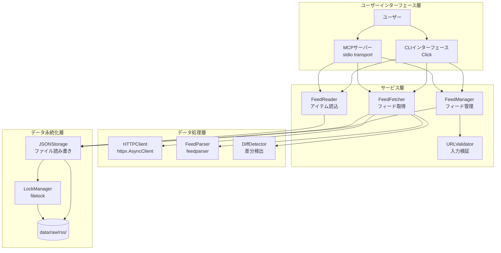
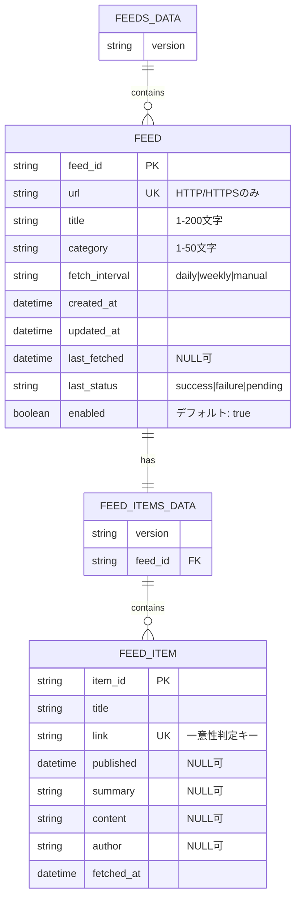
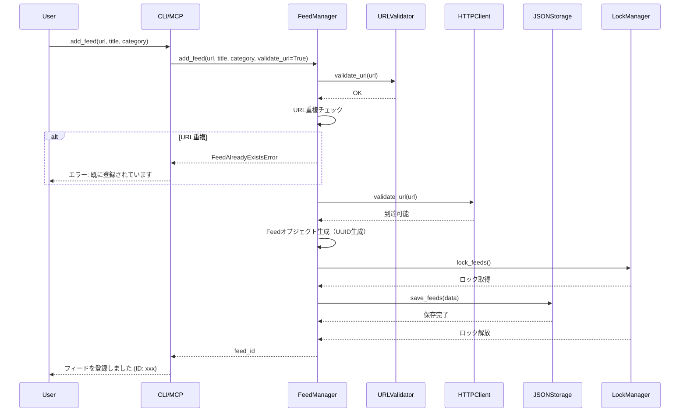
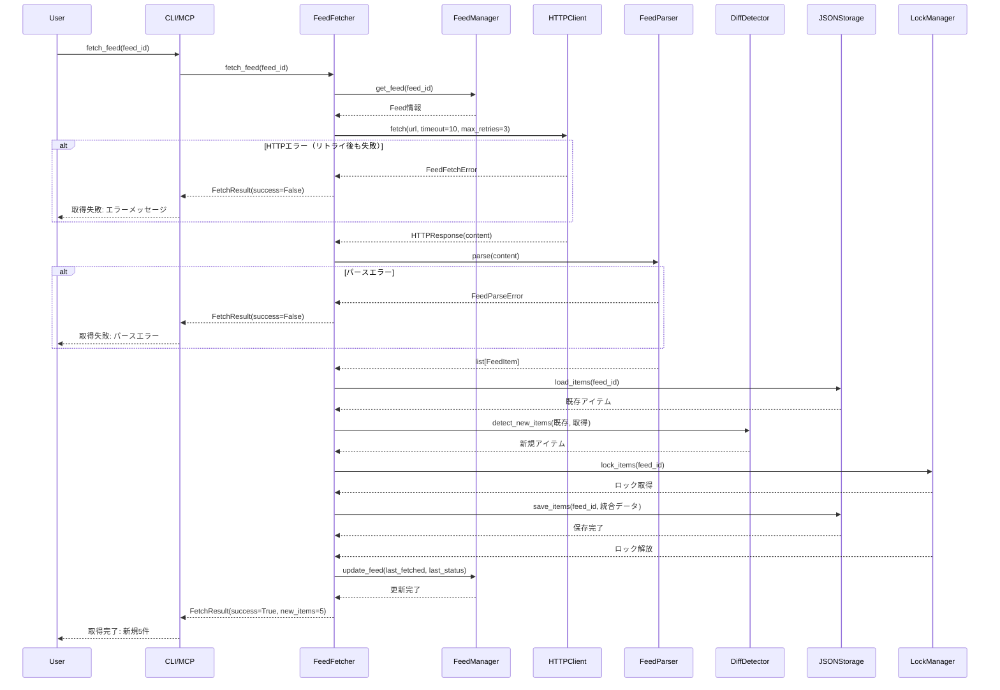
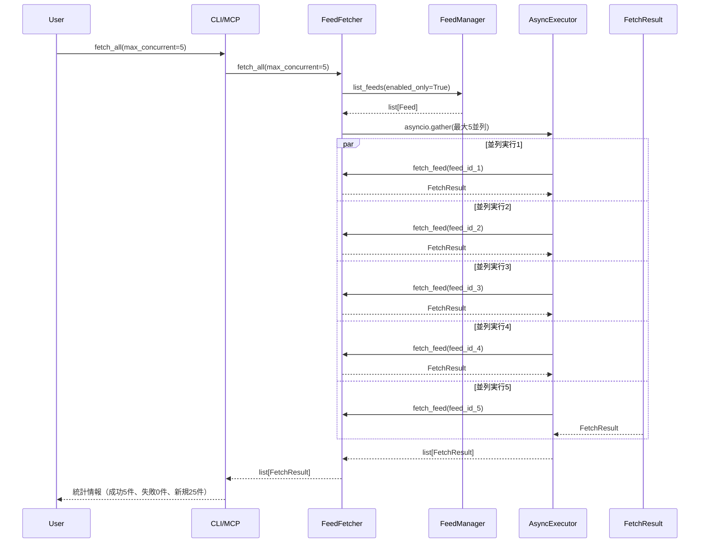
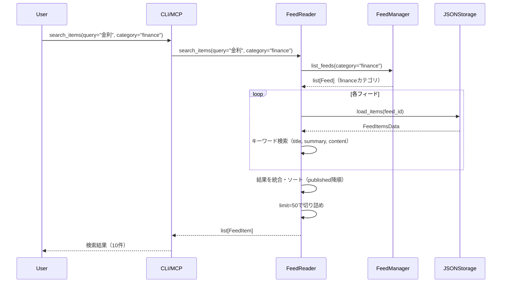

# 機能設計書 (Functional Design Document)

## システム構成図



## 技術スタック

| 分類 | 技術 | 選定理由 |
|------|------|----------|
| 言語 | Python 3.12+ | 型ヒント改善、パターンマッチング |
| HTTPクライアント | httpx 0.27.0+ | 非同期対応、HTTP/2サポート |
| RSSパーサー | feedparser 6.0.0+ | RSS 2.0/Atom対応、実績豊富 |
| ファイルロック | filelock 3.20.0+ | クロスプラットフォーム対応 |
| ロギング | structlog 25.4.0+ | 構造化ロギング（financeパッケージから継承） |
| MCPプロトコル | mcp 0.9.0+ | Claude Code連携（オプション） |
| スケジューラー | APScheduler 3.10.0+ | 日次バッチ実行（オプション） |
| CLI | click 8.1.0+ | サブコマンド対応（オプション） |
| パッケージ管理 | uv | 高速、統合されたツール |
| リント・フォーマット | Ruff | 高速、多機能 |
| 型チェック | pyright | 厳密な型チェック |
| テスト | pytest + Hypothesis | 標準的、プロパティベーステスト |

## データモデル定義

### エンティティ: Feed（フィード情報）

```python
from dataclasses import dataclass
from datetime import datetime
from enum import Enum


class FetchInterval(str, Enum):
    """フィード取得間隔"""
    DAILY = "daily"
    WEEKLY = "weekly"
    MANUAL = "manual"


class FetchStatus(str, Enum):
    """フィード取得ステータス"""
    SUCCESS = "success"
    FAILURE = "failure"
    PENDING = "pending"


@dataclass
class Feed:
    """フィード情報モデル"""
    feed_id: str                    # UUID v4形式
    url: str                        # HTTP/HTTPSスキーマのみ許可
    title: str                      # 1-200文字
    category: str                   # カテゴリ名（例: finance, economics）
    fetch_interval: FetchInterval   # 取得間隔
    created_at: datetime            # 作成日時（ISO 8601形式）
    updated_at: datetime            # 更新日時（ISO 8601形式）
    last_fetched: datetime | None   # 最終取得日時（初期はNone）
    last_status: FetchStatus        # 最終取得ステータス（初期はpending）
    enabled: bool                   # 有効/無効フラグ（デフォルト: True）
```

**制約**:
- `feed_id`: UUID v4形式、自動生成
- `url`: HTTP/HTTPSスキーマのみ許可、同一URL重複不可
- `title`: 1-200文字
- `category`: 1-50文字
- `enabled`: デフォルト `True`
- `last_status`: 初期値 `pending`

### エンティティ: FeedItem（フィードアイテム）

```python
@dataclass
class FeedItem:
    """フィードアイテムモデル"""
    item_id: str                    # UUID v4形式
    title: str                      # 記事タイトル
    link: str                       # 記事URL（一意性の判定に使用）
    published: datetime | None      # 公開日時（フィードに存在しない場合はNone）
    summary: str | None             # 記事の要約（オプション）
    content: str | None             # 本文（オプション）
    author: str | None              # 著者名（オプション）
    fetched_at: datetime            # 取得日時
```

**制約**:
- `item_id`: UUID v4形式、自動生成
- `link`: 一意性の判定キー（同一フィード内で重複不可）
- `published`: フィードに含まれない場合は `None`
- `summary`, `content`, `author`: オプション項目

### エンティティ: FeedsData（フィード管理マスター）

```python
@dataclass
class FeedsData:
    """フィード管理マスターデータ"""
    version: str                    # データフォーマットバージョン（現在: "1.0"）
    feeds: list[Feed]               # フィード情報リスト
```

**JSON保存形式**:
```json
{
  "version": "1.0",
  "feeds": [
    {
      "feed_id": "550e8400-e29b-41d4-a716-446655440000",
      "url": "https://example.com/feed.xml",
      "title": "Example Feed",
      "category": "finance",
      "fetch_interval": "daily",
      "created_at": "2026-01-14T10:00:00Z",
      "updated_at": "2026-01-14T10:00:00Z",
      "last_fetched": "2026-01-14T10:00:00Z",
      "last_status": "success",
      "enabled": true
    }
  ]
}
```

### エンティティ: FeedItemsData（フィードアイテム保存）

```python
@dataclass
class FeedItemsData:
    """フィードアイテムデータ"""
    version: str                    # データフォーマットバージョン（現在: "1.0"）
    feed_id: str                    # 所属するフィードのID
    items: list[FeedItem]           # アイテムリスト
```

**JSON保存形式**:
```json
{
  "version": "1.0",
  "feed_id": "550e8400-e29b-41d4-a716-446655440000",
  "items": [
    {
      "item_id": "660e8400-e29b-41d4-a716-446655440001",
      "title": "Article Title",
      "link": "https://example.com/article",
      "published": "2026-01-14T09:00:00Z",
      "summary": "Article summary...",
      "content": "Full content...",
      "author": "Author Name",
      "fetched_at": "2026-01-14T10:00:00Z"
    }
  ]
}
```

### ER図



## コンポーネント設計

### FeedManager（フィード管理サービス）

**責務**:
- フィード情報の登録、更新、削除
- フィード一覧の取得
- フィード情報のバリデーション
- feeds.jsonの読み書き

**インターフェース**:
```python
from abc import ABC, abstractmethod


class IFeedManager(ABC):
    """フィード管理インターフェース"""

    @abstractmethod
    def add_feed(
        self,
        url: str,
        title: str,
        category: str,
        fetch_interval: FetchInterval = FetchInterval.DAILY,
        validate_url: bool = True,
    ) -> str:
        """
        フィードを登録する

        Parameters
        ----------
        url : str
            フィードURL（HTTP/HTTPSのみ）
        title : str
            フィードタイトル（1-200文字）
        category : str
            カテゴリ名（1-50文字）
        fetch_interval : FetchInterval, default=FetchInterval.DAILY
            取得間隔
        validate_url : bool, default=True
            URL到達性を確認するか

        Returns
        -------
        str
            生成されたフィードID

        Raises
        ------
        InvalidURLError
            URLが不正な形式
        FeedAlreadyExistsError
            同一URLが既に登録されている
        FeedFetchError
            validate_url=Trueで、URLに到達できない
        """
        pass

    @abstractmethod
    def list_feeds(
        self,
        category: str | None = None,
        enabled_only: bool = True,
    ) -> list[Feed]:
        """
        フィード一覧を取得する

        Parameters
        ----------
        category : str | None, default=None
            カテゴリフィルタ（Noneの場合は全カテゴリ）
        enabled_only : bool, default=True
            有効なフィードのみ取得するか

        Returns
        -------
        list[Feed]
            フィード情報リスト
        """
        pass

    @abstractmethod
    def get_feed(self, feed_id: str) -> Feed:
        """
        指定されたフィードを取得する

        Parameters
        ----------
        feed_id : str
            フィードID

        Returns
        -------
        Feed
            フィード情報

        Raises
        ------
        FeedNotFoundError
            フィードが見つからない
        """
        pass

    @abstractmethod
    def update_feed(
        self,
        feed_id: str,
        title: str | None = None,
        category: str | None = None,
        fetch_interval: FetchInterval | None = None,
        enabled: bool | None = None,
    ) -> Feed:
        """
        フィード情報を更新する

        Parameters
        ----------
        feed_id : str
            フィードID
        title : str | None, default=None
            新しいタイトル（Noneの場合は変更なし）
        category : str | None, default=None
            新しいカテゴリ（Noneの場合は変更なし）
        fetch_interval : FetchInterval | None, default=None
            新しい取得間隔（Noneの場合は変更なし）
        enabled : bool | None, default=None
            有効/無効フラグ（Noneの場合は変更なし）

        Returns
        -------
        Feed
            更新後のフィード情報

        Raises
        ------
        FeedNotFoundError
            フィードが見つからない
        """
        pass

    @abstractmethod
    def remove_feed(self, feed_id: str) -> None:
        """
        フィードを削除する

        Parameters
        ----------
        feed_id : str
            フィードID

        Raises
        ------
        FeedNotFoundError
            フィードが見つからない
        """
        pass
```

**依存関係**:
- `JSONStorage`: feeds.jsonの読み書き
- `URLValidator`: URLバリデーション
- `HTTPClient`: URL到達性確認（validate_url=Trueの場合）
- `LockManager`: ファイルロック制御

### FeedFetcher（フィード取得サービス）

**責務**:
- HTTP/HTTPS経由でのフィード取得
- RSS/Atomパース処理
- 差分検出（重複排除）
- items.jsonへの保存
- リトライ機構の実装

**インターフェース**:
```python
from dataclasses import dataclass


@dataclass
class FetchResult:
    """フィード取得結果"""
    feed_id: str
    success: bool
    items_count: int            # 取得したアイテム総数
    new_items: int              # 新規アイテム数
    error_message: str | None   # エラーメッセージ（成功時はNone）


class IFeedFetcher(ABC):
    """フィード取得インターフェース"""

    @abstractmethod
    def fetch_feed(self, feed_id: str) -> FetchResult:
        """
        指定されたフィードを取得する

        Parameters
        ----------
        feed_id : str
            フィードID

        Returns
        -------
        FetchResult
            取得結果

        Raises
        ------
        FeedNotFoundError
            フィードが見つからない
        """
        pass

    @abstractmethod
    def fetch_all(
        self,
        category: str | None = None,
        max_concurrent: int = 5,
    ) -> list[FetchResult]:
        """
        全フィードを取得する（並列実行）

        Parameters
        ----------
        category : str | None, default=None
            カテゴリフィルタ（Noneの場合は全カテゴリ）
        max_concurrent : int, default=5
            最大並列実行数（1-10）

        Returns
        -------
        list[FetchResult]
            取得結果リスト
        """
        pass

    @abstractmethod
    async def fetch_all_async(
        self,
        category: str | None = None,
        max_concurrent: int = 5,
    ) -> list[FetchResult]:
        """
        全フィードを非同期で取得する

        Parameters
        ----------
        category : str | None, default=None
            カテゴリフィルタ（Noneの場合は全カテゴリ）
        max_concurrent : int, default=5
            最大並列実行数（1-10）

        Returns
        -------
        list[FetchResult]
            取得結果リスト
        """
        pass
```

**依存関係**:
- `FeedManager`: フィード情報取得
- `HTTPClient`: HTTP/HTTPS取得
- `FeedParser`: RSS/Atomパース
- `DiffDetector`: 差分検出
- `JSONStorage`: items.jsonの読み書き
- `LockManager`: ファイルロック制御

### FeedReader（アイテム読込サービス）

**責務**:
- items.jsonからのアイテム読込
- キーワード検索
- フィルタリング（カテゴリ、日付範囲）
- ページネーション

**インターフェース**:
```python
class IFeedReader(ABC):
    """アイテム読込インターフェース"""

    @abstractmethod
    def get_items(
        self,
        feed_id: str | None = None,
        limit: int = 10,
        offset: int = 0,
    ) -> list[FeedItem]:
        """
        アイテムを取得する

        Parameters
        ----------
        feed_id : str | None, default=None
            フィードID（Noneの場合は全フィード）
        limit : int, default=10
            取得件数
        offset : int, default=0
            オフセット

        Returns
        -------
        list[FeedItem]
            アイテムリスト（published降順）
        """
        pass

    @abstractmethod
    def search_items(
        self,
        query: str,
        category: str | None = None,
        fields: list[str] | None = None,
        limit: int = 50,
    ) -> list[FeedItem]:
        """
        キーワード検索でアイテムを取得する

        Parameters
        ----------
        query : str
            検索クエリ（部分一致）
        category : str | None, default=None
            カテゴリフィルタ（Noneの場合は全カテゴリ）
        fields : list[str] | None, default=None
            検索対象フィールド（デフォルト: ["title", "summary", "content"]）
        limit : int, default=50
            取得件数

        Returns
        -------
        list[FeedItem]
            検索結果リスト（published降順）
        """
        pass
```

**依存関係**:
- `JSONStorage`: items.jsonの読み込み
- `FeedManager`: カテゴリフィルタリング用のフィード情報取得

### HTTPClient（HTTP通信）

**責務**:
- HTTP/HTTPS経由でのフィード取得
- タイムアウト制御
- リトライ機構（指数バックオフ）
- User-Agent設定

**インターフェース**:
```python
@dataclass
class HTTPResponse:
    """HTTP レスポンス"""
    status_code: int
    content: bytes
    headers: dict[str, str]


class IHTTPClient(ABC):
    """HTTP クライアントインターフェース"""

    @abstractmethod
    async def fetch(
        self,
        url: str,
        timeout: int = 10,
        max_retries: int = 3,
    ) -> HTTPResponse:
        """
        URLからコンテンツを取得する

        Parameters
        ----------
        url : str
            取得するURL
        timeout : int, default=10
            タイムアウト時間（秒）
        max_retries : int, default=3
            最大リトライ回数

        Returns
        -------
        HTTPResponse
            HTTPレスポンス

        Raises
        ------
        FeedFetchError
            取得に失敗（リトライ後も失敗）
        """
        pass

    @abstractmethod
    async def validate_url(self, url: str, timeout: int = 10) -> bool:
        """
        URLの到達性を確認する

        Parameters
        ----------
        url : str
            確認するURL
        timeout : int, default=10
            タイムアウト時間（秒）

        Returns
        -------
        bool
            到達可能な場合True
        """
        pass
```

**依存関係**:
- `httpx.AsyncClient`: 非同期HTTPクライアント

**リトライ機構**:
- 対象エラー: タイムアウト、接続エラー、5xxエラー
- 対象外エラー: 4xxエラー（404等）
- リトライ間隔: 指数バックオフ（1秒、2秒、4秒）
- ログレベル: WARNING（リトライ時）、ERROR（最終失敗時）

### FeedParser（RSS/Atomパース）

**責務**:
- feedparserを使用したパース処理
- RSS 2.0 / Atom両対応
- 統一データ構造への変換
- パースエラーハンドリング

**インターフェース**:
```python
class IFeedParser(ABC):
    """フィードパーサーインターフェース"""

    @abstractmethod
    def parse(self, content: bytes) -> list[FeedItem]:
        """
        フィードコンテンツをパースする

        Parameters
        ----------
        content : bytes
            フィードコンテンツ（XML）

        Returns
        -------
        list[FeedItem]
            パース結果のアイテムリスト

        Raises
        ------
        FeedParseError
            パースに失敗
        """
        pass
```

**依存関係**:
- `feedparser`: RSS/Atomパーサー

### DiffDetector（差分検出）

**責務**:
- 既存アイテムとの差分検出
- 一意性判定（linkベース）
- 新規アイテム抽出

**インターフェース**:
```python
class IDiffDetector(ABC):
    """差分検出インターフェース"""

    @abstractmethod
    def detect_new_items(
        self,
        existing_items: list[FeedItem],
        fetched_items: list[FeedItem],
    ) -> list[FeedItem]:
        """
        新規アイテムを検出する

        Parameters
        ----------
        existing_items : list[FeedItem]
            既存アイテムリスト
        fetched_items : list[FeedItem]
            取得したアイテムリスト

        Returns
        -------
        list[FeedItem]
            新規アイテムリスト
        """
        pass
```

**依存関係**: なし

### JSONStorage（JSON永続化）

**責務**:
- feeds.json、items.jsonの読み書き
- UTF-8エンコーディング
- インデント付きJSON生成
- ディレクトリ自動生成

**インターフェース**:
```python
from pathlib import Path
from typing import TypeVar

T = TypeVar("T")


class IJSONStorage(ABC):
    """JSON ストレージインターフェース"""

    @abstractmethod
    def save_feeds(self, data: FeedsData) -> None:
        """
        フィードマスターを保存する

        Parameters
        ----------
        data : FeedsData
            保存するフィードデータ
        """
        pass

    @abstractmethod
    def load_feeds(self) -> FeedsData:
        """
        フィードマスターを読み込む

        Returns
        -------
        FeedsData
            フィードデータ（ファイルが存在しない場合は空データ）
        """
        pass

    @abstractmethod
    def save_items(self, feed_id: str, data: FeedItemsData) -> None:
        """
        フィードアイテムを保存する

        Parameters
        ----------
        feed_id : str
            フィードID
        data : FeedItemsData
            保存するアイテムデータ
        """
        pass

    @abstractmethod
    def load_items(self, feed_id: str) -> FeedItemsData:
        """
        フィードアイテムを読み込む

        Parameters
        ----------
        feed_id : str
            フィードID

        Returns
        -------
        FeedItemsData
            アイテムデータ（ファイルが存在しない場合は空データ）
        """
        pass
```

**依存関係**:
- `LockManager`: ファイルロック制御

### LockManager（ファイルロック）

**責務**:
- filelockを使用したファイルロック制御
- タイムアウト管理
- クロスプラットフォーム対応

**インターフェース**:
```python
from contextlib import contextmanager
from typing import Generator


class ILockManager(ABC):
    """ロック管理インターフェース"""

    @abstractmethod
    @contextmanager
    def lock_feeds(self, timeout: int = 10) -> Generator[None, None, None]:
        """
        feeds.jsonをロックする

        Parameters
        ----------
        timeout : int, default=10
            タイムアウト時間（秒）

        Yields
        ------
        None

        Raises
        ------
        FileLockError
            ロック取得に失敗
        """
        pass

    @abstractmethod
    @contextmanager
    def lock_items(
        self,
        feed_id: str,
        timeout: int = 10,
    ) -> Generator[None, None, None]:
        """
        items.jsonをロックする

        Parameters
        ----------
        feed_id : str
            フィードID
        timeout : int, default=10
            タイムアウト時間（秒）

        Yields
        ------
        None

        Raises
        ------
        FileLockError
            ロック取得に失敗
        """
        pass
```

**依存関係**:
- `filelock`: ファイルロックライブラリ

### URLValidator（入力検証）

**責務**:
- URL形式検証
- HTTP/HTTPSスキーマチェック
- 文字列長検証

**インターフェース**:
```python
class IURLValidator(ABC):
    """URL バリデーターインターフェース"""

    @abstractmethod
    def validate_url(self, url: str) -> bool:
        """
        URLの形式を検証する

        Parameters
        ----------
        url : str
            検証するURL

        Returns
        -------
        bool
            有効な場合True

        Raises
        ------
        InvalidURLError
            URLが不正な形式
        """
        pass

    @abstractmethod
    def validate_title(self, title: str) -> bool:
        """
        タイトルの長さを検証する

        Parameters
        ----------
        title : str
            検証するタイトル

        Returns
        -------
        bool
            有効な場合True

        Raises
        ------
        ValueError
            タイトルが1-200文字の範囲外
        """
        pass

    @abstractmethod
    def validate_category(self, category: str) -> bool:
        """
        カテゴリ名の長さを検証する

        Parameters
        ----------
        category : str
            検証するカテゴリ名

        Returns
        -------
        bool
            有効な場合True

        Raises
        ------
        ValueError
            カテゴリ名が1-50文字の範囲外
        """
        pass
```

**依存関係**: なし

## ユースケース図

### ユースケース1: フィード登録



**フロー説明**:
1. ユーザーがCLI/MCP経由でフィード登録を実行
2. URLValidatorでURL形式を検証
3. FeedManagerで同一URL重複をチェック（重複時はエラー）
4. HTTPClientでURL到達性を確認（validate_url=Trueの場合）
5. Feedオブジェクトを生成（UUID自動生成）
6. LockManagerでfeeds.jsonをロック
7. JSONStorageに保存
8. ロック解放
9. 生成されたfeed_idを返す

### ユースケース2: フィード取得（単一）



**フロー説明**:
1. ユーザーがCLI/MCP経由でフィード取得を実行
2. FeedManagerからフィード情報を取得
3. HTTPClientでフィードコンテンツを取得（リトライ機構付き）
4. FeedParserでRSS/Atomをパース
5. JSONStorageから既存アイテムを読込
6. DiffDetectorで新規アイテムを検出
7. LockManagerでitems.jsonをロック
8. 既存アイテムと新規アイテムを統合して保存
9. ロック解放
10. FeedManagerでlast_fetched、last_statusを更新
11. 取得結果を返す

### ユースケース3: 全フィード取得（並列）



**フロー説明**:
1. ユーザーがCLI/MCP経由で全フィード取得を実行
2. FeedManagerから有効なフィード一覧を取得
3. asyncio.gather()で最大5フィードを並列実行
4. 各フィードの取得結果を収集
5. 統計情報（成功数、失敗数、新規アイテム数）を返す

### ユースケース4: アイテム検索



**フロー説明**:
1. ユーザーがCLI/MCP経由でキーワード検索を実行
2. FeedManagerから指定カテゴリのフィード一覧を取得
3. 各フィードのitems.jsonを読み込み
4. title, summary, contentフィールドでキーワード検索（部分一致）
5. 検索結果を統合し、published降順でソート
6. limit件数で切り詰めて返す

## ファイル構造

**データ保存形式**:
```
data/raw/rss/
├── feeds.json                          # フィード管理マスター
├── .feeds.lock                         # feeds.json用ファイルロック
├── 550e8400-e29b-41d4-a716-446655440000/
│   ├── items.json                      # フィードアイテム
│   └── .items.lock                     # items.json用ファイルロック
└── 660e8400-e29b-41d4-a716-446655440001/
    ├── items.json
    └── .items.lock
```

**ディレクトリ自動生成**:
- `data/raw/rss/`: 初回保存時に自動生成
- `{feed_id}/`: フィードアイテム保存時に自動生成
- `.feeds.lock`, `.items.lock`: LockManagerが自動生成

## パフォーマンス最適化

### 並列フィード取得

**実装方法**:
- `httpx.AsyncClient`を使用した非同期HTTP取得
- `asyncio.gather()`で並列実行
- セマフォで同時実行数を制御（デフォルト5、最大10）

**実装例**:
```python
import asyncio
from httpx import AsyncClient


class FeedFetcher:
    async def fetch_all_async(
        self,
        category: str | None = None,
        max_concurrent: int = 5,
    ) -> list[FetchResult]:
        feeds = self.manager.list_feeds(category=category, enabled_only=True)
        semaphore = asyncio.Semaphore(max_concurrent)

        async def fetch_with_semaphore(feed_id: str) -> FetchResult:
            async with semaphore:
                return await self._fetch_feed_async(feed_id)

        tasks = [fetch_with_semaphore(feed.feed_id) for feed in feeds]
        return await asyncio.gather(*tasks, return_exceptions=False)
```

### JSON読み込みの最適化

**キャッシュ戦略**:
- feeds.jsonは初回読み込み時にメモリキャッシュ（変更時は無効化）
- items.jsonはファイルサイズが大きいため都度読み込み

**遅延読み込み**:
- `FeedReader.search_items()`は該当カテゴリのitems.jsonのみ読み込み
- 全フィード検索時は順次読み込み（メモリ効率優先）

### ファイルロック最適化

**粒度**:
- feeds.json: 全体ロック（頻度低、影響範囲大）
- items.json: フィードIDごとに個別ロック（頻度高、影響範囲小）

**タイムアウト**:
- デフォルト10秒（設定可能）
- タイムアウト時はFileLockErrorを発生

## セキュリティ考慮事項

### HTTPS証明書検証

**実装**:
- `httpx.AsyncClient(verify=True)`: 証明書検証を有効化
- 自己署名証明書は拒否

### User-Agent設定

**実装**:
- デフォルト: `"rss-feed-collector/0.1.0"`
- サーバー側でのアクセス制御・レート制限に対応

### タイムアウト設定

**実装**:
- デフォルト: 10秒
- DoS攻撃対策（長時間待機を防止）

### 入力検証

**実装**:
- URLスキーマ検証: HTTP/HTTPSのみ許可
- 文字列長検証: title (1-200文字), category (1-50文字)
- JSON構造検証: 読み込み時にバージョンチェック

## エラーハンドリング

### カスタム例外クラス

```python
class RSSError(Exception):
    """RSS パッケージの基底例外"""
    pass


class FeedNotFoundError(RSSError):
    """フィードが見つからない"""
    pass


class FeedAlreadyExistsError(RSSError):
    """フィードが既に存在する"""
    pass


class FeedFetchError(RSSError):
    """フィード取得に失敗"""
    pass


class FeedParseError(RSSError):
    """フィードのパースに失敗"""
    pass


class InvalidURLError(RSSError):
    """無効なURL形式"""
    pass


class FileLockError(RSSError):
    """ファイルロック取得に失敗"""
    pass
```

### エラーの分類

| エラー種別 | 処理 | ユーザーへの表示 | ログレベル |
|-----------|------|-----------------|-----------|
| FeedNotFoundError | 処理を中断 | "フィードが見つかりません (ID: xxx)" | ERROR |
| FeedAlreadyExistsError | 処理を中断 | "このURLは既に登録されています: xxx" | WARNING |
| FeedFetchError | リトライ後も失敗時に中断 | "フィード取得に失敗しました: xxx" | ERROR |
| FeedParseError | 処理を中断 | "フィードのパースに失敗しました: xxx" | ERROR |
| InvalidURLError | 処理を中断 | "無効なURL形式です: xxx" | WARNING |
| FileLockError | 処理を中断 | "ファイルロックの取得に失敗しました: xxx" | ERROR |

### HTTPエラーの分類

| HTTPステータス | リトライ | 処理 | ユーザーへの表示 |
|--------------|---------|------|-----------------|
| 200-299 | - | 正常処理 | - |
| 404 | なし | 処理を中断 | "フィードが見つかりません (404)" |
| 400-499（404以外） | なし | 処理を中断 | "クライアントエラー (xxx)" |
| 500-599 | あり（最大3回） | リトライ後も失敗時に中断 | "サーバーエラー (xxx)" |
| タイムアウト | あり（最大3回） | リトライ後も失敗時に中断 | "接続タイムアウト" |
| 接続エラー | あり（最大3回） | リトライ後も失敗時に中断 | "接続エラー: xxx" |

### ロギング方針

**ログレベル**:
- DEBUG: HTTP取得開始、パース開始
- INFO: フィード取得成功、アイテム保存完了、バッチ実行開始/終了
- WARNING: リトライ実行、URL重複検出
- ERROR: 取得失敗、パースエラー、ファイルロックエラー

**構造化ロギング例**:
```python
from finance.utils.logging_config import get_logger

logger = get_logger(__name__)

# 成功
logger.info(
    "Feed fetched successfully",
    feed_id=feed_id,
    url=url,
    items_count=10,
    new_items=5,
)

# リトライ
logger.warning(
    "Retrying feed fetch",
    feed_id=feed_id,
    url=url,
    attempt=2,
    max_retries=3,
    error=str(e),
)

# エラー
logger.error(
    "Failed to fetch feed",
    feed_id=feed_id,
    url=url,
    error=str(e),
    exc_info=True,
)
```

## テスト戦略

### ユニットテスト

**対象**:
- URLValidator: URL形式検証、文字列長検証
- DiffDetector: 差分検出ロジック
- FeedParser: RSS 2.0/Atomパース処理
- LockManager: ファイルロック取得・解放
- JSONStorage: JSON読み書き

**テストケース例**:
```python
# URLValidator
def test_validate_url_with_valid_https():
    """HTTPS URLは検証を通過する"""
    validator = URLValidator()
    assert validator.validate_url("https://example.com/feed.xml") is True


def test_validate_url_with_invalid_schema():
    """HTTP/HTTPS以外は InvalidURLError を発生させる"""
    validator = URLValidator()
    with pytest.raises(InvalidURLError):
        validator.validate_url("ftp://example.com/feed.xml")


def test_validate_title_with_long_string():
    """200文字超のタイトルは ValueError を発生させる"""
    validator = URLValidator()
    with pytest.raises(ValueError):
        validator.validate_title("a" * 201)
```

### 統合テスト

**対象**:
- フィード登録 → 取得 → アイテム保存 → 検索のフルフロー
- 並列フィード取得
- ファイルロック競合のシミュレーション

**テストケース例**:
```python
# フルフロー
def test_full_flow_add_fetch_search(tmp_path):
    """フィード登録 → 取得 → 検索のフルフローが動作する"""
    # モックHTTPサーバーでRSSフィードを提供
    with mock_rss_server() as server_url:
        manager = FeedManager(data_dir=tmp_path)
        fetcher = FeedFetcher(manager)
        reader = FeedReader(data_dir=tmp_path)

        # フィード登録
        feed_id = manager.add_feed(
            url=f"{server_url}/feed.xml",
            title="Test Feed",
            category="finance",
            validate_url=False,  # モックサーバーなので検証スキップ
        )

        # フィード取得
        result = fetcher.fetch_feed(feed_id)
        assert result.success is True
        assert result.new_items == 10

        # アイテム検索
        items = reader.search_items(query="金利", category="finance")
        assert len(items) > 0
```

### プロパティテスト（Hypothesis）

**対象**:
- FeedParser: 不正なXML/HTMLへの対処
- DiffDetector: 任意のアイテムリストで差分検出が正常動作

**テストケース例**:
```python
from hypothesis import given, strategies as st


@given(st.text(min_size=1, max_size=200))
def test_validate_title_with_random_string(title: str):
    """任意の1-200文字文字列は検証を通過する"""
    validator = URLValidator()
    assert validator.validate_title(title) is True


@given(st.lists(st.text()))
def test_diff_detector_with_random_items(links: list[str]):
    """任意のリンクリストで差分検出が正常動作する"""
    existing = [FeedItem(item_id=str(i), link=link, ...) for i, link in enumerate(links[:10])]
    fetched = [FeedItem(item_id=str(i), link=link, ...) for i, link in enumerate(links)]

    detector = DiffDetector()
    new_items = detector.detect_new_items(existing, fetched)

    # 新規アイテムは既存に含まれないリンクのみ
    new_links = {item.link for item in new_items}
    existing_links = {item.link for item in existing}
    assert new_links.isdisjoint(existing_links)
```

### E2Eテスト（モックサーバー使用）

**対象**:
- 実フィード形式（RSS 2.0, Atom）のパース
- HTTP/HTTPSエラーハンドリング
- リトライ機構の動作

**テストケース例**:
```python
import httpx
from pytest_httpserver import HTTPServer


def test_fetch_with_retry_on_500_error(httpserver: HTTPServer):
    """500エラー時にリトライが動作する"""
    httpserver.expect_request("/feed.xml").respond_with_data(
        status=500,
        response_data="Internal Server Error",
    )
    httpserver.expect_request("/feed.xml").respond_with_data(
        status=500,
        response_data="Internal Server Error",
    )
    httpserver.expect_request("/feed.xml").respond_with_data(
        status=200,
        response_data="<rss>...</rss>",
        content_type="application/rss+xml",
    )

    client = HTTPClient()
    response = await client.fetch(httpserver.url_for("/feed.xml"))
    assert response.status_code == 200
```

## MCP統合設計（P1機能）

### MCPツール定義

**提供ツール**:
1. `rss_list_feeds`: 登録済みフィード一覧を取得
2. `rss_get_items`: 指定フィードの最新アイテムを取得
3. `rss_search_items`: キーワード検索でアイテムを取得
4. `rss_add_feed`: 新規フィードを登録
5. `rss_update_feed`: フィード情報を更新
6. `rss_remove_feed`: フィードを削除
7. `rss_fetch_feed`: 指定フィードを即座に取得

### MCPツール仕様

#### rss_list_feeds

**説明**: 登録済みRSSフィードの一覧を取得します

**入力スキーマ**:
```json
{
  "type": "object",
  "properties": {
    "category": {
      "type": "string",
      "description": "カテゴリフィルタ（省略時は全カテゴリ）"
    },
    "enabled_only": {
      "type": "boolean",
      "description": "有効なフィードのみ取得するか（デフォルト: true）",
      "default": true
    }
  }
}
```

**出力例**:
```json
{
  "feeds": [
    {
      "feed_id": "550e8400-e29b-41d4-a716-446655440000",
      "url": "https://example.com/feed.xml",
      "title": "Example Feed",
      "category": "finance",
      "fetch_interval": "daily",
      "last_fetched": "2026-01-14T10:00:00Z",
      "last_status": "success"
    }
  ],
  "total": 1
}
```

#### rss_get_items

**説明**: 指定されたRSSフィードから最新アイテムを取得します

**入力スキーマ**:
```json
{
  "type": "object",
  "properties": {
    "feed_id": {
      "type": "string",
      "description": "フィードID（省略時は全フィード）"
    },
    "limit": {
      "type": "integer",
      "description": "取得するアイテム数（デフォルト: 10）",
      "default": 10
    },
    "offset": {
      "type": "integer",
      "description": "オフセット（デフォルト: 0）",
      "default": 0
    }
  }
}
```

**出力例**:
```json
{
  "items": [
    {
      "item_id": "660e8400-e29b-41d4-a716-446655440001",
      "feed_id": "550e8400-e29b-41d4-a716-446655440000",
      "feed_title": "Example Feed",
      "title": "記事タイトル",
      "link": "https://example.com/article",
      "published": "2026-01-14T09:00:00Z",
      "summary": "記事の要約...",
      "author": "著者名",
      "fetched_at": "2026-01-14T10:00:00Z"
    }
  ],
  "total": 100
}
```

#### rss_search_items

**説明**: キーワード検索でRSSアイテムを取得します

**入力スキーマ**:
```json
{
  "type": "object",
  "properties": {
    "query": {
      "type": "string",
      "description": "検索クエリ（部分一致）"
    },
    "category": {
      "type": "string",
      "description": "カテゴリフィルタ（省略時は全カテゴリ）"
    },
    "fields": {
      "type": "array",
      "items": {"type": "string"},
      "description": "検索対象フィールド（デフォルト: [\"title\", \"summary\", \"content\"]）"
    },
    "limit": {
      "type": "integer",
      "description": "取得件数（デフォルト: 50）",
      "default": 50
    }
  },
  "required": ["query"]
}
```

**出力例**: `rss_get_items`と同じ

#### rss_add_feed

**説明**: 新規RSSフィードを登録します

**入力スキーマ**:
```json
{
  "type": "object",
  "properties": {
    "url": {
      "type": "string",
      "description": "フィードURL（HTTP/HTTPSのみ）"
    },
    "title": {
      "type": "string",
      "description": "フィードタイトル（1-200文字）"
    },
    "category": {
      "type": "string",
      "description": "カテゴリ名（1-50文字）"
    },
    "fetch_interval": {
      "type": "string",
      "enum": ["daily", "weekly", "manual"],
      "description": "取得間隔（デフォルト: daily）",
      "default": "daily"
    },
    "validate_url": {
      "type": "boolean",
      "description": "URL到達性を確認するか（デフォルト: true）",
      "default": true
    }
  },
  "required": ["url", "title", "category"]
}
```

**出力例**:
```json
{
  "feed_id": "550e8400-e29b-41d4-a716-446655440000",
  "message": "フィードを登録しました"
}
```

#### rss_update_feed

**説明**: RSSフィード情報を更新します

**入力スキーマ**:
```json
{
  "type": "object",
  "properties": {
    "feed_id": {
      "type": "string",
      "description": "フィードID"
    },
    "title": {
      "type": "string",
      "description": "新しいタイトル（省略可）"
    },
    "category": {
      "type": "string",
      "description": "新しいカテゴリ（省略可）"
    },
    "fetch_interval": {
      "type": "string",
      "enum": ["daily", "weekly", "manual"],
      "description": "新しい取得間隔（省略可）"
    },
    "enabled": {
      "type": "boolean",
      "description": "有効/無効フラグ（省略可）"
    }
  },
  "required": ["feed_id"]
}
```

**出力例**:
```json
{
  "message": "フィード情報を更新しました"
}
```

#### rss_remove_feed

**説明**: RSSフィードを削除します

**入力スキーマ**:
```json
{
  "type": "object",
  "properties": {
    "feed_id": {
      "type": "string",
      "description": "フィードID"
    }
  },
  "required": ["feed_id"]
}
```

**出力例**:
```json
{
  "message": "フィードを削除しました"
}
```

#### rss_fetch_feed

**説明**: 指定されたRSSフィードを即座に取得します

**入力スキーマ**:
```json
{
  "type": "object",
  "properties": {
    "feed_id": {
      "type": "string",
      "description": "フィードID（省略時は全フィード）"
    }
  }
}
```

**出力例**:
```json
{
  "success": true,
  "items_count": 10,
  "new_items": 5,
  "message": "フィード取得が完了しました"
}
```

### Claude Code統合方法

**プロジェクトルートで実行**:
```bash
# MCPサーバーを追加
claude mcp add rss -- uvx rss-mcp

# または .mcp.json に手動追加
```

**.mcp.json設定例**:
```json
{
  "mcpServers": {
    "rss": {
      "command": "uvx",
      "args": ["rss-mcp"],
      "env": {
        "RSS_DATA_DIR": "./data/raw/rss"
      }
    }
  }
}
```

### MCPサーバー実装

**エントリーポイント**:
```python
# src/rss/mcp/server.py
import asyncio
from mcp.server import Server
from mcp.server.stdio import stdio_server


async def main():
    server = Server("rss")

    # ツール登録
    @server.list_tools()
    async def list_tools():
        return [
            Tool(name="rss_list_feeds", description="...", inputSchema={...}),
            Tool(name="rss_get_items", description="...", inputSchema={...}),
            # ...
        ]

    # ツール実行
    @server.call_tool()
    async def call_tool(name: str, arguments: dict):
        if name == "rss_list_feeds":
            # FeedManagerを使用してフィード一覧を取得
            ...
        elif name == "rss_get_items":
            # FeedReaderを使用してアイテムを取得
            ...
        # ...

    async with stdio_server() as (read_stream, write_stream):
        await server.run(read_stream, write_stream)


if __name__ == "__main__":
    asyncio.run(main())
```

## CLIインターフェース設計（P1機能）

### コマンド仕様

**エントリーポイント**: `rss-cli`

**サブコマンド**:
- `add`: フィード登録
- `list`: フィード一覧表示
- `update`: フィード情報更新
- `remove`: フィード削除
- `fetch`: フィード取得実行
- `items`: アイテム一覧表示
- `search`: アイテム検索

### CLIコマンド詳細

#### `rss-cli add`

**説明**: 新規フィードを登録する

**使用例**:
```bash
rss-cli add --url https://example.com/feed.xml --title "Example" --category finance
rss-cli add --url https://example.com/feed.xml --title "Example" --category finance --interval weekly
rss-cli add --url https://example.com/feed.xml --title "Example" --category finance --no-validate
```

**オプション**:
- `--url`: フィードURL（必須）
- `--title`: フィードタイトル（必須）
- `--category`: カテゴリ名（必須）
- `--interval`: 取得間隔（daily/weekly/manual、デフォルト: daily）
- `--no-validate`: URL到達性チェックをスキップ

#### `rss-cli list`

**説明**: フィード一覧を表示する

**使用例**:
```bash
rss-cli list
rss-cli list --category finance
rss-cli list --json
rss-cli list --all  # 無効なフィードも表示
```

**オプション**:
- `--category`: カテゴリフィルタ
- `--json`: JSON形式で出力
- `--all`: 無効なフィードも表示

**出力例（テーブル形式）**:
```
┌──────────────────────────────────────┬──────────────────┬──────────┬──────────┬───────────────┐
│ ID                                   │ タイトル          │ カテゴリ  │ 最終取得  │ ステータス     │
├──────────────────────────────────────┼──────────────────┼──────────┼──────────┼───────────────┤
│ 550e8400-e29b-41d4-a716-446655440000 │ Example Feed     │ finance  │ 1/14 10:00│ success       │
└──────────────────────────────────────┴──────────────────┴──────────┴──────────┴───────────────┘
```

#### `rss-cli update`

**説明**: フィード情報を更新する

**使用例**:
```bash
rss-cli update 550e8400-e29b-41d4-a716-446655440000 --title "New Title"
rss-cli update 550e8400-e29b-41d4-a716-446655440000 --category economics --interval weekly
rss-cli update 550e8400-e29b-41d4-a716-446655440000 --disable
```

**オプション**:
- `<feed_id>`: フィードID（必須、位置引数）
- `--title`: 新しいタイトル
- `--category`: 新しいカテゴリ
- `--interval`: 新しい取得間隔
- `--enable` / `--disable`: 有効/無効フラグ

#### `rss-cli remove`

**説明**: フィードを削除する

**使用例**:
```bash
rss-cli remove 550e8400-e29b-41d4-a716-446655440000
rss-cli remove 550e8400-e29b-41d4-a716-446655440000 --force  # 確認なし
```

**オプション**:
- `<feed_id>`: フィードID（必須、位置引数）
- `--force`: 確認プロンプトをスキップ

#### `rss-cli fetch`

**説明**: フィードを取得する

**使用例**:
```bash
rss-cli fetch 550e8400-e29b-41d4-a716-446655440000  # 特定フィード
rss-cli fetch --all  # 全フィード
rss-cli fetch --all --category finance  # 特定カテゴリの全フィード
rss-cli fetch --all --max-concurrent 10  # 並列数指定
```

**オプション**:
- `<feed_id>`: フィードID（位置引数、--allと排他）
- `--all`: 全フィード取得
- `--category`: カテゴリフィルタ（--allと併用）
- `--max-concurrent`: 最大並列実行数（デフォルト: 5）

**出力例**:
```
フィード取得を開始します...
[1/5] Example Feed (finance) ... 成功 (新規5件)
[2/5] Another Feed (economics) ... 成功 (新規3件)
[3/5] Failed Feed (finance) ... 失敗: 接続タイムアウト
[4/5] Third Feed (finance) ... 成功 (新規0件)
[5/5] Fourth Feed (economics) ... 成功 (新規8件)

結果: 成功 4件、失敗 1件、新規アイテム 16件
```

#### `rss-cli items`

**説明**: アイテム一覧を表示する

**使用例**:
```bash
rss-cli items 550e8400-e29b-41d4-a716-446655440000  # 特定フィード
rss-cli items --all  # 全フィード
rss-cli items --all --limit 20  # 件数指定
rss-cli items --all --json  # JSON形式
```

**オプション**:
- `<feed_id>`: フィードID（位置引数、--allと排他）
- `--all`: 全フィード
- `--limit`: 取得件数（デフォルト: 10）
- `--offset`: オフセット（デフォルト: 0）
- `--json`: JSON形式で出力

**出力例（テーブル形式）**:
```
┌──────────────────────────────────────┬────────────────────────────────┬─────────────────┐
│ タイトル                              │ 公開日時                        │ リンク           │
├──────────────────────────────────────┼────────────────────────────────┼─────────────────┤
│ 記事タイトル                          │ 2026-01-14 09:00               │ https://...      │
└──────────────────────────────────────┴────────────────────────────────┴─────────────────┘
```

#### `rss-cli search`

**説明**: キーワード検索でアイテムを取得する

**使用例**:
```bash
rss-cli search --query "金利"
rss-cli search --query "金利" --category finance
rss-cli search --query "金利" --fields title summary  # 検索対象フィールド指定
rss-cli search --query "金利" --limit 100
rss-cli search --query "金利" --json
```

**オプション**:
- `--query`: 検索クエリ（必須）
- `--category`: カテゴリフィルタ
- `--fields`: 検索対象フィールド（デフォルト: title, summary, content）
- `--limit`: 取得件数（デフォルト: 50）
- `--json`: JSON形式で出力

**出力例**: `rss-cli items`と同じ形式

### CLI実装

**エントリーポイント**:
```python
# src/rss/cli/main.py
import click
from rss import FeedManager, FeedFetcher, FeedReader


@click.group()
def cli():
    """RSS フィード収集・集約ツール"""
    pass


@cli.command()
@click.option("--url", required=True, help="フィードURL")
@click.option("--title", required=True, help="フィードタイトル")
@click.option("--category", required=True, help="カテゴリ名")
@click.option("--interval", default="daily", help="取得間隔")
@click.option("--no-validate", is_flag=True, help="URL到達性チェックをスキップ")
def add(url: str, title: str, category: str, interval: str, no_validate: bool):
    """新規フィードを登録する"""
    manager = FeedManager()
    feed_id = manager.add_feed(
        url=url,
        title=title,
        category=category,
        fetch_interval=interval,
        validate_url=not no_validate,
    )
    click.echo(f"フィードを登録しました (ID: {feed_id})")


# ... 他のコマンド


if __name__ == "__main__":
    cli()
```

**pyproject.toml設定**:
```toml
[project.scripts]
rss-cli = "rss.cli.main:cli"
```

## 日次バッチ実行設計（P1機能）

### スケジューラー設定

**実装方法**:
- APSchedulerを使用
- BlockingSchedulerまたはBackgroundScheduler

**設定例**:
```python
from apscheduler.schedulers.blocking import BlockingScheduler
from rss import FeedFetcher, FeedManager


def daily_fetch_job():
    """日次フィード取得ジョブ"""
    manager = FeedManager()
    fetcher = FeedFetcher(manager)

    logger.info("Daily feed fetch started")
    results = fetcher.fetch_all()

    success_count = sum(1 for r in results if r.success)
    failure_count = len(results) - success_count
    new_items_count = sum(r.new_items for r in results)

    logger.info(
        "Daily feed fetch completed",
        success=success_count,
        failure=failure_count,
        new_items=new_items_count,
    )


scheduler = BlockingScheduler()
scheduler.add_job(
    daily_fetch_job,
    'cron',
    hour=6,
    minute=0,
)

scheduler.start()
```

### バッチ実行の統計情報

**出力内容**:
- 成功数
- 失敗数
- 取得アイテム総数
- 新規アイテム数
- 実行時間

**ログ出力例**:
```
2026-01-14 06:00:00 [INFO] Daily feed fetch started
2026-01-14 06:00:10 [INFO] Feed fetched successfully | feed_id=550e8400... | new_items=5
2026-01-14 06:00:15 [ERROR] Failed to fetch feed | feed_id=660e8400... | error=Connection timeout
2026-01-14 06:00:30 [INFO] Daily feed fetch completed | success=4 | failure=1 | new_items=25 | duration=30s
```

### エラー時の挙動

**方針**:
- 1フィードの失敗が全体を停止させない
- 各フィードのエラーを個別にログ記録
- バッチ実行全体の統計を最後に出力

**実装**:
```python
async def fetch_all_async(self, ...) -> list[FetchResult]:
    feeds = self.manager.list_feeds(...)

    async def fetch_with_error_handling(feed_id: str) -> FetchResult:
        try:
            return await self._fetch_feed_async(feed_id)
        except Exception as e:
            logger.error("Feed fetch failed", feed_id=feed_id, error=str(e), exc_info=True)
            return FetchResult(
                feed_id=feed_id,
                success=False,
                items_count=0,
                new_items=0,
                error_message=str(e),
            )

    tasks = [fetch_with_error_handling(feed.feed_id) for feed in feeds]
    return await asyncio.gather(*tasks)
```
