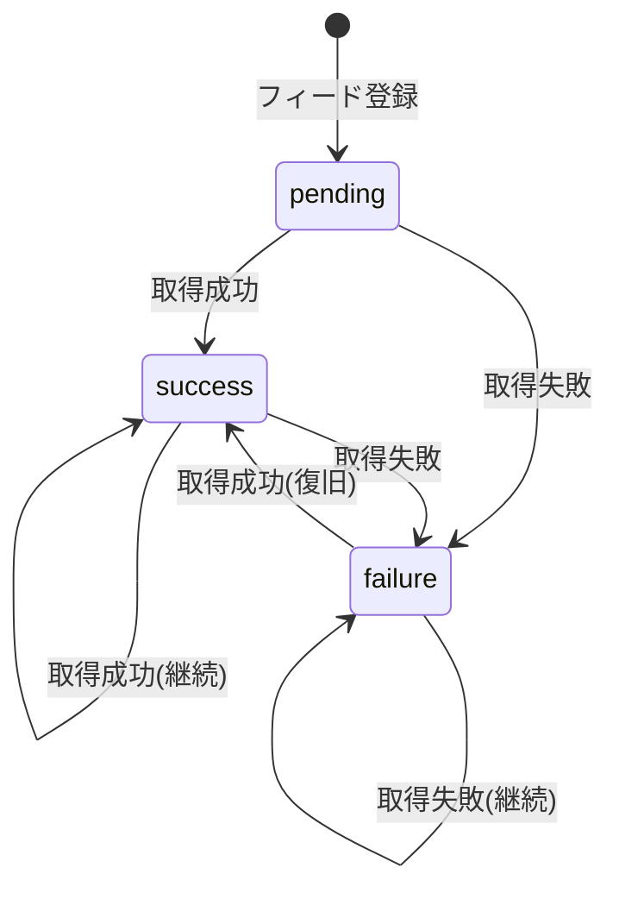

# 用語集 (Glossary)

## 概要

このドキュメントは、rssライブラリ内で使用される用語の定義を管理します。
全てのドキュメントで使用される用語を統一的に定義し、理解を促進します。

**更新日**: 2026-01-14

## ドメイン用語

RSSフィード収集・集約ライブラリ固有のビジネス概念や機能に関する用語。

### フィード (Feed)

**定義**: RSS 2.0またはAtom形式で配信されるコンテンツの情報源。

**説明**: RSSフィードは、ウェブサイトやブログが更新情報を配信するための標準化されたXML形式のファイルです。本ライブラリでは、フィードURLを登録・管理し、定期的にコンテンツを取得します。

**主要属性**:
- `feed_id`: UUID v4形式の一意識別子
- `url`: HTTP/HTTPSスキーマのフィードURL
- `title`: フィードのタイトル（1-200文字）
- `category`: 分類用カテゴリ名（例: finance, economics）
- `fetch_interval`: 取得間隔（daily/weekly/manual）
- `enabled`: 有効/無効フラグ

**関連用語**: [フィードアイテム](#フィードアイテム-feeditem)、[フィード管理マスター](#フィード管理マスター-feedsdata)、[取得間隔](#取得間隔-fetchinterval)

**使用例**:
- 「フィードを登録する」: 新しいRSSフィードをシステムに追加
- 「フィードを取得する」: フィードURLからコンテンツをダウンロード

**データモデル**: `src/rss/types.py` - `Feed`クラス

**英語表記**: Feed

### フィードアイテム (FeedItem)

**定義**: フィードに含まれる個別の記事やエントリ。

**説明**: RSSフィードから取得した個別のコンテンツ（記事、ブログポスト等）を表します。各アイテムはタイトル、URL、公開日時、本文等の情報を持ちます。

**主要属性**:
- `item_id`: UUID v4形式の一意識別子
- `title`: 記事タイトル
- `link`: 記事URL（一意性判定に使用）
- `published`: 公開日時（オプション）
- `summary`: 記事の要約（オプション）
- `content`: 本文（オプション）
- `author`: 著者名（オプション）

**関連用語**: [フィード](#フィード-feed)、[差分検出](#差分検出)

**使用例**:
- 「新規アイテムを検出する」: 既存データにないアイテムを抽出
- 「アイテムを検索する」: キーワードでアイテムを探す

**データモデル**: `src/rss/types.py` - `FeedItem`クラス

**英語表記**: Feed Item

### フィード管理マスター (FeedsData)

**定義**: 登録済みフィード情報の一覧を管理するJSON形式のマスターデータ。

**説明**: `data/raw/rss/feeds.json`に保存され、全フィードの情報（URL、カテゴリ、取得状態等）を集約管理します。手動編集可能な形式で、AIエージェントとの共同管理を実現します。

**ファイルパス**: `data/raw/rss/feeds.json`

**関連用語**: [フィード](#フィード-feed)、[ファイルロック](#ファイルロック)

**使用例**:
- 「フィード管理マスターに登録する」: 新規フィードをfeeds.jsonに追加
- 「フィード管理マスターを読み込む」: 登録済みフィード一覧を取得

**データ構造**:
```json
{
  "version": "1.0",
  "feeds": [
    {
      "feed_id": "550e8400-e29b-41d4-a716-446655440000",
      "url": "https://example.com/feed.xml",
      "title": "Example Feed",
      "category": "finance",
      ...
    }
  ]
}
```

**英語表記**: Feeds Data

### 取得間隔 (FetchInterval)

**定義**: フィードを自動取得する頻度を表す列挙型。

**取りうる値**:

| 値 | 意味 | 説明 |
|---|---|---|
| `daily` | 毎日 | 日次バッチで自動取得 |
| `weekly` | 毎週 | 週次バッチで自動取得 |
| `manual` | 手動 | ユーザーが明示的に取得実行 |

**関連用語**: [フィード](#フィード-feed)、[日次バッチ実行](#日次バッチ実行)

**使用例**:
```python
from rss import FeedManager, FetchInterval

manager = FeedManager()
manager.add_feed(
    url="https://example.com/feed.xml",
    title="Example Feed",
    category="finance",
    fetch_interval=FetchInterval.DAILY,  # 毎日自動取得
)
```

**英語表記**: Fetch Interval

### 取得ステータス (FetchStatus)

**定義**: フィード取得処理の結果を表す列挙型。

**取りうる値**:

| ステータス | 意味 | 遷移条件 | 次の状態 |
|----------|------|---------|---------|
| `pending` | 未実行 | フィード登録時の初期状態 | `success`, `failure` |
| `success` | 成功 | フィード取得が正常に完了 | `success`, `failure` |
| `failure` | 失敗 | フィード取得がエラーで終了 | `success`, `failure` |

**関連用語**: [フィード](#フィード-feed)、[取得結果](#取得結果-fetchresult)

**使用例**:
- フィード取得後に`last_status`を更新
- ダッシュボードでフィードの健全性を監視

**状態遷移図**:


**英語表記**: Fetch Status

### 取得結果 (FetchResult)

**定義**: フィード取得処理の実行結果を表すデータクラス。

**主要フィールド**:
- `feed_id`: 取得対象のフィードID
- `success`: 成功/失敗（真偽値）
- `items_count`: 取得したアイテム総数
- `new_items`: 新規アイテム数（差分検出後）
- `error_message`: エラーメッセージ（成功時はNone）

**関連用語**: [取得ステータス](#取得ステータス-fetchstatus)、[差分検出](#差分検出)

**使用例**:
```python
result = fetcher.fetch_feed(feed_id)
print(f"成功: {result.success}, 新規: {result.new_items}件")
```

**データモデル**: `src/rss/types.py` - `FetchResult`クラス

**英語表記**: Fetch Result

### 差分検出

**定義**: 取得したフィードアイテムと既存データを比較し、新規アイテムのみを抽出する処理。

**説明**: アイテムの一意性を`link`（記事URL）で判定し、既に保存されているアイテムとの差分を検出します。これにより、重複保存を回避します。

**処理フロー**:
1. 既存アイテムを`items.json`から読み込み
2. 取得したアイテムのリンク集合を作成
3. 既存リンクと比較し、新規アイテムを抽出

**関連用語**: [フィードアイテム](#フィードアイテム-feeditem)、[DiffDetector](#diffdetector)

**使用例**:
- 「差分検出で5件の新規アイテムを発見」
- 「重複排除により既存10件をスキップ」

**実装箇所**: `src/rss/core/diff_detector.py` - `DiffDetector`クラス

### 並列フィード取得

**定義**: 複数のフィードを同時に取得する非同期処理。

**説明**: `httpx.AsyncClient`と`asyncio.gather()`を使用し、最大5-10フィードを並列実行します。セマフォで同時実行数を制御し、効率的なフィード取得を実現します。

**パフォーマンス**:
- 逐次実行: 5フィード × 5秒 = 25秒
- 並列実行: 最大5秒（ネットワーク遅延除く）

**関連用語**: [HTTPClient](#httpclient)、[FeedFetcher](#feedfetcher)

**使用例**:
```python
fetcher = FeedFetcher(manager, max_concurrent=5)
results = await fetcher.fetch_all_async()
```

**実装箇所**: `src/rss/services/feed_fetcher.py` - `fetch_all_async()`メソッド

### 日次バッチ実行

**定義**: APSchedulerを使用した定期的なフィード自動取得機能（P1機能）。

**説明**: 指定された時刻（デフォルト: 午前6時）に全登録フィードを自動取得します。エラー発生時もバッチ処理を継続し、統計情報をログ出力します。

**設定項目**:
- 実行時刻: cron形式で指定可能
- 対象フィード: カテゴリフィルタ可能
- 並列実行数: 最大5-10フィード

**関連用語**: [取得間隔](#取得間隔-fetchinterval)、[APScheduler](#apscheduler)

**使用例**:
```python
from apscheduler.schedulers.blocking import BlockingScheduler

scheduler = BlockingScheduler()
scheduler.add_job(fetcher.fetch_all, 'cron', hour=6, minute=0)
scheduler.start()
```

**優先度**: P1（重要）

### ファイルロック

**定義**: `filelock`ライブラリを使用した並行書き込み制御機構。

**説明**: 複数プロセス/スレッドから同時にJSONファイルへ書き込む際、データ破損を防ぐためのロック機構です。タイムアウト（デフォルト10秒）で無限待機を回避します。

**ロック粒度**:
- `feeds.json`: 全体ロック（頻度低、影響範囲大）
- `items.json`: フィードIDごとに個別ロック（頻度高、影響範囲小）

**ロックファイル**:
- `.feeds.lock`: feeds.json用
- `.items.lock`: items.json用

**関連用語**: [JSONStorage](#jsonstorage)、[LockManager](#lockmanager)

**使用例**:
```python
with lock_manager.lock_feeds():
    # feeds.json への安全な書き込み
    storage.save_feeds(data)
```

**実装箇所**: `src/rss/storage/lock_manager.py` - `LockManager`クラス

## 技術用語

プロジェクトで使用している技術・フレームワーク・ツールに関する用語。

### Python

**定義**: 読みやすさを重視した汎用プログラミング言語。

**公式サイト**: https://www.python.org/

**本プロジェクトでの用途**: 全てのソースコードをPythonで記述し、PEP 695型ヒントで型安全性を確保しています。

**バージョン**: 3.12+

**選定理由**:
- 読みやすく保守しやすいコード
- 豊富なエコシステムとライブラリ
- PEP 695による最新の型ヒント機能（`type`文、`list[T]`構文）

**関連ドキュメント**:
- [アーキテクチャ設計書](./architecture.md#技術スタック)
- [開発ガイドライン](./development-guidelines.md#型ヒント)

**設定ファイル**: `pyproject.toml`

### httpx

**定義**: 非同期対応のHTTP/HTTPSクライアントライブラリ。

**公式サイト**: https://www.python-httpx.org/

**本プロジェクトでの用途**: RSSフィードのHTTP取得、リトライ機構、タイムアウト制御を実装しています。

**バージョン**: 0.27.0+

**選定理由**:
- 非同期処理（`AsyncClient`）で並列フィード取得が可能
- HTTP/2サポート
- requests互換のAPIで学習コストが低い

**主要機能**:
- 証明書検証（`verify=True`）
- タイムアウト設定
- リトライ機構（アプリケーションレベルで実装）

**実装箇所**: `src/rss/core/http_client.py` - `HTTPClient`クラス

### feedparser

**定義**: RSS 2.0/Atom両対応のPythonパーサーライブラリ。

**公式サイト**: https://feedparser.readthedocs.io/

**本プロジェクトでの用途**: フィードXMLのパース処理、RSS 2.0とAtomの統一的な扱いを実現しています。

**バージョン**: 6.0.0+

**選定理由**:
- RSS 2.0/Atom両対応
- 実績豊富で信頼性が高い
- 不正なXML/HTMLにも寛容

**注意点**:
- 不正なXMLでもパースを試みるため、追加でバリデーション実施
- 統一データ構造への変換が必要（title, link, published等）

**実装箇所**: `src/rss/core/parser.py` - `FeedParser`クラス

### filelock

**定義**: クロスプラットフォーム対応のファイルロックライブラリ。

**公式サイト**: https://py-filelock.readthedocs.io/

**本プロジェクトでの用途**: `feeds.json`と`items.json`への並行書き込み制御に使用しています。

**バージョン**: 3.20.0+

**選定理由**:
- クロスプラットフォーム（Linux/macOS/Windows）
- タイムアウト制御が可能
- シンプルなコンテキストマネージャーAPI

**使用例**:
```python
from filelock import FileLock, Timeout

lock = FileLock(".feeds.lock", timeout=10)
try:
    with lock:
        # 排他制御された処理
        pass
except Timeout:
    raise FileLockError("ロック取得失敗")
```

**実装箇所**: `src/rss/storage/lock_manager.py` - `LockManager`クラス

### structlog

**定義**: 構造化ロギングを提供するPythonライブラリ。

**公式サイト**: https://www.structlog.org/

**本プロジェクトでの用途**: 全てのログ出力を構造化し、JSON/テキスト形式で出力しています。financeパッケージから継承した共通設定を使用します。

**バージョン**: 25.4.0+

**選定理由**:
- キーバリュー形式で機械可読なログ
- JSON/テキスト形式の切り替え可能
- コンテキスト情報の追加が容易

**ログレベル**:
- DEBUG: HTTP取得開始、パース開始
- INFO: フィード取得成功、バッチ実行開始/終了
- WARNING: リトライ実行、URL重複検出
- ERROR: 取得失敗、パースエラー

**使用例**:
```python
from finance.utils.logging_config import get_logger

logger = get_logger(__name__)
logger.info("Feed fetched", feed_id=feed_id, items_count=10)
```

**共通設定**: `finance.utils.logging_config`

### click

**定義**: Pythonのコマンドライン作成フレームワーク（P1機能）。

**公式サイト**: https://click.palletsprojects.com/

**本プロジェクトでの用途**: CLIインターフェース（`rss-cli`コマンド）の実装に使用しています。

**バージョン**: 8.1.0+

**選定理由**:
- サブコマンド対応
- 型ヒントサポート
- Pythonで標準的なCLIフレームワーク

**提供コマンド**:
- `add`: フィード登録
- `list`: フィード一覧表示
- `fetch`: フィード取得実行
- `search`: アイテム検索

**実装箇所**: `src/rss/cli/main.py`

**優先度**: P1（重要）

### mcp

**定義**: Anthropic Model Context Protocolの実装ライブラリ（P1機能）。

**公式サイト**: https://modelcontextprotocol.io/

**本プロジェクトでの用途**: MCPサーバーとしてClaude Codeとの連携を実現しています。

**バージョン**: 0.9.0+

**選定理由**:
- Claude Code連携に必須
- stdio transportに対応
- 標準化されたAIエージェント連携プロトコル

**提供MCPツール**:
- `rss_list_feeds`: フィード一覧取得
- `rss_get_items`: アイテム取得
- `rss_search_items`: アイテム検索
- `rss_add_feed`: フィード登録
- `rss_fetch_feed`: フィード取得実行

**実装箇所**: `src/rss/mcp/server.py`

**優先度**: P1（重要）

### APScheduler

**定義**: Pythonのタスクスケジューリングライブラリ（P1機能）。

**公式サイト**: https://apscheduler.readthedocs.io/

**本プロジェクトでの用途**: 日次バッチ実行の定期実行スケジュールに使用しています。

**バージョン**: 3.10.0+

**選定理由**:
- cron形式のスケジュール設定が可能
- BlockingScheduler/BackgroundSchedulerの選択可能
- Pythonで標準的なスケジューラー

**使用例**:
```python
from apscheduler.schedulers.blocking import BlockingScheduler

scheduler = BlockingScheduler()
scheduler.add_job(
    fetcher.fetch_all,
    'cron',
    hour=6,  # 毎日午前6時
    minute=0,
)
scheduler.start()
```

**実装箇所**: 日次バッチ実行スクリプト

**優先度**: P1（重要）

### uv

**定義**: Rustベースの高速パッケージマネージャー。

**公式サイト**: https://github.com/astral-sh/uv

**本プロジェクトでの用途**: パッケージ管理、依存関係の同期、仮想環境管理に使用しています。

**バージョン**: latest

**選定理由**:
- Rustベースで高速（pipより10-100倍速い）
- pip/pipx/virtualenv/pyenvの機能を統合
- pyproject.tomlベースの統一管理

**主要コマンド**:
- `uv sync --all-extras`: 全依存関係を同期
- `uv add package`: パッケージ追加
- `uv run command`: 仮想環境でコマンド実行

### Ruff

**定義**: Rustベースの高速リンター・フォーマッター。

**公式サイト**: https://docs.astral.sh/ruff/

**本プロジェクトでの用途**: コードリント・フォーマット、import整理に使用しています。

**バージョン**: latest

**選定理由**:
- Rustベースで高速（Flake8より10-100倍速い）
- Flake8/isort/Blackを統合
- 自動修正機能

**実行コマンド**:
- `make lint`: リント実行
- `make format`: フォーマット実行

**設定ファイル**: `pyproject.toml` - `[tool.ruff]`

### pyright

**定義**: Microsoft製のPython型チェッカー。

**公式サイト**: https://github.com/microsoft/pyright

**本プロジェクトでの用途**: 厳密な型チェック、PEP 695型ヒントの検証に使用しています。

**バージョン**: latest

**選定理由**:
- 厳密な型チェック
- Python 3.12+の型機能に完全対応
- IDE統合（VS Code）

**実行コマンド**: `make typecheck`

**設定ファイル**: `pyproject.toml` - `[tool.pyright]`

### pytest

**定義**: Pythonの標準的なテストフレームワーク。

**公式サイト**: https://docs.pytest.org/

**本プロジェクトでの用途**: ユニットテスト、統合テスト、カバレッジ測定に使用しています。

**バージョン**: latest

**カバレッジ目標**: 80%以上

**実行コマンド**:
- `make test`: テスト実行
- `make test-cov`: カバレッジ付きテスト

**関連ツール**:
- pytest-cov: カバレッジ測定
- pytest-benchmark: ベンチマーク測定
- pytest-httpserver: モックHTTPサーバー

### Hypothesis

**定義**: プロパティベーステストを実現するPythonライブラリ。

**公式サイト**: https://hypothesis.readthedocs.io/

**本プロジェクトでの用途**: 不正入力への対処検証、ランダムデータでのテストに使用しています。

**バージョン**: latest

**選定理由**:
- 自動テストケース生成
- エッジケースの発見
- バグの再現性保証

**使用例**:
```python
from hypothesis import given, strategies as st

@given(st.text(min_size=1, max_size=200))
def test_validate_title(title: str):
    validator = URLValidator()
    assert validator.validate_title(title) is True
```

**テスト対象**:
- FeedParser: 不正なXML/HTMLへの対処
- DiffDetector: 任意のアイテムリストで差分検出

## 略語・頭字語

### RSS

**正式名称**: Really Simple Syndication

**意味**: ウェブサイトの更新情報を配信するためのXML形式の規格。

**本プロジェクトでの使用**:
- フィード取得の主要対象フォーマット（RSS 2.0）
- Atomフォーマットも併せて対応

**関連標準**:
- RSS 2.0: https://www.rssboard.org/rss-specification
- Atom: https://datatracker.ietf.org/doc/html/rfc4287

### HTTP/HTTPS

**正式名称**: HyperText Transfer Protocol / HTTP Secure

**意味**: ウェブ上でデータを送受信するための通信プロトコル。

**本プロジェクトでの使用**:
- フィードURLはHTTP/HTTPSスキーマのみ許可
- HTTPS接続時は証明書検証を有効化（`verify=True`）

**セキュリティ要件**:
- User-Agent設定: `rss-feed-collector/0.1.0`
- タイムアウト: デフォルト10秒（DoS攻撃対策）

### MCP

**正式名称**: Model Context Protocol

**意味**: AIエージェントがアプリケーションと連携するための標準プロトコル。

**本プロジェクトでの使用**:
- MCPサーバーとしてClaude Codeと連携
- stdio transportでコマンドライン経由通信

**公式サイト**: https://modelcontextprotocol.io/

**提供MCPツール数**: 7個（フィード管理・取得・検索）

**優先度**: P1（重要）

### CLI

**正式名称**: Command Line Interface

**意味**: コマンドラインから操作するインターフェース。

**本プロジェクトでの使用**:
- `rss-cli`コマンドで提供
- 7つのサブコマンド（add/list/update/remove/fetch/items/search）

**実装**: `src/rss/cli/main.py`

**優先度**: P1（重要）

### API

**正式名称**: Application Programming Interface

**意味**: ソフトウェア同士が連携するためのインターフェース。

**本プロジェクトでの使用**:
- Python API: `FeedManager`, `FeedFetcher`, `FeedReader`クラス
- MCP API: MCPツール経由のAIエージェント連携
- CLI API: `rss-cli`コマンド経由の操作

### TDD

**正式名称**: Test-Driven Development

**意味**: テスト駆動開発。テストを先に書いてから実装を行う開発手法。

**本プロジェクトでの適用**:
- 全ての新機能開発でTDD推奨
- カバレッジ目標80%以上

**手順**:
1. テストを書く
2. テストを実行 → 失敗を確認
3. 実装を書く
4. テストを実行 → 成功を確認
5. リファクタリング

**関連ドキュメント**: [開発ガイドライン](./development-guidelines.md)

### JSON

**正式名称**: JavaScript Object Notation

**意味**: データ交換のための軽量テキストフォーマット。

**本プロジェクトでの使用**:
- `feeds.json`: フィード管理マスター
- `items.json`: フィードアイテム保存
- UTF-8エンコーディング、インデント付き（手動編集可能）

**ファイルパス**: `data/raw/rss/`

### UUID

**正式名称**: Universally Unique Identifier

**意味**: 衝突の可能性が極めて低い128ビットの一意識別子。

**本プロジェクトでの使用**:
- `feed_id`: UUID v4形式で自動生成
- `item_id`: UUID v4形式で自動生成

**使用例**: `550e8400-e29b-41d4-a716-446655440000`

## アーキテクチャ用語

システム設計・アーキテクチャに関する用語。

### レイヤードアーキテクチャ

**定義**: システムを役割ごとに複数の層に分割し、上位層から下位層への一方向依存を持たせる設計パターン。

**本プロジェクトでの適用**:
```
UIレイヤー (cli/, mcp/)
    ↓
サービスレイヤー (services/)
    ↓
データ処理レイヤー (core/)
データ永続化レイヤー (storage/)
入力検証レイヤー (validators/)
    ↓
共通モジュール (types.py, exceptions.py)
```

**各層の責務**:
- UIレイヤー: ユーザー入力の受付と表示
- サービスレイヤー: ビジネスロジックの実装
- データ処理レイヤー: HTTP通信、パース、差分検出
- データ永続化レイヤー: JSON保存、ファイルロック
- 入力検証レイヤー: URL・文字列長検証

**メリット**:
- 関心の分離による保守性向上
- テストが容易（各層を独立してテスト可能）
- 変更の影響範囲が限定的

**依存関係のルール**:
- ✅ UIレイヤー → サービスレイヤー
- ✅ サービスレイヤー → データ処理/永続化/検証レイヤー
- ❌ データ処理/永続化/検証レイヤー → サービスレイヤー
- ❌ データ処理/永続化/検証レイヤー → UIレイヤー

**関連ドキュメント**:
- [アーキテクチャ設計書](./architecture.md#レイヤードアーキテクチャ)
- [リポジトリ構造定義書](./repository-structure.md)

### 依存性注入 (Dependency Injection)

**定義**: オブジェクトの依存関係を外部から注入する設計パターン。

**本プロジェクトでの適用**:
```python
class FeedFetcher:
    def __init__(
        self,
        manager: FeedManager,
        http_client: HTTPClient,
        parser: FeedParser,
    ) -> None:
        self.manager = manager
        self.http_client = http_client
        self.parser = parser
```

**メリット**:
- テスト時にモックへの差し替えが容易
- 依存関係が明示的
- 循環依存の回避

**関連パターン**: Protocol（型ヒント用インターフェース定義）

### 非同期処理 (Async/Await)

**定義**: I/O待機時にCPUを他の処理に使用できる並行処理モデル。

**本プロジェクトでの適用**:
- `httpx.AsyncClient`: 非同期HTTP取得
- `asyncio.gather()`: 並列フィード取得
- セマフォ: 同時実行数制御（最大5-10）

**パフォーマンス**:
- 逐次実行: 5フィード × 5秒 = 25秒
- 並列実行: 最大5秒（ネットワーク遅延除く）

**実装箇所**: `src/rss/services/feed_fetcher.py` - `fetch_all_async()`

## コンポーネント用語

主要なクラス・モジュールに関する用語。

### FeedManager

**定義**: フィード情報の登録・更新・削除・一覧取得を管理するサービスクラス。

**責務**:
- フィード情報のCRUD操作
- フィード情報のバリデーション
- feeds.jsonの読み書き
- URL重複チェック

**主要メソッド**:
- `add_feed()`: フィード登録
- `list_feeds()`: フィード一覧取得
- `get_feed()`: 特定フィード取得
- `update_feed()`: フィード情報更新
- `remove_feed()`: フィード削除

**依存関係**:
- JSONStorage: feeds.jsonの読み書き
- URLValidator: URLバリデーション
- LockManager: ファイルロック制御

**実装箇所**: `src/rss/services/feed_manager.py`

**使用例**:
```python
from rss import FeedManager

manager = FeedManager()
feed_id = manager.add_feed(
    url="https://example.com/feed.xml",
    title="Example Feed",
    category="finance",
)
```

**関連用語**: [フィード](#フィード-feed)、[JSONStorage](#jsonstorage)

### FeedFetcher

**定義**: HTTP/HTTPS経由でフィードを取得し、パース・差分検出・保存を統合するサービスクラス。

**責務**:
- HTTP/HTTPS経由でのフィード取得
- RSS/Atomパース処理
- 差分検出（重複排除）
- items.jsonへの保存
- リトライ機構の実装
- 並列フィード取得

**主要メソッド**:
- `fetch_feed()`: 単一フィード取得
- `fetch_all()`: 全フィード取得（同期ラッパー）
- `fetch_all_async()`: 全フィード取得（非同期、並列実行）

**依存関係**:
- FeedManager: フィード情報取得
- HTTPClient: HTTP/HTTPS取得
- FeedParser: RSS/Atomパース
- DiffDetector: 差分検出
- JSONStorage: items.jsonの読み書き

**実装箇所**: `src/rss/services/feed_fetcher.py`

**使用例**:
```python
from rss import FeedFetcher, FeedManager

manager = FeedManager()
fetcher = FeedFetcher(manager, max_concurrent=5)

# 単一フィード取得
result = fetcher.fetch_feed(feed_id)

# 全フィード並列取得
results = fetcher.fetch_all()
```

**関連用語**: [並列フィード取得](#並列フィード取得)、[取得結果](#取得結果-fetchresult)

### FeedReader

**定義**: items.jsonからのアイテム読込、キーワード検索、フィルタリングを提供するサービスクラス。

**責務**:
- items.jsonからのアイテム読込
- キーワード検索（title/summary/content）
- フィルタリング（カテゴリ、日付範囲）
- ページネーション

**主要メソッド**:
- `get_items()`: アイテム取得（published降順）
- `search_items()`: キーワード検索

**依存関係**:
- JSONStorage: items.jsonの読み込み
- FeedManager: カテゴリフィルタリング用のフィード情報取得

**実装箇所**: `src/rss/services/feed_reader.py`

**使用例**:
```python
from rss import FeedReader

reader = FeedReader()

# 最新10件取得
items = reader.get_items(feed_id, limit=10)

# キーワード検索
items = reader.search_items(
    query="金利",
    category="finance",
    fields=["title", "summary"],
    limit=50,
)
```

**関連用語**: [フィードアイテム](#フィードアイテム-feeditem)

### HTTPClient

**定義**: HTTP/HTTPS通信、タイムアウト制御、リトライ機構を実装したクラス。

**責務**:
- HTTP/HTTPS経由でのコンテンツ取得
- タイムアウト制御（デフォルト10秒）
- リトライ機構（最大3回、指数バックオフ）
- User-Agent設定
- HTTPS証明書検証

**リトライ対象エラー**:
- タイムアウト
- 接続エラー
- 5xxエラー（500-599）

**リトライ対象外エラー**:
- 4xxエラー（404等のクライアントエラー）
- パースエラー

**リトライ間隔**: 指数バックオフ（1秒、2秒、4秒）

**実装箇所**: `src/rss/core/http_client.py`

**使用例**:
```python
client = HTTPClient()
response = await client.fetch(
    url="https://example.com/feed.xml",
    timeout=10,
    max_retries=3,
)
```

**関連用語**: [httpx](#httpx)、[リトライ機構](#リトライ機構)

### FeedParser

**定義**: feedparserを使用したRSS/Atomパース処理クラス。

**責務**:
- RSS 2.0 / Atom両対応のパース処理
- 統一データ構造への変換
- パースエラーハンドリング

**統一データ構造**:
- title: 記事タイトル
- link: 記事URL
- published: 公開日時（オプション）
- summary: 要約（オプション）
- content: 本文（オプション）
- author: 著者名（オプション）

**実装箇所**: `src/rss/core/parser.py`

**使用例**:
```python
parser = FeedParser()
items = parser.parse(xml_content)
```

**関連用語**: [feedparser](#feedparser)、[RSS](#rss)

### DiffDetector

**定義**: 既存アイテムと新規アイテムを比較し、差分を検出するクラス。

**責務**:
- アイテムの一意性判定（linkベース）
- 新規アイテムの抽出
- 重複排除

**アルゴリズム**:
1. 既存アイテムのlink集合を作成
2. 取得アイテムのlinkと比較
3. 既存に含まれないアイテムを新規として抽出

**実装箇所**: `src/rss/core/diff_detector.py`

**使用例**:
```python
detector = DiffDetector()
new_items = detector.detect_new_items(
    existing_items=existing,
    fetched_items=fetched,
)
```

**関連用語**: [差分検出](#差分検出)

### JSONStorage

**定義**: JSON形式でのデータ保存・読込を担当するクラス。

**責務**:
- feeds.json、items.jsonの読み書き
- UTF-8エンコーディング
- インデント付きJSON生成（手動編集可能）
- ディレクトリ自動生成

**ファイル形式**:
- UTF-8エンコーディング
- インデント付き（2スペース）
- 日付時刻: ISO 8601形式

**実装箇所**: `src/rss/storage/json_storage.py`

**使用例**:
```python
storage = JSONStorage(data_dir=Path("data/raw/rss"))
storage.save_feeds(feeds_data)
feeds_data = storage.load_feeds()
```

**関連用語**: [ファイルロック](#ファイルロック)、[LockManager](#lockmanager)

### LockManager

**定義**: filelockを使用したファイルロック制御クラス。

**責務**:
- feeds.json、items.jsonのロック取得・解放
- タイムアウト管理（デフォルト10秒）
- クロスプラットフォーム対応

**ロックファイル**:
- `.feeds.lock`: feeds.json用
- `.items.lock`: items.json用（フィードIDごと）

**実装箇所**: `src/rss/storage/lock_manager.py`

**使用例**:
```python
lock_manager = LockManager(data_dir)
with lock_manager.lock_feeds():
    # feeds.jsonへの安全な書き込み
    storage.save_feeds(data)
```

**関連用語**: [filelock](#filelock)、[ファイルロック](#ファイルロック)

### URLValidator

**定義**: URL形式、文字列長を検証するクラス。

**責務**:
- URL形式検証（HTTP/HTTPSスキーマのみ許可）
- タイトル長検証（1-200文字）
- カテゴリ名長検証（1-50文字）

**実装箇所**: `src/rss/validators/url_validator.py`

**使用例**:
```python
validator = URLValidator()
validator.validate_url("https://example.com/feed.xml")  # OK
validator.validate_url("ftp://example.com/feed.xml")    # InvalidURLError
validator.validate_title("A" * 201)                     # ValueError
```

**関連用語**: [バリデーションエラー](#バリデーションエラー-validationerror)

## エラー・例外

システムで定義されているエラーと例外。

### RSSError

**クラス名**: `RSSError`

**継承元**: `Exception`

**発生条件**: RSSパッケージ固有のエラーの基底クラス。

**説明**: 全てのカスタム例外はこのクラスを継承します。一般的な`Exception`と区別するために使用します。

**実装箇所**: `src/rss/exceptions.py`

**使用例**:
```python
class RSSError(Exception):
    """RSSパッケージの基底例外"""
    pass
```

**子クラス**:
- [FeedNotFoundError](#フィードが見つからないエラー-feednotfounderror)
- [FeedAlreadyExistsError](#フィード重複エラー-feedalreadyexistserror)
- [FeedFetchError](#フィード取得エラー-feedfetcherror)
- [FeedParseError](#フィードパースエラー-feedparseerror)
- [InvalidURLError](#無効なURL形式エラー-invalidurlerror)
- [FileLockError](#ファイルロックエラー-filelockerror)

### フィードが見つからないエラー (FeedNotFoundError)

**クラス名**: `FeedNotFoundError`

**継承元**: `RSSError`

**発生条件**: 存在しないフィードIDを指定した場合に発生。

**エラーメッセージフォーマット**: `"フィードが見つかりません (ID: {feed_id})"`

**対処方法**:
- ユーザー: フィードIDが正しいか確認、`list_feeds()`で登録済みフィードを確認
- 開発者: フィードID存在チェックのロジックを確認

**ログレベル**: ERROR

**実装箇所**: `src/rss/exceptions.py`

**使用例**:
```python
feed = manager.get_feed(feed_id)
if feed is None:
    raise FeedNotFoundError(f"フィードが見つかりません (ID: {feed_id})")
```

### フィード重複エラー (FeedAlreadyExistsError)

**クラス名**: `FeedAlreadyExistsError`

**継承元**: `RSSError`

**発生条件**: 既に登録されているURLを再登録しようとした場合に発生。

**エラーメッセージフォーマット**: `"このURLは既に登録されています: {url}"`

**対処方法**:
- ユーザー: 登録済みフィードを確認、重複している場合は既存フィードを使用
- 開発者: URL重複チェックのロジックを確認

**ログレベル**: WARNING

**実装箇所**: `src/rss/exceptions.py`

**使用例**:
```python
if any(f.url == url for f in feeds.feeds):
    raise FeedAlreadyExistsError(f"このURLは既に登録されています: {url}")
```

### フィード取得エラー (FeedFetchError)

**クラス名**: `FeedFetchError`

**継承元**: `RSSError`

**発生条件**: フィード取得時のHTTPエラー（リトライ後も失敗）。

**エラーメッセージフォーマット**: `"フィード取得に失敗しました: {詳細}"`

**対処方法**:
- ユーザー: URLが正しいか確認、ネットワーク接続を確認
- 開発者: HTTPクライアントのログを確認、リトライ機構を検証

**ログレベル**: ERROR

**実装箇所**: `src/rss/exceptions.py`

**リトライ機構**:
- 最大3回リトライ
- 指数バックオフ（1秒、2秒、4秒）
- 対象エラー: タイムアウト、接続エラー、5xxエラー

**使用例**:
```python
try:
    response = await http_client.fetch(url)
except Exception as e:
    raise FeedFetchError(f"フィード取得に失敗しました: {e}")
```

### フィードパースエラー (FeedParseError)

**クラス名**: `FeedParseError`

**継承元**: `RSSError`

**発生条件**: フィードのパース処理が失敗した場合に発生。

**エラーメッセージフォーマット**: `"フィードのパースに失敗しました: {詳細}"`

**対処方法**:
- ユーザー: フィードURLが正しいRSS/Atom形式か確認
- 開発者: パース処理のログを確認、feedparserの動作を検証

**ログレベル**: ERROR

**実装箇所**: `src/rss/exceptions.py`

**使用例**:
```python
parsed = feedparser.parse(content)
if not parsed.get("feed"):
    raise FeedParseError(f"フィードの構造が不正です: {url}")
```

### 無効なURL形式エラー (InvalidURLError)

**クラス名**: `InvalidURLError`

**継承元**: `RSSError`

**発生条件**: URLバリデーション失敗時（HTTP/HTTPS以外のスキーマ）。

**エラーメッセージフォーマット**: `"HTTP/HTTPSスキーマのみ許可されます: {url}"`

**対処方法**:
- ユーザー: URLがHTTPまたはHTTPSで始まっているか確認
- 開発者: バリデーションロジックを確認

**ログレベル**: WARNING

**実装箇所**: `src/rss/exceptions.py`

**使用例**:
```python
if not url.startswith(("http://", "https://")):
    raise InvalidURLError(f"HTTP/HTTPSスキーマのみ許可されます: {url}")
```

### ファイルロックエラー (FileLockError)

**クラス名**: `FileLockError`

**継承元**: `RSSError`

**発生条件**: ファイルロック取得タイムアウト時（デフォルト10秒）。

**エラーメッセージフォーマット**: `"ファイルロックの取得に失敗しました: {ロックファイルパス}"`

**対処方法**:
- ユーザー: 他のプロセスがファイルを使用していないか確認、時間を置いて再実行
- 開発者: ロック取得のタイムアウト時間を調整、競合条件を調査

**ログレベル**: ERROR

**実装箇所**: `src/rss/exceptions.py`

**使用例**:
```python
from filelock import FileLock, Timeout

try:
    with FileLock(".feeds.lock", timeout=10):
        # 排他制御された処理
        pass
except Timeout:
    raise FileLockError(f"ファイルロックの取得に失敗しました: .feeds.lock")
```

### バリデーションエラー (ValidationError)

**クラス名**: 標準の`ValueError`を使用

**発生条件**: タイトル・カテゴリの文字列長が制約を満たさない場合。

**制約**:
- タイトル: 1-200文字
- カテゴリ: 1-50文字

**エラーメッセージフォーマット**:
- `"タイトルは1-200文字で入力してください。現在の文字数: {len(title)}"`
- `"カテゴリは1-50文字で入力してください。現在の文字数: {len(category)}"`

**対処方法**:
- ユーザー: 文字列長を調整
- 開発者: バリデーションロジックを確認

**ログレベル**: WARNING

**使用例**:
```python
if len(title) == 0 or len(title) > 200:
    raise ValueError(f"タイトルは1-200文字で入力してください。現在の文字数: {len(title)}")
```

## リトライ機構

**定義**: 一時的なエラー（ネットワーク障害等）に対する自動再試行の仕組み。

**説明**: HTTP取得時のタイムアウトや5xxエラーに対して、最大3回まで自動的に再試行します。指数バックオフにより、サーバー負荷を軽減します。

**リトライ対象エラー**:
- タイムアウト（`httpx.TimeoutException`）
- 接続エラー（`httpx.ConnectError`）
- 5xxエラー（500-599）

**リトライ対象外エラー**:
- 4xxエラー（404等のクライアントエラー）
- パースエラー

**リトライ間隔**: 指数バックオフ
- 1回目: 1秒待機
- 2回目: 2秒待機
- 3回目: 4秒待機

**ログレベル**:
- リトライ時: WARNING
- 最終失敗時: ERROR

**実装箇所**: `src/rss/core/http_client.py` - `HTTPClient.fetch()`

**使用例**:
```python
for attempt in range(max_retries):
    try:
        response = await client.get(url, timeout=timeout)
        return response
    except (httpx.TimeoutException, httpx.ConnectError) as e:
        if attempt < max_retries - 1:
            wait_time = 2 ** attempt  # 指数バックオフ
            logger.warning("Retrying fetch", attempt=attempt+1, wait=wait_time)
            await asyncio.sleep(wait_time)
        else:
            raise FeedFetchError(f"Failed after {max_retries} retries: {e}")
```

**関連用語**: [HTTPClient](#httpclient)、[フィード取得エラー](#フィード取得エラー-feedfetcherror)

## 索引

### あ行
- [APIインターフェース](#api) - 略語

### か行
- [カテゴリ](#フィード-feed) - ドメイン用語

### さ行
- [差分検出](#差分検出) - ドメイン用語

### た行
- [TDD](#tdd) - 略語
- [取得間隔](#取得間隔-fetchinterval) - ドメイン用語
- [取得ステータス](#取得ステータス-fetchstatus) - ドメイン用語
- [取得結果](#取得結果-fetchresult) - ドメイン用語

### は行
- [並列フィード取得](#並列フィード取得) - ドメイン用語
- [ファイルロック](#ファイルロック) - ドメイン用語
- [フィード](#フィード-feed) - ドメイン用語
- [フィードアイテム](#フィードアイテム-feeditem) - ドメイン用語
- [フィード管理マスター](#フィード管理マスター-feedsdata) - ドメイン用語

### ま行
- [MCP](#mcp) - 略語

### や行

### ら行
- [リトライ機構](#リトライ機構) - 技術用語
- [レイヤードアーキテクチャ](#レイヤードアーキテクチャ) - アーキテクチャ用語

### わ行

### A-Z
- [API](#api) - 略語
- [APScheduler](#apscheduler) - 技術用語
- [CLI](#cli) - 略語
- [DiffDetector](#diffdetector) - コンポーネント用語
- [FeedFetcher](#feedfetcher) - コンポーネント用語
- [FeedManager](#feedmanager) - コンポーネント用語
- [FeedParser](#feedparser) - コンポーネント用語
- [FeedReader](#feedreader) - コンポーネント用語
- [filelock](#filelock) - 技術用語
- [feedparser](#feedparser) - 技術用語
- [HTTP/HTTPS](#httphttps) - 略語
- [HTTPClient](#httpclient) - コンポーネント用語
- [httpx](#httpx) - 技術用語
- [Hypothesis](#hypothesis) - 技術用語
- [JSON](#json) - 略語
- [JSONStorage](#jsonstorage) - コンポーネント用語
- [LockManager](#lockmanager) - コンポーネント用語
- [MCP](#mcp) - 略語
- [mcp](#mcp-1) - 技術用語
- [pyright](#pyright) - 技術用語
- [pytest](#pytest) - 技術用語
- [Python](#python) - 技術用語
- [RSS](#rss) - 略語
- [Ruff](#ruff) - 技術用語
- [structlog](#structlog) - 技術用語
- [TDD](#tdd) - 略語
- [URLValidator](#urlvalidator) - コンポーネント用語
- [UUID](#uuid) - 略語
- [uv](#uv) - 技術用語

## 変更履歴

| 日付 | 変更内容 |
|------|---------|
| 2026-01-14 | 初版作成 |
