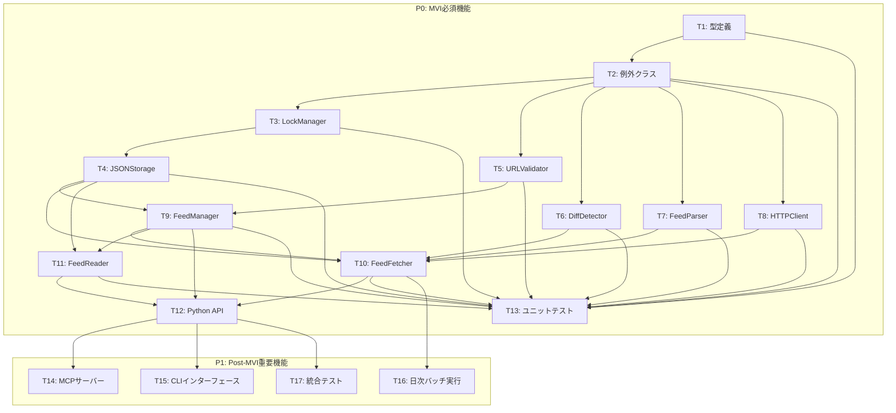

# 実装タスク一覧 (Implementation Tasks)

## タスク分解の方針

- **粒度**: 各タスクは1-2時間で完了できる実装単位に分解
- **依存関係**: 実装順序を明確化し、依存関係を明示
- **受け入れ条件**: 各タスクに測定可能な完了判定基準を設定
- **優先度**: P0（MVI必須）、P1（Post-MVI重要）、P2（将来機能）で分類

## 実装優先順位マップ

## タスク一覧

---

### **T1: 型定義（types.py）**

**優先度**: P0（MVI必須）

**依存関係**: なし

**実装内容**:
- `FetchInterval` Enumの定義（DAILY, WEEKLY, MANUAL）
- `FetchStatus` Enumの定義（SUCCESS, FAILURE, PENDING）
- `Feed` dataclassの定義（フィード情報モデル）
- `FeedItem` dataclassの定義（フィードアイテムモデル）
- `FeedsData` dataclassの定義（フィード管理マスター）
- `FeedItemsData` dataclassの定義（フィードアイテム保存）
- `HTTPResponse` dataclassの定義（HTTPレスポンス）
- `FetchResult` dataclassの定義（フィード取得結果）

**受け入れ条件**:
- [ ] `FetchInterval` Enumが3つの値を持つ（DAILY, WEEKLY, MANUAL）
- [ ] `FetchStatus` Enumが3つの値を持つ（SUCCESS, FAILURE, PENDING）
- [ ] `Feed` dataclassが全フィールドを持つ（feed_id, url, title, category, fetch_interval, created_at, updated_at, last_fetched, last_status, enabled）
- [ ] `FeedItem` dataclassが全フィールドを持つ（item_id, title, link, published, summary, content, author, fetched_at）
- [ ] `FeedsData` dataclassが version と feeds フィールドを持つ
- [ ] `FeedItemsData` dataclassが version, feed_id, items フィールドを持つ
- [ ] `HTTPResponse` dataclassが status_code, content, headers フィールドを持つ
- [ ] `FetchResult` dataclassが feed_id, success, items_count, new_items, error_message フィールドを持つ
- [ ] 全型がPython 3.12+の型ヒント（PEP 695）を使用
- [ ] pyrightで型チェックエラー0件

**参照テンプレート**:
- `template/src/template_package/types.py`

**実装ファイル**:
- `src/rss/types.py`

**テストファイル**:
- なし（型定義のため、使用側でテスト）

---

### **T2: 例外クラス（exceptions.py）**

**優先度**: P0（MVI必須）

**依存関係**: なし

**実装内容**:
- `RSSError` 基底例外クラスの定義
- `FeedNotFoundError` 例外クラスの定義（フィードが見つからない）
- `FeedAlreadyExistsError` 例外クラスの定義（フィードが既に存在する）
- `FeedFetchError` 例外クラスの定義（フィード取得に失敗）
- `FeedParseError` 例外クラスの定義（フィードのパースに失敗）
- `InvalidURLError` 例外クラスの定義（無効なURL形式）
- `FileLockError` 例外クラスの定義（ファイルロック取得に失敗）

**受け入れ条件**:
- [ ] `RSSError` が `Exception` を継承する
- [ ] 全例外クラスが `RSSError` を継承する
- [ ] 各例外クラスにdocstringが存在する
- [ ] エラーメッセージが明確で、原因・対処法を含む

**参照テンプレート**:
- `template/src/template_package/types.py`（例外クラス例）

**実装ファイル**:
- `src/rss/exceptions.py`

**テストファイル**:
- なし（例外発生のテストは使用側で実施）

---

### **T3: ファイルロック管理（LockManager）**

**優先度**: P0（MVI必須）

**依存関係**: T2（例外クラス）

**実装内容**:
- `LockManager` クラスの実装
- `lock_feeds()` コンテキストマネージャー（feeds.jsonをロック）
- `lock_items()` コンテキストマネージャー（items.jsonをロック）
- filelockライブラリの使用（タイムアウト10秒デフォルト）
- タイムアウト時に `FileLockError` を発生

**受け入れ条件**:
- [ ] `lock_feeds()` が feeds.json 用のロックを取得・解放する
- [ ] `lock_items(feed_id)` が指定フィードのitems.json用のロックを取得・解放する
- [ ] タイムアウト時間を設定可能（デフォルト10秒）
- [ ] タイムアウト時に `FileLockError` を発生させる
- [ ] ロックファイルが自動生成される（.feeds.lock, .items.lock）
- [ ] コンテキストマネージャーでロックが自動解放される
- [ ] 構造化ロギング（DEBUG: ロック取得、ERROR: タイムアウト）

**参照テンプレート**:
- `template/src/template_package/utils/helpers.py`（ロギング例）

**実装ファイル**:
- `src/rss/storage/lock_manager.py`

**テストファイル**:
- `tests/unit/storage/test_lock_manager.py`

**テストケース**:
- ロック取得・解放の正常動作
- タイムアウト時の例外発生
- ロックファイルの自動生成

---

### **T4: JSON永続化（JSONStorage）**

**優先度**: P0（MVI必須）

**依存関係**: T3（LockManager）

**実装内容**:
- `JSONStorage` クラスの実装
- `save_feeds(data: FeedsData)` メソッド（フィード管理マスター保存）
- `load_feeds()` メソッド（フィード管理マスター読込、存在しない場合は空データ）
- `save_items(feed_id: str, data: FeedItemsData)` メソッド（フィードアイテム保存）
- `load_items(feed_id: str)` メソッド（フィードアイテム読込、存在しない場合は空データ）
- UTF-8エンコーディング、インデント付きJSON生成
- ディレクトリ自動生成（data/raw/rss/, {feed_id}/）
- LockManagerによるファイルロック制御

**受け入れ条件**:
- [ ] `save_feeds()` が feeds.json を保存する
- [ ] `load_feeds()` が feeds.json を読み込む（存在しない場合は空データ）
- [ ] `save_items()` が {feed_id}/items.json を保存する
- [ ] `load_items()` が {feed_id}/items.json を読み込む（存在しない場合は空データ）
- [ ] JSON形式は UTF-8 エンコーディング
- [ ] JSON形式はインデント付き（手動編集可能）
- [ ] 保存時にディレクトリが自動生成される
- [ ] LockManagerでファイルロック制御される
- [ ] 構造化ロギング（INFO: 保存完了、ERROR: ファイルエラー）

**参照テンプレート**:
- `template/src/template_package/utils/helpers.py`（ロギング例）

**実装ファイル**:
- `src/rss/storage/json_storage.py`

**テストファイル**:
- `tests/unit/storage/test_json_storage.py`

**テストケース**:
- feeds.jsonの保存・読込
- items.jsonの保存・読込
- ファイルが存在しない場合の空データ返却
- ディレクトリ自動生成
- ファイルロック動作
- UTF-8エンコーディング・インデント付きJSON生成

---

### **T5: URL・文字列長検証（URLValidator）**

**優先度**: P0（MVI必須）

**依存関係**: T2（例外クラス）

**実装内容**:
- `URLValidator` クラスの実装
- `validate_url(url: str)` メソッド（HTTP/HTTPSスキーマチェック）
- `validate_title(title: str)` メソッド（1-200文字チェック）
- `validate_category(category: str)` メソッド（1-50文字チェック）
- 不正な形式で `InvalidURLError` または `ValueError` を発生

**受け入れ条件**:
- [ ] `validate_url()` が HTTP/HTTPSスキーマのみ許可する
- [ ] `validate_url()` がHTTP/HTTPS以外で `InvalidURLError` を発生させる
- [ ] `validate_title()` が1-200文字の範囲内を許可する
- [ ] `validate_title()` が範囲外で `ValueError` を発生させる
- [ ] `validate_category()` が1-50文字の範囲内を許可する
- [ ] `validate_category()` が範囲外で `ValueError` を発生させる
- [ ] エラーメッセージが明確で、原因を含む

**参照テンプレート**:
- `template/src/template_package/core/example.py`（バリデーション例）

**実装ファイル**:
- `src/rss/validators/url_validator.py`

**テストファイル**:
- `tests/unit/validators/test_url_validator.py`

**テストケース**:
- HTTPS URLの検証成功
- HTTP/HTTPS以外の検証失敗（ftp, fileなど）
- タイトル1-200文字の検証成功
- タイトル0文字、201文字以上の検証失敗
- カテゴリ1-50文字の検証成功
- カテゴリ0文字、51文字以上の検証失敗

---

### **T6: 差分検出（DiffDetector）**

**優先度**: P0（MVI必須）

**依存関係**: T1（型定義）

**実装内容**:
- `DiffDetector` クラスの実装
- `detect_new_items(existing_items: list[FeedItem], fetched_items: list[FeedItem])` メソッド
- linkフィールドで一意性を判定
- 既存アイテムに含まれないアイテムを新規として抽出

**受け入れ条件**:
- [ ] `detect_new_items()` が linkベースで差分を検出する
- [ ] 既存アイテムのlinkと重複するアイテムは除外される
- [ ] 新規アイテムのみが返される
- [ ] 空リストを渡した場合、全てのfetched_itemsが新規として返される
- [ ] 構造化ロギング（DEBUG: 差分検出開始、INFO: 検出完了）

**参照テンプレート**:
- `template/src/template_package/core/example.py`（アルゴリズム例）

**実装ファイル**:
- `src/rss/core/diff_detector.py`

**テストファイル**:
- `tests/unit/core/test_diff_detector.py`

**テストケース**:
- 全て新規アイテムの場合
- 全て既存アイテムの場合
- 一部が新規、一部が既存の場合
- linkが重複するアイテムの除外
- 空リストの場合

---

### **T7: RSS/Atomパーサー（FeedParser）**

**優先度**: P0（MVI必須）

**依存関係**: T1（型定義）、T2（例外クラス）

**実装内容**:
- `FeedParser` クラスの実装
- `parse(content: bytes)` メソッド（feedparserを使用）
- RSS 2.0 / Atom両対応
- パース結果を統一的な `FeedItem` リストに変換
- パースエラー時に `FeedParseError` を発生
- UUID v4形式で item_id を自動生成
- published, summary, content, author がない場合は None

**受け入れ条件**:
- [ ] `parse()` が RSS 2.0 フォーマットを正常にパースする
- [ ] `parse()` が Atom フォーマットを正常にパースする
- [ ] パース結果が統一的な `FeedItem` リストに変換される
- [ ] item_id が UUID v4形式で自動生成される
- [ ] published, summary, content, author がない場合は None
- [ ] 不正なXML/HTMLで `FeedParseError` を発生させる
- [ ] 構造化ロギング（DEBUG: パース開始、INFO: パース完了、ERROR: パースエラー）

**参照テンプレート**:
- `template/src/template_package/core/example.py`（パース例）

**実装ファイル**:
- `src/rss/core/parser.py`

**テストファイル**:
- `tests/unit/core/test_parser.py`

**テストケース**:
- RSS 2.0 フィードのパース
- Atom フィードのパース
- published, summary, content, author がない場合のNone設定
- 不正なXMLでのパースエラー
- 空のフィードの場合

---

### **T8: HTTP/HTTPSクライアント（HTTPClient）**

**優先度**: P0（MVI必須）

**依存関係**: T1（型定義）、T2（例外クラス）

**実装内容**:
- `HTTPClient` クラスの実装
- `fetch(url: str, timeout: int = 10, max_retries: int = 3)` 非同期メソッド
- httpx.AsyncClientを使用
- HTTPS証明書検証（verify=True）
- User-Agent設定（"rss-feed-collector/0.1.0"）
- タイムアウト制御（デフォルト10秒）
- リトライ機構（最大3回、指数バックオフ: 1秒、2秒、4秒）
- リトライ対象: タイムアウト、接続エラー、5xxエラー
- リトライ対象外: 4xxエラー（404等）
- リトライ後も失敗時に `FeedFetchError` を発生
- `validate_url(url: str, timeout: int = 10)` 非同期メソッド（到達性確認）

**受け入れ条件**:
- [ ] `fetch()` が HTTP/HTTPS 経由でコンテンツを取得する
- [ ] タイムアウト時間を設定できる（デフォルト10秒）
- [ ] 404エラー時にリトライせず `FeedFetchError` を発生させる
- [ ] 5xxエラー時にリトライする（最大3回）
- [ ] タイムアウト・接続エラー時にリトライする（最大3回）
- [ ] リトライ間隔が指数バックオフ（1秒、2秒、4秒）
- [ ] User-Agentヘッダーが設定される（"rss-feed-collector/0.1.0"）
- [ ] HTTPS証明書検証が有効（verify=True）
- [ ] `validate_url()` がURLの到達性を確認する
- [ ] 構造化ロギング（DEBUG: 取得開始、WARNING: リトライ、ERROR: 取得失敗）

**参照テンプレート**:
- `template/src/template_package/core/example.py`（HTTP通信例）

**実装ファイル**:
- `src/rss/core/http_client.py`

**テストファイル**:
- `tests/unit/core/test_http_client.py`

**テストケース**:
- HTTP取得成功
- HTTPS取得成功
- タイムアウトエラーのリトライ動作
- 5xxエラーのリトライ動作
- 404エラーのリトライなし動作
- 3回リトライ後も失敗時の例外発生
- User-Agentヘッダー設定
- 証明書検証動作

---

### **T9: フィード管理サービス（FeedManager）**

**優先度**: P0（MVI必須）

**依存関係**: T1（型定義）、T2（例外クラス）、T4（JSONStorage）、T5（URLValidator）

**実装内容**:
- `FeedManager` クラスの実装
- `add_feed(url, title, category, fetch_interval, validate_url)` メソッド
  - URLバリデーション
  - 重複チェック（同一URL）
  - URL到達性確認（validate_url=Trueの場合）
  - Feed生成（UUID v4自動生成）
  - feeds.jsonに保存
- `list_feeds(category, enabled_only)` メソッド
  - カテゴリフィルタ
  - 有効/無効フィルタ
- `get_feed(feed_id)` メソッド
  - フィードIDで検索
  - 存在しない場合は `FeedNotFoundError` を発生
- `update_feed(feed_id, title, category, fetch_interval, enabled)` メソッド
  - フィード情報更新
  - updated_at を現在時刻に更新
- `remove_feed(feed_id)` メソッド
  - フィード削除
  - items.jsonも削除

**受け入れ条件**:
- [ ] `add_feed()` がフィードを登録する
- [ ] 登録時にURLバリデーションが動作する
- [ ] 同一URLの重複登録で `FeedAlreadyExistsError` を発生させる
- [ ] validate_url=Trueの場合、URL到達性を確認する
- [ ] feed_idがUUID v4形式で自動生成される
- [ ] feeds.jsonに保存される
- [ ] `list_feeds()` がフィード一覧を取得する
- [ ] カテゴリフィルタが動作する
- [ ] enabled_only=Trueの場合、有効なフィードのみ取得する
- [ ] `get_feed()` が指定フィードを取得する
- [ ] 存在しないfeed_idで `FeedNotFoundError` を発生させる
- [ ] `update_feed()` がフィード情報を更新する
- [ ] 更新時にupdated_atが現在時刻に更新される
- [ ] `remove_feed()` がフィードを削除する
- [ ] 削除時にitems.jsonも削除される
- [ ] 構造化ロギング（INFO: フィード登録、WARNING: 重複検出、ERROR: エラー）

**参照テンプレート**:
- `template/src/template_package/core/example.py`（サービス実装例）

**実装ファイル**:
- `src/rss/services/feed_manager.py`

**テストファイル**:
- `tests/unit/services/test_feed_manager.py`

**テストケース**:
- フィード登録成功
- URL重複時のエラー
- URL到達性確認の動作
- フィード一覧取得
- カテゴリフィルタ動作
- enabled_onlyフィルタ動作
- フィード取得成功
- 存在しないフィードでのエラー
- フィード更新成功
- フィード削除成功

---

### **T10: フィード取得サービス（FeedFetcher）**

**優先度**: P0（MVI必須）

**依存関係**: T1（型定義）、T2（例外クラス）、T4（JSONStorage）、T6（DiffDetector）、T7（FeedParser）、T8（HTTPClient）、T9（FeedManager）

**実装内容**:
- `FeedFetcher` クラスの実装
- `fetch_feed(feed_id: str)` メソッド（単一フィード取得）
  - FeedManagerからフィード情報取得
  - HTTPClientでフィードコンテンツ取得
  - FeedParserでパース
  - 既存アイテム読込
  - DiffDetectorで新規アイテム検出
  - 既存アイテムと新規アイテムを統合して保存
  - last_fetched, last_statusを更新
  - `FetchResult` を返す
- `fetch_all_async(category, max_concurrent)` 非同期メソッド（並列取得）
  - asyncio.gather()で並列実行
  - セマフォで同時実行数を制御（デフォルト5、最大10）
  - 1フィードの失敗が全体を止めない
- `fetch_all(category, max_concurrent)` メソッド（同期ラッパー）
  - 内部でfetch_all_async()を呼び出す

**受け入れ条件**:
- [ ] `fetch_feed()` が指定フィードを取得する
- [ ] HTTPClientでコンテンツを取得する
- [ ] FeedParserでパースする
- [ ] DiffDetectorで新規アイテムを検出する
- [ ] 既存アイテムと新規アイテムを統合して保存する
- [ ] last_fetched, last_statusを更新する
- [ ] `FetchResult` を返す
- [ ] エラー時に `FetchResult(success=False)` を返す
- [ ] `fetch_all_async()` が並列実行する（最大max_concurrent）
- [ ] 1フィードの失敗が他フィードに影響しない
- [ ] `fetch_all()` が同期ラッパーとして動作する
- [ ] 構造化ロギング（INFO: 取得成功、ERROR: 取得失敗）

**参照テンプレート**:
- `template/src/template_package/core/example.py`（非同期処理例）

**実装ファイル**:
- `src/rss/services/feed_fetcher.py`

**テストファイル**:
- `tests/unit/services/test_feed_fetcher.py`

**テストケース**:
- フィード取得成功
- 新規アイテム検出
- 既存アイテムと統合
- last_fetched, last_status更新
- HTTPエラー時のFetchResult(success=False)
- パースエラー時のFetchResult(success=False)
- 並列取得の動作
- 1フィードの失敗が他に影響しない

---

### **T11: アイテム読込サービス（FeedReader）**

**優先度**: P0（MVI必須）

**依存関係**: T1（型定義）、T4（JSONStorage）、T9（FeedManager）

**実装内容**:
- `FeedReader` クラスの実装
- `get_items(feed_id, limit, offset)` メソッド
  - 指定フィードのアイテムを取得（feed_id=Noneの場合は全フィード）
  - published降順でソート
  - limit, offsetでページネーション
- `search_items(query, category, fields, limit)` メソッド
  - キーワード検索（部分一致）
  - 検索対象フィールド（デフォルト: title, summary, content）
  - カテゴリフィルタ
  - published降順でソート
  - limit件数で切り詰め

**受け入れ条件**:
- [ ] `get_items()` が指定フィードのアイテムを取得する
- [ ] feed_id=Noneの場合、全フィードのアイテムを取得する
- [ ] published降順でソートされる
- [ ] limit, offsetでページネーションが動作する
- [ ] `search_items()` がキーワード検索でアイテムを取得する
- [ ] title, summary, contentフィールドで部分一致検索される
- [ ] fieldsパラメータで検索対象フィールドを指定できる
- [ ] カテゴリフィルタが動作する
- [ ] published降順でソートされる
- [ ] limit件数で切り詰められる
- [ ] 構造化ロギング（DEBUG: 読込開始、INFO: 読込完了）

**参照テンプレート**:
- `template/src/template_package/core/example.py`（検索実装例）

**実装ファイル**:
- `src/rss/services/feed_reader.py`

**テストファイル**:
- `tests/unit/services/test_feed_reader.py`

**テストケース**:
- 特定フィードのアイテム取得
- 全フィードのアイテム取得
- published降順ソート動作
- ページネーション動作
- キーワード検索の部分一致動作
- 検索対象フィールド指定動作
- カテゴリフィルタ動作
- limit件数切り詰め動作

---

### **T12: Python API エクスポート（__init__.py）**

**優先度**: P0（MVI必須）

**依存関係**: T1（型定義）、T2（例外クラス）、T9（FeedManager）、T10（FeedFetcher）、T11（FeedReader）

**実装内容**:
- `__init__.py` の実装
- 公開APIのエクスポート:
  - `FeedManager`, `FeedFetcher`, `FeedReader`
  - `Feed`, `FeedItem`, `FetchInterval`, `FetchStatus`, `FetchResult`
  - 全カスタム例外クラス
- `__all__` の定義
- パッケージdocstringの記述

**受け入れ条件**:
- [ ] `FeedManager`, `FeedFetcher`, `FeedReader` がエクスポートされる
- [ ] `Feed`, `FeedItem`, `FetchInterval`, `FetchStatus`, `FetchResult` がエクスポートされる
- [ ] 全カスタム例外クラスがエクスポートされる
- [ ] `__all__` が定義される
- [ ] パッケージdocstringが記述される
- [ ] `from rss import FeedManager` でインポート可能
- [ ] pyrightで型チェックエラー0件

**参照テンプレート**:
- `template/src/template_package/__init__.py`

**実装ファイル**:
- `src/rss/__init__.py`

**テストファイル**:
- なし（インポートテストは統合テストで実施）

---

### **T13: ユニットテスト（カバレッジ80%以上）**

**優先度**: P0（MVI必須）

**依存関係**: T1-T12（全モジュール）

**実装内容**:
- 各モジュールのユニットテスト実装
- カバレッジ80%以上を達成
- pytest-covによる測定
- モックサーバー（pytest-httpserver）の使用

**テストファイル**:
- `tests/unit/core/test_http_client.py`
- `tests/unit/core/test_parser.py`
- `tests/unit/core/test_diff_detector.py`
- `tests/unit/services/test_feed_manager.py`
- `tests/unit/services/test_feed_fetcher.py`
- `tests/unit/services/test_feed_reader.py`
- `tests/unit/storage/test_json_storage.py`
- `tests/unit/storage/test_lock_manager.py`
- `tests/unit/validators/test_url_validator.py`
- `tests/conftest.py`（共通フィクスチャ）

**受け入れ条件**:
- [ ] 全モジュールのユニットテストが実装される
- [ ] カバレッジ80%以上を達成する
- [ ] pytest-covで測定可能
- [ ] make test で全テストが通過する
- [ ] 構造化ロギングのテストが含まれる
- [ ] モックサーバーでHTTP通信のテストが実施される
- [ ] テストフィクスチャ（tmp_data_dir, mock_feed_manager等）が定義される

**参照テンプレート**:
- `template/tests/unit/`
- `template/tests/conftest.py`

---

### **T14: MCPサーバー実装**

**優先度**: P1（Post-MVI重要）

**依存関係**: T12（Python API）

**実装内容**:
- `mcp/server.py` の実装
- MCPプロトコル（stdio transport）対応
- 7つのMCPツール実装:
  - `rss_list_feeds`: 登録済みフィード一覧を取得
  - `rss_get_items`: 指定フィードの最新アイテムを取得
  - `rss_search_items`: キーワード検索でアイテムを取得
  - `rss_add_feed`: 新規フィードを登録
  - `rss_update_feed`: フィード情報を更新
  - `rss_remove_feed`: フィードを削除
  - `rss_fetch_feed`: 指定フィードを即座に取得
- エラー時の適切なMCPエラーレスポンス
- `claude mcp add rss -- uvx rss-mcp` で追加可能

**受け入れ条件**:
- [ ] MCPプロトコル（stdio transport）に対応する
- [ ] 7つのMCPツールが実装される
- [ ] 各ツールの入力スキーマが定義される
- [ ] 各ツールの出力がJSON形式で返される
- [ ] エラー時に適切なMCPエラーレスポンスを返す
- [ ] `rss-mcp` コマンドで起動可能
- [ ] Claude Codeから呼び出し可能
- [ ] 構造化ロギング（INFO: ツール呼び出し、ERROR: エラー）

**参照テンプレート**:
- なし（MCPサーバーは独自実装）

**実装ファイル**:
- `src/rss/mcp/server.py`

**テストファイル**:
- なし（E2Eテストは統合テストで実施）

---

### **T15: CLIインターフェース実装**

**優先度**: P1（Post-MVI重要）

**依存関係**: T12（Python API）

**実装内容**:
- `cli/main.py` の実装
- clickライブラリを使用
- 7つのサブコマンド実装:
  - `add`: フィード登録
  - `list`: フィード一覧表示
  - `update`: フィード情報更新
  - `remove`: フィード削除
  - `fetch`: フィード取得実行
  - `items`: アイテム一覧表示
  - `search`: アイテム検索
- `--help` オプションで使用方法を表示
- `--json` オプションでJSON形式出力
- エラー時に適切な終了コードを返す（0=成功、1=エラー）

**受け入れ条件**:
- [ ] `rss-cli` コマンドで起動可能
- [ ] 7つのサブコマンドが実装される
- [ ] `--help` オプションで使用方法を表示する
- [ ] `--json` オプションでJSON形式で出力する
- [ ] エラー時に終了コード1を返す
- [ ] 成功時に終了コード0を返す
- [ ] テーブル形式の見やすい出力
- [ ] 構造化ロギング（INFO: コマンド実行、ERROR: エラー）

**参照テンプレート**:
- なし（CLI実装は独自実装）

**実装ファイル**:
- `src/rss/cli/main.py`

**テストファイル**:
- なし（E2Eテストは統合テストで実施）

---

### **T16: 日次バッチ実行機能**

**優先度**: P1（Post-MVI重要）

**依存関係**: T10（FeedFetcher）

**実装内容**:
- APSchedulerを使用した日次スケジュール設定
- バッチ実行関数の実装
- 実行時刻の指定（デフォルト: 毎日午前6時）
- バッチ実行の統計情報出力（成功数、失敗数、新規アイテム数）
- エラー発生時もバッチ処理を継続

**受け入れ条件**:
- [ ] APSchedulerで日次スケジュールを設定できる
- [ ] 実行時刻を指定できる（デフォルト: 毎日午前6時）
- [ ] バッチ実行時に全登録フィードを順次取得する
- [ ] 各フィードの取得結果をログに記録する
- [ ] バッチ実行の開始・終了をINFOレベルでログ記録する
- [ ] エラー発生時もバッチ処理を継続する
- [ ] バッチ実行の統計情報を出力する（成功数、失敗数、新規アイテム数）
- [ ] 構造化ロギング（INFO: バッチ開始/終了、ERROR: フィード取得失敗）

**参照テンプレート**:
- なし（スケジューラー実装は独自実装）

**実装ファイル**:
- なし（使用例をREADMEに記載）

**テストファイル**:
- なし（統合テストで動作確認）

---

### **T17: 統合テスト（フルフロー）**

**優先度**: P1（Post-MVI重要）

**依存関係**: T12（Python API）

**実装内容**:
- フィード登録 → 取得 → アイテム保存 → 検索のフルフローテスト
- 並列フィード取得テスト
- ファイルロック競合シミュレーション
- モックHTTPサーバー（pytest-httpserver）の使用

**テストファイル**:
- `tests/integration/test_feed_workflow.py`

**受け入れ条件**:
- [ ] フィード登録 → 取得 → 検索のフルフローが動作する
- [ ] 並列フィード取得が動作する
- [ ] ファイルロック競合のシミュレーションが動作する
- [ ] モックHTTPサーバーでRSSフィードを提供する
- [ ] make test で全テストが通過する

**参照テンプレート**:
- `template/tests/integration/`

---

## タスクの実装順序

### フェーズ1: 基礎実装（P0-1）
1. T1: 型定義（types.py）
2. T2: 例外クラス（exceptions.py）
3. T3: LockManager
4. T4: JSONStorage
5. T5: URLValidator

### フェーズ2: データ処理層（P0-2）
6. T6: DiffDetector
7. T7: FeedParser
8. T8: HTTPClient

### フェーズ3: サービス層（P0-3）
9. T9: FeedManager
10. T10: FeedFetcher
11. T11: FeedReader

### フェーズ4: API公開とテスト（P0-4）
12. T12: Python API エクスポート
13. T13: ユニットテスト（カバレッジ80%以上）

### フェーズ5: 外部インターフェース（P1）
14. T14: MCPサーバー実装
15. T15: CLIインターフェース実装
16. T16: 日次バッチ実行機能
17. T17: 統合テスト（フルフロー）

## 実装時の注意事項

### コーディング規約
- Python 3.12+ スタイル（PEP 695）を使用
- NumPy形式のdocstringを必ず記述
- 全コードに構造化ロギングを追加
- エラーメッセージは明確で、原因・対処法を含む

### テスト要件
- ユニットテスト: 各関数・クラスの単体テスト
- カバレッジ目標: 80%以上
- 統合テスト: フィード取得から保存までの統合テスト
- プロパティテスト: Hypothesisによる不正入力への対処検証

### ロギング要件
- DEBUG: 内部処理の詳細
- INFO: 重要な操作（フィード取得成功、アイテム保存完了等）
- WARNING: リトライ実行、URL重複検出等
- ERROR: エラー発生時の詳細情報（exc_info=True）

### 参照テンプレート
- 実装前に必ず `template/` 配下のテンプレートを参照
- コーディングスタイル、docstring形式、ロギング方法を統一

## 成功基準

### P0（MVI必須）完了条件
- [ ] 全P0タスク（T1-T13）が完了
- [ ] カバレッジ80%以上を達成
- [ ] make check-all が成功する（format, lint, typecheck, test）
- [ ] pyrightで型チェックエラー0件
- [ ] Python APIからフィード管理・取得・検索が可能

### P1（Post-MVI）完了条件
- [ ] 全P1タスク（T14-T17）が完了
- [ ] MCPサーバーとしてClaude Codeから利用可能
- [ ] CLIインターフェースで全サブコマンドが動作
- [ ] 日次バッチ実行が動作
- [ ] 統合テストが全て通過

## 進捗管理

### タスク管理方法
- `/issue` コマンドでGitHub Issueを作成
- 各タスクを個別のIssueとして管理
- 依存関係を Issue の本文に明記
- 完了したタスクはIssueをクローズ

### 定期レビュー
- P0タスク完了時: MVI機能の動作確認
- P1タスク完了時: 外部インターフェースの動作確認
- カバレッジレポートの確認: pytest-cov による測定

## まとめ

本タスク一覧は、rssライブラリの実装を17タスクに分解しました。

**タスク分解の特徴**:
- **粒度**: 各タスクは1-2時間で完了できる実装単位
- **依存関係**: 実装順序が明確で、並行作業が可能
- **受け入れ条件**: 各タスクに測定可能な完了判定基準
- **優先度**: P0（MVI必須）、P1（Post-MVI重要）で分類

**実装フロー**:
1. フェーズ1: 基礎実装（型定義、例外、ストレージ、バリデーション）
2. フェーズ2: データ処理層（HTTP取得、パース、差分検出）
3. フェーズ3: サービス層（フィード管理、取得、読込）
4. フェーズ4: API公開とテスト（Python API、ユニットテスト）
5. フェーズ5: 外部インターフェース（MCP、CLI、バッチ実行、統合テスト）

次のステップは、`/issue` コマンドでGitHub Issueを作成し、各タスクを実装することです。
