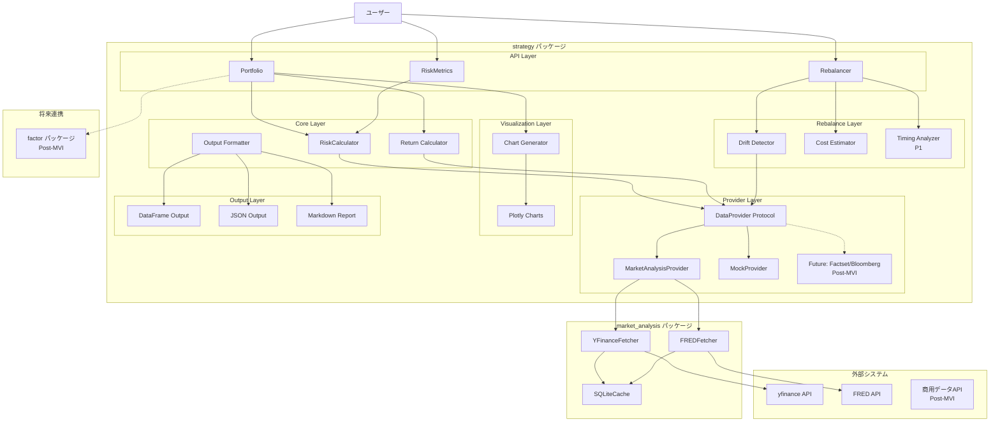
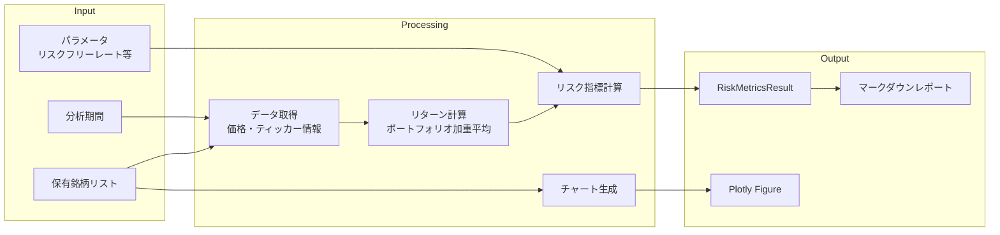
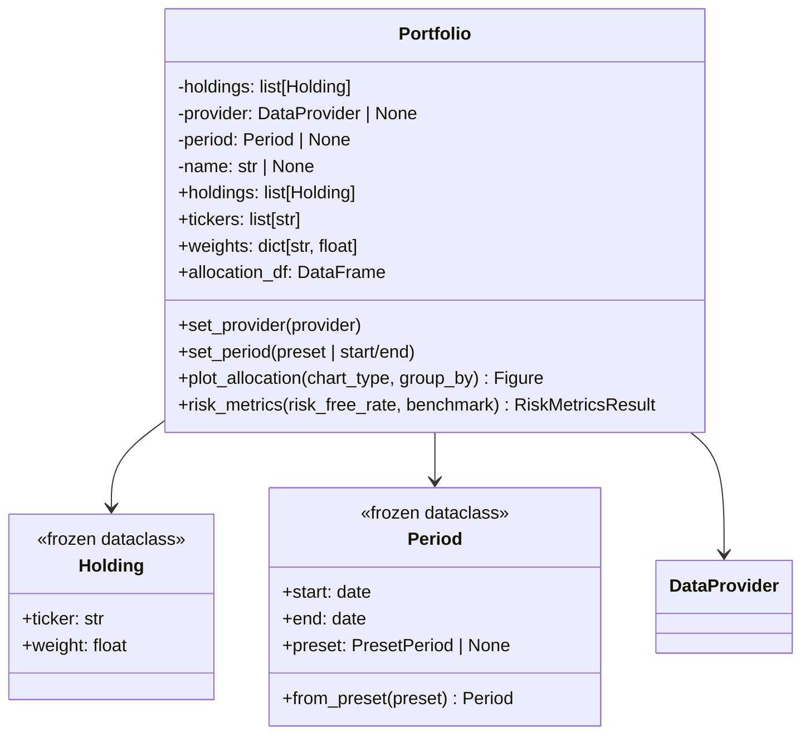
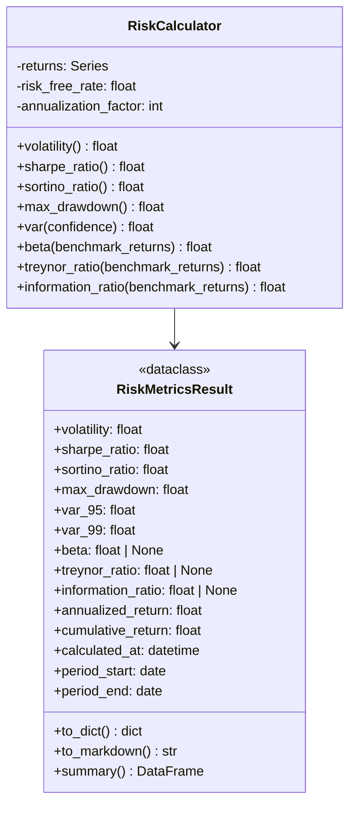
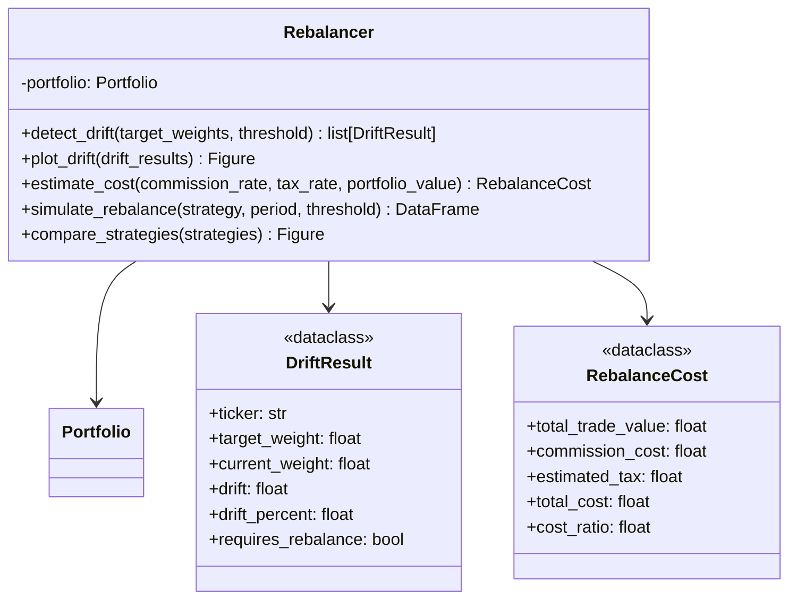
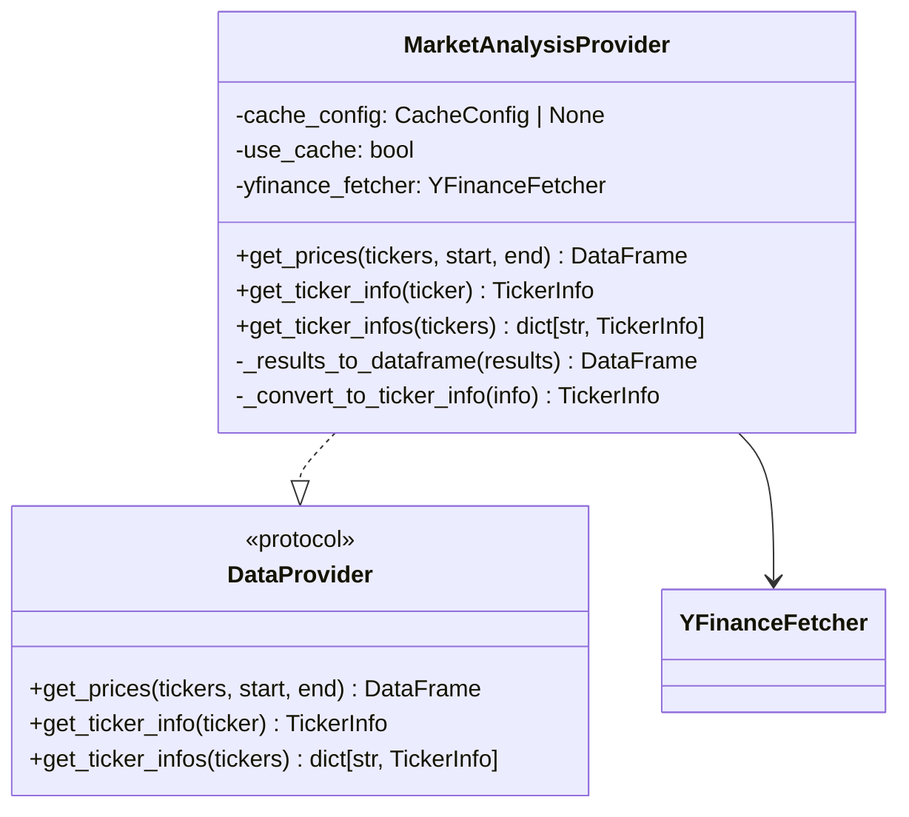
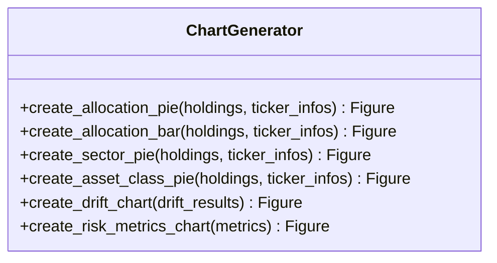
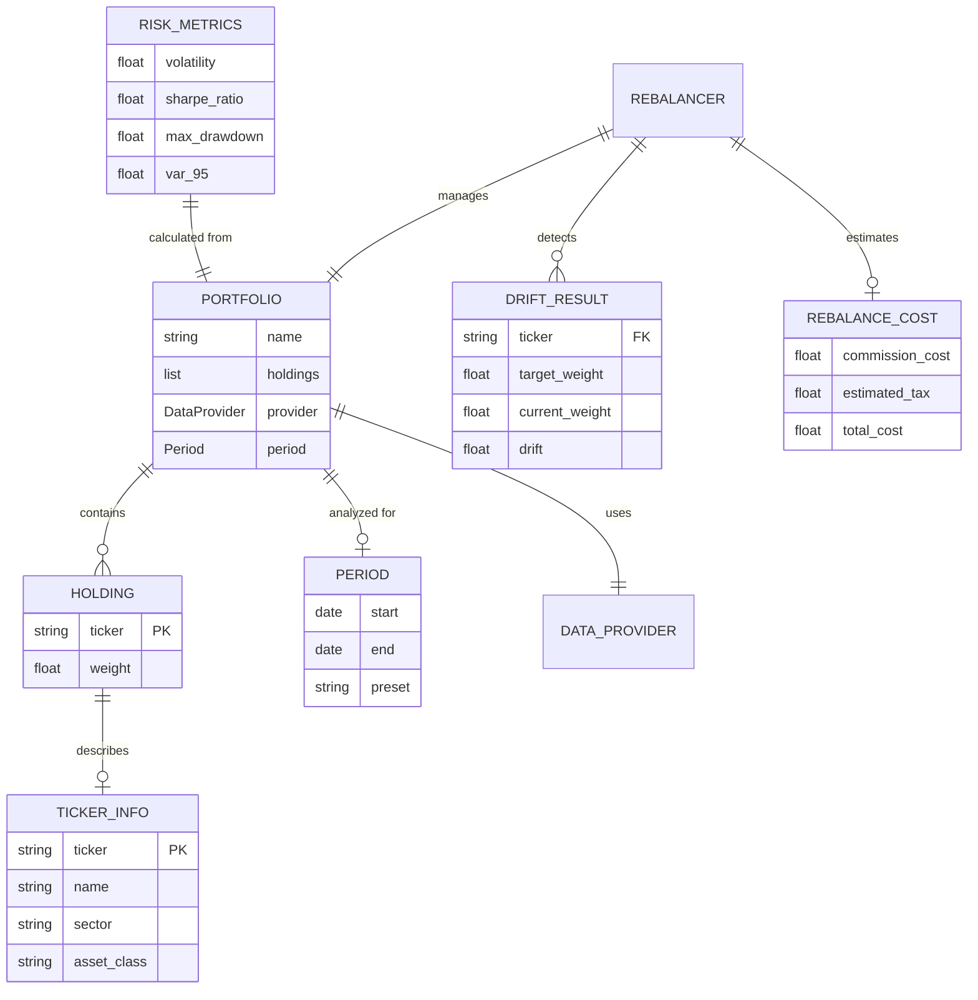
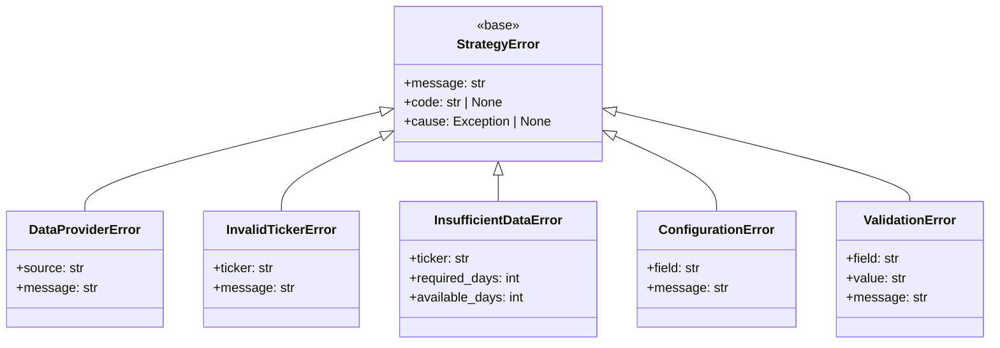

# アーキテクチャ設計書 (Architecture Design Document)

## 1. システムアーキテクチャ

### 1.1 全体構成図



### 1.2 レイヤー定義

| レイヤー | 責務 | 主要コンポーネント |
|----------|------|-------------------|
| API Layer | 公開インターフェース、入力バリデーション | Portfolio, RiskMetrics, Rebalancer |
| Core Layer | ビジネスロジック、リスク計算 | RiskCalculator, ReturnCalculator, Formatter |
| Rebalance Layer | リバランス分析ロジック | DriftDetector, CostEstimator, TimingAnalyzer |
| Provider Layer | データ取得の抽象化 | DataProvider Protocol, MarketAnalysisProvider |
| Visualization Layer | チャート生成 | ChartGenerator |
| Output Layer | 出力フォーマット変換 | DataFrame, JSON, Markdown Output |

### 1.3 データフロー



## 2. テクノロジースタック

### 2.1 言語・ランタイム

| 技術 | バージョン | 選定理由 |
|------|-----------|----------|
| Python | 3.12+ | 型ヒントの改善（PEP 695）、Protocol サポート、パフォーマンス向上 |
| uv | latest | Rustベース高速パッケージ管理、pyproject.toml統合 |

### 2.2 コア依存ライブラリ

| ライブラリ | バージョン | 用途 | 選定理由 |
|-----------|-----------|------|----------|
| pandas | >=2.0 | データ処理 | 金融データ分析の標準、DataFrame操作の効率性 |
| numpy | >=1.26 | 数値計算 | ベクトル化計算によるパフォーマンス |
| scipy | >=1.11 | 統計計算 | VaR計算（正規分布）、相関計算 |
| plotly | >=5.18 | インタラクティブ可視化 | 資産配分円グラフ、リスク指標チャート、marimo連携 |
| market_analysis | internal | データ取得 | 既存のキャッシュ機構・リトライ機能を再利用、yfinance/FREDラッパー |

### 2.3 開発ツール

| ツール | バージョン | 用途 | 選定理由 |
|--------|-----------|------|----------|
| Ruff | latest | リント・フォーマット | 高速（Rust）、Black/isort/Flake8統合 |
| pyright | latest (strict) | 型チェック | 厳密な型検査、VS Code統合 |
| pytest | >=8.0 | テスト | Python標準、豊富なプラグイン |
| Hypothesis | >=6.100 | プロパティテスト | エッジケース自動検出、リスク計算の検証 |
| pytest-cov | >=4.1 | カバレッジ | テストカバレッジ計測 |

## 3. レイヤードアーキテクチャ詳細

### 3.1 依存関係ルール

```
API Layer → Core Layer → Provider Layer
    ↓            ↓
Rebalance    Visualization
  Layer         Layer
    ↓            ↓
  types.py   types.py
```

**許可される依存**:
- 上位レイヤーから下位レイヤーへの依存
- 同一レイヤー内のユーティリティへの依存
- 全レイヤーから `types.py`, `errors.py` への依存

**禁止される依存**:
- 下位レイヤーから上位レイヤーへの依存
- Provider Layer から直接外部APIへのアクセス（market_analysis経由必須）
- 循環依存

### 3.2 API Layer

**責務**:
- 公開インターフェースの提供
- 入力パラメータのバリデーション
- 結果の型変換とエラーラッピング

```python
# src/strategy/__init__.py での公開API
from strategy.portfolio import Portfolio
from strategy.risk.metrics import RiskMetricsResult
from strategy.rebalance import Rebalancer
from strategy.providers import DataProvider, MarketAnalysisProvider, MockProvider
from strategy.types import Holding, TickerInfo, Period
from strategy.errors import StrategyError, DataProviderError, InvalidTickerError
```

### 3.3 Core Layer

**責務**:
- リスク指標計算のオーケストレーション
- ポートフォリオリターン計算
- 出力フォーマット変換

**主要コンポーネント**:

| コンポーネント | 責務 |
|---------------|------|
| RiskCalculator | 各種リスク指標の計算（ボラティリティ、シャープレシオ、VaR等） |
| ReturnCalculator | ポートフォリオリターンの加重平均計算 |
| Formatter | DataFrame/JSON/Markdown への変換 |

### 3.4 Rebalance Layer

**責務**:
- 配分ドリフトの検出
- リバランスコストの概算
- リバランスタイミングの分析（P1）

**主要コンポーネント**:

| コンポーネント | 責務 | 優先度 |
|---------------|------|--------|
| DriftDetector | 目標配分との乖離を計算 | P0 |
| CostEstimator | 取引コスト・税金の概算 | P1 |
| TimingAnalyzer | リバランス戦略のシミュレーション | P1 |

### 3.5 Provider Layer

**責務**:
- データソースの抽象化
- DataProvider プロトコルの実装
- market_analysis パッケージとの連携

**DataProvider プロトコル**:

```python
class DataProvider(Protocol):
    """データプロバイダーの抽象インターフェース.

    market_analysis パッケージ、テスト用モック、将来の商用プロバイダーなど、
    異なるデータソースを統一的に扱うためのプロトコル。
    """

    def get_prices(
        self,
        tickers: list[str],
        start: str,
        end: str,
    ) -> pd.DataFrame:
        """指定期間の価格データ（OHLCV）を取得.

        Parameters
        ----------
        tickers : list[str]
            取得するティッカーシンボルのリスト
        start : str
            開始日（YYYY-MM-DD形式）
        end : str
            終了日（YYYY-MM-DD形式）

        Returns
        -------
        pd.DataFrame
            MultiIndex DataFrame（columns: ticker, rows: date）
            各ティッカーに対して open, high, low, close, volume を含む
        """
        ...

    def get_ticker_info(self, ticker: str) -> TickerInfo:
        """ティッカーの情報（セクター、資産クラス等）を取得."""
        ...

    def get_ticker_infos(self, tickers: list[str]) -> dict[str, TickerInfo]:
        """複数ティッカーの情報を一括取得."""
        ...
```

**拡張ポイント**:

| 将来対応 | 拡張方法 |
|---------|----------|
| Factset | `FactsetProvider` 実装、同一プロトコル準拠 |
| Bloomberg | `BloombergProvider` 実装、同一プロトコル準拠 |
| Refinitiv | `RefinitivProvider` 実装、同一プロトコル準拠 |

## 4. コンポーネント設計

### 4.1 Portfolio クラス



### 4.2 RiskCalculator 設計



### 4.3 Rebalancer 設計



### 4.4 MarketAnalysisProvider 設計



### 4.5 ChartGenerator 設計



## 5. データモデル

### 5.1 エンティティ定義

```python
from dataclasses import dataclass
from datetime import date, datetime
from typing import Literal

type AssetClass = Literal["equity", "bond", "commodity", "real_estate", "cash", "other"]
type PresetPeriod = Literal["1y", "3y", "5y", "10y", "ytd", "max"]

@dataclass(frozen=True)
class Holding:
    """ポートフォリオ内の個別保有銘柄."""
    ticker: str        # ティッカーシンボル
    weight: float      # 配分比率（0.0-1.0）

@dataclass(frozen=True)
class TickerInfo:
    """ティッカーの詳細情報."""
    ticker: str
    name: str
    sector: str | None = None
    industry: str | None = None
    asset_class: AssetClass = "equity"

@dataclass(frozen=True)
class Period:
    """分析期間の定義."""
    start: date
    end: date
    preset: PresetPeriod | None = None

@dataclass
class RiskMetricsResult:
    """リスク指標の計算結果."""
    volatility: float
    sharpe_ratio: float
    sortino_ratio: float
    max_drawdown: float
    var_95: float
    var_99: float
    beta: float | None
    treynor_ratio: float | None
    information_ratio: float | None
    annualized_return: float
    cumulative_return: float
    calculated_at: datetime
    period_start: date
    period_end: date

@dataclass
class DriftResult:
    """配分ドリフトの分析結果."""
    ticker: str
    target_weight: float
    current_weight: float
    drift: float
    drift_percent: float
    requires_rebalance: bool

@dataclass
class RebalanceCost:
    """リバランスコストの概算結果."""
    total_trade_value: float
    commission_cost: float
    estimated_tax: float
    total_cost: float
    cost_ratio: float
```

### 5.2 ER図



## 6. パフォーマンス設計

### 6.1 パフォーマンス目標

| 操作 | データ規模 | 目標時間 | 測定環境 |
|------|-----------|---------|---------|
| リスク指標計算 | 10銘柄 x 5年日次 (12,500点) | 1秒以内 | CPU: 4コア、メモリ: 8GB |
| チャート生成 | 10銘柄のポートフォリオ | 500ms以内 | 同上 |
| ドリフト検出 | 10銘柄 | 100ms以内 | 同上 |
| コスト計算 | 10銘柄 | 50ms以内 | 同上 |
| データ取得（キャッシュヒット） | 10銘柄 x 5年 | 100ms以内 | 同上 |
| データ取得（キャッシュミス） | 10銘柄 x 5年 | 10秒以内 | ネットワーク依存 |

### 6.2 最適化戦略

| 領域 | 最適化手法 | 期待効果 |
|------|-----------|---------|
| データ取得 | market_analysis のキャッシュ活用 | 2回目以降 90%高速化 |
| リターン計算 | pandas ベクトル化操作 | ループ比 10-100x 高速 |
| リスク計算 | numpy/scipy ベクトル化 | 3-5x 高速化 |
| チャート生成 | Plotly Express 活用 | 記述量削減、最適化済み |

### 6.3 ベクトル化計算の原則

```python
# NG: ループ処理
def bad_portfolio_return(prices: pd.DataFrame, weights: dict) -> pd.Series:
    result = pd.Series(0.0, index=prices.index)
    for ticker, weight in weights.items():
        for i in range(1, len(prices)):
            result.iloc[i] += weight * (prices[ticker].iloc[i] / prices[ticker].iloc[i-1] - 1)
    return result

# OK: ベクトル化
def good_portfolio_return(prices: pd.DataFrame, weights: dict) -> pd.Series:
    returns = prices.pct_change()
    weight_series = pd.Series(weights)
    return (returns * weight_series).sum(axis=1)
```

### 6.4 メモリ使用量

| データ規模 | 入力データ | 処理中最大 | 上限 |
|-----------|-----------|-----------|------|
| 10銘柄 x 1,000日 | 0.8MB | 2.4MB | 100MB |
| 10銘柄 x 5,000日 | 4MB | 12MB | 100MB |
| 50銘柄 x 5,000日 | 20MB | 60MB | 100MB |

## 7. エラーハンドリング

### 7.1 エラー階層



### 7.2 エラー分類と対処

| エラー種別 | 原因 | 対処 | ユーザーメッセージ例 |
|-----------|------|------|-------------------|
| `ValidationError` | 不正な入力パラメータ | 処理中断 | `"Weight for 'VOO' must be between 0.0 and 1.0, got 1.5"` |
| `InvalidTickerError` | 無効なティッカー | 処理中断 | `"Invalid ticker symbol: 'INVALID'. Please check the symbol format."` |
| `DataProviderError` | API/ネットワーク障害 | 最大3回リトライ後中断 | `"Failed to fetch data: Connection timeout. Please try again later."` |
| `InsufficientDataError` | データ不足 | 警告表示、可能な範囲で計算 | `"Warning: Only 100 days of data available for 'VOO', need 252 for 1-year analysis."` |
| `ConfigurationError` | 設定不備 | 処理中断、設定方法を表示 | `"Provider not set. Call set_provider() before analysis."` |

### 7.3 警告の分類

```python
import warnings

class StrategyWarning(UserWarning):
    """strategy パッケージの基底警告クラス."""

class DataWarning(StrategyWarning):
    """データ関連の警告."""

class NormalizationWarning(StrategyWarning):
    """正規化関連の警告（比率の合計が1.0でない等）."""
```

## 8. キャッシュ設計

### 8.1 キャッシュ戦略

strategy パッケージは market_analysis パッケージのキャッシュ機構を活用します。

| データ種別 | キャッシュ方式 | TTL | 管理元 |
|-----------|--------------|-----|--------|
| 価格データ | SQLiteCache | 1時間 | market_analysis |
| ティッカー情報 | SQLiteCache | 24時間 | market_analysis |

### 8.2 キャッシュの利用

```python
# MarketAnalysisProvider でのキャッシュ活用
class MarketAnalysisProvider:
    def __init__(
        self,
        cache_config: CacheConfig | None = None,
        use_cache: bool = True,
    ) -> None:
        self._cache_config = cache_config or CacheConfig()
        self._use_cache = use_cache
        self._yfinance_fetcher = YFinanceFetcher(
            cache_config=self._cache_config,
        )
```

## 9. 拡張性設計

### 9.1 新規データプロバイダー追加

```python
# 将来の商用データプロバイダー実装例
class FactsetProvider:
    """Factset API 経由のデータプロバイダー（Post-MVI）."""

    def __init__(self, api_key: str, endpoint: str | None = None) -> None:
        self._api_key = api_key
        self._endpoint = endpoint or "https://api.factset.com"

    def get_prices(
        self,
        tickers: list[str],
        start: str,
        end: str,
    ) -> pd.DataFrame:
        """DataProvider プロトコルに準拠した価格データ取得."""
        ...

    def get_ticker_info(self, ticker: str) -> TickerInfo:
        """DataProvider プロトコルに準拠したティッカー情報取得."""
        ...


class BloombergProvider:
    """Bloomberg API 経由のデータプロバイダー（Post-MVI）."""

    def __init__(self, connection_string: str) -> None:
        self._connection_string = connection_string

    # DataProvider プロトコルに準拠したメソッドを実装
    ...
```

### 9.2 factor パッケージ連携インターフェース

```python
# Post-MVI: factor パッケージとの連携
class FactorIntegration:
    """factor パッケージとの連携インターフェース."""

    @staticmethod
    def from_factor_signal(
        signal: "FactorSignal",
        portfolio_value: float,
    ) -> Portfolio:
        """ファクターシグナルからポートフォリオを構築.

        Parameters
        ----------
        signal : FactorSignal
            factor パッケージからのシグナル
        portfolio_value : float
            ポートフォリオの時価総額

        Returns
        -------
        Portfolio
            シグナルに基づいたポートフォリオ
        """
        holdings = [
            Holding(ticker=ticker, weight=weight)
            for ticker, weight in signal.signals.items()
        ]
        return Portfolio(holdings=holdings)

    @staticmethod
    def apply_factor_tilt(
        portfolio: Portfolio,
        factor_values: pd.DataFrame,
        tilt_strength: float = 0.1,
    ) -> Portfolio:
        """ファクターティルトを適用したポートフォリオを返す."""
        ...
```

### 9.3 リバランス戦略の拡張（P1）

```python
# リバランス戦略のシミュレーション（P1）
class RebalanceStrategy(Protocol):
    """リバランス戦略のプロトコル."""

    def should_rebalance(
        self,
        current_weights: dict[str, float],
        target_weights: dict[str, float],
        date: date,
    ) -> bool:
        """リバランスを実行すべきかを判定."""
        ...


class PeriodicRebalanceStrategy:
    """定期リバランス戦略."""

    def __init__(self, frequency: Literal["monthly", "quarterly", "yearly"]) -> None:
        self.frequency = frequency


class ThresholdRebalanceStrategy:
    """閾値ベースリバランス戦略."""

    def __init__(self, threshold: float = 0.05) -> None:
        self.threshold = threshold
```

## 10. テスト戦略

### 10.1 テスト分類

| テスト種別 | 対象 | ツール | カバレッジ目標 |
|-----------|------|--------|--------------|
| ユニットテスト | 個別関数・クラス | pytest | 80% |
| プロパティテスト | 不変条件・境界値 | Hypothesis | 主要関数 |
| 統合テスト | API全体フロー | pytest + モック | 主要シナリオ |

### 10.2 テストケース例

**ユニットテスト**:
```python
# tests/strategy/unit/test_risk_calculator.py
def test_sharpe_ratio_positive_returns():
    """正のリターンでシャープレシオが正になることを確認."""
    returns = pd.Series([0.01, 0.02, 0.01, 0.03, 0.01])
    calculator = RiskCalculator(returns, risk_free_rate=0.0)
    assert calculator.sharpe_ratio() > 0

def test_max_drawdown_always_non_positive():
    """最大ドローダウンが常に0以下であることを確認."""
    returns = pd.Series([0.01, -0.02, 0.01, -0.03, 0.01])
    calculator = RiskCalculator(returns)
    assert calculator.max_drawdown() <= 0

def test_var_95_less_than_var_99():
    """95% VaRが99% VaRより小さい（絶対値は大きい）ことを確認."""
    returns = pd.Series(np.random.normal(0, 0.01, 1000))
    calculator = RiskCalculator(returns)
    assert calculator.var(0.95) > calculator.var(0.99)  # より負に近い
```

**プロパティテスト**:
```python
# tests/strategy/property/test_portfolio.py
from hypothesis import given, strategies as st

@given(st.lists(st.floats(min_value=0.01, max_value=1.0), min_size=2, max_size=10))
def test_weights_normalize_to_one(weights):
    """正規化後の比率合計が1.0になることを確認."""
    normalized = normalize_weights(weights)
    assert abs(sum(normalized) - 1.0) < 1e-10

@given(st.lists(st.floats(min_value=-0.1, max_value=0.1), min_size=100))
def test_max_drawdown_bounds(returns):
    """最大ドローダウンが -1.0 から 0.0 の範囲内であることを確認."""
    returns_series = pd.Series(returns)
    mdd = calculate_max_drawdown(returns_series)
    assert -1.0 <= mdd <= 0.0
```

**統合テスト**:
```python
# tests/strategy/integration/test_end_to_end.py
@pytest.mark.integration
def test_portfolio_analysis_with_mock_provider():
    """モックプロバイダーでのポートフォリオ分析が正常に完了することを確認."""
    provider = MockProvider(sample_prices, sample_ticker_infos)
    portfolio = Portfolio(
        holdings=[("VOO", 0.6), ("BND", 0.4)],
        provider=provider,
    )
    portfolio.set_period("1y")

    metrics = portfolio.risk_metrics()

    assert metrics.volatility > 0
    assert -1.0 <= metrics.max_drawdown <= 0.0
    assert metrics.var_95 < 0
```

### 10.3 テストディレクトリ構成

```
tests/strategy/
├── unit/
│   ├── test_portfolio.py
│   ├── test_risk_calculator.py
│   ├── test_rebalancer.py
│   ├── test_drift_detector.py
│   ├── test_cost_estimator.py
│   └── test_chart_generator.py
├── property/
│   ├── test_portfolio.py
│   ├── test_risk_calculator.py
│   └── test_rebalancer.py
├── integration/
│   └── test_end_to_end.py
└── conftest.py
```

## 11. ファイル構造

### 11.1 パッケージ構成

```
src/strategy/
├── __init__.py              # パッケージ公開API
├── py.typed                 # PEP 561 マーカー
├── types.py                 # 共通型定義（Holding, TickerInfo, Period等）
├── errors.py                # エラークラス定義
├── portfolio.py             # Portfolio クラス
├── risk/
│   ├── __init__.py
│   ├── calculator.py        # RiskCalculator
│   └── metrics.py           # RiskMetricsResult
├── rebalance/
│   ├── __init__.py
│   ├── rebalancer.py        # Rebalancer
│   ├── drift.py             # DriftResult, DriftDetector
│   └── cost.py              # RebalanceCost, CostEstimator
├── providers/
│   ├── __init__.py
│   ├── protocol.py          # DataProvider プロトコル
│   ├── market_analysis.py   # MarketAnalysisProvider
│   └── mock.py              # MockProvider（テスト用）
├── visualization/
│   ├── __init__.py
│   └── charts.py            # ChartGenerator
├── output/
│   ├── __init__.py
│   ├── dataframe.py         # DataFrame出力
│   ├── json.py              # JSON出力
│   └── markdown.py          # Markdown出力
├── utils/
│   ├── __init__.py
│   └── logging_config.py    # ロギング設定
└── docs/
    ├── project.md
    ├── library-requirements.md
    ├── functional-design.md
    └── architecture.md
```

### 11.2 公開API一覧

```python
# src/strategy/__init__.py
__all__ = [
    # Main Classes
    "Portfolio",
    "Rebalancer",
    # Risk
    "RiskMetricsResult",
    # Providers
    "DataProvider",
    "MarketAnalysisProvider",
    "MockProvider",
    # Types
    "Holding",
    "TickerInfo",
    "Period",
    "AssetClass",
    "PresetPeriod",
    # Rebalance
    "DriftResult",
    "RebalanceCost",
    # Errors
    "StrategyError",
    "DataProviderError",
    "InvalidTickerError",
    "InsufficientDataError",
    "ConfigurationError",
    "ValidationError",
    # Warnings
    "StrategyWarning",
    "DataWarning",
    "NormalizationWarning",
]
```

## 12. セキュリティ考慮事項

### 12.1 データ保護

| 対象 | 保護方法 |
|------|---------|
| キャッシュファイル | market_analysis パッケージの管理下（600パーミッション） |
| API認証情報 | 環境変数管理（将来の商用API対応時） |
| ユーザーデータ | ポートフォリオ情報はメモリ上のみ、永続化しない |

### 12.2 入力検証

```python
# 全ての公開APIで入力検証を実施
def validate_holdings(holdings: list[tuple[str, float]] | list[Holding]) -> list[Holding]:
    """保有銘柄リストのバリデーション."""
    result = []
    for item in holdings:
        if isinstance(item, tuple):
            ticker, weight = item
        else:
            ticker, weight = item.ticker, item.weight

        if not ticker or not ticker.strip():
            raise ValidationError(
                field="ticker",
                value=repr(ticker),
                message="Ticker symbol cannot be empty",
            )
        if not 0.0 <= weight <= 1.0:
            raise ValidationError(
                field="weight",
                value=str(weight),
                message=f"Weight for '{ticker}' must be between 0.0 and 1.0",
            )
        result.append(Holding(ticker=ticker.upper(), weight=weight))

    return result


def validate_period(
    preset: PresetPeriod | None,
    start: str | None,
    end: str | None,
) -> Period:
    """分析期間のバリデーション."""
    if preset and (start or end):
        raise ValidationError(
            field="period",
            value=f"preset={preset}, start={start}, end={end}",
            message="Cannot specify both preset and start/end",
        )
    if not preset and not (start and end):
        raise ValidationError(
            field="period",
            value="",
            message="Must specify either preset or both start and end",
        )
    ...
```

## 13. 非機能要件との対応

| LRD要件 | アーキテクチャ対応 |
|---------|-----------------|
| リスク指標計算: 5年分データで1秒以内 | ベクトル化計算、numpy/scipy活用 |
| チャート生成: 500ms以内 | Plotly Express、最適化済みテンプレート |
| メモリ: 10銘柄x5年で100MB以内 | 不要なコピー回避、効率的なpandas操作 |
| Python 3.12+ | PEP 695型ヒント、Protocol活用 |
| テストカバレッジ 80% | pytest + Hypothesis、CI統合 |
| 型カバレッジ 100% | pyright strict、py.typed |

## 14. 将来の拡張ロードマップ

### Phase 1: MVI (現在)
- Portfolio クラス
- RiskCalculator（ボラティリティ、シャープレシオ、VaR等）
- MarketAnalysisProvider
- 資産配分可視化
- 配分ドリフト検出

### Phase 2: P1
- リバランスコスト計算
- リバランスタイミング分析
- 戦略シミュレーション

### Phase 3: Post-MVI (P2)
- factor パッケージ連携
- 商用データプロバイダー（Factset, Bloomberg）
- バックテストエンジン
- 最適化アルゴリズム（平均分散、リスクパリティ）

## 15. 品質チェックリスト

- [x] すべての技術選定に理由が記載されている
- [x] レイヤードアーキテクチャが明確に定義されている
- [x] DataProvider プロトコルによるデータソース抽象化
- [x] market_analysis パッケージとの疎結合連携
- [x] パフォーマンス要件が測定可能である
- [x] セキュリティ考慮事項が記載されている
- [x] 拡張性が考慮されている（商用データプロバイダー対応）
- [x] factor パッケージとの連携可能性が考慮されている
- [x] キャッシュ戦略が定義されている
- [x] 依存関係管理のポリシーが明確である
- [x] テスト戦略が定義されている
