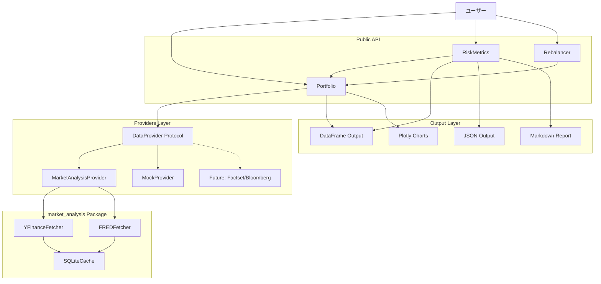
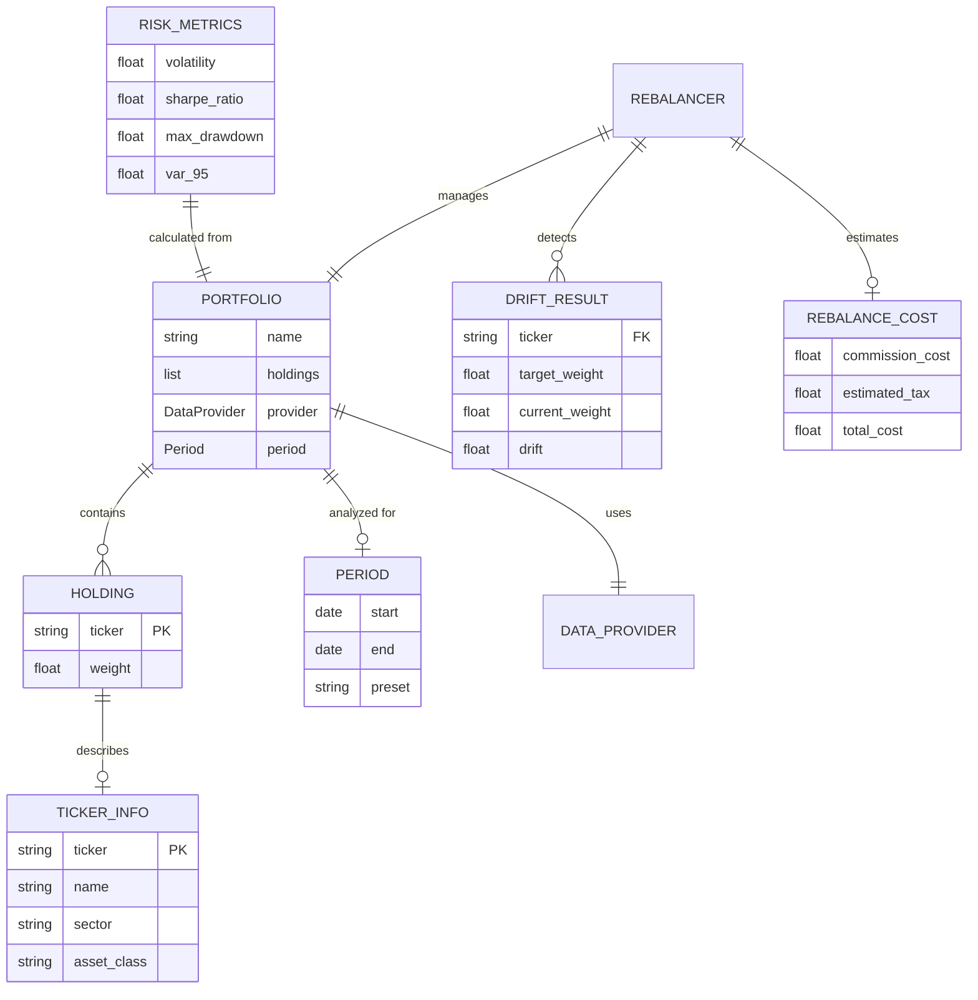
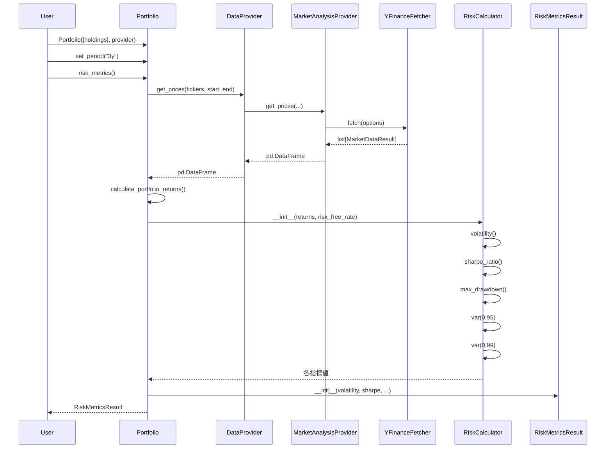
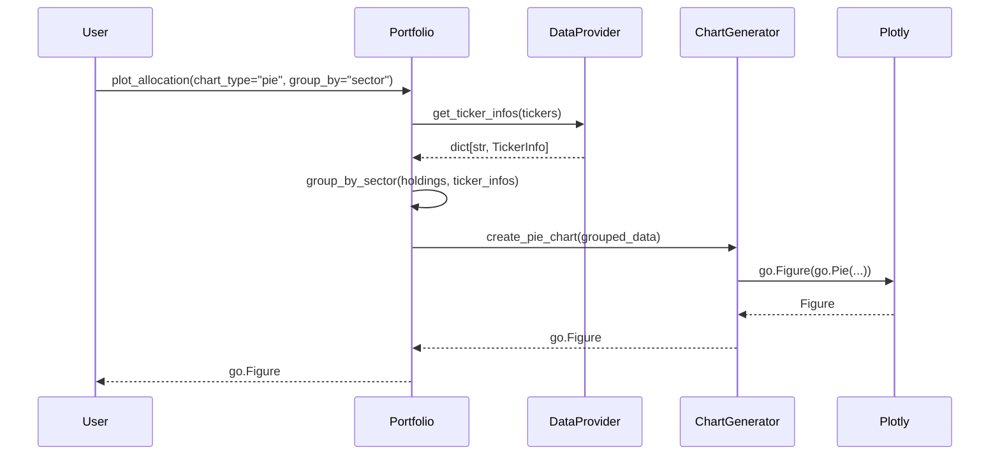
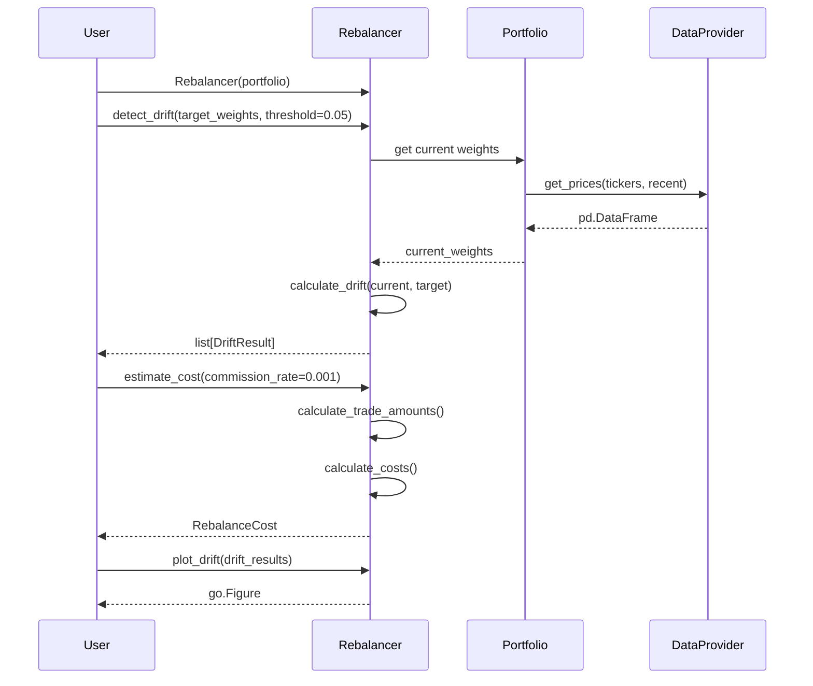
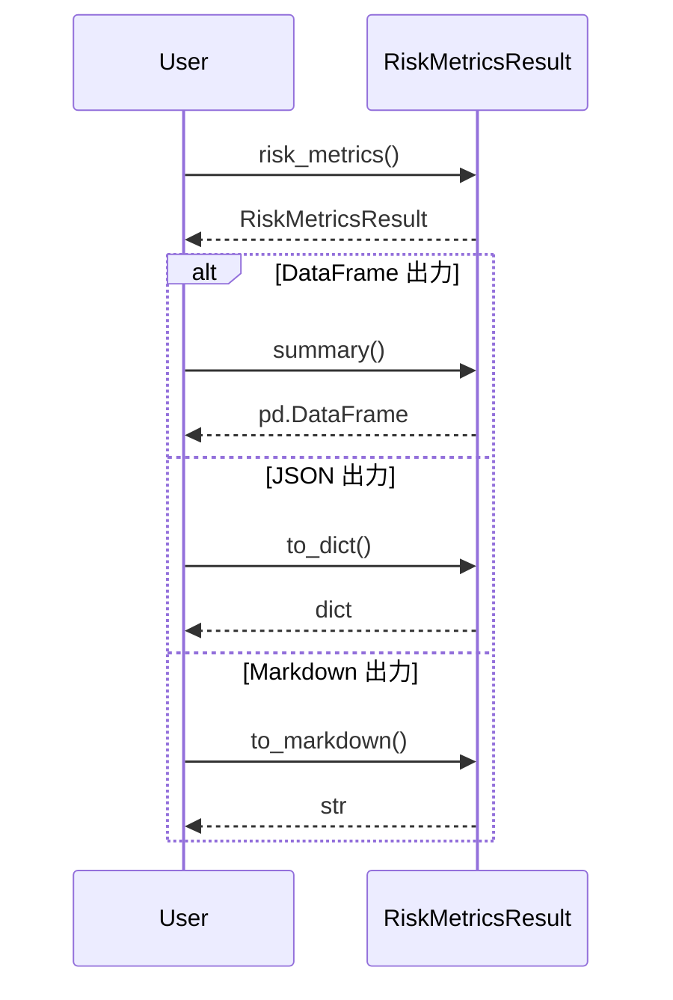

# 機能設計書 (Functional Design Document)

## システム概要

strategy パッケージは、ポートフォリオ管理・分析機能を提供するライブラリである。
DataProvider プロトコルによる抽象化されたデータ取得と、包括的なリスク指標計算、リバランス支援機能を提供する。

### 設計方針

1. **疎結合設計**: DataProvider プロトコルによりデータソースを抽象化
2. **多様な出力形式**: DataFrame、JSON、Plotly チャート、マークダウンテキストをサポート
3. **拡張性**: 将来的な商用データプロバイダー（Factset、Bloomberg 等）への対応を考慮

## システム構成図



## 技術スタック

| 分類             | 技術              | 選定理由                                     |
| ---------------- | ----------------- | -------------------------------------------- |
| 言語             | Python 3.12+      | 型ヒント改善、Protocol サポート              |
| パッケージ管理   | uv                | 高速、統合されたツール                       |
| データ処理       | pandas, numpy     | 金融データ分析の標準ライブラリ               |
| 可視化           | plotly            | インタラクティブなチャート、marimo 連携      |
| 統計計算         | scipy             | VaR 計算、統計分布                           |
| データ取得       | market_analysis   | 既存のキャッシュ機構・リトライ機能を再利用   |
| 型チェック       | pyright           | 厳密な型チェック                             |
| テスト           | pytest, Hypothesis| 標準的、プロパティベーステスト               |

## データモデル定義

### エンティティ: Holding (保有銘柄)

```python
from dataclasses import dataclass

@dataclass(frozen=True)
class Holding:
    """ポートフォリオ内の個別保有銘柄.

    Parameters
    ----------
    ticker : str
        ティッカーシンボル（例: "VOO", "BND"）
    weight : float
        ポートフォリオ内での比率（0.0 - 1.0）
    """
    ticker: str        # ティッカーシンボル
    weight: float      # 配分比率（0.0-1.0）

    def __post_init__(self) -> None:
        if not self.ticker or not self.ticker.strip():
            raise ValueError(f"ticker must be non-empty string, got {self.ticker!r}")
        if not 0.0 <= self.weight <= 1.0:
            raise ValueError(f"weight must be between 0.0 and 1.0, got {self.weight}")
```

**制約**:
- ticker: 非空文字列、大文字推奨
- weight: 0.0 以上 1.0 以下

### エンティティ: TickerInfo (銘柄情報)

```python
from dataclasses import dataclass
from typing import Literal

type AssetClass = Literal["equity", "bond", "commodity", "real_estate", "cash", "other"]

@dataclass(frozen=True)
class TickerInfo:
    """ティッカーの詳細情報.

    Parameters
    ----------
    ticker : str
        ティッカーシンボル
    name : str
        銘柄名（例: "Vanguard S&P 500 ETF"）
    sector : str | None
        セクター（例: "Technology"）
    industry : str | None
        業種（例: "Exchange Traded Fund"）
    asset_class : AssetClass
        資産クラス
    """
    ticker: str
    name: str
    sector: str | None = None
    industry: str | None = None
    asset_class: AssetClass = "equity"
```

### エンティティ: Period (分析期間)

```python
from dataclasses import dataclass
from datetime import date
from typing import Literal

type PresetPeriod = Literal["1y", "3y", "5y", "10y", "ytd", "max"]

@dataclass(frozen=True)
class Period:
    """分析期間の定義.

    Parameters
    ----------
    start : date
        開始日
    end : date
        終了日
    preset : PresetPeriod | None
        プリセット期間（設定時は start/end を自動計算）
    """
    start: date
    end: date
    preset: PresetPeriod | None = None

    @classmethod
    def from_preset(cls, preset: PresetPeriod) -> "Period":
        """プリセット期間から Period を作成."""
        ...
```

### エンティティ: RiskMetricsResult (リスク指標結果)

```python
from dataclasses import dataclass
from datetime import datetime

@dataclass
class RiskMetricsResult:
    """リスク指標の計算結果.

    Parameters
    ----------
    volatility : float
        年率ボラティリティ（標準偏差）
    sharpe_ratio : float
        シャープレシオ
    sortino_ratio : float
        ソルティノレシオ
    max_drawdown : float
        最大ドローダウン（負の値、例: -0.15 = -15%）
    var_95 : float
        95% VaR（負の値）
    var_99 : float
        99% VaR（負の値）
    beta : float | None
        ベータ値（ベンチマーク指定時のみ）
    treynor_ratio : float | None
        トレイナーレシオ（ベンチマーク指定時のみ）
    information_ratio : float | None
        情報レシオ（ベンチマーク指定時のみ）
    annualized_return : float
        年率リターン
    cumulative_return : float
        累積リターン
    calculated_at : datetime
        計算日時
    period_start : date
        分析期間開始日
    period_end : date
        分析期間終了日
    """
    volatility: float
    sharpe_ratio: float
    sortino_ratio: float
    max_drawdown: float
    var_95: float
    var_99: float
    beta: float | None
    treynor_ratio: float | None
    information_ratio: float | None
    annualized_return: float
    cumulative_return: float
    calculated_at: datetime
    period_start: date
    period_end: date

    def to_dict(self) -> dict[str, Any]:
        """辞書形式に変換（JSON出力用）."""
        ...

    def to_markdown(self) -> str:
        """マークダウン形式のレポートを生成."""
        ...

    def summary(self) -> pd.DataFrame:
        """全指標のサマリー DataFrame を返す."""
        ...
```

### エンティティ: DriftResult (配分ドリフト結果)

```python
from dataclasses import dataclass

@dataclass
class DriftResult:
    """配分ドリフトの分析結果.

    Parameters
    ----------
    ticker : str
        ティッカーシンボル
    target_weight : float
        目標配分比率
    current_weight : float
        現在の配分比率
    drift : float
        乖離幅（current - target）
    drift_percent : float
        乖離率（drift / target * 100）
    requires_rebalance : bool
        リバランス推奨フラグ
    """
    ticker: str
    target_weight: float
    current_weight: float
    drift: float
    drift_percent: float
    requires_rebalance: bool
```

### エンティティ: RebalanceCost (リバランスコスト)

```python
from dataclasses import dataclass

@dataclass
class RebalanceCost:
    """リバランスコストの概算結果.

    Parameters
    ----------
    total_trade_value : float
        総取引金額
    commission_cost : float
        手数料コスト
    estimated_tax : float
        推定税金（売却時のみ）
    total_cost : float
        総コスト（commission + tax）
    cost_ratio : float
        コスト率（total_cost / portfolio_value）
    """
    total_trade_value: float
    commission_cost: float
    estimated_tax: float
    total_cost: float
    cost_ratio: float
```

### ER図



## コンポーネント設計

### DataProvider プロトコル

**責務**:
- 価格データ（OHLCV）の取得インターフェースを定義
- ティッカー情報の取得インターフェースを定義
- データソース非依存の抽象化を提供

**インターフェース**:

```python
from typing import Protocol
import pandas as pd

class DataProvider(Protocol):
    """データ取得の抽象インターフェース.

    market_analysis パッケージ、テスト用モック、将来の商用プロバイダーなど、
    異なるデータソースを統一的に扱うためのプロトコル。

    Examples
    --------
    >>> provider = MarketAnalysisProvider()
    >>> prices = provider.get_prices(["VOO", "BND"], "2020-01-01", "2024-12-31")
    >>> info = provider.get_ticker_info("VOO")
    """

    def get_prices(
        self,
        tickers: list[str],
        start: str,
        end: str,
    ) -> pd.DataFrame:
        """指定期間の価格データを取得.

        Parameters
        ----------
        tickers : list[str]
            取得するティッカーシンボルのリスト
        start : str
            開始日（YYYY-MM-DD形式）
        end : str
            終了日（YYYY-MM-DD形式）

        Returns
        -------
        pd.DataFrame
            MultiIndex DataFrame
            - index: DatetimeIndex (取引日)
            - columns: MultiIndex (ticker, price_type)
            - price_type: open, high, low, close, volume

        Raises
        ------
        DataProviderError
            データ取得に失敗した場合
        InvalidTickerError
            無効なティッカーが含まれる場合
        """
        ...

    def get_ticker_info(self, ticker: str) -> TickerInfo:
        """ティッカーの情報を取得.

        Parameters
        ----------
        ticker : str
            ティッカーシンボル

        Returns
        -------
        TickerInfo
            ティッカー情報

        Raises
        ------
        InvalidTickerError
            無効なティッカーの場合
        """
        ...

    def get_ticker_infos(self, tickers: list[str]) -> dict[str, TickerInfo]:
        """複数ティッカーの情報を一括取得.

        Parameters
        ----------
        tickers : list[str]
            ティッカーシンボルのリスト

        Returns
        -------
        dict[str, TickerInfo]
            ティッカーをキーとした情報の辞書
        """
        ...
```

**拡張ポイント（将来対応）**:

```python
# 将来的な商用データプロバイダーの実装例
class FactsetProvider:
    """Factset API 経由のデータプロバイダー（P2）."""

    def __init__(self, api_key: str, endpoint: str | None = None) -> None:
        ...

class BloombergProvider:
    """Bloomberg API 経由のデータプロバイダー（P2）."""

    def __init__(self, connection_string: str) -> None:
        ...
```

### MarketAnalysisProvider

**責務**:
- market_analysis パッケージの YFinanceFetcher/FREDFetcher をラップ
- DataProvider プロトコルを実装
- キャッシュ機構を活用したデータ取得

**実装**:

```python
from market_analysis.core import YFinanceFetcher, FREDFetcher
from market_analysis.types import FetchOptions, CacheConfig

class MarketAnalysisProvider:
    """market_analysis パッケージを使用するデータプロバイダー.

    yfinance および FRED からデータを取得し、
    SQLite キャッシュを活用して効率的なデータアクセスを提供する。

    Parameters
    ----------
    cache_config : CacheConfig | None
        キャッシュ設定。None の場合はデフォルト設定を使用。
    use_cache : bool
        キャッシュを使用するかどうか（デフォルト: True）

    Examples
    --------
    >>> provider = MarketAnalysisProvider()
    >>> prices = provider.get_prices(["VOO", "BND"], "2020-01-01", "2024-12-31")
    """

    def __init__(
        self,
        cache_config: CacheConfig | None = None,
        use_cache: bool = True,
    ) -> None:
        self._cache_config = cache_config or CacheConfig()
        self._use_cache = use_cache
        self._yfinance_fetcher = YFinanceFetcher(
            cache_config=self._cache_config,
        )

    def get_prices(
        self,
        tickers: list[str],
        start: str,
        end: str,
    ) -> pd.DataFrame:
        """価格データを取得.

        内部で YFinanceFetcher を使用し、複数銘柄のデータを
        MultiIndex DataFrame として返す。
        """
        options = FetchOptions(
            symbols=tickers,
            start_date=start,
            end_date=end,
            use_cache=self._use_cache,
        )
        results = self._yfinance_fetcher.fetch(options)

        # 結果を MultiIndex DataFrame に変換
        return self._results_to_dataframe(results)

    def get_ticker_info(self, ticker: str) -> TickerInfo:
        """ティッカー情報を取得.

        yfinance の ticker.info を使用して情報を取得し、
        TickerInfo オブジェクトに変換する。
        """
        ...

    def _results_to_dataframe(
        self,
        results: list[MarketDataResult],
    ) -> pd.DataFrame:
        """MarketDataResult リストを MultiIndex DataFrame に変換."""
        ...
```

**依存関係**:
- market_analysis.core.YFinanceFetcher
- market_analysis.core.FREDFetcher
- market_analysis.types.FetchOptions, CacheConfig

### Portfolio

**責務**:
- ポートフォリオの構成管理
- 資産配分の分析と可視化
- リスク指標計算の起点

**インターフェース**:

```python
from typing import overload

class Portfolio:
    """ポートフォリオ管理クラス.

    保有銘柄と比率を管理し、資産配分分析やリスク指標計算を提供する。

    Parameters
    ----------
    holdings : list[tuple[str, float]] | list[Holding]
        保有銘柄のリスト。(ticker, weight) タプルまたは Holding オブジェクト
    provider : DataProvider | None
        データプロバイダー。None の場合は後から set_provider で設定
    name : str | None
        ポートフォリオ名（任意）
    normalize : bool
        比率の合計が1.0でない場合に自動正規化するか（デフォルト: False）

    Examples
    --------
    >>> portfolio = Portfolio([
    ...     ("VOO", 0.4),
    ...     ("VEA", 0.2),
    ...     ("BND", 0.3),
    ...     ("GLD", 0.1),
    ... ])
    >>> portfolio.set_provider(MarketAnalysisProvider())
    >>> portfolio.set_period("3y")
    >>> metrics = portfolio.risk_metrics()
    """

    def __init__(
        self,
        holdings: list[tuple[str, float]] | list[Holding],
        provider: DataProvider | None = None,
        name: str | None = None,
        normalize: bool = False,
    ) -> None:
        ...

    @property
    def holdings(self) -> list[Holding]:
        """保有銘柄のリストを返す."""
        ...

    @property
    def tickers(self) -> list[str]:
        """ティッカーシンボルのリストを返す."""
        ...

    @property
    def weights(self) -> dict[str, float]:
        """ティッカーと比率の辞書を返す."""
        ...

    @property
    def allocation_df(self) -> pd.DataFrame:
        """資産配分を DataFrame で返す."""
        ...

    def set_provider(self, provider: DataProvider) -> None:
        """データプロバイダーを設定."""
        ...

    @overload
    def set_period(self, preset: PresetPeriod) -> None: ...

    @overload
    def set_period(self, *, start: str, end: str) -> None: ...

    def set_period(
        self,
        preset: PresetPeriod | None = None,
        *,
        start: str | None = None,
        end: str | None = None,
    ) -> None:
        """分析期間を設定.

        Parameters
        ----------
        preset : PresetPeriod | None
            プリセット期間（"1y", "3y", "5y", "10y", "ytd", "max"）
        start : str | None
            開始日（YYYY-MM-DD形式）
        end : str | None
            終了日（YYYY-MM-DD形式）

        Raises
        ------
        ValueError
            preset と start/end を同時に指定した場合
            preset も start/end も指定しなかった場合

        Warnings
        --------
        データが不足している場合は利用可能な最大期間で計算し警告を出す
        """
        ...

    def plot_allocation(
        self,
        chart_type: Literal["pie", "bar"] = "pie",
        group_by: Literal["ticker", "sector", "asset_class"] | None = None,
    ) -> go.Figure:
        """資産配分をチャートで可視化.

        Parameters
        ----------
        chart_type : "pie" | "bar"
            チャートタイプ
        group_by : "ticker" | "sector" | "asset_class" | None
            グループ化の基準。None の場合はティッカー別

        Returns
        -------
        go.Figure
            Plotly Figure オブジェクト
        """
        ...

    def risk_metrics(
        self,
        risk_free_rate: float = 0.0,
        benchmark: str | None = None,
    ) -> RiskMetricsResult:
        """リスク指標を計算.

        Parameters
        ----------
        risk_free_rate : float
            リスクフリーレート（年率、デフォルト: 0.0）
        benchmark : str | None
            ベンチマークのティッカー（例: "^GSPC"）
            指定時はベータ、トレイナーレシオ、情報レシオを計算

        Returns
        -------
        RiskMetricsResult
            計算されたリスク指標
        """
        ...

    def __repr__(self) -> str:
        """ポートフォリオの文字列表現."""
        ...

    def __str__(self) -> str:
        """ポートフォリオの人間可読な文字列表現."""
        ...
```

**依存関係**:
- DataProvider（プロトコル）
- RiskCalculator（内部コンポーネント）
- ChartGenerator（内部コンポーネント）

### RiskCalculator

**責務**:
- 各種リスク指標の計算ロジック
- 統計計算の実装

**インターフェース**:

```python
class RiskCalculator:
    """リスク指標計算クラス（内部コンポーネント）.

    ポートフォリオのリターンデータから各種リスク指標を計算する。
    """

    def __init__(
        self,
        returns: pd.Series,
        risk_free_rate: float = 0.0,
        annualization_factor: int = 252,
    ) -> None:
        """初期化.

        Parameters
        ----------
        returns : pd.Series
            日次リターンの時系列
        risk_free_rate : float
            年率リスクフリーレート
        annualization_factor : int
            年率化係数（日次=252, 週次=52, 月次=12）
        """
        ...

    def volatility(self) -> float:
        """年率ボラティリティを計算."""
        ...

    def sharpe_ratio(self) -> float:
        """シャープレシオを計算."""
        ...

    def sortino_ratio(self) -> float:
        """ソルティノレシオを計算（下方偏差を使用）."""
        ...

    def max_drawdown(self) -> float:
        """最大ドローダウンを計算."""
        ...

    def var(self, confidence: float = 0.95) -> float:
        """VaR（Value at Risk）を計算.

        Parameters
        ----------
        confidence : float
            信頼水準（デフォルト: 0.95）

        Returns
        -------
        float
            VaR（負の値）
        """
        ...

    def beta(self, benchmark_returns: pd.Series) -> float:
        """ベータ値を計算."""
        ...

    def treynor_ratio(self, benchmark_returns: pd.Series) -> float:
        """トレイナーレシオを計算."""
        ...

    def information_ratio(self, benchmark_returns: pd.Series) -> float:
        """情報レシオを計算."""
        ...
```

### Rebalancer

**責務**:
- 配分ドリフトの検出
- リバランスコストの計算
- リバランスタイミングの分析

**インターフェース**:

```python
class Rebalancer:
    """リバランス分析クラス.

    ポートフォリオの配分ドリフト検出、コスト計算、
    タイミング分析を提供する。

    Parameters
    ----------
    portfolio : Portfolio
        分析対象のポートフォリオ

    Examples
    --------
    >>> rebalancer = Rebalancer(portfolio)
    >>> drift = rebalancer.detect_drift(
    ...     target_weights={"VOO": 0.4, "VEA": 0.2, "BND": 0.3, "GLD": 0.1}
    ... )
    >>> cost = rebalancer.estimate_cost(commission_rate=0.001)
    """

    def __init__(self, portfolio: Portfolio) -> None:
        ...

    def detect_drift(
        self,
        target_weights: dict[str, float],
        threshold: float = 0.05,
    ) -> list[DriftResult]:
        """配分ドリフトを検出.

        Parameters
        ----------
        target_weights : dict[str, float]
            目標配分比率（ティッカー -> 比率）
        threshold : float
            リバランス推奨の閾値（絶対値、デフォルト: 0.05 = 5%）

        Returns
        -------
        list[DriftResult]
            各銘柄のドリフト分析結果
        """
        ...

    def plot_drift(
        self,
        drift_results: list[DriftResult],
    ) -> go.Figure:
        """配分ドリフトを棒グラフで可視化."""
        ...

    def estimate_cost(
        self,
        commission_rate: float = 0.001,
        tax_rate: float = 0.20315,
        portfolio_value: float | None = None,
    ) -> RebalanceCost:
        """リバランスコストを概算.

        Parameters
        ----------
        commission_rate : float
            取引手数料率（デフォルト: 0.1%）
        tax_rate : float
            売却益への税率（デフォルト: 20.315%）
        portfolio_value : float | None
            ポートフォリオの時価総額。None の場合は 1,000,000 と仮定

        Returns
        -------
        RebalanceCost
            コストの概算結果
        """
        ...

    def simulate_rebalance(
        self,
        strategy: Literal["periodic", "threshold"],
        period: Literal["monthly", "quarterly", "yearly"] | None = None,
        threshold: float | None = None,
        start: str | None = None,
        end: str | None = None,
    ) -> pd.DataFrame:
        """リバランス戦略のシミュレーション（P1）.

        Parameters
        ----------
        strategy : "periodic" | "threshold"
            リバランス戦略
        period : "monthly" | "quarterly" | "yearly" | None
            定期リバランスの頻度
        threshold : float | None
            閾値リバランスの閾値
        start : str | None
            シミュレーション開始日
        end : str | None
            シミュレーション終了日

        Returns
        -------
        pd.DataFrame
            シミュレーション結果
            columns: date, strategy, portfolio_value, num_rebalances
        """
        ...

    def compare_strategies(
        self,
        strategies: list[dict],
    ) -> go.Figure:
        """複数のリバランス戦略を比較するチャート（P1）."""
        ...
```

## アルゴリズム設計

### リスク指標計算

#### ボラティリティ（年率標準偏差）

**目的**: ポートフォリオのリターンの変動性を年率で表現

**計算ロジック**:

```python
def calculate_volatility(
    returns: pd.Series,
    annualization_factor: int = 252,
) -> float:
    """年率ボラティリティを計算.

    Parameters
    ----------
    returns : pd.Series
        日次リターン（対数リターンまたは単純リターン）
    annualization_factor : int
        年率化係数（日次=252）

    Returns
    -------
    float
        年率ボラティリティ

    Formula
    -------
    volatility = std(returns) * sqrt(annualization_factor)
    """
    return returns.std() * np.sqrt(annualization_factor)
```

#### シャープレシオ

**目的**: リスク調整後リターンを評価

**計算ロジック**:

```python
def calculate_sharpe_ratio(
    returns: pd.Series,
    risk_free_rate: float = 0.0,
    annualization_factor: int = 252,
) -> float:
    """シャープレシオを計算.

    Parameters
    ----------
    returns : pd.Series
        日次リターン
    risk_free_rate : float
        年率リスクフリーレート
    annualization_factor : int
        年率化係数

    Returns
    -------
    float
        シャープレシオ

    Formula
    -------
    daily_rf = risk_free_rate / annualization_factor
    excess_return = mean(returns) - daily_rf
    sharpe = (excess_return / std(returns)) * sqrt(annualization_factor)
    """
    daily_rf = risk_free_rate / annualization_factor
    excess_returns = returns - daily_rf
    return (excess_returns.mean() / excess_returns.std()) * np.sqrt(annualization_factor)
```

#### ソルティノレシオ

**目的**: 下方リスクに対するリターンを評価

**計算ロジック**:

```python
def calculate_sortino_ratio(
    returns: pd.Series,
    risk_free_rate: float = 0.0,
    annualization_factor: int = 252,
) -> float:
    """ソルティノレシオを計算.

    Parameters
    ----------
    returns : pd.Series
        日次リターン
    risk_free_rate : float
        年率リスクフリーレート
    annualization_factor : int
        年率化係数

    Returns
    -------
    float
        ソルティノレシオ

    Formula
    -------
    daily_rf = risk_free_rate / annualization_factor
    excess_return = mean(returns) - daily_rf
    downside_returns = returns[returns < 0]
    downside_std = std(downside_returns)
    sortino = (excess_return / downside_std) * sqrt(annualization_factor)
    """
    daily_rf = risk_free_rate / annualization_factor
    excess_return = returns.mean() - daily_rf
    downside_returns = returns[returns < 0]
    downside_std = downside_returns.std()
    if downside_std == 0:
        return float('inf') if excess_return > 0 else 0.0
    return (excess_return / downside_std) * np.sqrt(annualization_factor)
```

#### 最大ドローダウン (MDD)

**目的**: 最大の資産減少幅を評価

**計算ロジック**:

```python
def calculate_max_drawdown(returns: pd.Series) -> float:
    """最大ドローダウンを計算.

    Parameters
    ----------
    returns : pd.Series
        日次リターン

    Returns
    -------
    float
        最大ドローダウン（負の値、例: -0.15 = -15%）

    Formula
    -------
    cumulative = (1 + returns).cumprod()
    running_max = cumulative.cummax()
    drawdown = (cumulative - running_max) / running_max
    max_drawdown = min(drawdown)
    """
    cumulative = (1 + returns).cumprod()
    running_max = cumulative.cummax()
    drawdown = (cumulative - running_max) / running_max
    return drawdown.min()
```

#### VaR (Value at Risk)

**目的**: 指定信頼水準での最大損失を評価

**計算ロジック**:

```python
from scipy import stats

def calculate_var(
    returns: pd.Series,
    confidence: float = 0.95,
    method: Literal["historical", "parametric"] = "historical",
) -> float:
    """VaR を計算.

    Parameters
    ----------
    returns : pd.Series
        日次リターン
    confidence : float
        信頼水準（例: 0.95 = 95%）
    method : "historical" | "parametric"
        計算方法

    Returns
    -------
    float
        VaR（負の値）

    Formula (Historical)
    --------------------
    var = percentile(returns, (1 - confidence) * 100)

    Formula (Parametric)
    --------------------
    var = mean(returns) + z_score * std(returns)
    where z_score = norm.ppf(1 - confidence)
    """
    if method == "historical":
        return np.percentile(returns, (1 - confidence) * 100)
    else:
        z_score = stats.norm.ppf(1 - confidence)
        return returns.mean() + z_score * returns.std()
```

#### ベータ値

**目的**: ベンチマークに対する感応度を評価

**計算ロジック**:

```python
def calculate_beta(
    returns: pd.Series,
    benchmark_returns: pd.Series,
) -> float:
    """ベータ値を計算.

    Parameters
    ----------
    returns : pd.Series
        ポートフォリオの日次リターン
    benchmark_returns : pd.Series
        ベンチマークの日次リターン

    Returns
    -------
    float
        ベータ値

    Formula
    -------
    beta = cov(returns, benchmark) / var(benchmark)
    """
    # 日付を揃える
    aligned = pd.DataFrame({
        "portfolio": returns,
        "benchmark": benchmark_returns,
    }).dropna()

    covariance = aligned["portfolio"].cov(aligned["benchmark"])
    benchmark_variance = aligned["benchmark"].var()

    if benchmark_variance == 0:
        return float('nan')
    return covariance / benchmark_variance
```

### ポートフォリオリターン計算

**目的**: 複数銘柄の加重平均リターンを計算

**計算ロジック**:

```python
def calculate_portfolio_returns(
    price_data: pd.DataFrame,
    weights: dict[str, float],
) -> pd.Series:
    """ポートフォリオの日次リターンを計算.

    Parameters
    ----------
    price_data : pd.DataFrame
        各銘柄の終値データ（columns: tickers, index: dates）
    weights : dict[str, float]
        ティッカーと比率の辞書

    Returns
    -------
    pd.Series
        ポートフォリオの日次リターン

    Formula
    -------
    1. 各銘柄の日次リターンを計算: r_i = (P_t - P_{t-1}) / P_{t-1}
    2. 加重平均: R_p = sum(w_i * r_i)
    """
    # 日次リターンを計算
    returns = price_data.pct_change().dropna()

    # 加重平均
    portfolio_returns = pd.Series(0.0, index=returns.index)
    for ticker, weight in weights.items():
        if ticker in returns.columns:
            portfolio_returns += weight * returns[ticker]

    return portfolio_returns
```

## ユースケース図

### ユースケース1: ポートフォリオ分析（基本フロー）



**フロー説明**:
1. ユーザーが保有銘柄リストでポートフォリオを作成
2. 分析期間を設定（プリセットまたはカスタム）
3. リスク指標計算を要求
4. DataProvider 経由で価格データを取得
5. ポートフォリオリターンを計算
6. RiskCalculator で各指標を計算
7. 結果を RiskMetricsResult として返却

### ユースケース2: 資産配分可視化



### ユースケース3: リバランス分析



### ユースケース4: 出力形式変換



## エラーハンドリング

### エラーの分類

```python
class StrategyError(Exception):
    """strategy パッケージの基底例外クラス."""

    def __init__(
        self,
        message: str,
        code: str | None = None,
        cause: Exception | None = None,
    ) -> None:
        super().__init__(message)
        self.code = code
        self.cause = cause


class DataProviderError(StrategyError):
    """データプロバイダー関連のエラー."""


class InvalidTickerError(StrategyError):
    """無効なティッカーシンボルのエラー."""


class InsufficientDataError(StrategyError):
    """データ不足のエラー."""


class ConfigurationError(StrategyError):
    """設定エラー."""
```

### エラー処理方針

| エラー種別 | 処理 | ユーザーへの表示 |
|-----------|------|-----------------|
| InvalidTickerError | 処理を中断、エラーメッセージ表示 | "Invalid ticker symbol: {ticker}. Please check the symbol format." |
| InsufficientDataError | 警告を出しつつ利用可能なデータで続行 | "Warning: Only {available_days} days of data available for {ticker}. Using maximum available period." |
| DataProviderError | 処理を中断、原因と対処法を表示 | "Failed to fetch data: {cause}. Please check your network connection or try again later." |
| ConfigurationError | 処理を中断、設定方法を表示 | "Provider not set. Call set_provider() before analysis. Example: portfolio.set_provider(MarketAnalysisProvider())" |
| 比率合計エラー | 警告または正規化 | "Warning: Weights sum to {sum}, not 1.0. Use normalize=True to auto-normalize." |

### 警告の分類

```python
import warnings

class StrategyWarning(UserWarning):
    """strategy パッケージの基底警告クラス."""


class DataWarning(StrategyWarning):
    """データ関連の警告."""


class NormalizationWarning(StrategyWarning):
    """正規化関連の警告."""
```

## パフォーマンス最適化

### キャッシュ戦略

- market_analysis パッケージの SQLiteCache を活用
- 同一期間・同一銘柄のデータ取得を最小化
- TTL: 1時間（デフォルト）

### 計算最適化

- numpy のベクトル化演算を活用
- 大規模データは pandas の効率的なメソッドを使用
- 不要な DataFrame コピーを回避

### メモリ管理

- 10 銘柄・5 年分データで 100MB 以内
- 大規模ポートフォリオは遅延評価を検討

## テスト戦略

### ユニットテスト

対象:
- RiskCalculator の各メソッド
- Portfolio のデータ処理ロジック
- Rebalancer の計算ロジック
- DataProvider の変換処理

```python
# テスト例: シャープレシオ計算
def test_sharpe_ratio_positive_returns():
    """正のリターンでシャープレシオが正になることを確認."""
    returns = pd.Series([0.01, 0.02, 0.01, 0.03, 0.01])
    calculator = RiskCalculator(returns, risk_free_rate=0.0)
    assert calculator.sharpe_ratio() > 0

def test_sharpe_ratio_with_risk_free_rate():
    """リスクフリーレートを考慮したシャープレシオを確認."""
    returns = pd.Series([0.01, 0.02, 0.01, 0.03, 0.01])
    calculator = RiskCalculator(returns, risk_free_rate=0.02)
    sharpe = calculator.sharpe_ratio()
    # リスクフリーレートが高いほどシャープレシオは低下
    assert sharpe < RiskCalculator(returns, risk_free_rate=0.0).sharpe_ratio()
```

### プロパティテスト (Hypothesis)

対象:
- 配分比率の正規化
- リスク指標の境界値
- データ変換の整合性

```python
from hypothesis import given, strategies as st

@given(st.lists(st.floats(min_value=0.01, max_value=1.0), min_size=2, max_size=10))
def test_weights_normalize_to_one(weights):
    """正規化後の比率合計が1.0になることを確認."""
    normalized = normalize_weights(weights)
    assert abs(sum(normalized) - 1.0) < 1e-10

@given(st.lists(st.floats(min_value=-0.1, max_value=0.1), min_size=10))
def test_max_drawdown_bounds(returns):
    """最大ドローダウンが -1.0 から 0.0 の範囲内であることを確認."""
    returns_series = pd.Series(returns)
    mdd = calculate_max_drawdown(returns_series)
    assert -1.0 <= mdd <= 0.0
```

### 統合テスト

シナリオ:
- MarketAnalysisProvider との連携
- 実際の市場データでのリスク指標計算
- エンドツーエンドのポートフォリオ分析

```python
@pytest.mark.integration
def test_portfolio_analysis_with_real_data():
    """実データでのポートフォリオ分析が正常に完了することを確認."""
    provider = MarketAnalysisProvider()
    portfolio = Portfolio(
        holdings=[("VOO", 0.6), ("BND", 0.4)],
        provider=provider,
    )
    portfolio.set_period("1y")

    metrics = portfolio.risk_metrics()

    assert metrics.volatility > 0
    assert -1.0 <= metrics.max_drawdown <= 0.0
    assert metrics.var_95 < 0
```

### モックプロバイダー

テスト用のモックデータプロバイダー:

```python
class MockProvider:
    """テスト用のモックデータプロバイダー.

    事前定義されたデータを返すことで、外部依存なしのテストを可能にする。
    """

    def __init__(self, price_data: pd.DataFrame, ticker_infos: dict[str, TickerInfo]) -> None:
        self._price_data = price_data
        self._ticker_infos = ticker_infos

    def get_prices(self, tickers: list[str], start: str, end: str) -> pd.DataFrame:
        return self._price_data[tickers].loc[start:end]

    def get_ticker_info(self, ticker: str) -> TickerInfo:
        return self._ticker_infos[ticker]
```

## ディレクトリ構造

```
src/strategy/
├── __init__.py              # パッケージ公開API
├── py.typed                 # PEP 561 マーカー
├── types.py                 # 型定義（Holding, TickerInfo, Period等）
├── errors.py                # エラークラス定義
├── portfolio.py             # Portfolio クラス
├── risk/                    # リスク計算モジュール
│   ├── __init__.py
│   ├── calculator.py        # RiskCalculator
│   └── metrics.py           # RiskMetricsResult
├── rebalance/               # リバランスモジュール
│   ├── __init__.py
│   ├── rebalancer.py        # Rebalancer
│   ├── drift.py             # DriftResult
│   └── cost.py              # RebalanceCost
├── providers/               # データプロバイダー
│   ├── __init__.py
│   ├── protocol.py          # DataProvider プロトコル
│   ├── market_analysis.py   # MarketAnalysisProvider
│   └── mock.py              # MockProvider（テスト用）
├── visualization/           # 可視化モジュール
│   ├── __init__.py
│   └── charts.py            # チャート生成
├── output/                  # 出力フォーマット
│   ├── __init__.py
│   ├── dataframe.py         # DataFrame出力
│   ├── json.py              # JSON出力
│   └── markdown.py          # Markdown出力
├── utils/                   # ユーティリティ
│   ├── __init__.py
│   └── logging_config.py    # ロギング設定
└── docs/                    # ドキュメント
    ├── library-requirements.md
    └── functional-design.md
```

## API サマリー

### 公開API

```python
# メインクラス
from strategy import Portfolio, RiskMetrics, Rebalancer

# データプロバイダー
from strategy.providers import DataProvider, MarketAnalysisProvider, MockProvider

# 型定義
from strategy.types import Holding, TickerInfo, Period, AssetClass

# エラー
from strategy.errors import StrategyError, DataProviderError, InvalidTickerError
```

### 基本的な使用例

```python
from strategy import Portfolio, Rebalancer
from strategy.providers import MarketAnalysisProvider

# データプロバイダーの設定
provider = MarketAnalysisProvider()

# ポートフォリオの定義
portfolio = Portfolio(
    holdings=[
        ("VOO", 0.4),    # S&P500 ETF
        ("VEA", 0.2),    # 先進国株ETF
        ("VWO", 0.1),    # 新興国株ETF
        ("BND", 0.2),    # 米国債券ETF
        ("GLD", 0.1),    # 金ETF
    ],
    provider=provider,
)

# 期間設定
portfolio.set_period("3y")

# リスク指標の計算
metrics = portfolio.risk_metrics(risk_free_rate=0.02, benchmark="^GSPC")
print(metrics.sharpe_ratio)     # シャープレシオ
print(metrics.max_drawdown)     # 最大ドローダウン
print(metrics.to_markdown())    # マークダウンレポート

# 資産配分の可視化
fig = portfolio.plot_allocation(chart_type="pie", group_by="sector")
fig.show()

# リバランス分析
rebalancer = Rebalancer(portfolio)
drift = rebalancer.detect_drift(
    target_weights={"VOO": 0.4, "VEA": 0.2, "VWO": 0.1, "BND": 0.2, "GLD": 0.1},
    threshold=0.05,
)
cost = rebalancer.estimate_cost(commission_rate=0.001)
```

---

> このドキュメントは機能設計書作成スキルにより作成されました
