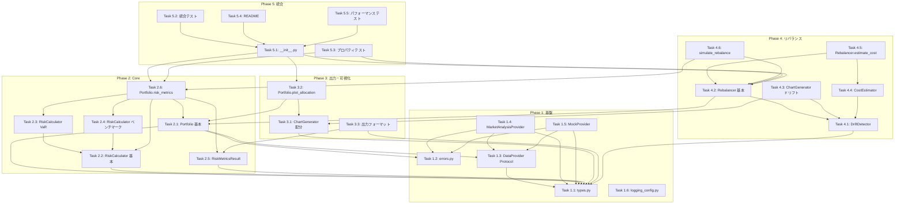

# 実装タスク一覧 (Implementation Tasks)

## 概要

strategy パッケージの実装タスクを優先度と依存関係に基づいて整理した一覧。
各タスクは GitHub Issue として登録可能な形式で記載。

## 実装フェーズ

| フェーズ | 内容 | 優先度 |
|---------|------|--------|
| Phase 1 | 基盤構築（types, errors, DataProvider） | P0 |
| Phase 2 | Core機能（Portfolio, RiskCalculator） | P0 |
| Phase 3 | 出力・可視化 | P0 |
| Phase 4 | リバランス機能 | P0/P1 |
| Phase 5 | 統合・ドキュメント | P0 |

---

## Phase 1: 基盤構築

### Task 1.1: 型定義の実装

**タイトル**: [strategy] 共通型定義（types.py）の実装

**説明**:
strategy パッケージで使用する共通の型定義を実装する。
全てのコンポーネントがこれらの型に依存するため、最初に実装する必要がある。

**実装ファイル**:
- `src/strategy/types.py`

**実装内容**:
```python
# 型エイリアス
type AssetClass = Literal["equity", "bond", "commodity", "real_estate", "cash", "other"]
type PresetPeriod = Literal["1y", "3y", "5y", "10y", "ytd", "max"]

# データクラス
@dataclass(frozen=True)
class Holding:
    ticker: str
    weight: float

@dataclass(frozen=True)
class TickerInfo:
    ticker: str
    name: str
    sector: str | None
    industry: str | None
    asset_class: AssetClass

@dataclass(frozen=True)
class Period:
    start: date
    end: date
    preset: PresetPeriod | None

    @classmethod
    def from_preset(cls, preset: PresetPeriod) -> "Period": ...
```

**受け入れ条件**:
- [ ] `AssetClass` 型エイリアスが定義されている
- [ ] `PresetPeriod` 型エイリアスが定義されている
- [ ] `Holding` dataclass が実装されている
  - [ ] ticker: 非空文字列のバリデーション
  - [ ] weight: 0.0-1.0 の範囲チェック
- [ ] `TickerInfo` dataclass が実装されている
- [ ] `Period` dataclass が実装されている
  - [ ] `from_preset()` クラスメソッドが実装されている
- [ ] 全クラスに NumPy 形式の docstring がある
- [ ] pyright strict でエラーなし
- [ ] ユニットテストが 80% 以上のカバレッジ

**依存関係**: なし

**優先度**: P0

**見積もり**: 2時間

**ラベル**: `enhancement`, `priority:high`

---

### Task 1.2: エラー・警告クラスの実装

**タイトル**: [strategy] エラー・警告クラス（errors.py）の実装

**説明**:
strategy パッケージで使用するカスタム例外クラスと警告クラスを実装する。

**実装ファイル**:
- `src/strategy/errors.py`

**実装内容**:
```python
class StrategyError(Exception):
    """基底例外クラス"""
    def __init__(self, message: str, code: str | None = None, cause: Exception | None = None): ...

class DataProviderError(StrategyError): ...
class InvalidTickerError(StrategyError): ...
class InsufficientDataError(StrategyError): ...
class ConfigurationError(StrategyError): ...
class ValidationError(StrategyError): ...

class StrategyWarning(UserWarning): ...
class DataWarning(StrategyWarning): ...
class NormalizationWarning(StrategyWarning): ...
```

**受け入れ条件**:
- [ ] `StrategyError` 基底クラスが実装されている
  - [ ] message, code, cause 属性を持つ
- [ ] `DataProviderError` が実装されている
- [ ] `InvalidTickerError` が実装されている
- [ ] `InsufficientDataError` が実装されている
- [ ] `ConfigurationError` が実装されている
- [ ] `ValidationError` が実装されている
- [ ] `StrategyWarning` 基底警告が実装されている
- [ ] `DataWarning` が実装されている
- [ ] `NormalizationWarning` が実装されている
- [ ] 全クラスに NumPy 形式の docstring がある
- [ ] pyright strict でエラーなし

**依存関係**: なし

**優先度**: P0

**見積もり**: 1時間

**ラベル**: `enhancement`, `priority:high`

---

### Task 1.3: DataProvider プロトコルの定義

**タイトル**: [strategy] DataProvider プロトコルの定義

**説明**:
データ取得の抽象インターフェースを定義する。
market_analysis パッケージ、テスト用モック、将来の商用プロバイダーを統一的に扱うための Protocol。

**実装ファイル**:
- `src/strategy/providers/__init__.py`
- `src/strategy/providers/protocol.py`

**実装内容**:
```python
class DataProvider(Protocol):
    def get_prices(
        self,
        tickers: list[str],
        start: str,
        end: str,
    ) -> pd.DataFrame: ...

    def get_ticker_info(self, ticker: str) -> TickerInfo: ...

    def get_ticker_infos(self, tickers: list[str]) -> dict[str, TickerInfo]: ...
```

**受け入れ条件**:
- [ ] `DataProvider` Protocol が定義されている
- [ ] `get_prices()` メソッドが定義されている
  - [ ] tickers: list[str]
  - [ ] start, end: str (YYYY-MM-DD形式)
  - [ ] 戻り値: MultiIndex DataFrame
- [ ] `get_ticker_info()` メソッドが定義されている
- [ ] `get_ticker_infos()` メソッドが定義されている
- [ ] NumPy 形式の docstring で戻り値の DataFrame 構造が明記されている
- [ ] pyright strict でエラーなし

**依存関係**:
- Task 1.1: 型定義の実装

**優先度**: P0

**見積もり**: 1時間

**ラベル**: `enhancement`, `priority:high`

---

### Task 1.4: MarketAnalysisProvider の実装

**タイトル**: [strategy] MarketAnalysisProvider の実装

**説明**:
market_analysis パッケージをラップするデフォルトのデータプロバイダーを実装する。
yfinance/FRED データをキャッシュ活用で取得する。

**実装ファイル**:
- `src/strategy/providers/market_analysis.py`

**実装内容**:
```python
class MarketAnalysisProvider:
    def __init__(
        self,
        cache_config: CacheConfig | None = None,
        use_cache: bool = True,
    ) -> None: ...

    def get_prices(self, tickers: list[str], start: str, end: str) -> pd.DataFrame: ...
    def get_ticker_info(self, ticker: str) -> TickerInfo: ...
    def get_ticker_infos(self, tickers: list[str]) -> dict[str, TickerInfo]: ...
```

**受け入れ条件**:
- [ ] `MarketAnalysisProvider` クラスが実装されている
- [ ] コンストラクタで cache_config, use_cache を受け取る
- [ ] `get_prices()` が market_analysis の YFinanceFetcher を使用してデータを取得
- [ ] `get_prices()` の戻り値が MultiIndex DataFrame
- [ ] `get_ticker_info()` が yfinance の ticker.info を使用して情報を取得
- [ ] `get_ticker_info()` が TickerInfo オブジェクトを返す
- [ ] `get_ticker_infos()` が複数ティッカーを一括取得
- [ ] DataProviderError を適切に発生させる
- [ ] InvalidTickerError を適切に発生させる
- [ ] NumPy 形式の docstring がある
- [ ] pyright strict でエラーなし
- [ ] ユニットテスト（モックを使用）

**依存関係**:
- Task 1.1: 型定義の実装
- Task 1.2: エラー・警告クラスの実装
- Task 1.3: DataProvider プロトコルの定義

**優先度**: P0

**見積もり**: 3時間

**ラベル**: `enhancement`, `priority:high`

---

### Task 1.5: MockProvider の実装

**タイトル**: [strategy] MockProvider（テスト用）の実装

**説明**:
テスト用のモックデータプロバイダーを実装する。
事前定義されたデータを返すことで、外部依存なしのテストを可能にする。

**実装ファイル**:
- `src/strategy/providers/mock.py`

**実装内容**:
```python
class MockProvider:
    def __init__(
        self,
        price_data: pd.DataFrame,
        ticker_infos: dict[str, TickerInfo],
    ) -> None: ...

    def get_prices(self, tickers: list[str], start: str, end: str) -> pd.DataFrame: ...
    def get_ticker_info(self, ticker: str) -> TickerInfo: ...
    def get_ticker_infos(self, tickers: list[str]) -> dict[str, TickerInfo]: ...
```

**受け入れ条件**:
- [ ] `MockProvider` クラスが実装されている
- [ ] コンストラクタで price_data, ticker_infos を受け取る
- [ ] `get_prices()` が指定期間のデータを返す
- [ ] `get_ticker_info()` が事前定義されたティッカー情報を返す
- [ ] `get_ticker_infos()` が複数ティッカー情報を返す
- [ ] 存在しないティッカーに対して InvalidTickerError を発生
- [ ] DataProvider Protocol に準拠
- [ ] NumPy 形式の docstring がある
- [ ] pyright strict でエラーなし

**依存関係**:
- Task 1.1: 型定義の実装
- Task 1.2: エラー・警告クラスの実装
- Task 1.3: DataProvider プロトコルの定義

**優先度**: P0

**見積もり**: 1.5時間

**ラベル**: `enhancement`, `priority:high`

---

### Task 1.6: ロギング設定の実装

**タイトル**: [strategy] ロギング設定（logging_config.py）の実装

**説明**:
strategy パッケージ用のロギング設定を実装する。
finance パッケージの既存設定を参考にする。

**実装ファイル**:
- `src/strategy/utils/__init__.py`
- `src/strategy/utils/logging_config.py`

**受け入れ条件**:
- [ ] `get_logger()` 関数が実装されている
- [ ] structlog を使用したロギング設定
- [ ] LOG_LEVEL 環境変数に対応
- [ ] LOG_FORMAT 環境変数に対応（json/text）
- [ ] NumPy 形式の docstring がある

**依存関係**: なし

**優先度**: P0

**見積もり**: 1時間

**ラベル**: `enhancement`, `priority:high`

---

## Phase 2: Core機能

### Task 2.1: Portfolio クラスの基本実装

**タイトル**: [strategy] Portfolio クラスの基本実装

**説明**:
ポートフォリオの構成管理と基本機能を実装する。
保有銘柄リストの管理、期間設定、プロバイダー設定を含む。

**実装ファイル**:
- `src/strategy/portfolio.py`

**実装内容**:
```python
class Portfolio:
    def __init__(
        self,
        holdings: list[tuple[str, float]] | list[Holding],
        provider: DataProvider | None = None,
        name: str | None = None,
        normalize: bool = False,
    ) -> None: ...

    @property
    def holdings(self) -> list[Holding]: ...
    @property
    def tickers(self) -> list[str]: ...
    @property
    def weights(self) -> dict[str, float]: ...
    @property
    def allocation_df(self) -> pd.DataFrame: ...

    def set_provider(self, provider: DataProvider) -> None: ...
    def set_period(self, preset: PresetPeriod | None = None, *, start: str | None = None, end: str | None = None) -> None: ...

    def __repr__(self) -> str: ...
    def __str__(self) -> str: ...
```

**受け入れ条件**:
- [ ] `Portfolio` クラスが実装されている
- [ ] タプルリストまたは Holding リストからポートフォリオを作成できる
- [ ] 比率の合計が 1.0 でない場合に NormalizationWarning を発生
- [ ] normalize=True で自動正規化
- [ ] 無効なティッカーに対して ValidationError を発生
- [ ] `holdings`, `tickers`, `weights` プロパティが実装されている
- [ ] `allocation_df` で資産配分 DataFrame を取得できる
- [ ] `set_provider()` でプロバイダーを設定できる
- [ ] `set_period()` でプリセット/カスタム期間を設定できる
- [ ] プロバイダー未設定時に ConfigurationError を発生
- [ ] `__repr__`, `__str__` が実装されている
- [ ] NumPy 形式の docstring がある
- [ ] pyright strict でエラーなし
- [ ] ユニットテスト

**依存関係**:
- Task 1.1: 型定義の実装
- Task 1.2: エラー・警告クラスの実装
- Task 1.3: DataProvider プロトコルの定義

**優先度**: P0

**見積もり**: 4時間

**ラベル**: `enhancement`, `priority:high`

---

### Task 2.2: RiskCalculator の実装（基本指標）

**タイトル**: [strategy] RiskCalculator の基本リスク指標実装

**説明**:
基本的なリスク指標（ボラティリティ、シャープレシオ、ソルティノレシオ、最大ドローダウン）の計算ロジックを実装する。

**実装ファイル**:
- `src/strategy/risk/__init__.py`
- `src/strategy/risk/calculator.py`

**実装内容**:
```python
class RiskCalculator:
    def __init__(
        self,
        returns: pd.Series,
        risk_free_rate: float = 0.0,
        annualization_factor: int = 252,
    ) -> None: ...

    def volatility(self) -> float: ...
    def sharpe_ratio(self) -> float: ...
    def sortino_ratio(self) -> float: ...
    def max_drawdown(self) -> float: ...
```

**受け入れ条件**:
- [ ] `RiskCalculator` クラスが実装されている
- [ ] コンストラクタで returns, risk_free_rate, annualization_factor を受け取る
- [ ] `volatility()`: 年率ボラティリティを計算
  - [ ] 計算式: std(returns) * sqrt(annualization_factor)
- [ ] `sharpe_ratio()`: シャープレシオを計算
  - [ ] リスクフリーレートを考慮
- [ ] `sortino_ratio()`: ソルティノレシオを計算
  - [ ] 下方偏差を使用
  - [ ] 下方リターンがない場合のエッジケース処理
- [ ] `max_drawdown()`: 最大ドローダウンを計算
  - [ ] 戻り値は負の値（例: -0.15）
- [ ] numpy のベクトル化計算を使用
- [ ] NumPy 形式の docstring がある
- [ ] pyright strict でエラーなし
- [ ] ユニットテスト
- [ ] Hypothesis によるプロパティテスト

**依存関係**:
- Task 1.1: 型定義の実装

**優先度**: P0

**見積もり**: 3時間

**ラベル**: `enhancement`, `priority:high`

---

### Task 2.3: RiskCalculator の実装（VaR）

**タイトル**: [strategy] RiskCalculator の VaR 計算実装

**説明**:
VaR（Value at Risk）の計算ロジックを実装する。
ヒストリカル法とパラメトリック法の両方をサポート。

**実装ファイル**:
- `src/strategy/risk/calculator.py`

**実装内容**:
```python
def var(
    self,
    confidence: float = 0.95,
    method: Literal["historical", "parametric"] = "historical",
) -> float: ...
```

**受け入れ条件**:
- [ ] `var()` メソッドが実装されている
- [ ] ヒストリカル法: percentile(returns, (1-confidence)*100)
- [ ] パラメトリック法: mean + z_score * std
- [ ] 95%, 99% 信頼水準に対応
- [ ] 戻り値は負の値
- [ ] scipy.stats を使用した z_score 計算
- [ ] NumPy 形式の docstring がある
- [ ] ユニットテスト
- [ ] Hypothesis によるプロパティテスト（var_95 > var_99）

**依存関係**:
- Task 2.2: RiskCalculator の基本指標実装

**優先度**: P0

**見積もり**: 2時間

**ラベル**: `enhancement`, `priority:high`

---

### Task 2.4: RiskCalculator の実装（ベンチマーク指標）

**タイトル**: [strategy] RiskCalculator のベンチマーク比較指標実装

**説明**:
ベンチマークとの比較に基づくリスク指標（ベータ、トレイナーレシオ、情報レシオ）を実装する。

**実装ファイル**:
- `src/strategy/risk/calculator.py`

**実装内容**:
```python
def beta(self, benchmark_returns: pd.Series) -> float: ...
def treynor_ratio(self, benchmark_returns: pd.Series) -> float: ...
def information_ratio(self, benchmark_returns: pd.Series) -> float: ...
```

**受け入れ条件**:
- [ ] `beta()` メソッドが実装されている
  - [ ] 計算式: cov(returns, benchmark) / var(benchmark)
  - [ ] 日付の整列処理
- [ ] `treynor_ratio()` メソッドが実装されている
  - [ ] 計算式: (annualized_return - risk_free_rate) / beta
- [ ] `information_ratio()` メソッドが実装されている
  - [ ] 計算式: mean(active_return) / std(active_return)
- [ ] ベンチマークデータがない日の処理
- [ ] ゼロ除算の防止
- [ ] NumPy 形式の docstring がある
- [ ] ユニットテスト

**依存関係**:
- Task 2.2: RiskCalculator の基本指標実装

**優先度**: P0

**見積もり**: 2時間

**ラベル**: `enhancement`, `priority:high`

---

### Task 2.5: RiskMetricsResult の実装

**タイトル**: [strategy] RiskMetricsResult の実装

**説明**:
リスク指標の計算結果を格納するデータコンテナクラスを実装する。
出力変換メソッド（to_dict, to_markdown, summary）を含む。

**実装ファイル**:
- `src/strategy/risk/metrics.py`

**実装内容**:
```python
@dataclass
class RiskMetricsResult:
    volatility: float
    sharpe_ratio: float
    sortino_ratio: float
    max_drawdown: float
    var_95: float
    var_99: float
    beta: float | None
    treynor_ratio: float | None
    information_ratio: float | None
    annualized_return: float
    cumulative_return: float
    calculated_at: datetime
    period_start: date
    period_end: date

    def to_dict(self) -> dict[str, Any]: ...
    def to_markdown(self) -> str: ...
    def summary(self) -> pd.DataFrame: ...
```

**受け入れ条件**:
- [ ] `RiskMetricsResult` dataclass が実装されている
- [ ] 全リスク指標フィールドが定義されている
- [ ] `to_dict()`: 辞書形式に変換（JSON出力用）
- [ ] `to_markdown()`: マークダウン形式のレポート生成
- [ ] `summary()`: DataFrame でサマリーを返す
- [ ] NumPy 形式の docstring がある
- [ ] pyright strict でエラーなし
- [ ] ユニットテスト

**依存関係**:
- Task 1.1: 型定義の実装

**優先度**: P0

**見積もり**: 2時間

**ラベル**: `enhancement`, `priority:high`

---

### Task 2.6: Portfolio.risk_metrics() の実装

**タイトル**: [strategy] Portfolio.risk_metrics() メソッドの実装

**説明**:
Portfolio クラスにリスク指標計算メソッドを追加する。
内部で RiskCalculator を使用し、RiskMetricsResult を返す。

**実装ファイル**:
- `src/strategy/portfolio.py`

**実装内容**:
```python
def risk_metrics(
    self,
    risk_free_rate: float = 0.0,
    benchmark: str | None = None,
) -> RiskMetricsResult: ...
```

**受け入れ条件**:
- [ ] `risk_metrics()` メソッドが実装されている
- [ ] リスクフリーレートを引数で受け取る
- [ ] ベンチマークティッカーを指定可能
- [ ] プロバイダー経由で価格データを取得
- [ ] ポートフォリオリターンを加重平均で計算
- [ ] RiskCalculator を使用して各指標を計算
- [ ] RiskMetricsResult を返す
- [ ] プロバイダー未設定時に ConfigurationError を発生
- [ ] 期間未設定時にデフォルト期間（1y）を使用
- [ ] データ不足時に InsufficientDataError または警告
- [ ] NumPy 形式の docstring がある
- [ ] ユニットテスト（MockProvider を使用）

**依存関係**:
- Task 2.1: Portfolio クラスの基本実装
- Task 2.2-2.4: RiskCalculator の実装
- Task 2.5: RiskMetricsResult の実装

**優先度**: P0

**見積もり**: 3時間

**ラベル**: `enhancement`, `priority:high`

---

## Phase 3: 出力・可視化

### Task 3.1: ChartGenerator の実装（資産配分）

**タイトル**: [strategy] ChartGenerator の資産配分チャート実装

**説明**:
資産配分を可視化するチャート生成機能を実装する。
円グラフと棒グラフをサポートし、グループ化（セクター、資産クラス）にも対応。

**実装ファイル**:
- `src/strategy/visualization/__init__.py`
- `src/strategy/visualization/charts.py`

**実装内容**:
```python
class ChartGenerator:
    def create_allocation_pie(
        self,
        holdings: list[Holding],
        ticker_infos: dict[str, TickerInfo] | None = None,
    ) -> go.Figure: ...

    def create_allocation_bar(
        self,
        holdings: list[Holding],
        ticker_infos: dict[str, TickerInfo] | None = None,
    ) -> go.Figure: ...

    def create_sector_pie(
        self,
        holdings: list[Holding],
        ticker_infos: dict[str, TickerInfo],
    ) -> go.Figure: ...

    def create_asset_class_pie(
        self,
        holdings: list[Holding],
        ticker_infos: dict[str, TickerInfo],
    ) -> go.Figure: ...
```

**受け入れ条件**:
- [ ] `ChartGenerator` クラスが実装されている
- [ ] `create_allocation_pie()`: ティッカー別円グラフ
- [ ] `create_allocation_bar()`: ティッカー別棒グラフ
- [ ] `create_sector_pie()`: セクター別円グラフ
- [ ] `create_asset_class_pie()`: 資産クラス別円グラフ
- [ ] Plotly を使用
- [ ] 日本語ラベル対応（オプション）
- [ ] NumPy 形式の docstring がある
- [ ] pyright strict でエラーなし
- [ ] ユニットテスト

**依存関係**:
- Task 1.1: 型定義の実装

**優先度**: P0

**見積もり**: 3時間

**ラベル**: `enhancement`, `priority:high`

---

### Task 3.2: Portfolio.plot_allocation() の実装

**タイトル**: [strategy] Portfolio.plot_allocation() メソッドの実装

**説明**:
Portfolio クラスに資産配分可視化メソッドを追加する。
内部で ChartGenerator を使用し、Plotly Figure を返す。

**実装ファイル**:
- `src/strategy/portfolio.py`

**実装内容**:
```python
def plot_allocation(
    self,
    chart_type: Literal["pie", "bar"] = "pie",
    group_by: Literal["ticker", "sector", "asset_class"] | None = None,
) -> go.Figure: ...
```

**受け入れ条件**:
- [ ] `plot_allocation()` メソッドが実装されている
- [ ] chart_type で円グラフ/棒グラフを選択
- [ ] group_by で集計基準を選択
- [ ] group_by="sector" または "asset_class" の場合、プロバイダー経由でティッカー情報を取得
- [ ] プロバイダー未設定時は group_by="ticker" のみ利用可能
- [ ] Plotly Figure を返す
- [ ] NumPy 形式の docstring がある
- [ ] ユニットテスト

**依存関係**:
- Task 2.1: Portfolio クラスの基本実装
- Task 3.1: ChartGenerator の実装

**優先度**: P0

**見積もり**: 2時間

**ラベル**: `enhancement`, `priority:high`

---

### Task 3.3: 出力フォーマット関数の実装

**タイトル**: [strategy] 出力フォーマット関数（DataFrame, JSON, Markdown）の実装

**説明**:
リスク指標やポートフォリオデータを各種形式に変換する出力関数を実装する。

**実装ファイル**:
- `src/strategy/output/__init__.py`
- `src/strategy/output/dataframe.py`
- `src/strategy/output/json.py`
- `src/strategy/output/markdown.py`

**受け入れ条件**:
- [ ] `output/dataframe.py`
  - [ ] `to_dataframe()` 関数が実装されている
  - [ ] RiskMetricsResult を DataFrame に変換
- [ ] `output/json.py`
  - [ ] `to_dict()` 関数が実装されている
  - [ ] JSON シリアライズ可能な辞書を返す
- [ ] `output/markdown.py`
  - [ ] `to_markdown()` 関数が実装されている
  - [ ] マークダウンテーブル形式のレポートを生成
- [ ] NumPy 形式の docstring がある
- [ ] pyright strict でエラーなし
- [ ] ユニットテスト

**依存関係**:
- Task 1.1: 型定義の実装
- Task 2.5: RiskMetricsResult の実装

**優先度**: P0

**見積もり**: 2時間

**ラベル**: `enhancement`, `priority:high`

---

## Phase 4: リバランス機能

### Task 4.1: DriftResult と DriftDetector の実装

**タイトル**: [strategy] 配分ドリフト検出（DriftDetector）の実装

**説明**:
目標配分と現在配分の乖離を検出する機能を実装する。

**実装ファイル**:
- `src/strategy/rebalance/__init__.py`
- `src/strategy/rebalance/drift.py`

**実装内容**:
```python
@dataclass
class DriftResult:
    ticker: str
    target_weight: float
    current_weight: float
    drift: float
    drift_percent: float
    requires_rebalance: bool

class DriftDetector:
    def detect(
        self,
        current_weights: dict[str, float],
        target_weights: dict[str, float],
        threshold: float = 0.05,
    ) -> list[DriftResult]: ...
```

**受け入れ条件**:
- [ ] `DriftResult` dataclass が実装されている
- [ ] `DriftDetector` クラスが実装されている
- [ ] `detect()` メソッドが実装されている
  - [ ] current_weights と target_weights の差異を計算
  - [ ] drift: current - target
  - [ ] drift_percent: drift / target * 100
  - [ ] requires_rebalance: abs(drift) > threshold
- [ ] 存在しないティッカーの処理
- [ ] NumPy 形式の docstring がある
- [ ] pyright strict でエラーなし
- [ ] ユニットテスト

**依存関係**:
- Task 1.1: 型定義の実装

**優先度**: P0

**見積もり**: 2時間

**ラベル**: `enhancement`, `priority:high`

---

### Task 4.2: Rebalancer クラスの基本実装

**タイトル**: [strategy] Rebalancer クラスの基本実装

**説明**:
リバランス分析の統合クラスを実装する。
配分ドリフト検出とチャート生成を含む。

**実装ファイル**:
- `src/strategy/rebalance/rebalancer.py`

**実装内容**:
```python
class Rebalancer:
    def __init__(self, portfolio: Portfolio) -> None: ...

    def detect_drift(
        self,
        target_weights: dict[str, float],
        threshold: float = 0.05,
    ) -> list[DriftResult]: ...

    def plot_drift(
        self,
        drift_results: list[DriftResult],
    ) -> go.Figure: ...
```

**受け入れ条件**:
- [ ] `Rebalancer` クラスが実装されている
- [ ] コンストラクタで Portfolio を受け取る
- [ ] `detect_drift()` メソッドが実装されている
  - [ ] 内部で DriftDetector を使用
- [ ] `plot_drift()` メソッドが実装されている
  - [ ] ドリフトを棒グラフで可視化
- [ ] NumPy 形式の docstring がある
- [ ] pyright strict でエラーなし
- [ ] ユニットテスト

**依存関係**:
- Task 2.1: Portfolio クラスの基本実装
- Task 4.1: DriftResult と DriftDetector の実装

**優先度**: P0

**見積もり**: 2時間

**ラベル**: `enhancement`, `priority:high`

---

### Task 4.3: ChartGenerator のドリフトチャート実装

**タイトル**: [strategy] ChartGenerator のドリフトチャート実装

**説明**:
配分ドリフトを可視化する棒グラフを生成する機能を追加する。

**実装ファイル**:
- `src/strategy/visualization/charts.py`

**実装内容**:
```python
def create_drift_chart(
    self,
    drift_results: list[DriftResult],
) -> go.Figure: ...
```

**受け入れ条件**:
- [ ] `create_drift_chart()` メソッドが実装されている
- [ ] 各ティッカーのドリフトを棒グラフで表示
- [ ] 正のドリフト（オーバーウェイト）と負のドリフト（アンダーウェイト）を色分け
- [ ] 閾値線の表示（オプション）
- [ ] NumPy 形式の docstring がある
- [ ] ユニットテスト

**依存関係**:
- Task 4.1: DriftResult と DriftDetector の実装
- Task 3.1: ChartGenerator の実装

**優先度**: P0

**見積もり**: 1.5時間

**ラベル**: `enhancement`, `priority:high`

---

### Task 4.4: RebalanceCost と CostEstimator の実装

**タイトル**: [strategy] リバランスコスト計算（CostEstimator）の実装

**説明**:
リバランスに伴う取引コストと税金を概算する機能を実装する。

**実装ファイル**:
- `src/strategy/rebalance/cost.py`

**実装内容**:
```python
@dataclass
class RebalanceCost:
    total_trade_value: float
    commission_cost: float
    estimated_tax: float
    total_cost: float
    cost_ratio: float

class CostEstimator:
    def estimate(
        self,
        drift_results: list[DriftResult],
        portfolio_value: float,
        commission_rate: float = 0.001,
        tax_rate: float = 0.20315,
    ) -> RebalanceCost: ...
```

**受け入れ条件**:
- [ ] `RebalanceCost` dataclass が実装されている
- [ ] `CostEstimator` クラスが実装されている
- [ ] `estimate()` メソッドが実装されている
  - [ ] 総取引金額の計算
  - [ ] 手数料コストの計算（commission_rate）
  - [ ] 税金の概算（売却時のみ、tax_rate）
  - [ ] コスト率の計算
- [ ] NumPy 形式の docstring がある
- [ ] pyright strict でエラーなし
- [ ] ユニットテスト

**依存関係**:
- Task 4.1: DriftResult と DriftDetector の実装

**優先度**: P1

**見積もり**: 2時間

**ラベル**: `enhancement`, `priority:medium`

---

### Task 4.5: Rebalancer.estimate_cost() の実装

**タイトル**: [strategy] Rebalancer.estimate_cost() メソッドの実装

**説明**:
Rebalancer クラスにリバランスコスト計算メソッドを追加する。

**実装ファイル**:
- `src/strategy/rebalance/rebalancer.py`

**実装内容**:
```python
def estimate_cost(
    self,
    commission_rate: float = 0.001,
    tax_rate: float = 0.20315,
    portfolio_value: float | None = None,
) -> RebalanceCost: ...
```

**受け入れ条件**:
- [ ] `estimate_cost()` メソッドが実装されている
- [ ] 内部で CostEstimator を使用
- [ ] portfolio_value が None の場合は 1,000,000 と仮定
- [ ] RebalanceCost を返す
- [ ] NumPy 形式の docstring がある
- [ ] ユニットテスト

**依存関係**:
- Task 4.2: Rebalancer クラスの基本実装
- Task 4.4: RebalanceCost と CostEstimator の実装

**優先度**: P1

**見積もり**: 1時間

**ラベル**: `enhancement`, `priority:medium`

---

### Task 4.6: リバランスタイミング分析の実装

**タイトル**: [strategy] リバランスタイミング分析（simulate_rebalance）の実装

**説明**:
定期リバランスと閾値リバランスのシミュレーション機能を実装する。

**実装ファイル**:
- `src/strategy/rebalance/rebalancer.py`

**実装内容**:
```python
def simulate_rebalance(
    self,
    strategy: Literal["periodic", "threshold"],
    period: Literal["monthly", "quarterly", "yearly"] | None = None,
    threshold: float | None = None,
    start: str | None = None,
    end: str | None = None,
) -> pd.DataFrame: ...

def compare_strategies(
    self,
    strategies: list[dict],
) -> go.Figure: ...
```

**受け入れ条件**:
- [ ] `simulate_rebalance()` メソッドが実装されている
  - [ ] 定期リバランス（monthly, quarterly, yearly）
  - [ ] 閾値リバランス（threshold ベース）
  - [ ] シミュレーション結果を DataFrame で返す
- [ ] `compare_strategies()` メソッドが実装されている
  - [ ] 複数戦略のパフォーマンス比較チャート
- [ ] NumPy 形式の docstring がある
- [ ] ユニットテスト

**依存関係**:
- Task 4.2: Rebalancer クラスの基本実装
- Task 2.6: Portfolio.risk_metrics() の実装

**優先度**: P1

**見積もり**: 4時間

**ラベル**: `enhancement`, `priority:medium`

---

## Phase 5: 統合・ドキュメント

### Task 5.1: パッケージ初期化ファイルの実装

**タイトル**: [strategy] パッケージ初期化ファイル（__init__.py）の実装

**説明**:
パッケージの公開 API を定義し、全てのエクスポートを整理する。

**実装ファイル**:
- `src/strategy/__init__.py`
- `src/strategy/py.typed`

**受け入れ条件**:
- [ ] `__init__.py` で公開 API が定義されている
- [ ] `__all__` リストが適切に設定されている
- [ ] 以下がエクスポートされている:
  - [ ] Portfolio, Rebalancer
  - [ ] RiskMetricsResult
  - [ ] DataProvider, MarketAnalysisProvider, MockProvider
  - [ ] Holding, TickerInfo, Period, AssetClass, PresetPeriod
  - [ ] DriftResult, RebalanceCost
  - [ ] 全エラークラス、警告クラス
- [ ] `py.typed` マーカーファイルが存在する
- [ ] pyright strict でエラーなし

**依存関係**:
- 全ての Phase 1-4 タスク

**優先度**: P0

**見積もり**: 1時間

**ラベル**: `enhancement`, `priority:high`

---

### Task 5.2: 統合テストの実装

**タイトル**: [strategy] 統合テストの実装

**説明**:
エンドツーエンドのポートフォリオ分析フローをテストする統合テストを実装する。

**実装ファイル**:
- `tests/strategy/integration/test_end_to_end.py`
- `tests/strategy/conftest.py`

**受け入れ条件**:
- [ ] テストフィクスチャ（conftest.py）が実装されている
  - [ ] サンプル価格データ
  - [ ] サンプルティッカー情報
  - [ ] MockProvider インスタンス
- [ ] 統合テストが実装されている
  - [ ] ポートフォリオ作成 → 期間設定 → リスク指標計算
  - [ ] 資産配分可視化
  - [ ] リバランス分析
  - [ ] 各種出力形式
- [ ] `@pytest.mark.integration` マーカーが付与されている
- [ ] テストが成功する

**依存関係**:
- 全ての Phase 1-4 タスク

**優先度**: P0

**見積もり**: 3時間

**ラベル**: `test`, `priority:high`

---

### Task 5.3: プロパティテストの実装

**タイトル**: [strategy] Hypothesis プロパティテストの実装

**説明**:
Hypothesis を使用したプロパティベーステストを実装する。

**実装ファイル**:
- `tests/strategy/property/test_portfolio.py`
- `tests/strategy/property/test_risk_calculator.py`
- `tests/strategy/property/test_rebalancer.py`

**受け入れ条件**:
- [ ] Portfolio プロパティテスト
  - [ ] 正規化後の比率合計が 1.0
  - [ ] weight が 0.0-1.0 の範囲
- [ ] RiskCalculator プロパティテスト
  - [ ] max_drawdown が -1.0 から 0.0 の範囲
  - [ ] var_95 > var_99（絶対値）
  - [ ] volatility >= 0
- [ ] Rebalancer プロパティテスト
  - [ ] drift の整合性
- [ ] Hypothesis の @given デコレータを使用
- [ ] テストが成功する

**依存関係**:
- Task 2.1-2.6: Core 機能の実装
- Task 4.1-4.2: リバランス機能の実装

**優先度**: P0

**見積もり**: 3時間

**ラベル**: `test`, `priority:high`

---

### Task 5.4: README の作成

**タイトル**: [strategy] README.md の作成

**説明**:
strategy パッケージの README を作成する。
インストール方法、基本的な使用例、API リファレンスを含む。

**実装ファイル**:
- `src/strategy/README.md`

**受け入れ条件**:
- [ ] パッケージ概要が記載されている
- [ ] インストール方法が記載されている
- [ ] 基本的な使用例（10行以内のコード）が記載されている
- [ ] 主要クラスの説明がある
- [ ] ライセンス情報がある

**依存関係**:
- 全ての Phase 1-4 タスク

**優先度**: P0

**見積もり**: 2時間

**ラベル**: `documentation`, `priority:high`

---

### Task 5.5: パフォーマンステストの実装

**タイトル**: [strategy] パフォーマンステストの実装

**説明**:
パフォーマンス要件（リスク指標計算 1秒以内、チャート生成 500ms以内）を検証するテストを実装する。

**実装ファイル**:
- `tests/strategy/integration/test_performance.py`

**受け入れ条件**:
- [ ] リスク指標計算のパフォーマンステスト
  - [ ] 10銘柄 x 5年（約1250日）で 1秒以内
- [ ] チャート生成のパフォーマンステスト
  - [ ] 10銘柄のポートフォリオで 500ms 以内
- [ ] pytest-benchmark または timeit を使用
- [ ] `@pytest.mark.slow` マーカーが付与されている

**依存関係**:
- 全ての Phase 1-4 タスク

**優先度**: P0

**見積もり**: 2時間

**ラベル**: `test`, `priority:high`

---

## 依存関係グラフ



---

## 実装順序（推奨）

### Wave 1（基盤 - 並列実装可能）
1. Task 1.1: types.py
2. Task 1.2: errors.py
3. Task 1.6: logging_config.py

### Wave 2（Provider Layer）
4. Task 1.3: DataProvider Protocol（depends: 1.1）
5. Task 1.4: MarketAnalysisProvider（depends: 1.1, 1.2, 1.3）
6. Task 1.5: MockProvider（depends: 1.1, 1.2, 1.3）

### Wave 3（Core - Portfolio）
7. Task 2.1: Portfolio 基本（depends: 1.1, 1.2, 1.3）

### Wave 4（Core - Risk - 並列実装可能）
8. Task 2.2: RiskCalculator 基本（depends: 1.1）
9. Task 2.5: RiskMetricsResult（depends: 1.1）

### Wave 5（Core - Risk 拡張）
10. Task 2.3: RiskCalculator VaR（depends: 2.2）
11. Task 2.4: RiskCalculator ベンチマーク（depends: 2.2）

### Wave 6（Core 統合）
12. Task 2.6: Portfolio.risk_metrics（depends: 2.1, 2.2, 2.3, 2.4, 2.5）

### Wave 7（可視化 - 並列実装可能）
13. Task 3.1: ChartGenerator 配分（depends: 1.1）
14. Task 3.3: 出力フォーマット（depends: 1.1, 2.5）

### Wave 8（可視化統合）
15. Task 3.2: Portfolio.plot_allocation（depends: 2.1, 3.1）

### Wave 9（リバランス基盤）
16. Task 4.1: DriftDetector（depends: 1.1）

### Wave 10（リバランス統合）
17. Task 4.2: Rebalancer 基本（depends: 2.1, 4.1）
18. Task 4.3: ChartGenerator ドリフト（depends: 3.1, 4.1）

### Wave 11（リバランス P1）
19. Task 4.4: CostEstimator（depends: 4.1）
20. Task 4.5: Rebalancer.estimate_cost（depends: 4.2, 4.4）
21. Task 4.6: simulate_rebalance（depends: 4.2, 2.6）

### Wave 12（統合・ドキュメント）
22. Task 5.1: __init__.py
23. Task 5.2: 統合テスト
24. Task 5.3: プロパティテスト
25. Task 5.4: README
26. Task 5.5: パフォーマンステスト

---

## サマリー

| Phase | タスク数 | 合計見積もり | 優先度 |
|-------|---------|-------------|--------|
| Phase 1: 基盤 | 6 | 9.5時間 | P0 |
| Phase 2: Core | 6 | 16時間 | P0 |
| Phase 3: 出力・可視化 | 3 | 7時間 | P0 |
| Phase 4: リバランス | 6 | 12.5時間 | P0/P1 |
| Phase 5: 統合・ドキュメント | 5 | 11時間 | P0 |
| **合計** | **26** | **56時間** | - |

---

> このドキュメントは要件定義書・設計書から自動生成されました
