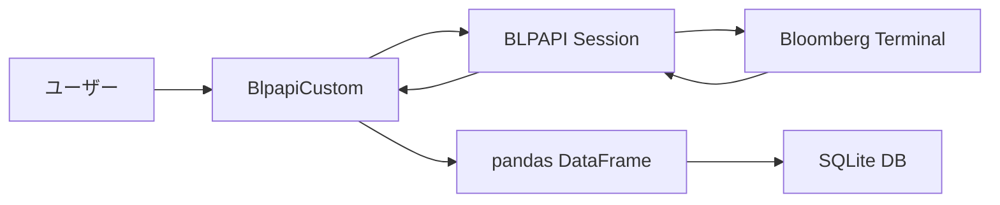

# Bloomberg BLPAPI Python ユーティリティ 技術仕様書

**バージョン**: 2.0.0
**最終更新日**: 2024年11月27日
**作成者**: Bloomberg API開発チーム

---

## 📋 目次

1. [概要](#概要)
2. [システム要件](#システム要件)
3. [アーキテクチャ](#アーキテクチャ)
4. クラス仕様: BlpapiCustom
5. メソッド詳細
6. ニュースデータ取得メソッド
7. 使用例
8. エラーハンドリング
9. ベストプラクティス
10. 付録

---

## 概要

### 目的

本モジュール(`bloomberg_utils.py`)は、Bloomberg Terminal API (BLPAPI)を使用したデータ取得を簡素化するPythonラッパーライブラリです。金融データ、ニュースデータの取得、変換、保存を統一されたインターフェースで提供します。

### 主な機能

| 機能カテゴリ | 説明 |
|------------|------|
| **ヒストリカルデータ取得** | 価格、ボリューム等の時系列データ取得 |
| **財務データ取得** | 損益計算書、貸借対照表、キャッシュフロー |
| **識別子変換** | SEDOL/CUSIP/ISIN ⇔ Bloomberg Ticker |
| **バリュエーション指標** | Forward/Trailing PE, PB, EPS, BPS |
| **ニュースデータ取得** | BFW/BN過去記事・本文取得 |
| **ニューストレンド分析** | キーワードトレンド、セクター比較 |
| **データベース統合** | SQLite3への自動保存・増分更新 |
| **多通貨対応** | 任意通貨への自動変換機能 |
| **決算発表日取得** | 直近・次回の決算発表日、時間帯の取得 |
| **フィールド情報取得** | FLDSの定義、説明文、データ型を取得 |

### 設計思想



---

## システム要件

### 必須環境

| 項目 | 要件 |
|------|------|
| **Python** | 3.8以上 |
| **Bloomberg Terminal** | 稼働中であること |
| **BLPAPI** | インストール済み |
| **接続** | localhost:8194 |

### 依存ライブラリ

```python
blpapi          # Bloomberg API
pandas          # データ処理
numpy           # 数値計算
sqlite3         # データベース
logging         # ロギング
pathlib         # パス操作
typing          # 型ヒント
matplotlib      # グラフ描画（オプション）
```

### インストール

```bash
# BLPAPI のインストール
pip install blpapi

# その他の依存関係
pip install pandas numpy matplotlib
```

---

## アーキテクチャ

### モジュール構造

```text
bloomberg_utils.py
### ケース1: 日次価格データの増分更新

```python
from bloomberg_utils import BlpapiCustom
from pathlib import Path
import datetime

api = BlpapiCustom()

# S&P 500構成銘柄の価格データを自動更新
tickers = ['AAPL US Equity', 'MSFT US Equity', 'GOOGL US Equity']

rows = api.update_historical_data(
    db_path=Path('data/sp500_prices.db'),
    table_name='daily_prices',
    tickers=tickers,
    field='PX_LAST',
    default_start_date=datetime.datetime(2020, 1, 1),
    currency='USD',
    verbose=True
)

print(f'✅ 更新完了: {rows:,}行追加')
```

**出力例**:

```text
============================================================
📊 増分更新モード
   最新データ日付: 2024-11-26
   取得期間: 2024-11-27 ～ 2024-11-27
   対象銘柄: 3銘柄
   通貨: USD
============================================================
✅ 接続中...
✅ サービスオープン完了。リクエスト作成中...
📡 リクエストを送信します (USD建て) (期間: 2024-11-27 - 2024-11-27)...

✅ データ取得完了。接続を終了しました。

📈 取得データ:
   行数: 3行
   日付範囲: 2024-11-27 ～ 2024-11-27
   ユニーク日数: 1日
✅ 保存完了。テーブル 'daily_prices' に 3 行を新規挿入しました。

✅ 増分更新完了: 3行
```

---

### ケース2: Forward PEのPoint-in-Time分析

```python
# 過去3年間のForward PE推移を取得
df_fwd_pe = api.get_historical_data_with_overrides(
    securities=['AAPL US Equity', 'MSFT US Equity'],
    fields=['PE_RATIO', 'BEST_EPS', 'PX_TO_BOOK_RATIO', 'BEST_DIV_YLD'],
    start_date='20210101',
    end_date='20231231',
    id_type='ticker',
    overrides={'BEST_FPERIOD_OVERRIDE': '1FY'},
    verbose=True
)

# データベースに保存
df_long = pd.melt(
    df_fwd_pe,
    id_vars=['Date', 'Identifier', 'ID_Type'],
    var_name='Field',
    value_name='Value'
).dropna(subset=['Value'])

api.store_to_database(
    df=df_long,
    db_path=Path('data/valuation.db'),
    table_name='forward_metrics_1fy',
    primary_keys=['Date', 'Identifier', 'Field'],
    verbose=True
)

# 統計分析
stats = df_fwd_pe.groupby('Identifier')['PE_RATIO'].agg([
    'mean', 'median', 'std', 'min', 'max'
]).round(2)

print('\n📊 Forward PE 統計 (過去3年):')
print(stats)
```

---

### ケース3: 複数識別子タイプでのデータ統合

```python
# Step 1: SEDOL リストをTickerに変換
sedol_list = ['2046251', '2588173', '2714830']
df_mapping = api.convert_identifiers(
    identifiers=sedol_list,
    id_type='sedol',
    verbose=True
)

# Step 2: 変換されたTickerでデータ取得
tickers = df_mapping[df_mapping['Error'].isna()]['Bloomberg_Ticker'].tolist()

df_data = api.get_historical_data(
    securities=tickers,
    fields=['PX_LAST'],
    start_date='20230101',
    end_date='20231231',
    currency='USD',
    verbose=True
)

print(f'✅ {len(tickers)}銘柄のデータ取得完了')
```

---

### ケース4: Forward vs Trailing比較分析

```python
def compare_valuation_metrics(
    api: BlpapiCustom,
    ticker: str,
    start: str,
    end: str
) -> pd.DataFrame:
    """Forward指標とTrailing指標を比較"""

    fields = ['PE_RATIO', 'BEST_EPS', 'PX_TO_BOOK_RATIO']

    # Forward (1年先予想)
    df_fwd = api.get_historical_data_with_overrides(
        securities=[ticker],
        fields=fields,
        start_date=start,
        end_date=end,
        overrides={'BEST_FPERIOD_OVERRIDE': '1FY'}
    ).assign(Type='Forward')

    # Trailing (実績)
    df_trail = api.get_historical_data_with_overrides(
        securities=[ticker],
        fields=fields,
        start_date=start,
        end_date=end,
        overrides={'BEST_FPERIOD_OVERRIDE': '-0FY'}
    ).assign(Type='Trailing')

    # 結合
    df_combined = pd.concat([df_fwd, df_trail], ignore_index=True)

    return df_combined

# 実行
df_comp = compare_valuation_metrics(
    api=api,
    ticker='AAPL US Equity',
    start='20230101',
    end='20231231'
)

# Forward/Trailing比較
pivot = df_comp.pivot_table(
    index='Date',
    columns='Type',
    values='PE_RATIO',
    aggfunc='mean'
)

print('\n📊 Forward vs Trailing PE:')
print(pivot.tail())
```

---

---

### ケース5: 決算発表日情報の取得

```python
# 直近および次回の決算発表日を取得
df_earnings = api.get_earnings_dates(
    securities=['AAPL US Equity', 'MSFT US Equity'],
    verbose=True
)

print('\n📅 決算発表日情報:')
print(df_earnings)
```

---

### ケース6: 財務データと発表日の同時取得

```python
# 財務データと共に発表日も取得
df_financials = api.get_financial_data(
    securities=['AAPL US Equity'],
    fields=['SALES_REV_TURN', 'NET_INCOME'],
    period='Q',
    start_date='20230101',
    end_date='20231231',
    include_announcement_date=True, # 発表日を含める
    verbose=True
)

print('\n📊 財務データ (発表日付き):')
print(df_financials[['Ticker', 'Field', 'Period_End_Date', 'Announcement_Date', 'Value']].head())
```

---

### ケース7: フィールド情報の取得

```python
# フィールドIDの詳細を確認
df_info = api.get_field_info(
    fields=['PX_LAST', 'PE_RATIO', 'BEST_EPS'],
    verbose=True
)

print('\n📋 フィールド情報:')
print(df_info[['Field', 'Mnemonic', 'Description']])
```

---

## エラーハンドリング

### エラータイプ

| レベル | エラータイプ | 処理方法 |
|--------|------------|---------|
| **セッション** | 接続失敗 | 空DataFrame/リスト返却 |
| **サービス** | サービスオープン失敗 | セッション終了 |
| **リクエスト** | `responseError` | エラーメッセージ出力 |
| **セキュリティ** | `securityError` | 該当銘柄スキップ |
| **フィールド** | `fieldError` | Null値設定 |
| **タイムアウト** | 5秒/10秒超過 | 処理中断 |

### エラーハンドリングパターン

```python
try:
    # Bloomberg API処理
    df = api.get_historical_data(...)

    # データ検証
    if df.empty:
        print('⚠️ データなし')
        return

    # 保存
    rows = api.store_to_database(...)
    print(f'✅ {rows}行保存')

except Exception as e:
    print(f'❌ エラー: {e}')
    import traceback
    traceback.print_exc()
```

### verbose出力の絵文字

| 絵文字 | 意味 | 使用場面 |
|-------|------|---------|
| ✅ | 成功 | 処理完了 |
| ❌ | エラー | 失敗時 |
| ⚠️ | 警告 | データなし等 |
| 📡 | 通信 | API送信時 |
| 📊 | 統計 | データサマリー |
| 🆕 | 新規 | 初回作成 |
| ⏳ | 待機 | タイムアウト |
| 💱 | 通貨 | 通貨変換時 |
| 🔧 | 設定 | オーバーライド |
| 📅 | 日付 | 期間指定 |
| 📰 | ニュース | ニュース取得 ★NEW |
| 🔥 | 速報 | Hot Headlines ★NEW |
| 📈 | トレンド | トレンド分析 ★NEW |
| 🔔 | アラート | 通知 ★NEW |

---

## ベストプラクティス

### 1. セッション管理

```python
# ✅ 推奨: クラスメソッド使用（自動管理）
df = api.get_historical_data(...)

# ❌ 非推奨: 手動セッション管理
session = blpapi.Session()
session.start()
# ... 処理 ...
session.stop()  # 終了忘れのリスク
```

### 2. エラーチェック

```python
# ✅ 推奨: Noneチェック
df = api.get_reference_data(...)
if df is not None and not df.empty:
    # 処理続行
    pass

# ✅ 推奨: Errorカラムのフィルタリング
df_clean = df[df['Error'].isna()]
```

### 3. 通貨管理

```python
# ✅ 推奨: 通貨を明示的に指定
df_usd = api.get_historical_data(
    securities=tickers,
    fields=['PX_LAST'],
    start_date='20230101',
    end_date='20231231',
    currency='USD'  # 明示的
)

# ⚠️ 注意: currency=Noneは報告通貨
```

### 4. バッチ処理

```python
# ✅ 推奨: 銘柄を分割して処理
def batch_get_data(api, tickers, batch_size=50):
    results = []
    for i in range(0, len(tickers), batch_size):
        batch = tickers[i:i+batch_size]
        df = api.get_historical_data(
            securities=batch,

#### データ取得範囲

| 項目 | 制限 | 備考 |
|------|------|------|
| **取得可能期間** | 契約による | 一般的に1-2年 |
| **最大取得件数** | 契約による | デフォルト1000-10000件 |
| **レート制限** | あり | 1秒あたりのリクエスト数 |
| **同時接続数** | 制限あり | 複数セッション非推奨 |

#### ライセンス確認事項

```python
# Bloomberg Help Deskに確認すべき項目:
# 1. ヒストリカルニュースの取得可能範囲
# 2. BFW/BNへのAPIアクセス権限
# 3. レート制限（リクエスト/秒、リクエスト/日）
# 4. 最大取得件数制限
# 5. 第三者ソース（WSJ, NYT等）へのアクセス権
```

#### 推奨取得パターン

```python
# ✅ 推奨: 効率的な取得
# 1. 期間を分割
for i in range(0, 365, 30):  # 30日ずつ
    news = api.get_historical_news(days_back=30, ...)
    time.sleep(1)  # レート制限対策

# 2. 必要な記事のみ本文取得
headlines = api.get_historical_news(...)
important = [h for h in headlines if 'earnings' in h['headline'].lower()]
for h in important[:5]:  # 重要な記事のみ
    content = api.get_news_story_content(h['story_id'])

# ❌ 非推奨: 一度に大量取得
news = api.get_historical_news(days_back=365, max_results=10000)
```

---

### I. サポート情報

#### 技術サポート

- **Bloomberg Help**: `HELP HELP` on Terminal
- **API Documentation**: `WAPI <GO>` on Terminal
- **Field Search**: `FLDS <GO>` on Terminal
- **News Settings**: `NZPD <GO>` on Terminal ★NEW
- **News Search**: `NEWS <GO>` on Terminal ★NEW

#### 参考資料

- [[Bloomberg Fundamentals in BQL.pdf]]
- [[BQL Company Financials.pdf]]
- [[Equity Index Financials.pdf]]
- [[FLDS.pdf]]

---

### J. ニュース取得のユースケース ★NEW

#### ユースケース1: リスクモニタリング

```python
# 特定キーワードの急増を検知
risk_keywords = ["default", "bankruptcy", "investigation", "lawsuit"]

for keyword in risk_keywords:
    trend = api.analyze_news_trend(
        keyword=keyword,
        days_back=30,
        source="BN",
        save_chart=False,
        verbose=False
    )

    # 直近3日の平均と比較
    recent_avg = trend.tail(3).mean()
    overall_avg = trend.mean()

    if recent_avg > overall_avg * 2:  # 2倍以上なら警告
        print(f"⚠️ リスクキーワード '{keyword}' 急増: {recent_avg:.1f}件/日")
```

#### ユースケース2: セクターローテーション検知

```python
# 過去30日と60日のセクター記事数を比較
sectors = ["TECH", "FINANCE", "ENERGY", "CONSUMER", "HEALTH"]

df_30d = api.compare_sector_news(sectors=sectors, days_back=30, verbose=False)
df_60d = api.compare_sector_news(sectors=sectors, days_back=60, verbose=False)

df_30d['Avg_30d'] = df_30d['Article_Count'] / 30
df_60d['Avg_60d'] = df_60d['Article_Count'] / 60

# 比較
comparison = df_30d.merge(df_60d[['Sector', 'Avg_60d']], on='Sector')
comparison['Change_%'] = ((comparison['Avg_30d'] / comparison['Avg_60d']) - 1) * 100

print("\n📊 セクター別記事数変化:")
print(comparison.sort_values('Change_%', ascending=False))
```

#### ユースケース3: 決算シーズン分析

```python
# 主要テック企業の決算BFWを一括分析
tech_earnings = {
    'AAPL US Equity': '20241101',
    'MSFT US Equity': '20241029',
    'GOOGL US Equity': '20241030',
    'META US Equity': '20241031',
    'AMZN US Equity': '20241101',
}

all_results = []

for ticker, date_str in tech_earnings.items():
    earnings_date = datetime.datetime.strptime(date_str, '%Y%m%d')

    df = api.analyze_earnings_bfw(
        ticker=ticker,
        earnings_date=earnings_date,
        verbose=False
    )

    df['Ticker'] = ticker
    all_results.append(df)

# 統合分析
df_all = pd.concat(all_results, ignore_index=True)

print("\n📊 テック決算シーズンBFW分析:")
print(f"総BFW数: {len(df_all)}件")
print(f"平均BFW数/銘柄: {len(df_all)/len(tech_earnings):.1f}件")

# 決算当日の記事数ランキング
earnings_day = df_all[df_all['days_from_earnings'] == 0]
ranking = earnings_day.groupby('Ticker').size().sort_values(ascending=False)
print("\n🏆 決算当日BFW数ランキング:")
print(ranking)
```

---
